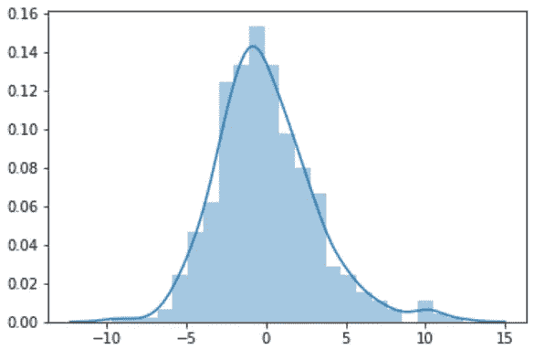
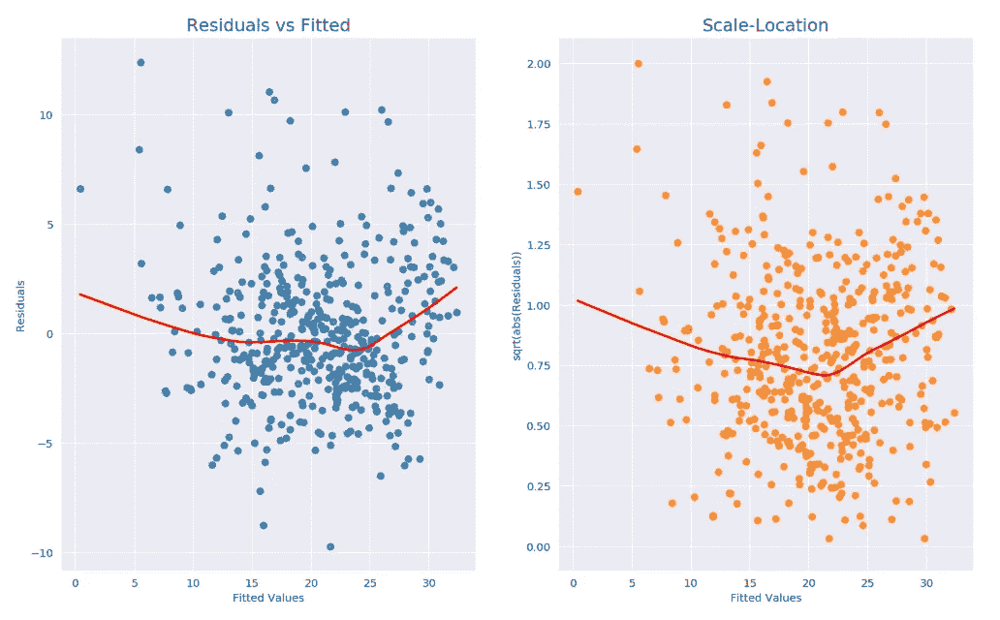
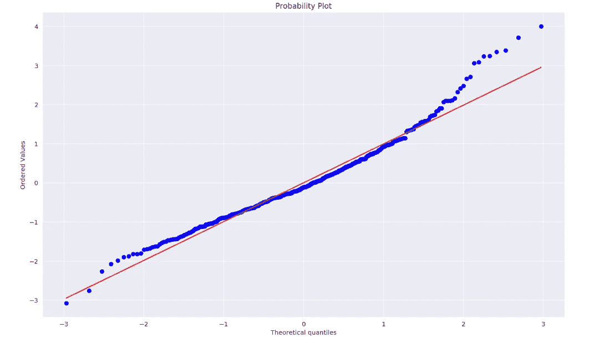
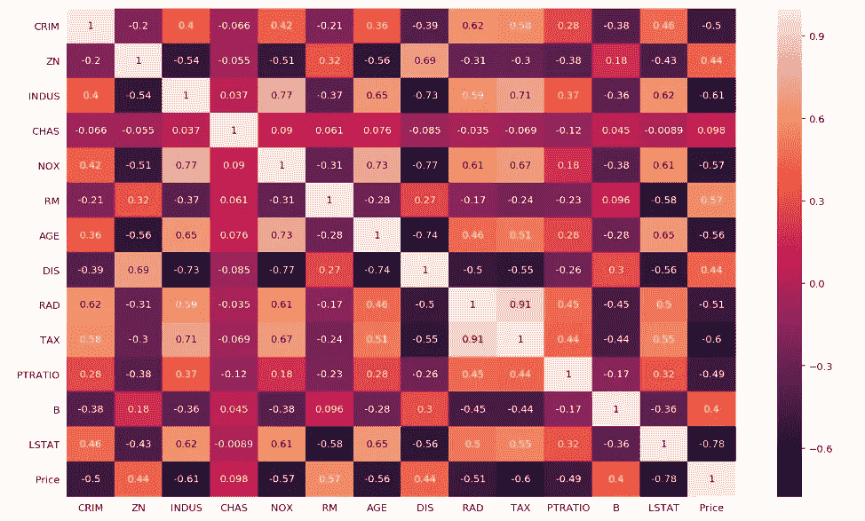
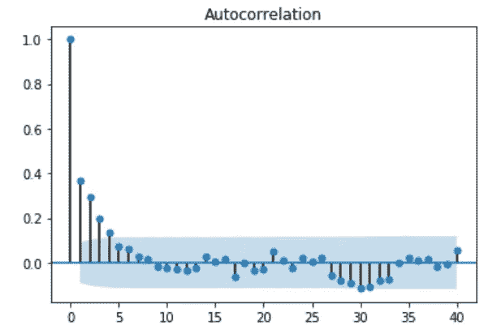

# 线性回归的假设—数据科学家同事应该知道什么

> 原文：<https://pub.towardsai.net/assumptions-of-linear-regression-what-fellow-data-scientists-should-know-fe0288c70b00?source=collection_archive---------0----------------------->

## [机器学习](https://towardsai.net/p/category/machine-learning)

照片由[马里乌斯·马萨拉尔](https://unsplash.com/@marius?utm_source=medium&utm_medium=referral)在 [Unsplash](https://unsplash.com?utm_source=medium&utm_medium=referral) 上拍摄

**线性回归**是一种**线性方法**，用于模拟目标变量与一个或多个自变量之间的**关系。这个模型化的关系然后被用于预测分析。**研究线性回归算法只是工作的一半。**另一半在于理解这项技术所依赖的以下假设:**

# 1.残差正态性

对于给定数据的线性回归，假设**误差(残差)遵循正态分布**。尽管当样本量非常大时这不是必需的。可以使用 **Q-Q 图(数据分位数与正态分位数)**来验证正态性，其中我们绘制了来自数据集的分位数和来自假设正态分布的分位数，在这里我们期望看到一条几乎为直线的线来验证残差的正态性。

**检验:** Jarque Bera 检验、Shapiro 检验、残差图

**例子:**下面我们可以看到残差的直方图，有核密度估计，它向我们显示，在这种情况下，残差是相当正常的。

图 1: KDE 残差图

# 2.同质性

同质性描述了独立特征和目标变量之间的关系(方差强度)中的**噪声/干扰在独立值**的所有值中都相同的情况。因此，我们可以使用**残差与预测值散点图**来检查这一点。我们不应该在这个散点图上看到一个模式，所有的数据都应该是随机分布的。这验证了同质性。

**检验:**戈德菲尔德检验，残差与拟合图

**示例:**下面我们可以看到残差与拟合图，以及另一个带有比例残差值的图(为了显示比例可以显示随机性的变化，但是**随机性将出现在同分布数据**中，这在图中非常明显)。

图 2:残差与拟合图

# 3.残差的线性

残差是在计算预测目标值和观察目标值之间的差异时获得的误差项。**当预测变量与目标变量呈直线关系时，可以观察到线性。如果残差是正态分布和同质的，一般不用担心这个问题。**

**测试:**彩虹测试，概率图

**注:**在查看等式时，线性度不是从数据集的特征/变量的功效来判断，而是从β参数的**功效来判断。**

**举例:***Y*=*a*+(*β*1 **X*1)+(*β*2 **X*2)

在上面的例子中，X2 的幂是 2，这意味着我们的数据集中的一个变量的幂是 2，但是 beta 参数(执行回归得到的系数)的幂都不是 1。这里显示了残差的线性度。

下面我们可以看到**概率图，即正态分布**的观察分位数与理论分位数，以检查线性度(这非常适用于下面数据中较低的数据点)。请记住，你的数据不会是完美的线性，但它必须趋于线性。

图 3:观察分位数与理论分位数

# 4.无多重共线性

多重共线性是独立变量之间**非常高的相互相关性或相互关联性的一种状态**。这种干扰**削弱了回归模型**的统计能力，这就是为什么低或没有多重共线性是可取的。

**测试:**方差膨胀因子(VIF)，相关矩阵/热图

**示例:**下面的相关性热图显示了独立变量之间的**相关性以及这些独立变量与目标(在下面的情况下是价格)的相关性。所以，为了检查多重共线性，我们不必检查自变量如何与目标相关，所以我们可以忽略价格。为了清楚起见，让我们检查一些关系:**

1.  印度河流域与 DIS 高度负相关(印度河流域增加，DIS 减少)
2.  印度河与税收呈高度正相关(印度河增加，税收增加)

因此，当变量高度相关时，可能需要移除这些变量中的一些，否则，会构建过度拟合的模型，因为这些变量本质上为模型提供了相同的数据。

图 4:关联热图

# 5.无自相关

当**残差相互依赖**时，会出现自相关，这最终会降低模型的准确性。**相关图(也称为自相关函数 ACF 图或自相关图)**是显示随时间变化的数据中的****线性相关性的直观方式**。这种**通常出现在时间序列模型**中，其中下一个时刻依赖于前一个时刻。所以，简单来说，**自相关是一个时间点的误差，传播到后续的时间点。**例如，你可能会高估第一个月获得客户的成本，从而高估接下来几个月的成本。**

****试验:**杜宾沃森试验**

****示例:**下图显示了 Y 轴上的相关系数和 X 轴上的相关时滞。我们看到，相关值仅在时间上的某些情况下是高的，并且在穿过 X 轴时没有向上或向下的模式，因此可以消除串行相关的可能性。**

****

**图 5:自相关函数(ACF)图**

# **摘要**

**在进行任何线性回归问题之前，必须满足上述假设，但是，**有时可能会有某些例外，例如“残差的线性度”**中所述的例外。对于其他假设，我们不要求完美，但结果不应该与我们假设的有很大不同。因此，如果我们说自相关变小，或者残差的线性趋于线性，那么在某种程度上这是可以接受的。图表帮助我们可视化数据如何维持我们计划坚持的假设，并且测试证明了这一点。**

**彻底检查了以上所有内容？现在，我们可以继续寻找最佳拟合回归线！**