# atoti——用 Python 构建 BI 平台

> 原文：<https://pub.towardsai.net/atoti-build-a-bi-platform-in-python-beea47b92c7b?source=collection_archive---------0----------------------->

## [数据可视化](https://towardsai.net/p/category/data-visualization)

## 通过交互式用户界面从您的数据中获得洞察力

# 动机

你有没有花 15 分钟左右的时间在 Python 中操作数据和创建一个图？如果像下面这样简单的拖拽就能快速从数据中提取洞察，岂不是很好？

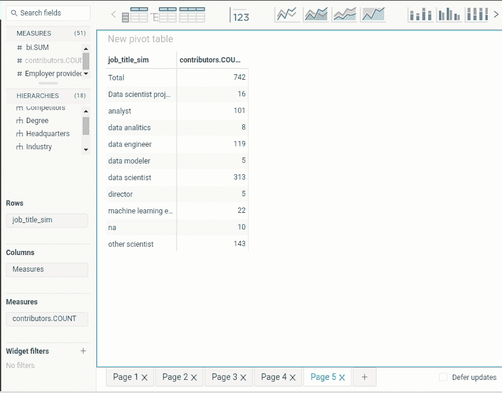

作者 GIF

这正是阿托蒂派上用场的时候。在本文中，您将学习如何用 Python 快速创建仪表板，并使用 atoti 与他人共享。

# 什么是阿托蒂？

[atoti](https://www.atoti.io/) 是一个免费的 Python BI 分析平台，面向数据科学家、数据分析师和商业用户。

有了 atoti，您可以快速:

*   创建不同的场景并并排比较它们
*   创建多维数据集并从中获得洞察力
*   与您的同事和利益相关者分享成果
*   在 Jupyter lab 上创建交互式可视化，无需编码

还有更多。

要安装 atoti，请键入:

```
pip install atoti[jupyterlab]
```

现在，当您通过运行以下命令打开 Jupyter 实验室时:

```
jupyter lab
```

您应该在左侧面板中看到 atoti 图标。

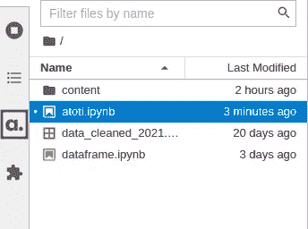

作者图片

# 创建一个立方体

为了了解 atoti 是如何工作的，让我们用它来分析 Kaggle 上的[数据科学家薪水](https://www.kaggle.com/nikhilbhathi/data-scientist-salary-us-glassdoor)数据集。

首先创建一个会话。`config`参数是可选的，但是如果您想要保存您的仪表板或与其他人共享它，它是很重要的。具体来说，

*   `user_content_storage`指定存储仪表板的位置
*   `port`指定仪表板应用程序的端口号。如果没有指定`port`，atoti 将选择一个随机端口。

通过从 CSV 文件中读取数据来创建数据帧:

接下来，创建一个多维数据集:

多维数据集是数据的多维视图，更易于聚合、筛选和比较。它被称为多维数据集，因为数据的每个分类列都可以表示为多维数据集的一个维度:

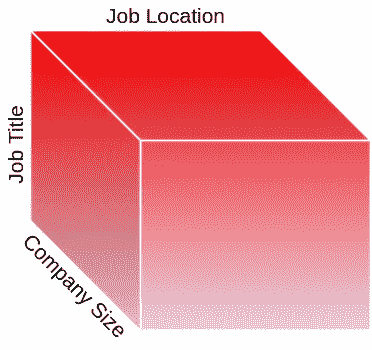

作者图片

多维数据集由两部分组成:维度和度量。

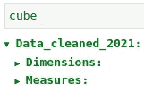

作者图片

atoti 自动将分类列检测为维度:

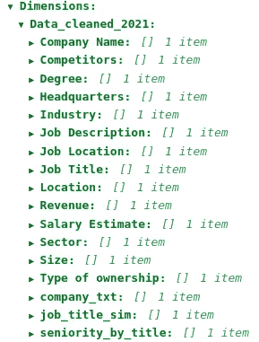

作者图片

并将数字列检测为度量值:

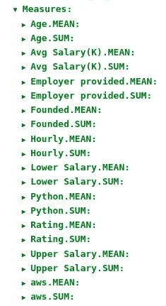

作者图片

如果您想更改此默认设置，请将`hierarchized_columns`添加到`session.read_csv()`

现在，让我们尝试在 atoti 仪表板上与这个立方体进行交互。

# 创建仪表板

要使用 atoti 创建仪表板，只需输入:

现在，您可以与您的表格进行交互，如下所示:

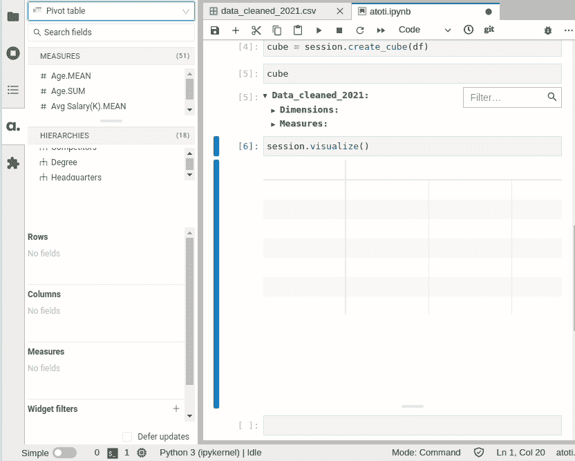

作者 GIF

要获得对仪表板的更多控制，右键单击绘图，然后选择“应用内发布”。

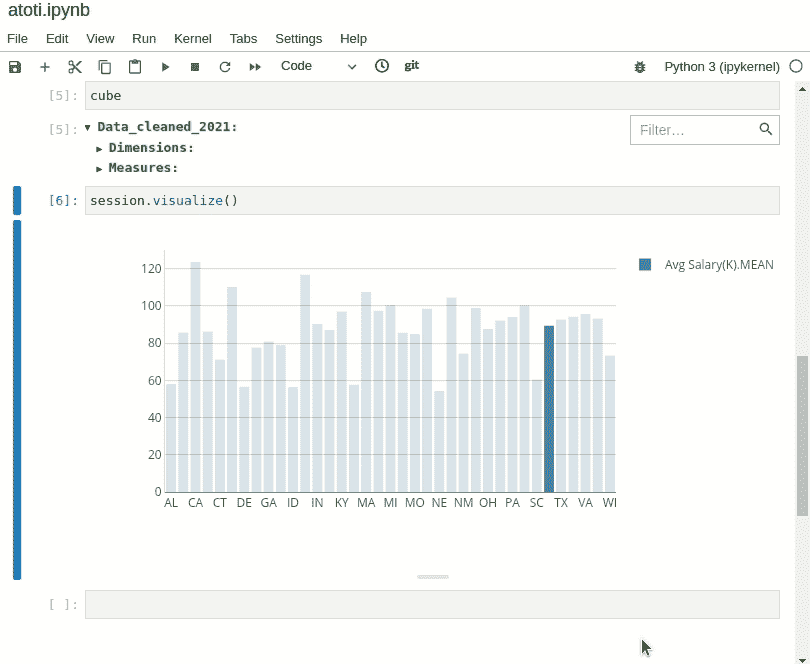

作者 GIF

让我们使用 atoti 从我们的数据中获得一些有趣的见解。

## 各州工资

首先，国家给的平均工资是多少？通过在`Hierarchies`会话中点击`Job Location`并在`Measures`会话中点击`Avg.Salary(K).MEAN`，可以很容易地找到这一点。

创建数据透视表后，您可以单击顶部面板上的一个图表来创建基于该表的图表。

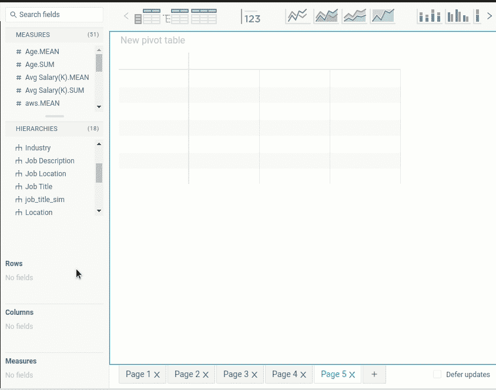

从柱状图来看，数据科学家的平均工资似乎是加州、伊利诺伊州和哥伦比亚特区最高的。

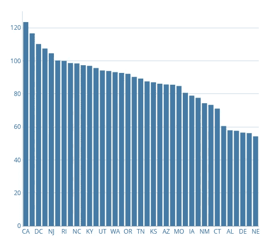

作者图片

## 特定州内城市的薪金

到目前为止，我们只知道各州的工资。然而，你可能更关心城市的工资，因为一个州内不同城市的工资差别很大。

让我们通过将`Location`选项卡拖动到值`IL`来计算出伊利诺斯州城市的工资。

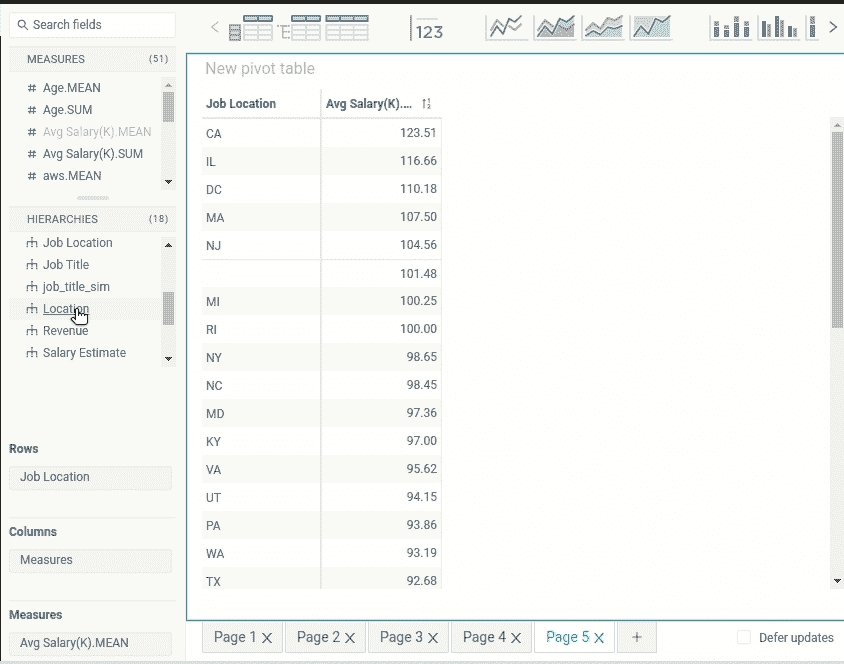

作者 GIF

哈！有意思。伊利诺伊州森林湖的平均工资高于伊利诺伊州芝加哥的平均工资。由于芝加哥是一个生活成本较高的大城市，所以看到芝加哥的平均工资低于伊利诺伊州森林湖的平均工资似乎有点奇怪。

会不会是森林湖没有足够的数据点来准确地代表人口数量？让我们将`contributors.COUNT`添加到表格中，找出每个城市有多少个数据点。

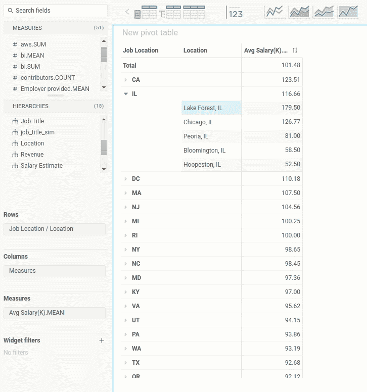

作者 GIF

啊哈！伊利诺伊州森林湖只有一个数据点，而伊利诺伊州芝加哥有 32 个数据点。森林湖的一个数据点不足以概括森林湖人口的工资。

## 找出影响工资差异的因素

有没有一种方法可以解释同一个地点工资的差异？可能是大公司给员工的工资更高。让我们通过在表中添加`Size`来检查我们的假设。

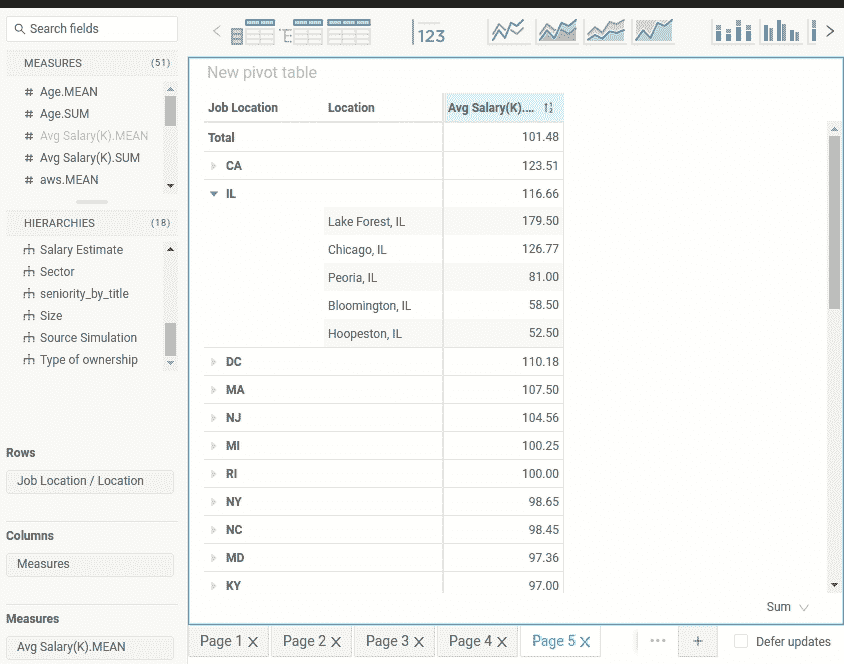

作者 GIF

这个假设似乎是正确的。随着公司规模的扩大，薪水也会增加。让我们用条形图来形象化伊利诺伊州芝加哥市的这种关系:

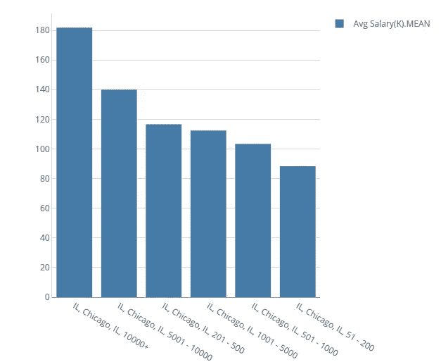

作者图片

酷！

## 使用堆积条形图分析每个职位的学位

到目前为止，我们只聚合了一个数字列和一个分类列。让我们用两个分类列聚合一个数字列，并使用一个堆积条形图来可视化这个二维数据集。

堆积条形图对于比较整体的各个部分非常有用。


作者 GIF

注意，最初，图表不是堆叠的。要按`Degree`堆叠图表，将`Degree`拖至`Stack by`区域。

在上面的堆积条形图中，

*   蓝条代表硕士学位。
*   橙色条代表博士学位。
*   红条代表南。我们可以假设这些人既没有硕士学位也没有博士学位。

很难比较不同职称之间的博士比例，因为每个职称的数量不同。让我们将普通堆积条形图转换为 100%堆积条形图进行比较:


作者图片

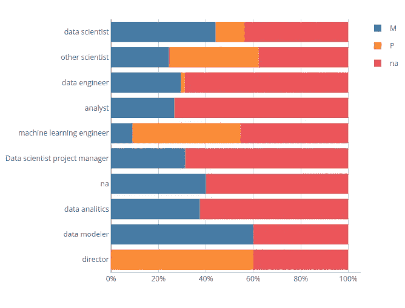

作者图片

从 100%堆积条形图来看，似乎博士学位在机器学习工程师、数据科学家、董事和其他科学家中很常见。

## 树形图和过滤器

大多数数据专业人士从事什么行业？为了回答这个问题，我们创建一个二维数据集，其维度是`job_title_sim`和`industry`，度量是`countributor.Count`。

接下来，单击树形图图标创建树形图。树状图非常适合于显示在分层结构中分组和嵌套的数据。

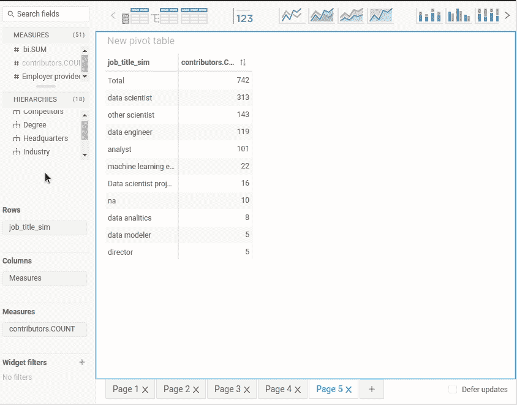

作者 GIF

由于一个标题中有许多行业，所以很难读懂树形图。有没有一种方法可以让我们在每个标题中只显示 4 个最常见的行业？是的，我们可以用窗口小部件过滤器做到这一点。

要选择 4 个最常见的行业，请将`Industry`拖至窗口小部件过滤器，然后单击高级。

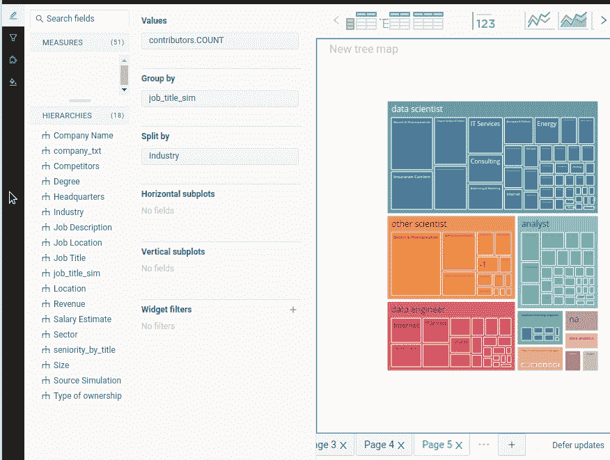

作者 GIF

不错！现在树形图看起来更容易阅读了。从下面的树形图中，我们可以看到大多数数据专业人员的常见行业是:

*   生物技术和制药
*   保险公司
*   计算机硬件和软件
*   信息技术服务

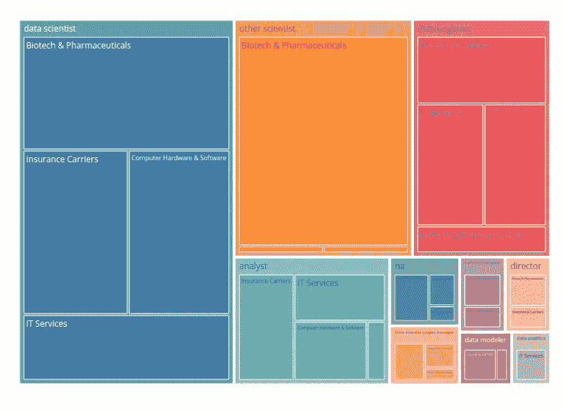

作者图片

## 一个仪表板中的多个图表

要在一个仪表板中添加多个图表，您可以添加一个新页面:


作者图片

或将另一个图表组件拖到同一页面:


作者 GIF

# 展示和共享您的仪表板

好的，能够在您的本地机器上创建一个仪表板是很酷的。但是如果你想和别人分享你的发现呢？幸运的是，atoti 还可以轻松展示和分享您的仪表板。

## 展示您的仪表板

要展示您的仪表板，只需点击屏幕左上角的“展示”按钮。atoti 将隐藏所有编辑面板，仅在您的仪表板中显示图表。

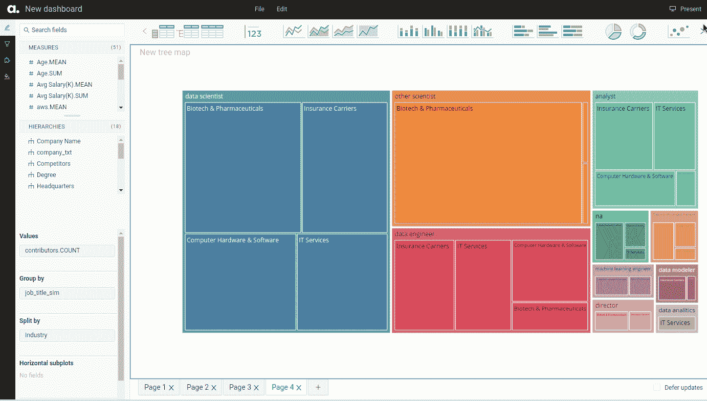

作者 GIF

## 共享您的仪表板

您的仪表板看起来很棒，您希望您的同事有机会与您的仪表板互动。您如何与他们共享您的仪表板？


作者图片

现在，您的仪表板在您的本地机器上:

```
[http://localhost:9000/#/](http://localhost:9000/#/)
```

要将您的本地 web 服务器转换成公共 URL，请使用 [ngrok](https://ngrok.com/) 。从[安装 ngrok](https://ngrok.com/download) 开始，并进行设置。

如果您当前的端口是 9000，请键入:

```
$ ngrok http 9000
```

…并且会自动为您生成一个公共 URL！

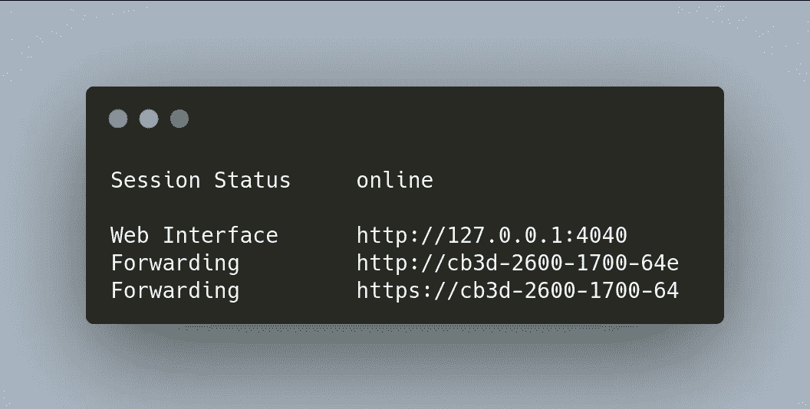

作者图片

现在你需要做的就是将公共 URL 链接发送给你的同事，这样他们就可以查看了。请注意，当您在本地计算机中结束会话时，您的同事将无法再查看仪表板。

查看[这篇教程](https://docs.atoti.io/latest/how_tos/security/security.html)如何让你的会话更加安全，以及[这篇教程](https://docs.atoti.io/latest/deployment/deployment_setup.html)如何部署你的仪表板。

# 结论

恭喜你！您刚刚学习了如何使用 atoti 在 Python 中创建仪表板。我希望这个工具能让你更快地从数据中获得洞察力，并与他人分享。

本文的源代码可以在这里找到:

[](https://github.com/khuyentran1401/Data-science/blob/master/visualization/atoti_example/atoti.ipynb) [## 数据科学/atoti . ipynb at master khuyentran 1401/数据科学

### 收集有用的数据科学主题以及代码和文章-Data-science/atoti . ipynb at master…

github.com](https://github.com/khuyentran1401/Data-science/blob/master/visualization/atoti_example/atoti.ipynb) 

我喜欢写一些基本的数据科学概念，并尝试不同的数据科学工具。你可以在 [LinkedIn](https://www.linkedin.com/in/khuyen-tran-1ab926151/) 和 [Twitter](https://twitter.com/KhuyenTran16) 上和我联系。

如果你想查看我写的所有文章的代码，请点击这里。在 Medium 上关注我，了解我的最新数据科学文章，例如:

[](https://towardsdatascience.com/how-to-create-interactive-and-elegant-plot-with-altair-8dd87a890f2a) [## 如何用 Altair 创建交互式剧情

### 在 5 行简单的 Python 代码中利用您的数据分析

towardsdatascience.com](https://towardsdatascience.com/how-to-create-interactive-and-elegant-plot-with-altair-8dd87a890f2a) [](https://towardsdatascience.com/floweaver-turn-flow-data-into-a-sankey-diagram-in-python-d166e87dbba) [## floWeaver 将流数据转换成 Python 中的 Sankey 图

### 用几行代码创建和定制一个 Sankey 图

towardsdatascience.com](https://towardsdatascience.com/floweaver-turn-flow-data-into-a-sankey-diagram-in-python-d166e87dbba) [](https://towardsdatascience.com/introduction-to-datapane-a-python-library-to-build-interactive-reports-4593fd3cb9c8) [## Datapane 简介:构建交互式报表的 Python 库

### 创建精美报告并与您的团队分享分析结果的简单框架

towardsdatascience.com](https://towardsdatascience.com/introduction-to-datapane-a-python-library-to-build-interactive-reports-4593fd3cb9c8) [](https://towardsdatascience.com/orchestrate-a-data-science-project-in-python-with-prefect-e69c61a49074) [## 用 Prefect 编制 Python 中的数据科学项目

### 用几行代码优化您的数据科学工作流程

towardsdatascience.com](https://towardsdatascience.com/orchestrate-a-data-science-project-in-python-with-prefect-e69c61a49074) [](https://towardsdatascience.com/introduction-to-weight-biases-track-and-visualize-your-machine-learning-experiments-in-3-lines-9c9553b0f99d) [## 权重和偏差介绍:用 3 条线跟踪和可视化你的机器学习实验…

### 无缝比较不同的实验，并使用 Python 重现您的机器学习实验

towardsdatascience.com](https://towardsdatascience.com/introduction-to-weight-biases-track-and-visualize-your-machine-learning-experiments-in-3-lines-9c9553b0f99d) 

# 参考

[Nikhil Bhathi](https://www.kaggle.com/nikhilbhathi) 。2021–12–29.数据科学家工资。
CC0:公共领域。检索自[https://www . ka ggle . com/nikhilbhathi/data-scientist-salary-us-glass door](https://www.kaggle.com/nikhilbhathi/data-scientist-salary-us-glassdoor)。