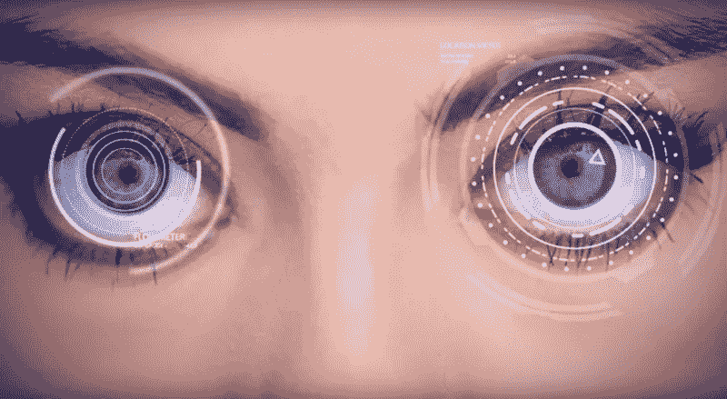
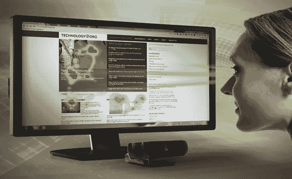
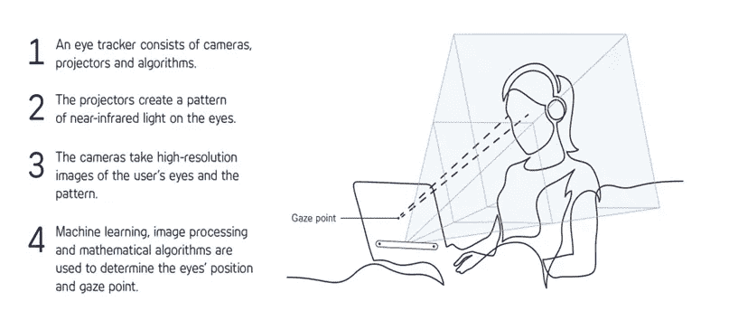
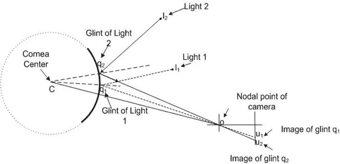
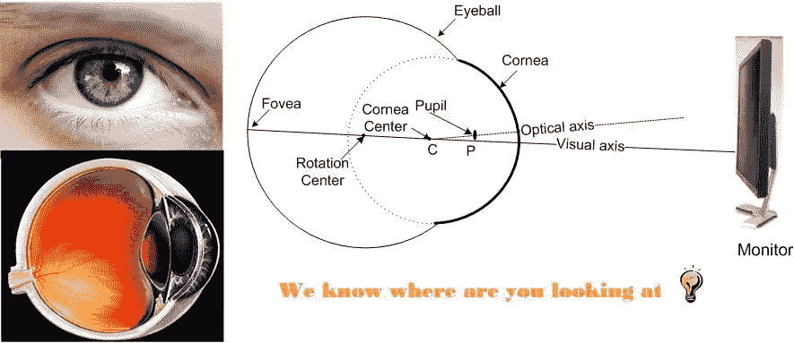
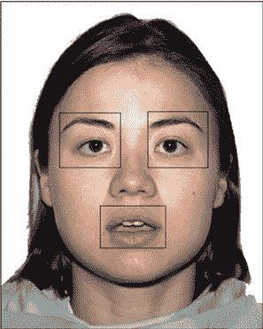
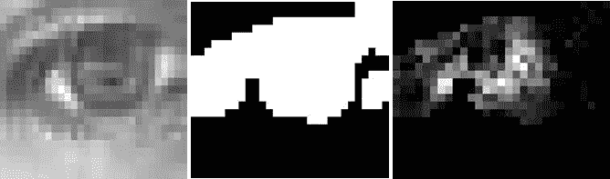
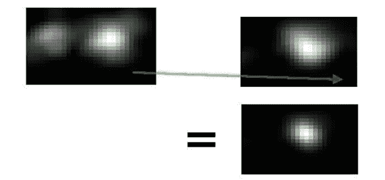

# 新手注意！眼睛凝视跟踪程序的强大曝光

> 原文：<https://pub.towardsai.net/attention-beginners-powerful-exposure-of-eye-gaze-tracking-procedure-a8575778c7e5?source=collection_archive---------0----------------------->

## 解释眼睛注视估计所需的现有系统和步骤

图片来自本·迪克森拍摄的 bdtechtalks.com。

> 为了您的方便，我为重要的概念添加了一些重要的解释链接，您可以在那里深入了解更多知识。希望你喜欢学习！

## 简介:

在过去的几十年中，眼睛注视跟踪技术已经导致了用于人机交互的有前途的注视估计技术和应用的发展。从历史上看，对视线跟踪的研究可以追溯到 20 世纪初，始于侵入式眼球跟踪技术。这些方法包括使用放置在眼睛周围的成对电极的电描记法，或者包括嵌入粘附在眼睛上的隐形眼镜中的线圈的巩膜搜索法。这种情况在 20 世纪 90 年代发生了变化，因为眼睛凝视在计算机输入和控制中得到了应用。2000 年后，计算速度、数字视频处理和低成本硬件的快速发展使视线跟踪设备更接近用户，应用于游戏、虚拟现实和网络广告。在目前的场景中，眼睛注视被用于人工智能、机器学习、计算机视觉等许多方面。

图片来自 prnewswire.com

眼睛凝视通过应用一些方法和算法使人和机器的交互更加紧密。

> 哦嘿！如果你是初学者，恭喜你！你是在正确的地方获得更多的知识，如果不是，那么这可能是一个可爱的复习，并可能提醒你的初学者的日子。

## 什么是眼动仪:

图片来自 tobii.com

嗯，我知道，你会说眼球追踪从来都不是小菜一碟，你猜怎么着！你是对的。尽管计算机视觉有许多算法可以有效地执行任务，但是这些算法仍然有一些局限性。眼球追踪可以被视为跟随眼睛在计算机屏幕上的方向，使用眼睛执行鼠标点击任务，即使用眨眼来发出命令，并且还可以使用眼睛来识别少量情绪。

"**眼球追踪**是测量**凝视点**(一个人正在看的地方)或者**眼球**相对于头部的运动的过程。一个**眼球跟踪器**是一个测量**眼球**位置和**眼球**运动的装置。

## 要执行的具体活动:

来自 [RPI ECS](https://www.google.com/url?sa=i&source=imgres&cd=&cad=rja&uact=8&ved=2ahUKEwiG3IPM2PvmAhWIWX0KHQ77AAMQjhx6BAgBEAI&url=https%3A%2F%2Fwww.ecse.rpi.edu%2F~cvrl%2Fzhiwei%2Fgazetracking%2Fgazetracking.html&psig=AOvVaw0En3_lJuvFU0oFFJ78U6lp&ust=1578836807828487) 的图像:单摄像机凝视估计场景。

(1)从有利距离的用户的正式面部和眼睛检测开始。

(2)检测凝视的参考点。(参考点:摄像机光线在**眼睛**的角膜上产生一个闪光，称为角膜反射。在大多数现有工作中，闪烁被用作**参考点**用于**凝视**估计。当**眼睛**或头部移动时，瞳孔闪烁差矢量保持不变。)

(3)应用虚拟参考点算法进行估计。(更多详情:[虚拟参考点](https://arxiv.org/pdf/1708.01817))

(4)在执行项目时，你需要训练你的算法或脚本。

(5)瞳孔检测和跟踪。(读完《基础》之后，你会更喜欢这篇由 Stepan Filonov 写的文章)

## 行动中的跟踪技术:

图片来自[ecse.rpi.edu](https://www.ecse.rpi.edu/~cvrl/zhiwei/gazetracking/gazetracking.html)

(1)基于视频的凝视方法通常使用两种成像技术: [**红外成像**](https://en.wikipedia.org/wiki/Thermography) 和 [**可见光成像**](https://en.wikipedia.org/wiki/Visible_light_imaging) 。前者需要红外摄像机和红外光源来捕捉红外图像，而后者通常利用高分辨率摄像机来获取图像。

(2)与红外成像方法相比，可见光成像方法避免了已知的问题，不需要特定的红外设备和红外光源。它们对环境中使用的玻璃和红外光源不敏感。可见光成像方法应该在自然环境中工作，在自然环境中，环境光是不受控制的，通常会导致较低对比度的图像。

(3) [Yusuke Sugano](https://www.researchgate.net/publication/225174403_An_Incremental_Learning_Method_for_Unconstrained_Gaze_Estimation) 已经提出了一种在增量学习框架内用于凝视估计的在线学习算法，该算法利用了用户在 PC 监视器上的操作(即，鼠标点击)。第一个训练模型用于检测和跟踪眼睛，并使用眼睛的裁剪图像来训练用于凝视估计的高斯过程函数。在它们的应用中，用户必须在训练程序后稳定头部在摄像机前的位置。

(4) [奥里弗·威廉姆斯](https://www.researchgate.net/publication/221364899_Sparse_and_Semi-supervised_Visual_Mapping_with_the_S)提出了一种稀疏半监督高斯过程模型来推断视线，简化了收集训练数据的过程。一般来说，要训练一个系统获得准确有效的结果，需要从各种对象获取大量数据(图像)。

## 旧系统的缺点:

我想知道！为什么这些眼睛凝视算法永远不可能完美，这对计算机视觉来说是相当令人恼火的？没错。但是随着资源的增长，眼睛注视的算法越来越有效。安静点。民间。以下是老式眼睛凝视系统的一些缺点:

(1)虹膜中心检测将变得比瞳孔中心检测更困难，因为虹膜通常被上眼睑部分遮挡。

(2)分类器的构造需要大量的训练样本，这些样本由不同条件下观看屏幕上不同位置的受试者的眼睛图像组成。

(3)它们对头部运动和光线变化以及训练样本的数量很敏感。

(4)他们不能容忍头部运动。

## 需要注意的步骤:

## 面部和眼部区域的识别:

要开始你的任务，首先，你需要定位脸部，然后是眼睛。在人脸的情况下，可以看 [Opencv 的人脸识别](https://docs.opencv.org/2.4/modules/contrib/doc/facerec/facerec_tutorial.html)做基本参考。在这里，眼睛是最重要的，在眼睛上完成任务一点也不容易。你可以[看到这个](http://answers.opencv.org/question/105813/crop-roi-from-face-eye-detection/)。

图片来自[印度商城](https://www.google.com/url?sa=i&source=imgres&cd=&cad=rja&uact=8&ved=2ahUKEwigzNzU6vvmAhUCXSsKHcfaAukQjB16BAgBEAM&url=https%3A%2F%2Fwww.indiamart.com%2Fproddetail%2Fface-recognition-solutions-21341122633.html&psig=AOvVaw3f73J2CF03H_qgaeqv4cJM&ust=1578841929229013)。

图片来自[www.researchgate.net](http://www.researchgate.net)作者[海莉·克劳福德](https://www.researchgate.net/profile/Hayley_Crawford)

面部 ROI、左眼 ROI 和右眼 ROI 以及嘴 ROI 的例子；面部 ROI 是一个矩形形状，自动定位以覆盖模型的面部、头发和颈部，而矩形区域内的注视坐标分别分配给每个模型的眼睛和嘴巴 ROI。在识别眼睛所在的面部区域之后。然后缩小为更准确地检测眼睛而指定的区域。然后在 ROI 上画小方框以进行更详细的检测。

## 寻找瞳孔中心:

要估计凝视的方向和位置，您必须在每只眼睛的边界框内找到瞳孔中心。为此，您可以使用基于[梯度的方法](https://arxiv.org/pdf/1605.05272)，该方法利用了虹膜和瞳孔边界处的图像梯度倾向于直接指向远离瞳孔中心的事实。它的工作原理如下:

对于下面的公式，你需要做一个单位向量 di，它从一个给定的图像位置指向一个梯度位置，然后它与归一化梯度向量 gi 的平方点积，表示为(di T gi) 2，如果我们在瞳孔中心，它将被最大化。您应该对每个图像位置和每个梯度进行这种计算。瞳孔中心 c*是使这些点积之和最大化的位置:

现在只计算图像黑暗部分的瞳孔中心概率，因为已知瞳孔是黑暗的。(为此，对像素亮度执行阈值，然后放大图像以稍微扩大允许的区域。你必须放大，使我们的搜索区域包括瞳孔中有明亮反射的部分。)睫毛和阴影产生不想要的梯度，这会在瞳孔中心概率图像中产生伪峰值。所需的梯度曾经相当强，所以如果你愿意，可以丢弃所有强度低于平均值的梯度。

这种方法提供了具有相当高的可靠性和可接受的精度(通常在 3 个像素以内)的虹膜中心。然而，它可能容易受到低分辨率图像中看起来类似于瞳孔的区域的影响，例如眼睛左侧的阴影斑点。

*从左到右:模糊的眼睛图像；被认为是瞳孔候选的足够暗的区域；我们对黑暗区域中心概率的估计(白色=最高概率)。注意左边的杂散峰值。*

## 眼睛方向的参考点:

以根据从面部某个参考点的偏移来检测瞳孔坐标。面部和眼睛的 Haar 级联边界框不够稳定，不足以用作参考点，即使在一起平均时也是如此。因此，您可能需要大量试验其他几种可能的参考点方法，如用干擦记号笔在两眼之间画一个蓝点，并应用所需的算法来找到蓝点的中心。

## 双眼瞳孔概率:

哦，最后，概率来了，一些你已经意识到的东西！。现在首先，通过组合多个概率估计来提高你的估计的可靠性。因此，您可以设计一种方法来合并两只眼睛的估计值:将右眼的概率图像叠加到左眼上，并将两个概率相乘。

瞳孔一起移动，因此出现在两幅图像的相同位置。但是眼睛的其他部分(产生噪音的部分)在脸部的中心线附近是镜像的，因此在两幅图像中出现在不同的位置。

使用来自先前帧的平均瞳孔到瞳孔向量，将相机左眼概率叠加在相机右眼概率上。他们的产品噪音小。

综合两只眼睛的估计并不直截了当。因为眼睛边界框不准确，所以它们不能用于对齐概率图像。洞察力可以是，如果头部位置稳定，当瞳孔四处移动时，从左眼瞳孔到右眼瞳孔的矢量几乎是恒定的。(尤其是当眼睛聚焦在一个平面上的时候，比如电脑显示器。)因此，如果包括左眼的任何图像区域被该向量移动，则左瞳孔将在右瞳孔之上结束。

因此有时间组合眼睛概率估计，而不需要面部上的任何绝对参考点。(做一件事:在乘法之前稍微模糊两个图像，使得瞳孔-瞳孔向量中的几个像素的误差仍然在真实瞳孔附近产生强峰值。)可以从各个瞳孔位置的噪声估计中获得瞳孔到瞳孔向量。然后简单地应用非常慢的移动平均滤波器来拒绝向量估计中的噪声。

## 结论和可能性:

最大的改进机会是允许头部运动而无需重新训练。(大多数算法和商业系统都不能处理头部运动。)对此的一种可能性是估计头部位置并应用几何学。当前系统检测到头部的左右移动，并可用于实时修改模型。网络摄像头无法直接感知距离，但我们的瞳孔向量的长度可能是一个非常有希望的信号，用于估计距离的变化。头部方向的变化将更难校正，因为头部旋转会产生参考点相对于瞳孔位置的非线性变化。一种选择可能是使用 Haar 级联来检测用户的鼻子并推断头部方向，然后应用机器学习或面部几何来校正头部方向对参考点的影响。

> 荣誉奖:(这里有一篇很好的文章，你可以更喜欢进一步的细节和概念。)

[视线追踪技术综述](https://arxiv.org/pdf/1312.6410)。pdf - arXiv

## 快乐学习家庭！