# 立正！初学者，理论:挑战面部特征识别的术语和方法

> 原文：<https://pub.towardsai.net/attention-beginners-theory-challenging-terms-and-methods-for-facial-features-recognition-f8657fca0be2?source=collection_archive---------0----------------------->

## 理论解释(计算机视觉):模式识别(面部识别)的挑战和可能的方法

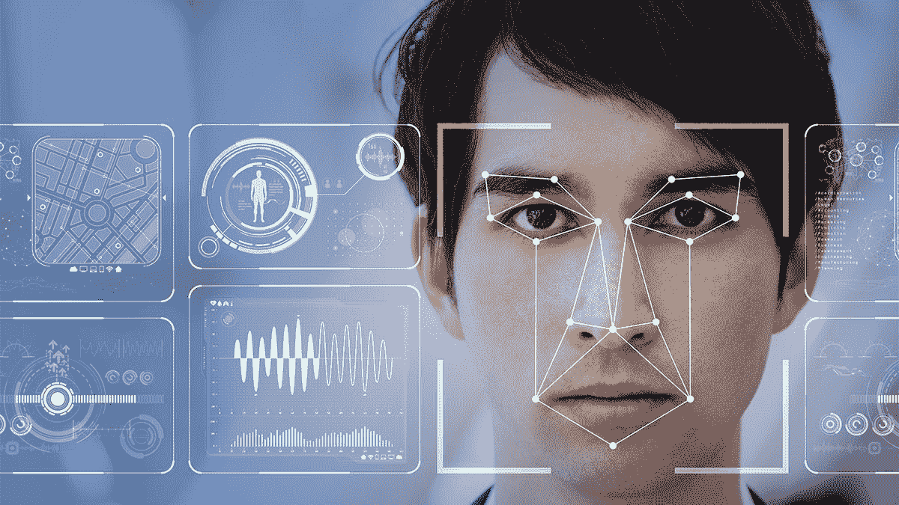

**形象由**[**【newsroom.cisco.com】**](https://newsroom.cisco.com/)**从** [**到**](https://newsroom.cisco.com/authorbio-detail?articleId=252072)

> **节能小贴士民间**:最好从 **OpenCV-C++/ Python** ，[https://docs . OpenCV . org/2.4/modules/contrib/doc/facerec/facerec _ tutorial . html](https://docs.opencv.org/2.4/modules/contrib/doc/facerec/facerec_tutorial.html)是一个专门解决计算机视觉问题的 Python 绑定库。以后你可以继续发展神经网络。

## 背景:

1960 年，伍迪给出了第一个半自动面部识别技术。这种技术需要图像上的一些特征，例如嘴、鼻子、眼睛和鼻子。之后，人脸识别技术出现了。从 2001 年开始，这种生物识别技术迅速发展，如下图所示。这篇文章的主要目标是让初学者了解不断增长的对人脸识别生物识别技术的科学兴趣。下面的分析是通过应用关键字“人脸识别”进行的。

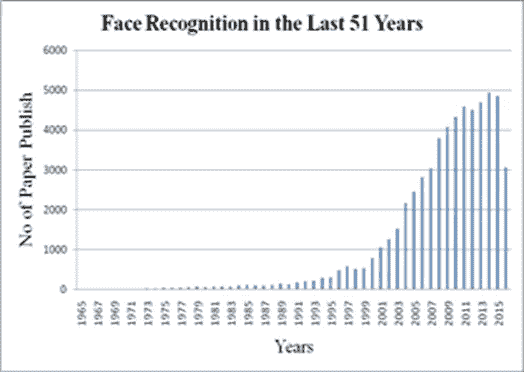

**过去 51 年人脸识别相关出版物**

## 挑战性条款:

## A.老化:

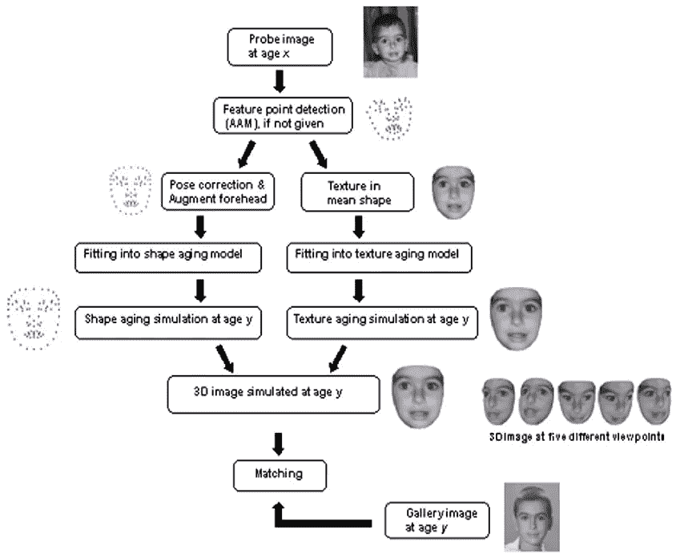

**从 x 岁到 y 岁的衰老模拟**

与其他面部变化相比，衰老是人一生中不可避免的自然过程。可以在三个主要的独特特征下观察到老化效应:

1)衰老是不可控的:不能提前，甚至不能延迟，是缓慢的，不可逆的。

2)个性化衰老迹象:每个人都经历不同的衰老模式。这些依赖于他或她的基因和许多其他因素，如健康、食物、地区和天气条件。

3)衰老的迹象取决于时间:一个人在老年时的面孔会影响所有老年人的面孔，但在年轻时不受影响。

## B.部分遮挡:

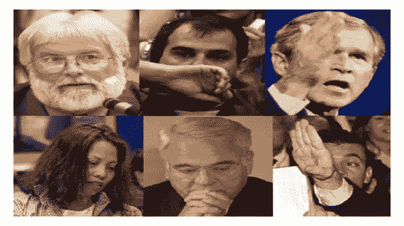

**部分遮挡的示例图像。**

你看，上面的图像有部分遮挡还挺公平的吧！但是等等，这个怎么样？

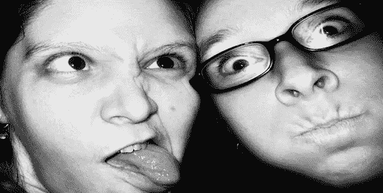

**这意味着，未来不仅仅是人脸识别，这已经决定了，哈哈！**

就像这样，遮挡指的是图像中的**自然或人为障碍**。它可以是面部的局部区域以及不同的物体，例如太阳镜、围巾、手和头发。它们通常被称为部分闭塞。部分遮挡对应于任何遮挡对象。而**遮挡少于 50%的人脸被认为是部分遮挡**。部分遮挡情况下的人脸识别方法分为以下三类:

(1)基于零件的方法。

(2)基于特征的方法和

(3)分形方法。

图像处理的许多领域受到部分遮挡的影响，例如**的识别耳朵由于耳环**而被遮挡。当人们通过使用**太阳镜、围巾、面纱或者将手机或手放在脸前**来欺骗系统时，遮挡会影响系统的性能。在某些情况下，其他因素，如极端光照导致的阴影，也会成为遮挡因素。此外，局部方法用于处理部分遮挡人脸的问题，其将人脸分成不同的部分。然而，这个问题可以通过消除在图像中精确识别时造成麻烦的一些特征来克服。大多数局部方法是基于特征分析的，其中检测最佳可能特征，然后将它们组合。可用于此目的的另一种方法是接近于**整体方法**，在该方法中，遮挡的特征、特质和角色被消除，而面部的其余部分被用作有价值的信息。研究人员正在开发不同的技术来解决这个问题。哦天哪！很容易理解，对吧？

## C.姿势不变性:

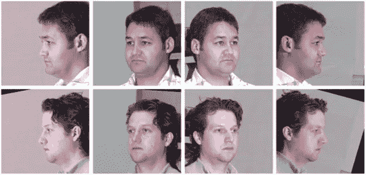

**姿态不变的人脸识别。**

姿态变化是实现成功的人脸识别系统的另一个障碍。人们每次拍照的姿势都不一样。摆姿势没有标准化的规则。因此，从具有不同姿态的图像中区分和识别面部变得更加困难。姿势变化降低了面部特征的表现。此外，许多系统在不灵活的成像条件下工作，因此会影响图库图像的质量。处理姿态变化的方法可以分为两类，即多视角人脸识别和跨姿态人脸识别。多视角人脸识别可以看作是正面人脸识别的一个补充，其中考虑了每个姿态的图库图像。另一方面，在人脸识别中跨姿态，产生具有以前从未暴露给识别系统的姿态的人脸。还有一些其他的方法和途径正被用来解决人脸识别的类似问题。此外，姿势的变化和改变可以分为三类，即:

(1)一般算法。

(2)二维人脸识别方法

(3)三维模型。

## D.照明:

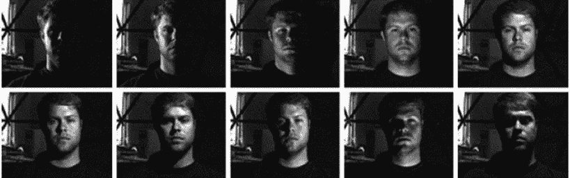

**任意光照下的人脸识别。**

照明是光的一种可观察的属性和效果。它也可能指闪电效应或光源的使用。全局照明是已经在 3D 计算机图形中使用的算法。光照变化也会严重影响人脸识别系统。因此，它已成为许多研究者关注的领域。然而，从静止或视频图像中识别一个或多个人成为一项乏味的任务。但是，当图像是在受控环境下连同均匀背景一起拍摄时，从图像中提取所需信息是相当容易的。此外，有三种方法可以用来处理照明问题。它们是梯度、灰度级和面部反射场估计技术。灰度变换技术用非线性或线性函数进行深度映射。梯度提取方法用于在灰度级提取图像的边缘。照明是严重影响通过人脸图像或视频获得的识别系统的性能的一个因素。开发这些技术是为了抑制照明的影响。

## 人脸识别中使用的方法:

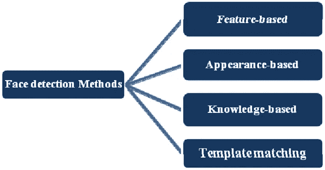

人脸识别是模式识别研究和技术的子领域。首先，我们从标准相机获取输入图像，该图像被称为输入图像。其次，执行预处理以提高图像质量并降低拍摄图像中的噪声。下一阶段是面部分割，其中面部部分从图像的人体和背景中裁剪出来。在下一阶段，在将输入图像分割到非常好的水平之后进行特征提取，并且识别相关特征，这可以帮助将该人与其他人区分开。在最后一个阶段，生成一个模板用于注册和匹配。最后，在生物统计系统中进行匹配，以识别被认证的人，如果匹配，则输出将以用户接受的形式出现，否则用户拒绝。人脸识别系统可以分为不同的类别:

## A.基于知识的方法:

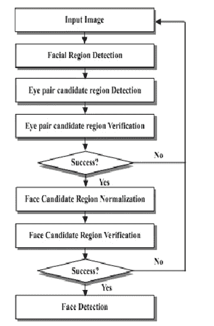

基于知识的技术基于面部的几何形状和面部特征的排列。这些基于知识的方法描述形状、大小和纹理。一些方法描述了面部特征的一些其他特征，例如头、眉毛、眼睛、鼻子和下巴。这些技术的主要问题是，由于不同类型的姿态或头部方向，它们的性能不佳，如图中我对 [V-J 算法](https://en.wikipedia.org/wiki/Viola%E2%80%93Jones_object_detection_framework)的实现结果所示:

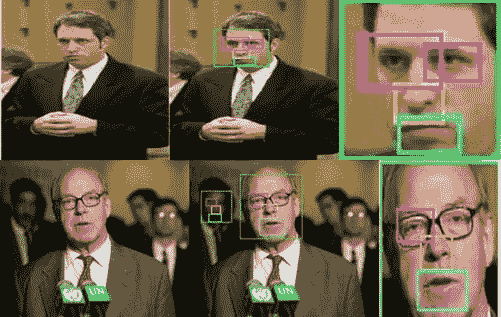

**获得人脸分割结果。**

## B.特征不变方法:

[特征不变技术](https://en.wikipedia.org/wiki/Scale-invariant_feature_transform)的主要目的是即使在光照条件变化的情况下也能找到人脸的结构特征。使用不同类型的结构特征，例如面部局部特征、肤色、形状和纹理。这些方法对光照、遮挡、肤色区域的存在以及相邻面非常敏感，如图所示:

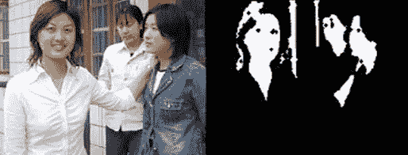

**(一)原始图像。(b)肤色二值图像**

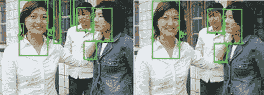

**(c)肤色标记区域。(d)通过面部长宽比验证的图像。**

## C.基于模板的方法:

基于模板的方法对人体的姿态、比例和形状变化敏感。已经提出了可变形模板方法来处理身体的姿势、比例和形状的这种变化。使用弹性模型的基于模板的方法包括形状参数以及面部特征的强度信息。

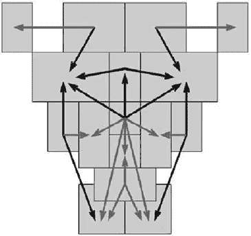

**一个 14x16 像素比例的模板。**

## D.基于外观的方法:

用于人脸检测的基于外观的方法是特征脸、线性判别分析、神经网络、支持向量机和隐马尔可夫模型。在这些方法的帮助下，整个图像被扫描并且图像区域被识别为人脸或者非人脸。在模板匹配期间，基于外观的方法将会出现。

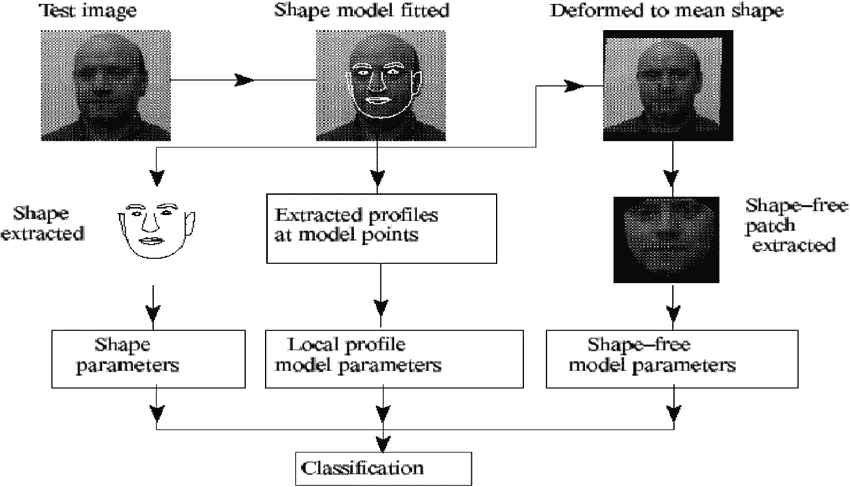

**基于外观的分类方法。**

## 结论:

所以嘿！最后，人脸识别多年来一直是研究人员努力的领域。本文对不同的人脸识别方法和具有挑战性的术语进行了综合研究。经过详细的分析，发现当原始人脸图像的特征维数较高时，PCA 是最适合的技术。事实上，人类行为最近已经成为学者们的一个有前途的研究领域，应该在未来加以开发。最后得出结论，人脸识别系统在研究方面仍然存在空白，需要填补，以提高其准确性和效率。

> 要了解更多的概念和理解，你可以参考 Divyansh Dwivedi [的这篇文章《面向初学者的人脸识别》](https://towardsdatascience.com/face-recognition-for-beginners-a7a9bd5eb5c2)来理解 PCA、神经网络等。

***恭喜民间！，你已经迈出了人脸识别的第一步。我很乐意听到你的问题，并提供最合适的答案。***

## 快乐学习 FAM！