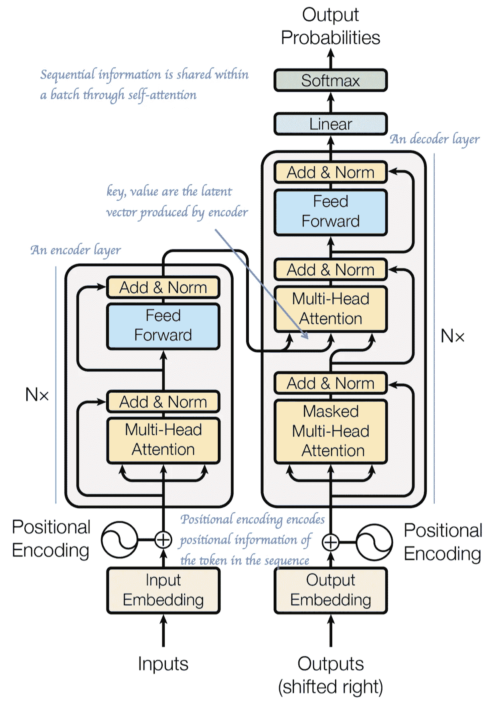
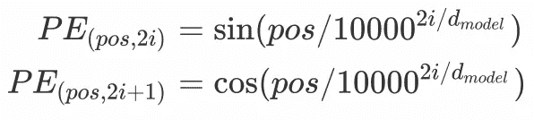
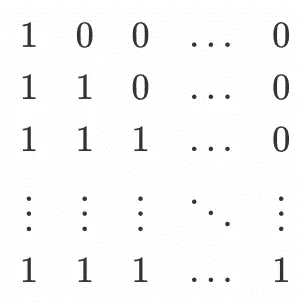
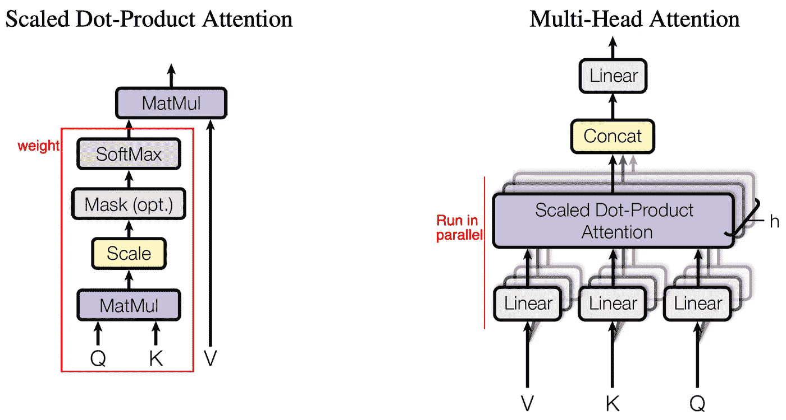
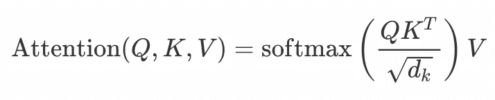
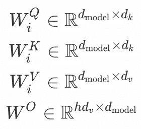
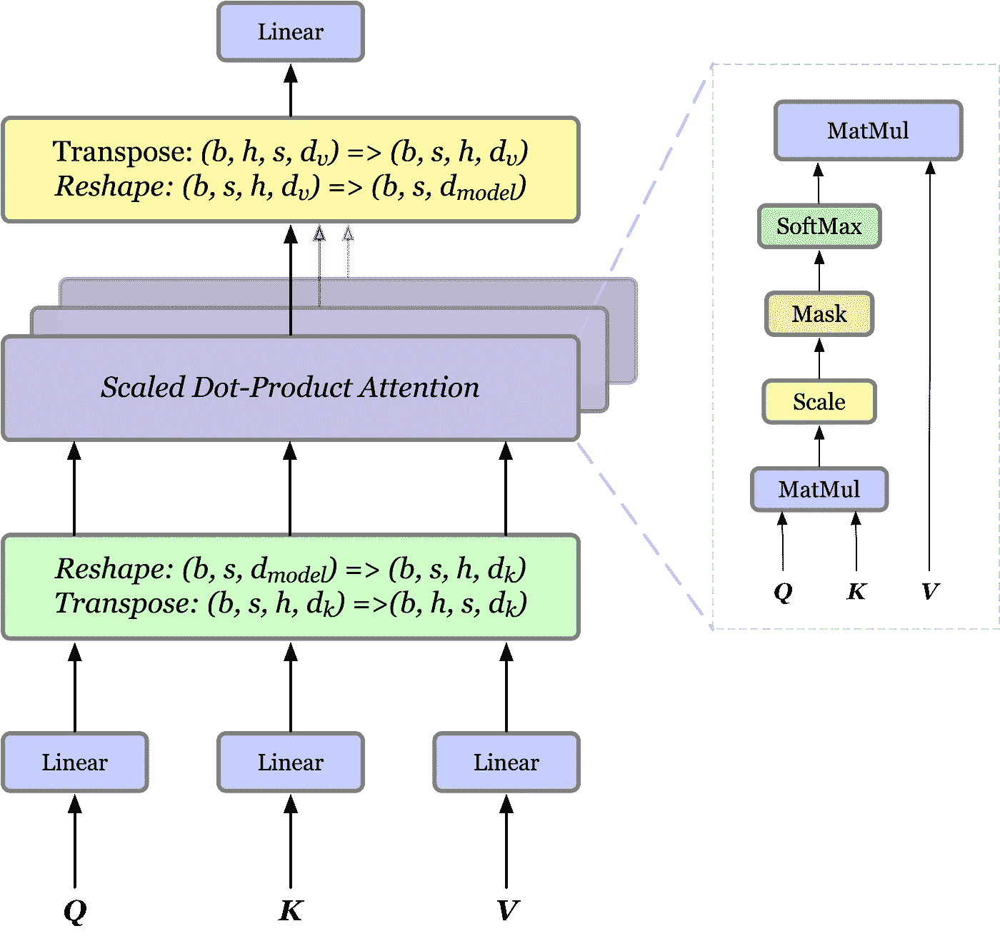
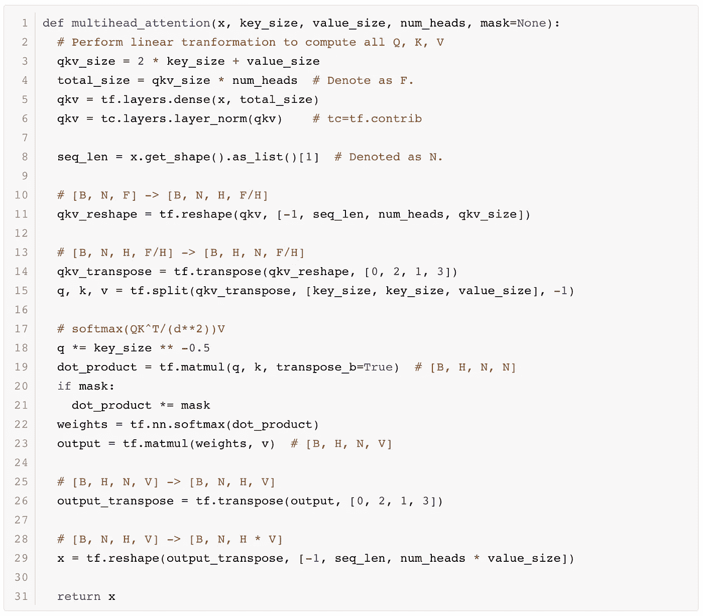

# 关注是你所需要的——变形金刚

> 原文：<https://pub.towardsai.net/attention-is-all-you-need-transformer-4c34aa78308f?source=collection_archive---------0----------------------->

## [机器学习](https://towardsai.net/p/category/machine-learning)

来自 https://wall.alphacoders.com/big.php?i=845641[的](https://wall.alphacoders.com/big.php?i=845641)

## **简介**

递归神经网络(RNNs)，特别是长短期记忆(LSTM)和门控递归单元(GRU)，已经被牢固地确立为序列建模和转导问题的最先进的方法。这种模型通常依赖隐藏状态来维护历史信息。它们是有益的，因为它们允许模型根据隐藏状态中提取的有用历史信息进行预测。另一方面，这种固有的顺序性质排除了并行化，这在较长的序列长度时变得至关重要，因为内存约束限制了跨示例的批处理。此外，在这些模型中，关联来自两个任意输入或输出位置的信号所需的运算数量随着位置之间的距离而增长，这使得学习远处位置之间的相关性更加困难。

在本文中，我们将讨论 Vaswani 等人在 NIPS 2017 上提出的一个名为 Transformer 的模型，该模型利用自我注意来计算其输入和输出的表示，而不使用序列对齐的 rnn。通过这种方式，它减少了将来自两个任意位置的信号关联到一个常数所需的操作数量，并显著提高了并行性。在本文的其余部分，我们将关注模型的主要架构和注意力的中心思想。其他细节请参考参考文献[1]和[2]。

值得记住的一点是，我们在这里介绍的转换器像 RNNs 一样维护样本中的顺序信息。这表明网络的输入是*【批量大小，序列长度，嵌入大小】*的形式。

## **模型架构**

转换器遵循编码器-解码器结构，对编码器和解码器使用堆叠自关注层和完全连接层，分别显示在下图的左半部分和右半部分。

变压器模型架构，最初从纸上注意是你所需要的

## 位置编码

在这项工作中，我们使用不同频率的正弦和余弦函数来编码位置信息:

其中 *pos* 为位置， *i* 为尺寸。也就是说，位置编码的每个维度对应于一个正弦曲线。波长形成从 *2π* 到 *10000⋅2π* 的几何级数。作者选择这个函数，因为他们假设它将允许模型容易地学习通过相对位置出席，因为对于任何固定的偏移 *k* ， *PE_{pos+k}* 可以表示为 *PE_{pos}* 的线性函数。

## **编码器和解码器堆栈**

**编码器**

编码器由一堆 *N=6* 相同的层组成。每层有两个子层。第一个是多头自我关注机制(我们很快就会回来)，第二个是简单的全连接前馈网络。在两个子层的每一个周围使用剩余连接，并且在它们之间应用层标准化。即每个子层的输出是*x+Sublayer(layer norm(x))*(这个，被[2]采用，与文中使用的略有不同，但遵循了何等在[3]中推荐的模式)，其中 *Sublayer(x)* 是子层本身实现的函数。

**解码器**

解码器也是由一堆 *N=6* 相同的层组成。除了编码器层中的两个子层之外，解码器还插入了第三个子层，该子层对编码器堆栈的输出执行多头关注(即，我们将编码器的输出作为键和值)。解码器中的子层遵循与编码器中相同的方式。

**掩蔽**

在编码器和解码器的自关注层中，在 softmax 之前使用掩码，以防止对失序位置的不必要关注。此外，结合通用掩码，在解码器堆栈中的自关注子层中使用附加掩码，以防止位置关注后续位置。这种面具具有以下形式

实际上，解码器中的两个掩码可以通过逐位 and 运算来混合。

## **注意**

(左)缩放的点积注意力。(右)多头注意力由几个并行运行的注意力层组成。

**缩放点积注意**

注意力函数可以描述为从查询和一组键-值对到输出的映射，其中查询、键、值和输出都是向量。输出被计算为值的加权和，其中分配给每个值的权重由查询与相应键的兼容性函数来计算。

更正式地说，输出计算如下

其中 *Q，K，V* 分别是查询、键和值； *dₖ* 是按键的维度；兼容性函数(softmax 部分)计算分配给行中每个值的权重。点积 *QK^T* 在\sqrt{dₖ} 上缩放 *1，以避免 *dₖ* 的大值出现极小的梯度，此时点积的幅度变大，将 softmax 函数推到边缘区域。*

一些要点:从数学上来说，注意力只是集中在 *Q* 和 *K* 相似的空间(w.r.t .余弦相似性)，假设它们处于相同的量级——因为*(qk^t)_{i,j}=|q_i||k_j|cosθ*)。一个极端的思考练习是 *Q* 和 *K* 都是一个热编码的情况。

**多头关注**

单一注意力头平均注意力加权位置，降低了有效分辨率。为了解决这个问题，多头注意力被提出来共同关注来自不同位置的不同表征子空间的信息。

其中投影是参数矩阵

对于每个头部，我们首先应用全连接层来降低维度，然后将结果传递给单个注意函数。最后，所有的头部被连接并再次投影，产生最终的值。由于所有的头并行运行，每个头的维度预先降低，总的计算成本类似于全维度的单头注意。

在实践中，如果我们有 *hdₖ=hdᵥ=d_{model}* ，多头注意力可以简单地用具有四个附加全连接层的注意力来实现，每个维度 *d_{model}×d_{model}* 如下

**张量流代码**

我们现在为多头注意力提供 Tensorflow 代码。为了简单起见，我们进一步假设 *Q* 、 *K* 、 *V* 都是 *x.*

代码源自[https://github . com/deep mind/sonnet/blob/56c 917 e 156d 84 db 2 bcbc 1 f 027 ccbeae 3c b 1192 cf/sonnet/python/modules/relational _ memory . py # L120](https://github.com/deepmind/sonnet/blob/56c917e156d84db2bcbc1f027ccbeae3cb1192cf/sonnet/python/modules/relational_memory.py#L120)。量身定制，消除不必要的依赖

## 结束

我希望你已经对变形金刚有了基本的了解。要查看完整的代码示例，您可以进一步参考[ [2](http://nlp.seas.harvard.edu/2018/04/03/attention.html#attention) ]

## **参考文献**

1.  你所需要的只是关注
2.  Guillaume Klein 等. OpenNMT: [用于神经机器翻译的开源工具包](http://nlp.seas.harvard.edu/2018/04/03/attention.html#attention)
3.  深剩余网络中的单位映射。