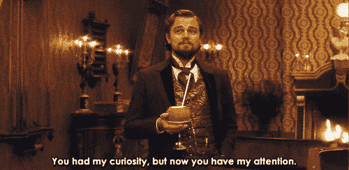
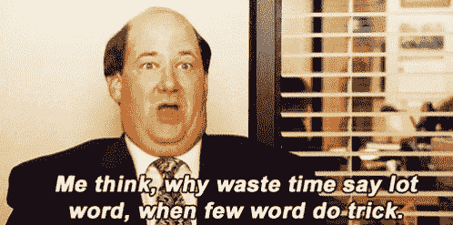
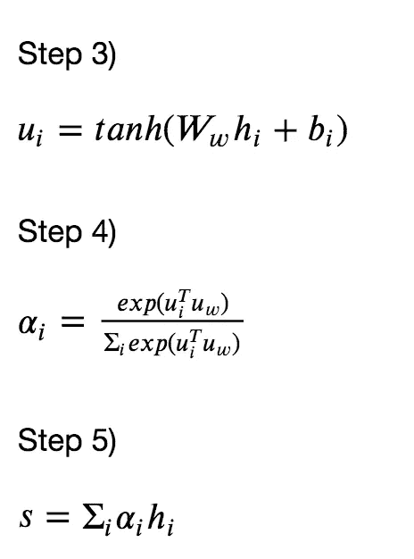
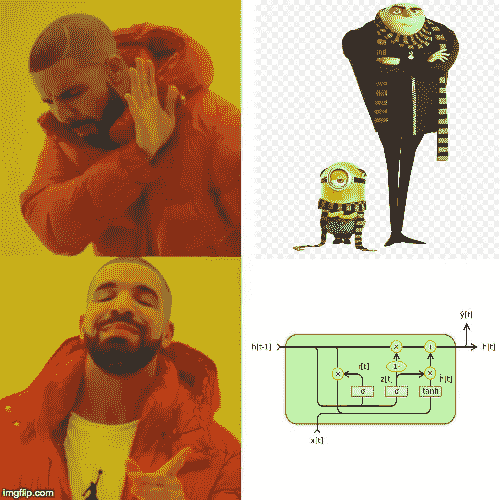
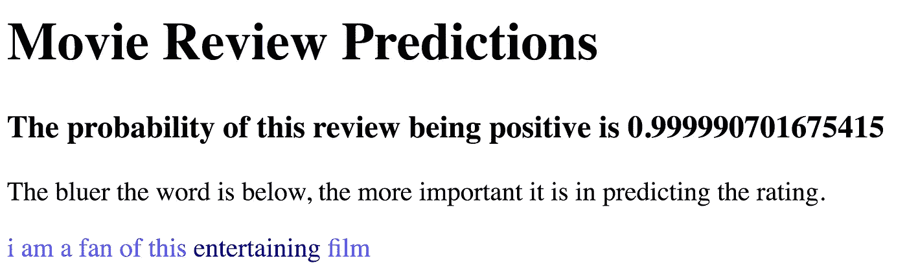
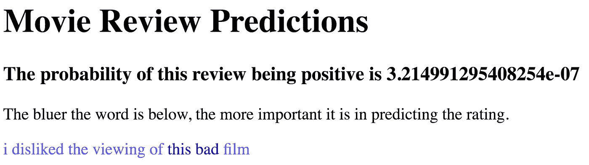

# 请注意:文件分类

> 原文：<https://pub.towardsai.net/attention-please-document-classification-7be927e758a?source=collection_archive---------0----------------------->

## [机器学习](https://towardsai.net/p/category/machine-learning)

深度学习实践的当前状态令我着迷，因为我们人类处理图像和文本的方式与我们用来让计算机处理图像和文本的算法之间存在有趣的相似之处。

连续单词包方法，其中句子中每个单词的单词嵌入被聚集以将整个句子表示为单个向量，可以在许多 NLP 任务中获得非常可观的结果。

*然而，关键在于单词理解句子成分顺序 a。*哎呀，让我再试一次。*语序却是句子理解中至关重要的一个组成部分。*不，那也不对。我想说的是:“*然而，词序是理解句子的一个重要组成部分。这个想法产生了像 LSTM 和 GRU 的循环算法，它们使用词序来做预测。[这里的](https://medium.com/datadriveninvestor/recurrent-neural-network-rnn-52dd4f01b7e8)是深入挖掘递归算法的好资源；一个简单的总结是，这些模型跟踪一个单词一个单词地更新的状态。这种状态可以被认为是记忆，在处理下一个单词时考虑到单词的先前想法/概念。*

正如凯文非常优雅地指出的，一个句子中的所有单词并不都同等重要。这种赋予句子中更重要的单词更多预测能力的想法被定义为注意力。让问题变得更复杂的是，单词并没有固定的重要性等级；这个词的重要性取决于句子的上下文。

为了更好地理解注意力，我实现了 t [他的论文](https://www.cs.cmu.edu/~hovy/papers/16HLT-hierarchical-attention-networks.pdf)的简化版本。作者比正常的注意力模型更进了一步，使用了一种分层的方法，在这种方法中，他们不仅了解单词在句子中的重要性，还了解句子在文档中的重要性。我正在处理的数据集在每个观察中都包含一两个句子，所以我觉得句子注意层是不必要的。

*完全免责声明，我最初在一个必须保持私有的数据集上实现了这个模型。我的示例代码使用了公开可用的* [*IMDB 数据集*](https://ai.stanford.edu/~amaas/data/sentiment/) *，其中一些评论可能很长，足以保证使用分层关注。*

那么，注意力是如何工作的呢？看一个给定的句子，说哪个词重要是一回事。然而，如果不可推广，这个模型显然是没有用的，所以它需要以某种方式学习单词的属性，以及这些属性如何相互作用以及哪些相互作用会产生重要意义。

描述步骤的数学描述

第一步:将词汇表中的每个单词表示为一个 N 维的嵌入向量。这是 NLP 中一个非常常见的方法，更多信息[在这里](https://medium.com/data-science-group-iitr/word-embedding-2d05d270b285)。

第二步:通过 GRU 发送嵌入向量的每个句子。GRU 将在每个单词之间有一个隐藏状态。通常对于预测，我们只关心最终状态，但是对于这个模型，我们也想跟踪每个中间状态。设 h *ᵢ* 为表示隐藏状态后记 *i* 的向量。注意，虽然可能，但不是必要的，我遵循论文使用了双向 GRU。这意味着模型向前和向后贯穿句子。每个单词都有隐藏状态 h *ᵢ* ᶠ和 h *ᵢ* ᵇ，我们简单地将这两个向量连接成 h *ᵢ* 然后继续。

第三步:通过一个完全连接的线性层馈送每个 h *ᵢ* ，包括一个偏置项。该论文建议输出尺寸具有尺寸 100；我还没有探索调整这个超参数的功效，尽管我认为这可能是一个有趣的研究领域。对于结果向量中的每个元素，取*双曲正切*。把这个新向量 u *称为ᵢ* ，再次对应于字 *i* 。

第四步:通过另一个线性层发送每个 u *ᵢ* ，这次没有偏置项。这个线性层应该有一个标量输出，所以现在我们有一个与每个单词 *i* 相关联的标量值。然后对每个句子应用 softmax 函数；每个句子的标量总和为 1。让句子 *i* 的标量称为 *αᵢ.*

第五步:我们快到预测时间了。对于给定句子中的每个单词，我们现在都有一个向量 h *ᵢ、*和一个重要性标量 *αᵢ.*这里理解这些 *hᵢ* 向量不同于原始单词嵌入是至关重要的，因为它们在向前和向后两个方向上都有句子的记忆。我们对评审中的所有向量进行元素加权求和，将此评审向量称为 *s.*

第六步:应用于 *s* 的函数根据模型的目标而不同，但是因为该模型对文档二进制分类感兴趣，所以我将最终的线性层应用于向量 *s* ，它返回奇异值 *p，*属于类 1 的概率。

就预测而言，这个模型架构之外的一切都是基本的深度学习实践。这个模型有趣的地方在于，我们不仅得到了一个预测，而且 *α* 值的向量代表了给定句子中每个对应单词的重要性。

为了测试它是如何工作的，我组装了一个小的前端组件来与模型交互。用户只需输入电影评论的文本，用户就会得到肯定的概率以及评论中每个词有多重要的可视化描述。启动这个界面的代码以及模型训练都可以在 my [Github](https://github.com/jrpresta/website) 中找到。以下是我尝试的两篇评论的截图。

我很抱歉伤了各地招聘人员的心，但我不想找前端开发工作——我更喜欢坚持机器学习。模型对预测非常确定，这很棒，但对我来说更有趣的是模型选择了重要的词。看起来它知道使用*娱乐*和*坏*来进行预测，因此这些词的权重明显高于句子的其余部分。

注意力是提高模型预测能力的有效方法，看看模型认为哪些词有用真的很有趣。我希望在读完这篇文章后，你会考虑在你的模型中加入注意力来促进预测和推理。