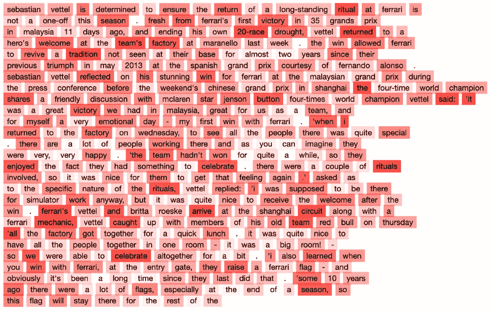
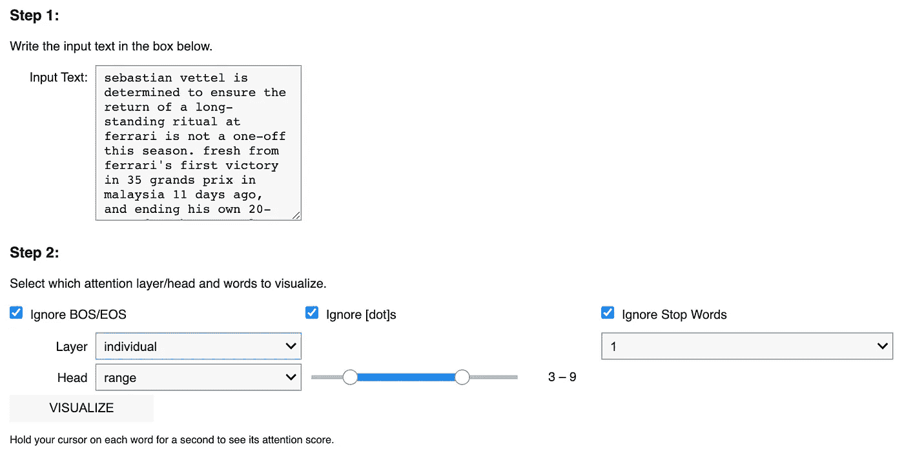

# 注意力可视化工具包:使用罗伯塔模型展示得分最高的单词

> 原文：<https://pub.towardsai.net/attention-visualizer-package-showcase-highest-scored-words-using-roberta-model-8218658b4447?source=collection_archive---------3----------------------->

## [自然语言处理](https://towardsai.net/p/category/nlp)

[*这个库*](https://github.com/AlaFalaki/AttentionVisualizer) *可以让你很容易地看到哪些单词在每一层的自我关注分数方面贡献最大，并使用预先训练的罗伯塔模型走向输出。*



图一。使用来自 CNN/DM 数据集的文章的模型输出示例。(启用“忽略特殊记号、点、停用字词”功能)

自我关注机制相对于上下文中的所有其他标记给每个标记分配一个分数。每个头部中的得分张量形状将是[N×N]，其中 N 是输入长度。理论上，我们可以将这些分数可视化，以查看哪些单词对模型的最终决策贡献最大。该库与 RoBERTa [1]兼容，并有不同的选项来显示详细视图，如图 2 所示。



图二。用户界面元素。

第一步是输入一篇长度不超过 512 个单词的文章；然后有三个不同的选项，在计算分数时忽略不同的单词。这些选项允许您忽略 1) BOS/EOS 标记、2)点和 3)停用词。为什么这些选项可用的细节将在后面讨论。最后，下拉菜单选择*所有*、*一个范围*或*特定的*层和头。单击 visualize 按钮后会显示输出(图 1 ),如果将鼠标悬停在每个单词上一两秒钟，就会显示每个单词的分数。

这个包托管在 [Github](https://github.com/AlaFalaki/AttentionVisualizer) 上，你可以使用 Python 包管理器(pip)来安装它，它会负责下载 Huggingface、NLTK 和 ipywidgets 等依赖项。

```
pip install git+https://github.com/AlaFalaki/AttentionVisualizer.git
```

导入该类，并使用 *AttentionVisualizer()* 函数初始化它，该函数将下载 RoBERTa 模型和 tokenizer。在笔记本中，可以通过调用 *show_controllers()* 方法来处理任何文本。

或者，使用[这个演示链接](https://colab.research.google.com/github/AlaFalaki/AttentionVisualizer/blob/main/demo.ipynb)在 Google Colab 环境中使用这个模型。

# 实施细节

有几点和设计选择值得讨论。我将解释这些问题以及解决这些问题的方法。

*   **高维度**

自我注意分数张量具有[L×H×N×N]的大小，其中 N×N 表示自我注意机制，即通过将句子与其自身进行比较来计算每个标记的分数；同样，变量 L 和 H 代表层数和自我关注头数。正如你所看到的，它远不是一个简单的大小为[N]的秩 1 张量，它为每个令牌保存一个分数！最简单的解决方案是将分数与层和头一起平均。(该包中选择的方法)

想到的更高级的想法，如头部修剪以找到最有价值的头部，或结合维度减少算法以提取重要的特征，目前还没有实现。

*   **标记化过程**

RoBERTa 模型使用字节级字节对编码，将一些单词分解成更小的比特。(比如像**【去】**这样的单词会转换成**【go+ing】**)词汇量小一点会有帮助。但是既然每个标记(“go”、“ing”)得到的是分数而不是单词，我们应该如何处理呢？这里实现的解决方案是选择得分最高的标记作为单词的得分。(例如，如果第一个单词“go”得分为 0.05，第二个单词“ing”得分为 0.01，则 0.05 将被选为单词“going”的得分)

*   **忽略令牌**

如前所述，有一个选项可以在显示单词组时忽略它们的分数。如果您使用这个包并尝试不同的配置，那么这些选项存在的原因就很清楚了。事实证明，平均所有的分数并显示它们会将一个很大的数字分配给句子([CLS])令牌的乞求，这是有意义的。同样明显的是，忽略 BOS 标记会增加[dot]标记的分数！只有在忽略等式中的 bo 和[dot]之后，才能获得合理的输出。

需要注意的是，如果选择忽略选项，标记不会从文本中删除。无论如何，相同的文本将被传递给 RoBERTa 模型。唯一的区别是，我们将这些令牌的分数(平均后)更改为最小分数，并进行简单的最小-最大归一化来放大所有分数。

# 最后的话，

这个包的创建是作为一个实验开始的，但我认为添加一个 UI 并发布在 Github 上可能会对某些人有所帮助，甚至会带来乐趣。无论如何，它都不应该是完美的，这就是开源社区的魅力所在！如果你不同意设计选择或者认为有更好的方法(我知道有！)要反制提到的问题，就来说说吧，或者你可以简单的发一个拉取请求！对我来说这是一个有趣的项目，它教会了我如何使用 IPythonWidgets 在 IPython 笔记本上制作一个简单的 UI。*(如果有人喜欢，我可以写下来，在* [*推特*](https://twitter.com/NLPiation) *上告诉我)*我希望这对你来说也是一本好书。

⚠️ *免责声明:我是软件包作者。*

> 我每周给 NLP 的书呆子发一份时事通讯。如果您想了解自然语言处理的最新发展，可以考虑订阅。
> [阅读更多，订阅](https://nlpiation.github.io/) —加入酷孩子俱乐部，立即报名！

# 参考

[1]刘，y .，奥特，m .，戈亚尔，n .，杜，j .，乔希，m .，陈，d .，… &斯托扬诺夫，V. (2019)。Roberta:稳健优化的 bert 预训练方法。arXiv 预印本 arXiv:1907.11692