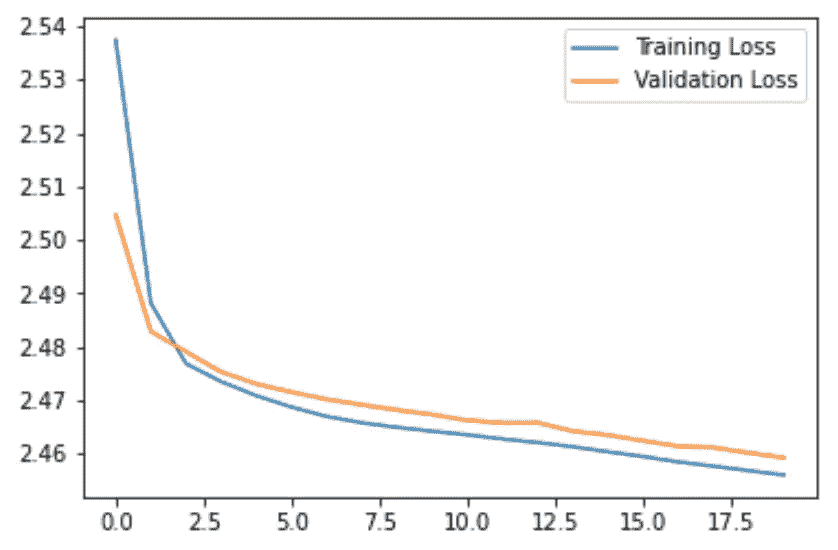
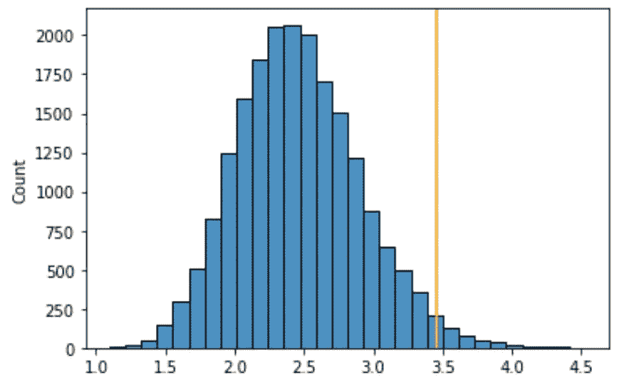

# 使用张量流 Keras 进行异常检测的自动编码器

> 原文：<https://pub.towardsai.net/autoencoder-for-anomaly-detection-using-tensorflow-keras-7fdfa9f3ad99?source=collection_archive---------0----------------------->

使用无监督深度学习模型的异常检测


由[安德里亚·德·森蒂斯峰](https://unsplash.com/@santesson89?utm_source=medium&utm_medium=referral)在 [Unsplash](https://unsplash.com?utm_source=medium&utm_medium=referral) 上拍摄

Autoencoder 是一种无监督的神经网络模型，它使用重建误差来检测异常或异常值。重建误差是重建数据和输入数据之间的差异。

Autoencoder 仅使用正常数据来训练模型，并使用所有数据来进行预测。因此，我们期望异常值具有更高的重建误差，因为它们不同于常规数据。

在本文中，我们将使用 Python `Tensorflow` `Keras`库来说明使用自动编码器识别异常值的过程。具体来说，我们将涵盖:

*   autoencoder 用于异常检测的算法是什么？
*   如何训练一个自动编码器模型？
*   如何设置 autoencoder 异常检测的阈值？
*   如何评价 autoencoder 异常检测性能？

**本帖资源:**

*   YouTube[上的视频教程](https://www.youtube.com/watch?v=IsLXROuJoEo&list=PLVppujud2yJo0qnXjWVAa8h7fxbFJHtfJ&index=7)
*   Python 代码在帖子最后。点击[此处](https://mailchi.mp/0533d92d0b6e/p8t1t9jgqc)为笔记本。
*   更多关于[异常检测的视频教程](https://www.youtube.com/playlist?list=PLVppujud2yJo0qnXjWVAa8h7fxbFJHtfJ)
*   更多关于[异常检测](https://medium.com/@AmyGrabNGoInfo/list/imbalanced-classification-and-anomalies-detection-dc908de4382d)的博文

我们开始吧！

# 步骤 1:导入库

```
# Synthetic dataset
from sklearn.datasets import make_classification# Data processing
import pandas as pd
import numpy as np
from collections import Counter# Visualization
import matplotlib.pyplot as plt
import seaborn as sns# Model and performance
import tensorflow as tf
from tensorflow.keras import layers, losses
from sklearn.model_selection import train_test_split
from sklearn.metrics import classification_report
```

# 步骤 2:创建带有异常的数据集

使用 sklearn 库中的 make_classification，我们创建了两个类，多数类和少数类的比率为 0.995:0.005。32 个信息特征作为预测因子。我们没有在该数据集中包含任何冗余或重复的要素。

```
# Create an imbalanced dataset
X, y = make_classification(n_samples=100000, n_features=32, n_informative=32,
                           n_redundant=0, n_repeated=0, n_classes=2,
                           n_clusters_per_class=1,
                           weights=[0.995, 0.005],
                           class_sep=0.5, random_state=0)
```

# 步骤 3:训练测试分割

在这一步中，我们将数据集分成 80%的训练数据和 20%的验证数据。random_state 确保我们每次都有相同的训练测试分割。random_state 的种子号不一定是 42，可以是任何数字。

```
# Train test split
X_train, X_test, y_train, y_test = train_test_split(X, y, test_size=0.2, random_state=42)# Check the number of records
print('The number of records in the training dataset is', X_train.shape[0])
print('The number of records in the test dataset is', X_test.shape[0])
print(f"The training dataset has {sorted(Counter(y_train).items())[0][1]} records for the majority class and {sorted(Counter(y_train).items())[1][1]} records for the minority class.")
```

训练测试拆分为我们提供了 80，000 条训练数据集记录和 20，000 条验证数据集记录。在训练数据集中，我们有 79，200 个数据点来自多数群体，800 个数据点来自少数群体。少数类数据点是异常值或异常值。

# 步骤 4:用于异常检测的自动编码器算法

用于异常检测的自动编码器模型有六个步骤。前三步是模型训练，后三步是模型预测。

*   步骤 1 是编码器步骤。在该步骤中，通过神经网络模型提取基本信息。
*   步骤 2 是解码器步骤。在此步骤中，模型使用提取的信息重建数据。
*   步骤 3:重复步骤 1 和步骤 2 来调整模型，以最小化输入和重构输出之间的差异，直到我们为训练数据集获得良好的重构结果。
*   步骤 4:对包含异常值的数据集进行预测。
*   步骤 5:通过比较自动编码器模型重建值和实际值之间的差异来设置异常值/异常值的阈值。
*   步骤 6:将差异高于阈值的数据点识别为异常值或异常值。

# 步骤 5:自动编码器模型训练

autoencoder 模型在正常数据集上训练，因此我们必须首先将预期数据与异常数据分开。

然后，我们创建了输入层、编码器层和解码器层。

在输入层，我们指定了数据集的形状。因为建模数据集有 32 个要素，所以这里的形状是 32。

编码器由 3 层组成，分别具有 16、8 和 4 个神经元。注意，编码器要求神经元的数量随着层的增加而减少。编码器中的最后一层是编码表示的大小，也称为瓶颈。

解码器由 3 层组成，分别具有 8、16 和 32 个神经元。与编码器相反，解码器要求神经元的数量随着层数的增加而增加。解码器中的输出层与输入层具有相同的大小。

`relu`激活功能用于除解码器输出层之外的每一层。`relu`是一个比较流行的激活功能，不过你可以试试其他的激活功能，对比一下型号性能。

在定义了输入层、编码器层和解码器层之后，我们创建了 autoencoder 模型来组合这些层。

```
# Keep only the normal data for the training dataset
X_train_normal = X_train[np.where(y_train == 0)]# Input layer
input = tf.keras.layers.Input(shape=(32,))# Encoder layers
encoder = tf.keras.Sequential([
  layers.Dense(16, activation='relu'),
  layers.Dense(8, activation='relu'),
  layers.Dense(4, activation='relu')])(input)# Decoder layers
decoder = tf.keras.Sequential([
      layers.Dense(8, activation="relu"),
      layers.Dense(16, activation="relu"),
      layers.Dense(32, activation="sigmoid")])(encoder)# Create the autoencoder
autoencoder = tf.keras.Model(inputs=input, outputs=decoder)
```

在定义了输入层、编码器层和解码器层之后，我们创建了 autoencoder 模型来组合这些层。

创建自动编码器模型后，我们用优化器`adam`和损失`mae`(平均绝对误差)编译模型。

在拟合 autoencoder 模型时，我们可以看到输入和输出数据集是相同的，即只包含正常数据点的数据集。

验证数据是包含正常和异常数据点的测试数据集。

20 的`epochs`和 64 的`batch_size`意味着模型在每次迭代中使用 64 个数据点来更新权重，并且模型将遍历整个训练数据集 20 次。

`shuffle=True`将在每个历元之前随机播放数据集。

```
# Compile the autoencoder
autoencoder.compile(optimizer='adam', loss='mae')# Fit the autoencoder
history = autoencoder.fit(X_train_normal, X_train_normal, 
          epochs=20, 
          batch_size=64,
          validation_data=(X_test, X_test),
          shuffle=True)
```

输出

```
Epoch 1/20
1238/1238 [==============================] - 2s 1ms/step - loss: 2.5375 - val_loss: 2.5047
Epoch 2/20
1238/1238 [==============================] - 2s 1ms/step - loss: 2.4882 - val_loss: 2.4829
Epoch 3/20
.........
.........
Epoch 19/20
1238/1238 [==============================] - 2s 1ms/step - loss: 2.4568 - val_loss: 2.4602
Epoch 20/20
1238/1238 [==============================] - 2s 1ms/step - loss: 2.4560 - val_loss: 2.4593
```

此图表显示了模型拟合过程中训练和验证损失的变化。x 轴是历元数，y 轴是损耗。我们可以看到，训练和验证损失都随着时代的增加而减少。



图片由作者提供。

# 步骤 6:自动编码器异常检测阈值

现在我们有了一个自动编码器模型，让我们用它来预测离群值。

首先，我们使用`.predict`来获得包含正常数据点和异常值的测试数据集的重建值。

然后，我们使用平均绝对误差来计算实际和重建之间的损失值。

之后，设置阈值来识别异常值。该阈值可以基于百分位数、标准偏差或其他方法。在本例中，我们使用 98%的损失作为阈值，将 2%的数据识别为异常值。

```
# Predict anomalies/outliers in the training dataset
prediction = autoencoder.predict(X_test)# Get the mean absolute error between actual and reconstruction/prediction
prediction_loss = tf.keras.losses.mae(prediction, X_test)# Check the prediction loss threshold for 2% of outliers
loss_threshold = np.percentile(prediction_loss, 98)
print(f'The prediction loss threshold for 2% of outliers is {loss_threshold:.2f}')# Visualize the threshold
sns.histplot(prediction_loss, bins=30, alpha=0.8)
plt.axvline(x=loss_threshold, color='orange')
```

可视化图表显示，预测损失接近于平均值为 2.5 左右的正态分布。2%异常值的预测损失阈值约为 3.5。



# 步骤 7:自动编码器异常检测性能

有时数据集有异常的基本事实标签，而数据集通常没有。当有异常的标签时，我们可以评估模型的性能。

根据我们在上一步中确定的阈值，如果预测损失小于阈值，我们预测正常数据点。否则，我们预测该数据点为异常值或异常值。我们将正常预测值 0 和异常值预测值 1 标记为与基本事实标签一致。

```
# Check the model performance at 2% threshold
threshold_prediction = [0 if i < loss_threshold else 1 for i in prediction_loss]# # Check the prediction performance
print(classification_report(y_test, threshold_prediction))
```

0.01 的召回值表明大约 1%的异常值被自动编码器捕获。

```
precision    recall  f1-score   support 0       0.99      0.98      0.98     19803
           1       0.01      0.01      0.01       197 accuracy                           0.97     20000
   macro avg       0.50      0.50      0.50     20000
weighted avg       0.98      0.97      0.98     20000
```

# 步骤 8:将所有代码放在一起

```
###### Step 1: Import Libraries# Synthetic dataset
from sklearn.datasets import make_classification# Data processing
import pandas as pd
import numpy as np
from collections import Counter# Visualization
import matplotlib.pyplot as plt
import seaborn as sns# Model and performance
import tensorflow as tf
from tensorflow.keras import layers, losses
from sklearn.model_selection import train_test_split
from sklearn.metrics import classification_report ###### Step 2: Create Dataset With Anomalies# Create an imbalanced dataset
X, y = make_classification(n_samples=100000, n_features=32, n_informative=32,
                           n_redundant=0, n_repeated=0, n_classes=2,
                           n_clusters_per_class=1,
                           weights=[0.995, 0.005],
                           class_sep=0.5, random_state=0) ###### Step 3: Train Test Split# Train test split
X_train, X_test, y_train, y_test = train_test_split(X, y, test_size=0.2, random_state=42)# Check the number of records
print('The number of records in the training dataset is', X_train.shape[0])
print('The number of records in the test dataset is', X_test.shape[0])
print(f"The training dataset has {sorted(Counter(y_train).items())[0][1]} records for the majority class and {sorted(Counter(y_train).items())[1][1]} records for the minority class.") ###### Step 4: Autoencoder Algorithm For Anomaly Detection# No code for this step ###### Step 5: Autoencoder Model Training# Keep only the normal data for the training dataset
X_train_normal = X_train[np.where(y_train == 0)]# Input layer
input = tf.keras.layers.Input(shape=(32,))# Encoder layers
encoder = tf.keras.Sequential([
  layers.Dense(16, activation='relu'),
  layers.Dense(8, activation='relu'),
  layers.Dense(4, activation='relu')])(input)# Decoder layers
decoder = tf.keras.Sequential([
      layers.Dense(8, activation="relu"),
      layers.Dense(16, activation="relu"),
      layers.Dense(32, activation="sigmoid")])(encoder)# Create the autoencoder
autoencoder = tf.keras.Model(inputs=input, outputs=decoder) ###### Step 6: Autoencoder Anomaly Detection Threshold# Predict anomalies/outliers in the training dataset
prediction = autoencoder.predict(X_test)# Get the mean absolute error between actual and reconstruction/prediction
prediction_loss = tf.keras.losses.mae(prediction, X_test)# Check the prediction loss threshold for 2% of outliers
loss_threshold = np.percentile(prediction_loss, 98)
print(f'The prediction loss threshold for 2% of outliers is {loss_threshold:.2f}')# Visualize the threshold
sns.histplot(prediction_loss, bins=30, alpha=0.8)
plt.axvline(x=loss_threshold, color='orange') ###### Step 7: Autoencoder Anomaly Dectection Performance# Check the model performance at 2% threshold
threshold_prediction = [0 if i < loss_threshold else 1 for i in prediction_loss]# # Check the prediction performance
print(classification_report(y_test, threshold_prediction))
```

# 摘要

在本文中，我们通过自动编码器神经网络模型进行异常检测。

使用 Python 中的 Tensorflow Keras API，我们介绍了:

*   什么是自动编码器？
*   autoencoder 用于异常检测的算法是什么？
*   如何训练一个自动编码器模型？
*   如何设置 autoencoder 异常检测的阈值？
*   如何评价 autoencoder 异常检测性能？

更多教程可在 GrabNGoInfo.com 的 GrabNGoInfo [YouTube 频道](https://www.youtube.com/channel/UCmbA7XB6Wb7bLwJw9ARPcYg)和[获得。](https://grabngoinfo.com/tutorials/)

# 推荐教程

*   [GrabNGoInfo 机器学习教程盘点](https://medium.com/grabngoinfo/grabngoinfo-machine-learning-tutorials-inventory-9b9d78ebdd67)
*   [用于异常检测的单级 SVM](https://medium.com/p/one-class-svm-for-anomaly-detection-6c97fdd6d8af)
*   [使用 Python 中的 Prophet 进行多时间序列预测的 3 种方式](https://medium.com/p/3-ways-for-multiple-time-series-forecasting-using-prophet-in-python-7a0709a117f9)
*   [使用 Python 实现不平衡分类的四种过采样和欠采样方法](https://medium.com/p/four-oversampling-and-under-sampling-methods-for-imbalanced-classification-using-python-7304aedf9037)
*   [利用 Python 中的 Prophet 进行具有季节性和假日效应的多元时间序列预测](https://medium.com/p/multivariate-time-series-forecasting-with-seasonality-and-holiday-effect-using-prophet-in-python-d5d4150eeb57)
*   [如何检测离群值|数据科学面试问答](https://medium.com/p/how-to-detect-outliers-data-science-interview-questions-and-answers-1e400284f6b4)
*   [利用 Python 中的 Prophet 进行时间序列异常检测](https://medium.com/p/time-series-anomaly-detection-using-prophet-in-python-877d2b7b14b4)
*   [如何配合谷歌 Colab 笔记本使用 R](https://medium.com/p/how-to-use-r-with-google-colab-notebook-610c3a2f0eab)

# 参考

*   [1]张量流。2022.*自动编码器介绍| TensorFlow 核心*。[在线]可在:<https://www.tensorflow.org/tutorials/generative/autoencoder>[2022 年 4 月 23 日访问]。
*   [2]异常图。2022. *Anomagram:自动编码器的交互式可视化*。[在线]见:<https://anomagram.fastforwardlabs.com/#/>[2022 年 4 月 23 日访问]。
*   [3] Blog.keras.io. 2022。*在 Keras 中构建自动编码器*。[在线]见:<https://blog.keras.io/building-autoencoders-in-keras.html>[2022 年 4 月 23 日访问]。

[](https://medium.com/@AmyGrabNGoInfo/membership) [## 通过我的推荐链接加入媒体-艾米 GrabNGoInfo

### 作为一个媒体会员，你的会员费的一部分会给你阅读的作家，你可以完全接触到每一个故事…

medium.com](https://medium.com/@AmyGrabNGoInfo/membership)