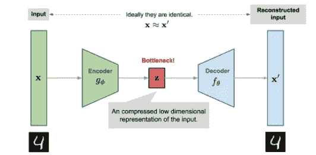
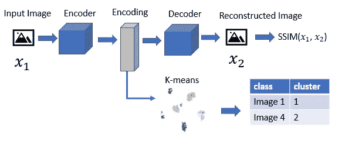
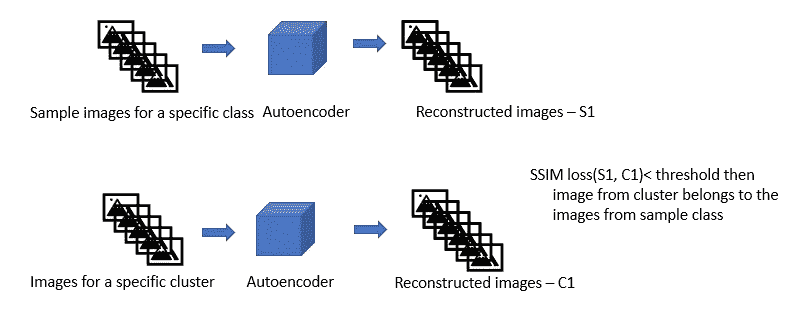
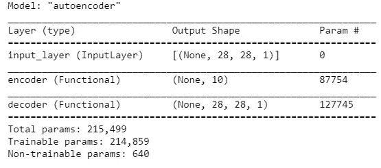
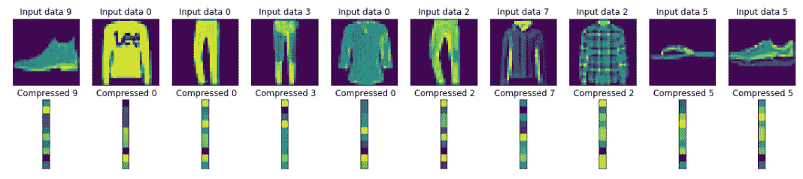
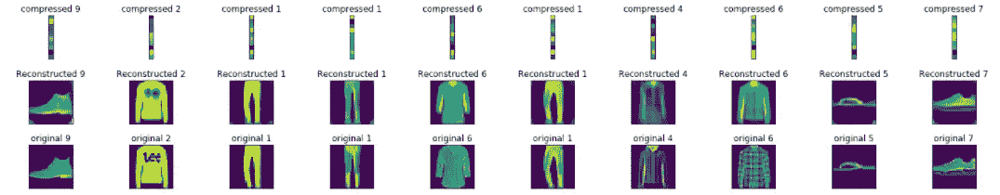
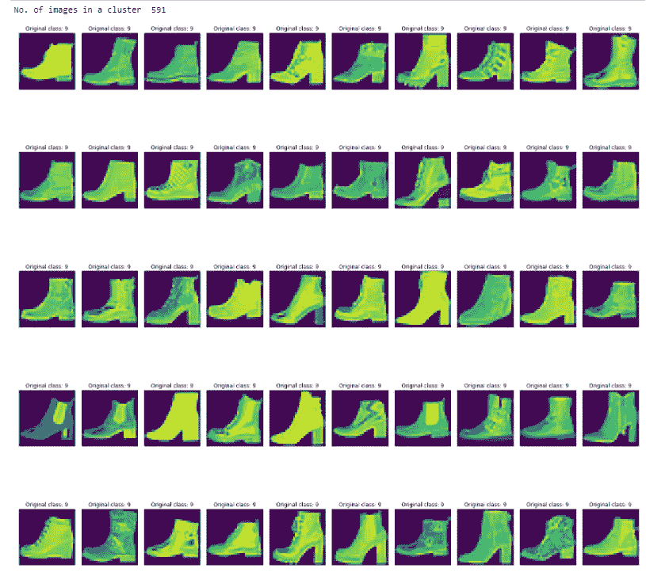
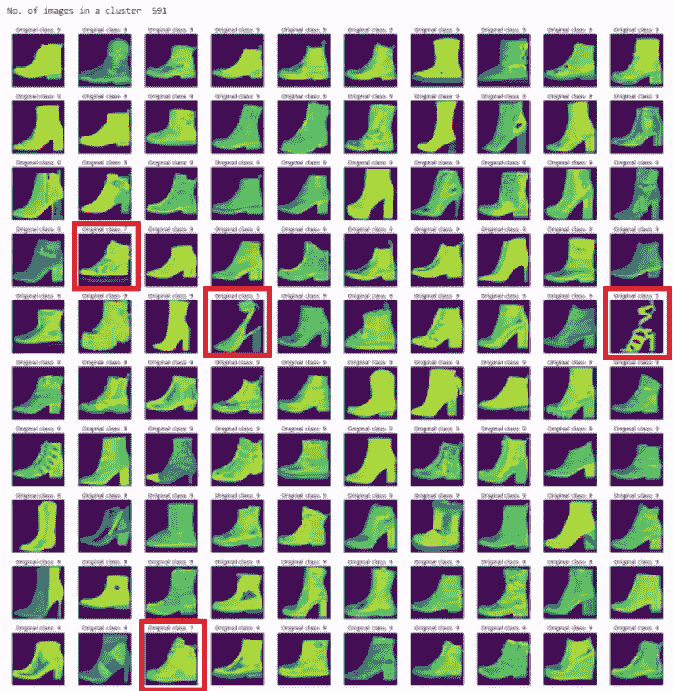
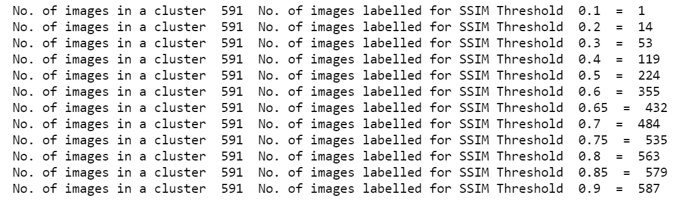

# 用于图像标记的自动编码器

> 原文：<https://pub.towardsai.net/autoencoders-for-image-labeling-84242decd3d2?source=collection_archive---------0----------------------->

## [深度学习](https://towardsai.net/p/category/machine-learning/deep-learning)

## 了解如何使用深度卷积自动编码器标记图像

*你在一个文件夹中混合了不同类别的图像，当你知道类别的数量时，你如何标记这些图像。*

*在这里，您将实现深度卷积自动编码器，仅使用时尚 MNIST 图像来标记时尚 MNIST 数据集。*


使用自动编码器为标记图像所做的假设:

*   了解数据集中的类的数量
*   每堂课都有几张图片

# 自动编码器概述

自动编码器由编码器和解码器网络组成。编码器将高维输入编码成低维潜在表示，也称为瓶颈层。解码器采用这种低维潜在表示，并重构原始输入。自动编码器的目标是最小化输入和输出之间的重构误差。这有助于自动编码器学习输入数据中的重要特征。



来源:[https://lilian Weng . github . io/lil-log/2018/08/12/from-auto encoder-to-beta-vae . html](https://lilianweng.github.io/lil-log/2018/08/12/from-autoencoder-to-beta-vae.html)

**自动编码器的应用**

*   图像压缩中的降维
*   从压缩的图像中重建图像
*   提取图像的特征并标记它们
*   图像去噪
*   [图像异常检测](https://medium.com/analytics-vidhya/image-anomaly-detection-using-autoencoders-ae937c7fd2d1)

## 时尚 MNIST 数据集标注体系结构

**步骤 1:** **创建深度卷积自动编码器**

自动编码器将由一个将图像压缩成潜在表示的编码器和一个将压缩图像重建回原始尺寸的解码器组成。

使用 SSIM 损失函数计算原始图像和重建图像之间的损失



训练深度 Conv 自动编码器，然后使用 KMeans(image by author)从编码数据创建图像簇

**步骤 2:使用 KMeans** 为编码图像数据生成聚类

使用无监督 KMeans 算法对编码数据进行聚类，编码器的输出包含压缩的图像数据。聚类的数量就是数据集中的类的数量。

**步骤 3:将每个类别的样本图像与每个聚类中的图像进行比较**



基于聚类分配将重建的样本图像与重建的图像进行比较

使用 Autoencoder 重建每个类别的样本图像以及每个聚类的图像。使用 SSIM、结构相似性指数比较重建图像。如果结构相似性损失函数中的差异小于阈值，则来自聚类的图像属于来自样本类的图像。

需要对阈值进行实验，以获得一组良好的原始标记图像。

## 利用 Autoencoder 实现时尚目录数据的标注

**加载时尚 MNIST 数据集**

```
# set the image dimension
**IMG_WIDTH= 28 
IMG_HEIGHT= 28 
IMG_CHANNELS=1
IMG_DIM = (IMG_HEIGHT, IMG_WIDTH)
input_shape = (IMG_HEIGHT, IMG_WIDTH, IMG_CHANNELS)**#Load Fashion MNIST and scale the data
**(x_train, y_train), (x_test, y_test) = tf.keras.datasets.fashion_mnist.load_data()**
# Rescale the images from [0,255] to the [0.0,1.0] range.
**x_train, x_test = x_train[..., np.newaxis]/255.0, x_test[..., np.newaxis]/255.0
x_train = x_train.reshape(-1, IMG_WIDTH, IMG_HEIGHT,IMG_CHANNELS)**
```

**创建深度 Conv 自动编码器**

```
# Create the Encoder and Decoder
#pass the gray scale input image of size(28,28,1)
**inputs = tf.keras.Input(shape=input_shape, name='input_layer')**
# Conv Block 1 -> BatchNorm->leaky Relu
**encoded = tf.keras.layers.Conv2D(32, kernel_size=3, strides= 1, padding='same', name='conv_1')(inputs)
encoded = tf.keras.layers.BatchNormalization(name='batchnorm_1')(encoded)
encoded = tf.keras.layers.LeakyReLU(name='leaky_relu_1')(encoded)**# Conv Block 2 -> BatchNorm->leaky Relu
**encoded = tf.keras.layers.Conv2D(64, kernel_size=3, strides= 2, padding='same', name='conv_2')(encoded)
encoded = tf.keras.layers.BatchNormalization(name='batchnorm_2')(encoded)
encoded = tf.keras.layers.LeakyReLU(name='leaky_relu_2')(encoded)**# Conv Block 3 -> BatchNorm->leaky Relu
**encoded = tf.keras.layers.Conv2D(64, kernel_size=3, strides=2, padding='same', name='conv_3')(encoded)
encoded = tf.keras.layers.BatchNormalization(name='batchnorm_3')(encoded)
encoded = tf.keras.layers.LeakyReLU(name='leaky_relu_3')(encoded)
encoded_shape= tf.keras.backend.int_shape(encoded)**

**encoded = tf.keras.layers.Flatten()(encoded)
encoded = tf.keras.layers.Dense(10)(encoded)
encoder=tf.keras.Model(inputs, encoded, name='encoder')
encoder.summary()
latent=tf.keras.Input(shape=(10,))**
#Decoder
# DeConv Block 1-> BatchNorm->leaky Relu.
**decoded= tf.keras.layers.Dense(np.prod(encoded_shape[1:]))(latent)
decoded= tf.keras.layers.Reshape((encoded_shape[1], encoded_shape[2], encoded_shape[3]))(decoded)
decoded = tf.keras.layers.Conv2DTranspose(64, 3, strides= 2, padding='same',name='conv_transpose_1')(decoded)
decoded = tf.keras.layers.BatchNormalization(name='batchnorm_4')(decoded)
decoded = tf.keras.layers.LeakyReLU(name='leaky_relu_4')(decoded)**
# DeConv Block 2-> BatchNorm->leaky Relu
**decoded = tf.keras.layers.Conv2DTranspose(64, 3, strides= 2, padding='same', name='conv_transpose_2')(decoded)
decoded = tf.keras.layers.BatchNormalization(name='batchnorm_5')(decoded)
decoded = tf.keras.layers.LeakyReLU(name='leaky_relu_5')(decoded)**
# DeConv Block 3-> BatchNorm->leaky Relu
**decoded = tf.keras.layers.Conv2DTranspose(32, 3, 1, padding='same', name='conv_transpose_3')(decoded)
decoded = tf.keras.layers.BatchNormalization(name='batchnorm_6')(decoded)
decoded = tf.keras.layers.LeakyReLU(name='leaky_relu_6')(decoded)**
# output
**outputs = tf.keras.layers.Conv2DTranspose(1, 3, 1,padding='same', activation='sigmoid', name='conv_transpose_4')(decoded)****decoder= tf.keras.Model(latent, outputs, name="decoder")**
**Autoencoder = tf.keras.Model(inputs, decoder(encoder(inputs)),name="autoencoder")  
Autoencoder.summary()**
```



**训练自动编码器**

```
# SSIM Loss functtion
**def ssim_loss(y_true, y_pred):
  return 1- tf.reduce_mean(tf.image.ssim(y_true, y_pred, 2.0))**# compile the model 
**optimizer = 'adam'
Autoencoder.compile(optimizer=optimizer, loss=ssim_loss, )**#training
**Autoencoder.fit(x_train, x_train, batch_size=64, epochs=20)**
```

**使用 KMeans** 创建编码数据的图像簇

使用编码器生成图像的压缩或编码特征

```
**feature_model = tf.keras.Model(inputs=encoder.input, outputs=encoder.output)
features = feature_model.predict(x_test)**
```

绘制原始图像和作为编码器输出的压缩图像

```
**plt.figure(figsize=(20, 4))
n=10
for i in range(10):
    ax = plt.subplot(2, n, i + 1)
    plt.imshow(x_test[i].reshape(28, 28))
    plt.title("Input data "+ str(y_train[i]))
    ax.get_xaxis().set_visible(False)
    ax.get_yaxis().set_visible(False)

    ax = plt.subplot(2, n, i + n+1)
    plt.imshow(features[i].reshape(10, 1))
    plt.title(" Compressed " + str(y_train[i]))
    ax.get_xaxis().set_visible(False)
    ax.get_yaxis().set_visible(False)****plt.show()**
```



原始输入图像和图像的压缩 pr 编码数据

要从压缩数据中重建图像，请将编码特征传递给解码器

```
**reconstruction_model = tf.keras.Model(latent, outputs, name="decoder")
recon_image = reconstruction_model.predict(features)**
```



## 对编码要素运行 KMeans 聚类

正如我们所知，时尚 MNIST 有 10 个类别，对编码的要素运行 KMeans 聚类算法以聚类成 10 个不同的类

```
**from sklearn.cluster import KMeans
kmeans_img = KMeans(n_clusters=10, init='k-means++', max_iter=10000, n_init=20, random_state=0)
y_means_img = kmeans_img.fit_predict(features)**
```

**重建每个聚类中的图像**

```
**test_x_predictions = Autoencoder.predict(x_test)**
```

**重建每个类别的样本图像**

为了方便起见，我在这里用 y_train 来表示类 9，它是一个踝靴。

对于自定义数据集，您可以使用每个类中的一些样本图像。

```
**train_filter = [key for (key, label) in enumerate(y_train) if int(label) == 9 ]
train_x_pred= Autoencoder.predict(x_train[train_filter])**
```

您可以遍历不同的集群进行比较。出于演示的目的，我硬编码了一个与踝靴图像相匹配的集群。

```
**selected_col=data_cluster.index[data_cluster['cluster'] ==6]**
```

如果样本图像和聚类中的图像之间的重建损失小于阈值，则聚类中的图像属于样本图像的类别。

样本图像和属于正确聚类的图像之间的 SSIM 损失应该最小。

```
**SSIM_THRESHOLD=0.3
for i in range(len(selected_col)):
    if ssim_loss(test_x_predictions[selected_col[i]],train_x_pred[i])<SSIM_THRESHOLD: 
   good_labeled_image_idx.append(selected_col[i])**
```



可以玩阈值。下面的输出显示了当您增加 SSIM 损失阈值时，看起来相似但不属于同一类的图像将如何添加。你会发现更多的图像，但其中一些会被错误标记。

```
**SSIM_THRESHOLD=0.8
for i in range(len(selected_col)):
    if ssim_loss(test_x_predictions[selected_col[i]],train_x_pred[i])<SSIM_THRESHOLD: 
        good_labeled_image_idx.append(selected_col[i])**
```



随着 SSIM 阈值的增加，您将识别出更多的图像，但图像会被错误标记，如下所示



分享您使用机器学习算法标记数据的经验，以及您面临的挑战。