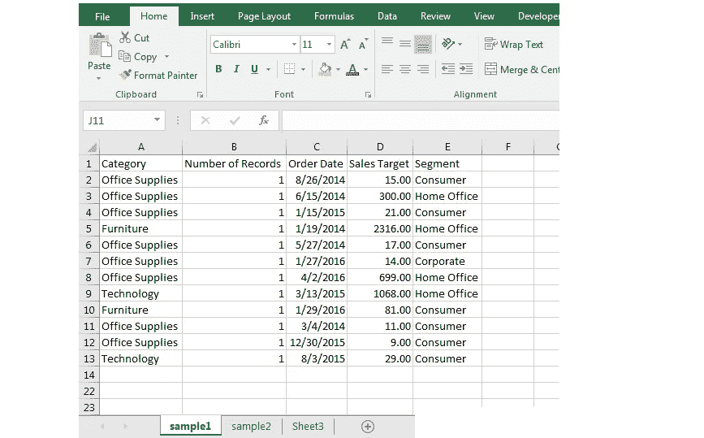
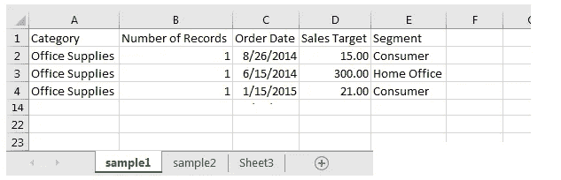
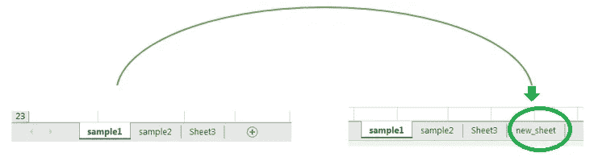
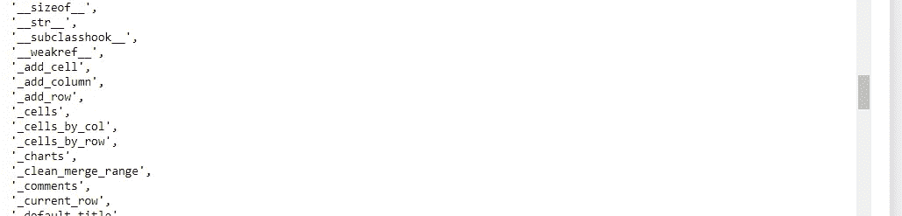
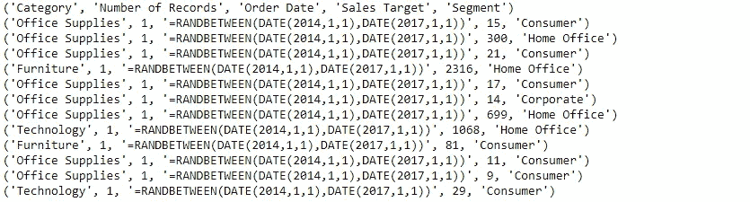
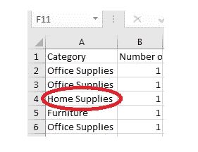
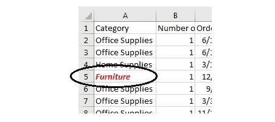

# 使用 Openpyxl 和 Python 自动执行 Excel 任务

> 原文：<https://pub.towardsai.net/automate-excel-tasks-with-openpyxl-and-python-dc60b59b4cde?source=collection_archive---------0----------------------->

## [编程](https://towardsai.net/p/category/programming)

自动化 excel 任务



作者的照片

在本文中，我们将借助 jupyter notebook 上的 python 库 openpyxl 来处理 excel 表格。

我们将使用一个示例 excel 文件，并在下面提到的库的帮助下，使用 python 执行各种任务来自动化这些任务。

要安装该库，请打开 anaconda 提示符并编写如下所示的命令:

```
pip install openpyxl
```

样张的视图如下所示，底部有几个样张。



作者图片

现在，我们将在库的帮助下加载 excel 文件。

导入 openpyxl 库。

```
import openpyxl
```

工作簿内的第一个工作表包含关于类别、记录等的一般信息。另外两张是测试和样品的空白纸。

现在，在 python 解释器的帮助下，关闭我们将要处理的 excel 文件，以避免任何与权限相关的问题。不过，不要担心，无论何时我们想从文件中读取某些内容，或者无论何时我们要从 python 中对文件进行更改，我们都会打开文件，然后检查更改。

现在，创建变量对象，将 excel 文件加载到其中，以进行进一步的操作。

```
#In brackets we need to write the path of the workbook
wb = openpyxl.load_workbook("sample_openpyxl.xlsx")
```

> ***阅读工作簿基本信息***

wb 是一个变量，我们可以用它进行多种运算。现在，用 ***属性*** 方法读取关于工作簿的各种信息。

```
wb.properties#output:
<openpyxl.packaging.core.DocumentProperties object>
Parameters:
creator='Amit', title=None, description=None, subject=None, identifier=None, language=None, created=datetime.datetime(2021, 11, 20, 9, 55, 18), modified=datetime.datetime(2021, 11, 20, 10, 1, 16), lastModifiedBy='Amit', category=None, contentStatus=None, version=None, revision=None, keywords=None, lastPrinted=None
```

在这个输出中，我们得到了很多信息，

*   工作簿的创建者。
*   工作簿的创建日期和修改日期。

> ***查找工作簿中工作表名称和活动工作表的数量***

```
wb.sheetnames#output:
['sample1', 'sample2', 'Sheet3']
```

输出显示了工作簿中的工作表名称，如上图所示。

```
wb.active#output:
<Worksheet "sample1">
```

> ***创建新的工作表并从 python 中删除工作表***

## 创建新工作表

```
wb.create_sheet('new_sheet')#output:
<Worksheet "new_sheet">
```

要进行更改，我们需要保存工作簿。

```
wb.save(“sample_openpyxl.xlsx”)
```



## 移除新的或任何工作表

要移除工作表，我们必须给出该特定工作表的名称。

选项 1

```
sheet = wb['new_sheet']
wb.remove(sheet)
```

选项 2

```
del wb['new_sheet']
```

我们可以使用上述选项中的任何一种方法。

[](/are-you-switching-careers-to-data-science-and-machine-learning-5fab0b75470e) [## 你要转行做数据科学和机器学习吗？

### 分析角色和成为数据科学家的路线图

pub.towardsai.net](/are-you-switching-careers-to-data-science-and-machine-learning-5fab0b75470e) [](/why-what-who-is-data-scientist-a7a9ac98bc96) [## 为什么，什么，谁是数据科学家？

### 能够对数据进行分析和技术处理

pub.towardsai.net](/why-what-who-is-data-scientist-a7a9ac98bc96) 

> ***处理工作表的方法***

选择我们要处理的工作表名称。

```
sheet = wb['sample1']
sheet.title#output:
'sample1'
```

用 ***的 dir*** 的方法来了解所有的方法来做操作。 ***dir*** 方法显示了我们可以在工作表中操作的所有方法。

```
dir(sheet)
```



示例:

```
sheet.active_cell#output:
F11sheet.dimensions#output:
'A1:E13'
```

活动单元格意味着鼠标箭头点击了 F11 单元格。表的总填充区域是从 A1 到 E13。

```
sheet.max_row
sheet.max_column#output:
13
5--------------------------------------------------------
for i in sheet.values:
    print(i)
```



> ***查找工作表中的值***

我们可以通过单元格名称或者通过提及行和列的值来找到单元格数据。

```
sheet['A4'].value#output:
'Office Supplies'--------------------------------------------------------
sheet.cell(row = 3, column = 5).value#output:
'Home Office'
```

> ***改变单元格的值***

我们还可以更改单元格数据的值，如下例所示:

```
cell = sheet['A4']
cell.value = 'Home Supplies'
wb.save("sample_openpyxl.xlsx")
```



> ***单元格样式***

我们在 excel 中工作，忘记了单元格和数据的样式，这是不可能的。在这里，我们可以做许多样式，如粗体、斜体、字体颜色、单元格填充颜色等。

```
cell = sheet['A5']
font = Font(color = colors.RED, bold = True, italic = True)
cell.font = font
wb.save("sample_openpyxl.xlsx")
```



> ***结论***

本文介绍了用 python 编程在 excel 中使用的基本方法。

我希望你喜欢这篇文章。通过我的 [LinkedIn](https://www.linkedin.com/in/data-scientist-95040a1ab/) 和 [twitter](https://twitter.com/amitprius) 联系我。

# 推荐文章

1.[8 Python 的主动学习见解收集模块](/8-active-learning-insights-of-python-collection-module-6c9e0cc16f6b?source=friends_link&sk=4a5c9f9ad552005636ae720a658281b1)
2。 [NumPy:图像上的线性代数](/numpy-linear-algebra-on-images-ed3180978cdb?source=friends_link&sk=d9afa4a1206971f9b1f64862f6291ac0)3。[Python 中的异常处理概念](/exception-handling-concepts-in-python-4d5116decac3?source=friends_link&sk=a0ed49d9fdeaa67925eac34ecb55ea30)
4。[熊猫:处理分类数据](/pandas-dealing-with-categorical-data-7547305582ff?source=friends_link&sk=11c6809f6623dd4f6dd74d43727297cf)
5。[超参数:机器学习中的 RandomSeachCV 和 GridSearchCV](/hyper-parameters-randomseachcv-and-gridsearchcv-in-machine-learning-b7d091cf56f4?source=friends_link&sk=cab337083fb09601114a6e466ec59689)
6。[用 Python](https://medium.com/towards-artificial-intelligence/fully-explained-linear-regression-with-python-fe2b313f32f3?source=friends_link&sk=53c91a2a51347ec2d93f8222c0e06402)
7 全面讲解了线性回归。[用 Python](https://medium.com/towards-artificial-intelligence/fully-explained-logistic-regression-with-python-f4a16413ddcd?source=friends_link&sk=528181f15a44e48ea38fdd9579241a78)
充分解释了 Logistic 回归 8。[数据分发使用 Numpy 与 Python](/data-distribution-using-numpy-with-python-3b64aae6f9d6?source=friends_link&sk=809e75802cbd25ddceb5f0f6496c9803)
9。[机器学习中的决策树 vs 随机森林](/decision-trees-vs-random-forests-in-machine-learning-be56c093b0f?source=friends_link&sk=91377248a43b62fe7aeb89a69e590860)
10。[用 Python 实现数据预处理的标准化](/standardization-in-data-preprocessing-with-python-96ae89d2f658?source=friends_link&sk=f348435582e8fbb47407e9b359787e41)