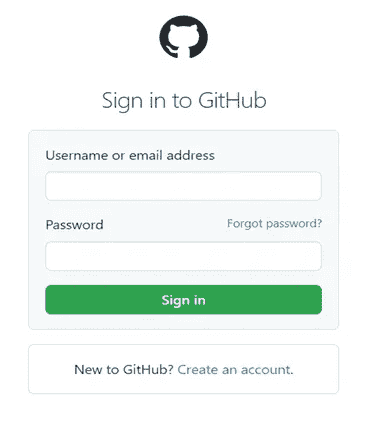

# 使用 Python 和 Selenium 自动登录

> 原文：<https://pub.towardsai.net/automate-login-with-python-and-selenium-207981484007?source=collection_archive---------0----------------------->

## 如何自动登录网站


[Firmbee.com](https://unsplash.com/@firmbee?utm_source=unsplash&utm_medium=referral&utm_content=creditCopyText)在 [Unsplash](https://unsplash.com/s/photos/login-to-website?utm_source=unsplash&utm_medium=referral&utm_content=creditCopyText) 上拍照

登录过程自动化有助于访问网站上的信息。例如，您可能想要自动更新您的帐户设置，或者您可能想要抓取一些网页并提取一些数据，但您首先需要使用您的凭据登录。

在本文中，我将展示一个 Python 程序，它将访问 GitHub 网站，输入登录凭证，并登录到该网站。

> 声明:本文仅用于教育目的。我们不鼓励任何人抓取网站，尤其是那些可能有条款和条件反对此类行为的网站。

**查看网页的 HTML 结构**

首先，我们需要理解网页中 HTML 标签的结构和内容。对于这个项目，我们将使用 GitHub 登录网页(如下所示)。您可以通过选择此[链接](https://github.com/login)来访问此网页。



我们可以通过找到输入字段、输入所需数据并单击登录按钮来登录该网站。要查找此网页上输入字段的 HTML 标记，请右键单击网页上的任意位置，从下拉列表中选择 inspect，单击屏幕左上角带有 HTML 的箭头图标，然后单击用户名或电子邮件地址输入字段。这将导致显示以下屏幕。


我们可以看到用户名或电子邮件地址字段有一个 id = "login_field "，密码字段有一个 id = "password "。如果您向下滚动一点，您会看到登录按钮有一个 name = "commit "。

因此，如果您想输入用户名，您可以遵循这些步骤。

1.创建一个包含您的用户名或电子邮件地址的变量。

2.找到用户名字段，其中 id = "login_field "。

3.将用户名值发送到用户名字段。

查找和输入用户名的代码如下所示:

```
username **=** "your username"
uname **=** driver**.**find_element("id", "login_field") 
uname**.**send_keys("username")
```

对于登录屏幕上的其他字段，将遵循类似的过程。

**路线图**

下面的步骤将使用 Python 和 Selenium 来执行。

1.导入库。

2.为登录凭据创建变量。

3.安装 Web 驱动程序。

4.启动浏览器并打开网址。

5.输入登录凭据并登录。

6.验证登录状态。

## 该计划

目标:输入登录凭据并登录到网站。

要开始，您需要安装 selenium 包。

**安装硒包**

```
!pip3 install selenium
```

**导入库**

```
**from** selenium **import** webdriver
**from** selenium.webdriver.support.ui **import** WebDriverWait
**from** selenium.webdriver.common.by **import** By
```

**为登录凭证创建变量**

```
username **=** "your username or email address"
password **=** "your password"
```

**安装网络驱动**

```
!apt**-**get update 
!apt install chromium**-**chromedriver

chrome_options **=** webdriver**.**ChromeOptions()
chrome_options**.**add_argument('--headless')
chrome_options**.**add_argument('--no-sandbox')
chrome_options**.**add_argument('--disable-dev-shm-usage')
driver **=** webdriver**.**Chrome('chromedriver',chrome_options**=**chrome_options)
```

web 驱动程序是 selenium 的关键组件。web 驱动程序是一个浏览器自动化框架，使用开源 API。该框架通过接受命令、将这些命令发送到浏览器以及与应用程序交互来运行。

Selenium 支持多种 web 浏览器，并为每种浏览器提供 web 驱动程序。我已经为这个项目从 selenium 导入了 chrome web 驱动程序。或者，您可以下载特定浏览器的 web 驱动程序，并将其存储在易于访问的位置(C:\ users \ web driver \ chrome driver . exe)。您可以在这个[站点](https://selenium-python.readthedocs.io/installation.html#:~:text=Selenium%20requires%20a-,driver,-to%20interface%20with)下载您的浏览器的网络驱动程序。

**启动浏览器，打开网址**

```
driver**.**get("https://github.com/login")
```

**输入登录凭证并登录**

```
# Find the username/email field and send the username to the input field.
uname **=** driver**.**find_element("id", "login_field") 
uname**.**send_keys("username")

# Find the password input field and send the password to the input field.
pword **=** driver**.**find_element("id", "password") 
pword**.**send_keys("password")

# Click sign in button to login the website.
driver**.**find_element("name", "commit")**.**click()
```

**验证登录状态**

```
# Wait for login process to complete. 
WebDriverWait(driver**=**driver, timeout**=**10)**.**until(
    **lambda** x: x**.**execute_script("return document.readyState === 'complete'")
)
# Verify that the login was successful.
error_message **=** "Incorrect username or password."# Retrieve any errors found.
errors **=** driver**.**find_elements(By**.**CLASS_NAME, "flash-error")

# When errors are found, the login will fail.
**if** any(error_message **in** e**.**text **for** e **in** errors): 
    print("[!] Login failed")
**else**:
    print("[+] Login successful")
```

[+]登录成功

**关闭驱动器**

```
driver**.**close()
```

将所有这些放在一起…

```
Install selenium packages.
!pip3 install selenium# Import the libraries.
**from** selenium **import** webdriver
**from** selenium.webdriver.support.ui **import** WebDriverWait
**from** selenium.webdriver.common.by **import** By# Create variables for login credentials.
username **=** "your username"
password **=** "your password"# Install the chrome web driver from selenium. 
!apt**-**get update 
!apt install chromium**-**chromedriver

chrome_options **=** webdriver**.**ChromeOptions()
chrome_options**.**add_argument('--headless')
chrome_options**.**add_argument('--no-sandbox')
chrome_options**.**add_argument('--disable-dev-shm-usage')
driver **=** webdriver**.**Chrome('chromedriver',chrome_options**=**chrome_options)# Launch the browser and open the github URL in your web driver.
driver**.**get("https://github.com/login")

# Find the username/email field and send the username to the input field.
uname **=** driver**.**find_element("id", "login_field") 
uname**.**send_keys("username")

# Find the password input field and send the password to the input field.
pword **=** driver**.**find_element("id", "password") 
pword**.**send_keys("password")

# Click sign in button to login the website.
driver**.**find_element("name", "commit")**.**click()# Wait for login process to complete.
WebDriverWait(driver**=**driver, timeout**=**10)**.**until(
    **lambda** x: x**.**execute_script("return document.readyState === 'complete'")
)# Verify that the login was successful.
error_message **=** "Incorrect username or password."
# Retrieve any errors found.
errors **=** driver**.**find_elements(By**.**CLASS_NAME, "flash-error")

# When errors are found, the login will fail. 
**if** any(error_message **in** e**.**text **for** e **in** errors): 
    print("[!] Login failed")
**else**:
    print("[+] Login successful")# Close the driver
driver**.**close()
```

这就完成了登录过程的自动化。

非常感谢你阅读我的文章！如果您有任何意见或反馈，请在下面添加。

如果你喜欢阅读这样的故事，并想支持我成为一名作家，可以考虑报名成为一名媒体成员。会员资格使你可以无限制地访问媒体上的所有报道。你可以通过这个链接注册[https://medium.com/@dniggl/membership](https://medium.com/@dniggl/membership)