# 使用 Databricks AutoML(玻璃盒方法和 MLFLow)实现机器学习自动化

> 原文：<https://pub.towardsai.net/automate-machine-learning-using-databricks-automl-a-glass-box-approach-and-mlflow-2543a8143687?source=collection_archive---------1----------------------->

## [自动化机器学习](https://towardsai.net/p/category/automl)

## Databricks AutoML 允许您快速生成基线模型和笔记本

Databricks 最近在 2021 年[数据+人工智能峰会](https://databricks.com/dataaisummit/north-america-2021)期间宣布了他们的 Databricks AutoML 平台。在本文中，我们将讨论如何使用 Databricks AutoML 平台自动将机器学习应用于数据集，并使用 REST API 将模型部署到生产中。

照片由[本·怀特](https://unsplash.com/@benwhitephotography?utm_source=medium&utm_medium=referral)在 [Unsplash](https://unsplash.com?utm_source=medium&utm_medium=referral) 上拍摄

**目录** :
1。Databricks AutoML 概述。
2。设置 Azure Databricks 环境。
3。在 Azure 数据块中配置 AutoML。
4。探索由 AutoML 生成的笔记本。
5。将模型注册到 MLflow 模型注册表。
6。使用 REST API 部署模型。

# Databricks 汽车

AutoML 是指在构建机器学习或深度学习模型时，对重复性任务的自动化。AutoML 试图自动化 ML 管道中的任务，如数据清理、特征工程、分类特征处理、超参数调整，尽可能减少人工干预。

AutoML 的主要目标是将机器学习工具带给非机器学习或非技术专家。

Databricks AutoML 允许我们通过自动化数据预处理、特征工程、超参数调整和最佳模型选择等任务来快速构建机器学习模型。Databricks AutoML 与 [MLflow](https://mlflow.org/) 集成，将性能最佳的模型注册到模型注册表中，用于模型部署(通过 REST API 提供模型服务)。

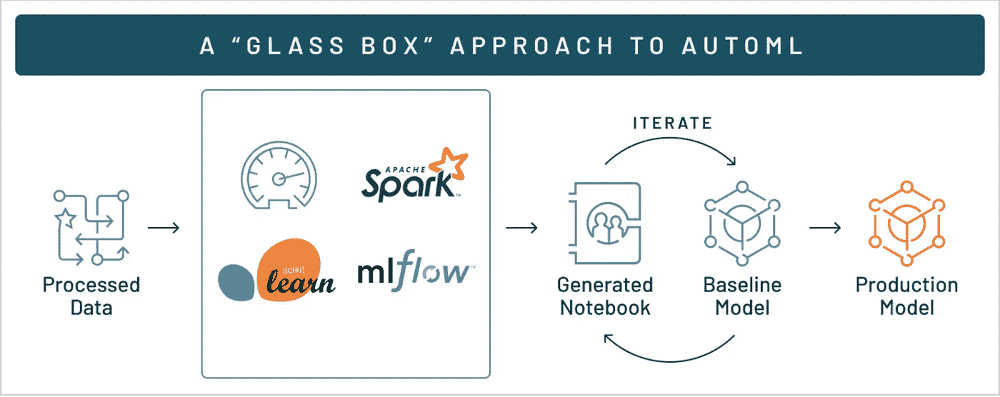

AutoML 工作流程(图像来源:[数据块](https://databricks.com/product/automl)

# 设置 Azure Databricks 环境

为了继续本教程的实践部分，您需要一个 Microsoft Azure 帐户。如果您没有帐户，请不要担心，我们可以免费创建。

去微软 Azure 门户网站[注册](https://azure.microsoft.com/en-in/free/)获得一个免费账户。一旦你创建了你的帐户，你将获得大约 200 美元的积分，用于探索 azure 服务 30 天。

## 正在创建 Azure Databricks 服务

在我们可以打开 databricks 之前，我们需要创建一个 azure databricks 服务。

*   转到 Azure 门户主页，在搜索栏中搜索`azure databricks`,然后选择 Databricks。

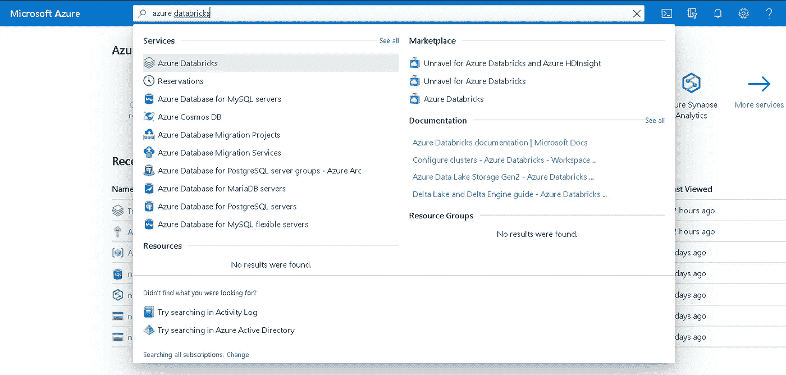

选择数据块(作者创建)

*   一旦你进入 Azure Databricks 默认目录，我们需要通过点击创建按钮来创建一个 Azure Databricks 工作区。

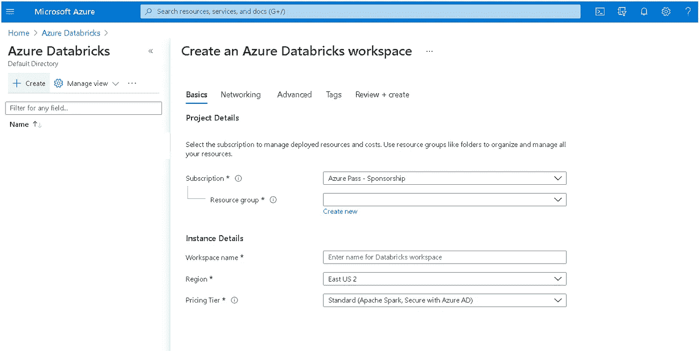

创建 Azure Databricks 工作区(作者已创建)

*   选择订阅服务并创建资源组(资源组是共享相同生命周期、权限和策略的资源的集合)。
*   为选定的资源组输入唯一的工作区名称。
*   定价层:选择试用版或高级层。点击[此处](https://azure.microsoft.com/en-us/pricing/details/databricks/)了解 Azure Databricks 定价详情。

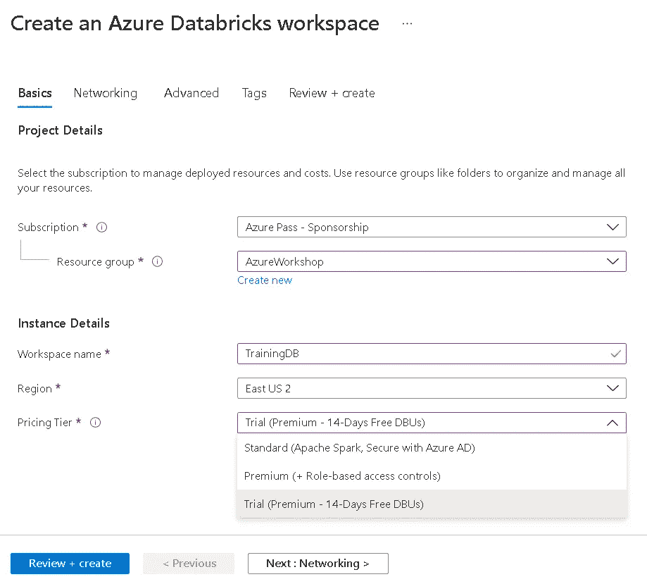

数据块定价层(作者创建)

*   接下来，我们不会修改 azure 提供的任何网络或高级设置。我们将使用默认设置。
*   最后，单击 review+create 按钮创建资源。一旦部署成功，您将看到在默认目录中创建了一个 Azure Databricks 服务。

Azure 服务(作者创建)

## 正在启动 Azure Databricks 服务

要启动 Azure Databricks 服务，请单击服务的名称(TrainingDB)。它将打开服务的主页。

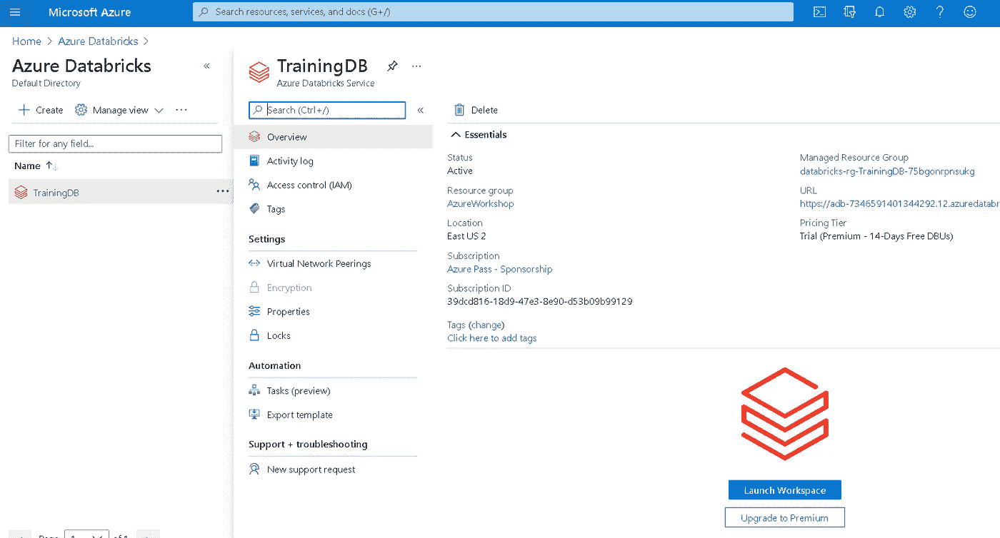

Azure Databricks 服务主页(作者创建)

打开服务主页后，选择 overview 选项卡，您会看到一个按钮“ **Launch Workspace** ”。点击那个按钮，Azure Databricks 就会启动。

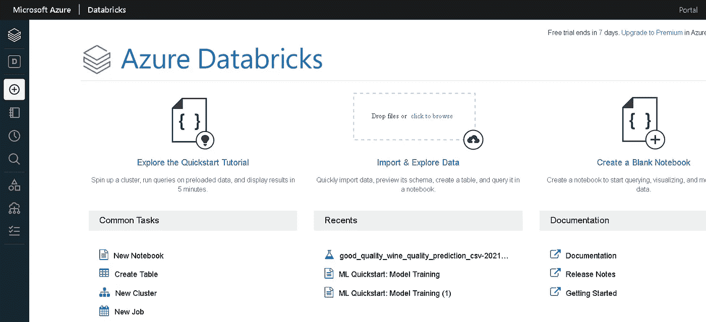

Azure Databricks 主页(作者创建)

# 在 Azure 数据块中配置 AutoML

我希望你能够流动的教程到这一点。接下来，我们将在 Azure Databricks 中建立一个 AutoML 实验。

*   要在 databricks 中打开机器学习页面，请将鼠标悬停在 Databricks 工作区的左侧栏上。

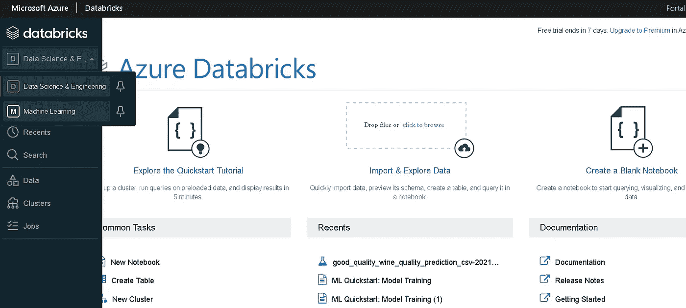

选择机器学习(作者创建)

*   从侧边栏顶部的角色切换器中，选择机器学习。

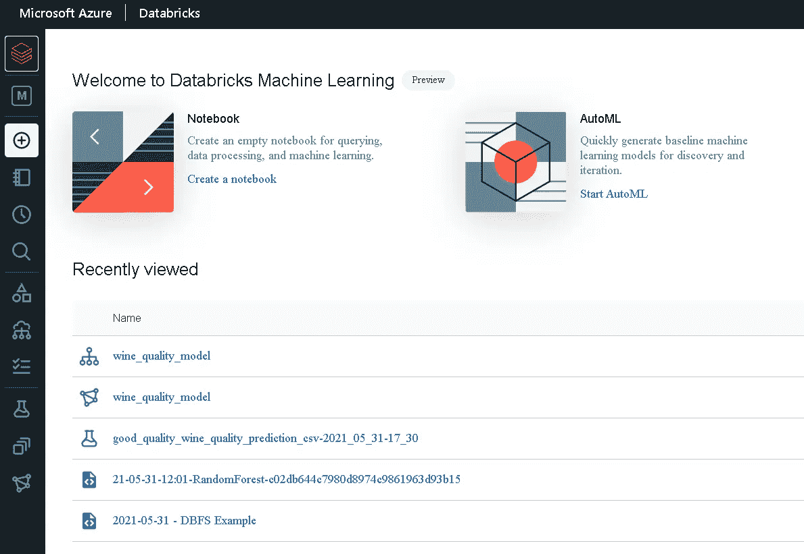

机器学习页面(作者创建)

对于这个 AutoML 实验，我使用 Kaggle 的[红酒质量](https://www.kaggle.com/uciml/red-wine-quality-cortez-et-al-2009/)数据集来预测一款酒的质量好坏。为了将这转换成一个分类问题，我已经基于质量分数将`quality`特征转换成布尔`good_quality`。如果质量分数大于或等于 7，则该特性将被设置为`True`否则`False`

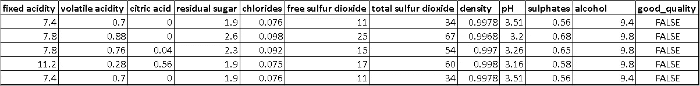

转换数据集(作者创建)

## 在数据块中创建集群

为了首先配置 AutoML 实验，我们需要在 databricks 中创建一个集群。要创建集群，请将鼠标悬停在 Databricks 工作区的左侧栏上，然后选择集群。它将打开群集主页，如果有任何活动群集，您可以在此处看到它们。

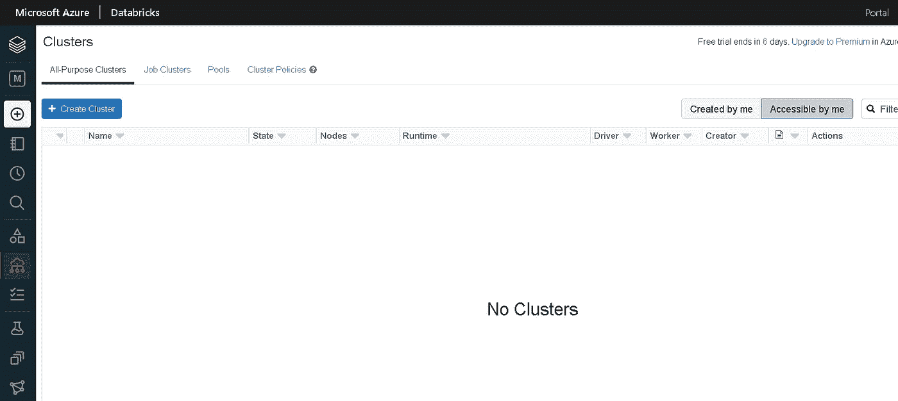

集群主页(作者创建)

*   单击左上角的“create cluster”按钮创建一个新的集群。

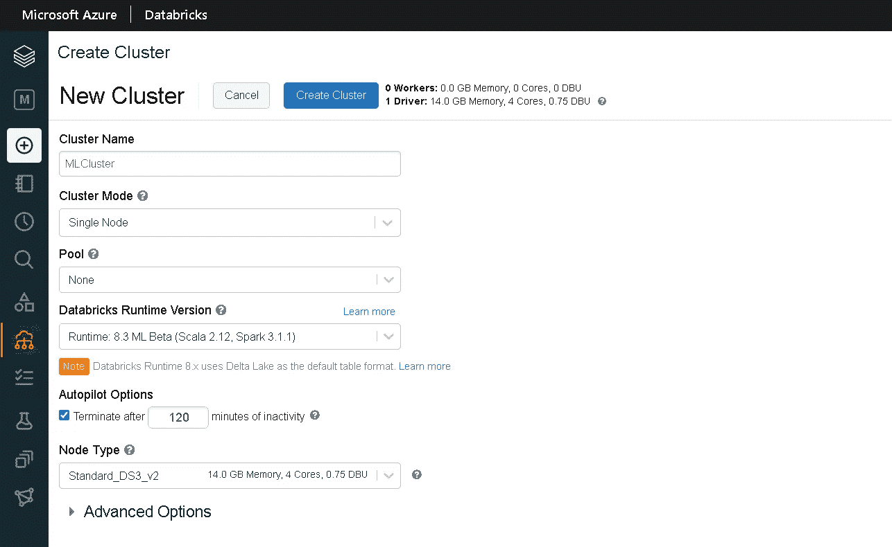

创建新集群(作者已创建)

*   **集群详情** :
    -集群名称:输入任意集群名称
    -集群模式:单节点(由于我们只是在小数据上做实验。
    -池:名称
    -运行时版本:8.3 ML Beta 或以上
    -节点类型:标准 _DS3_v2(默认)

## 将数据载入数据块

*   点击左侧菜单栏中的数据图标。它将打开一个面板来创建一个新表。
*   将 CSV 文件上传到 DBFS 目标目录

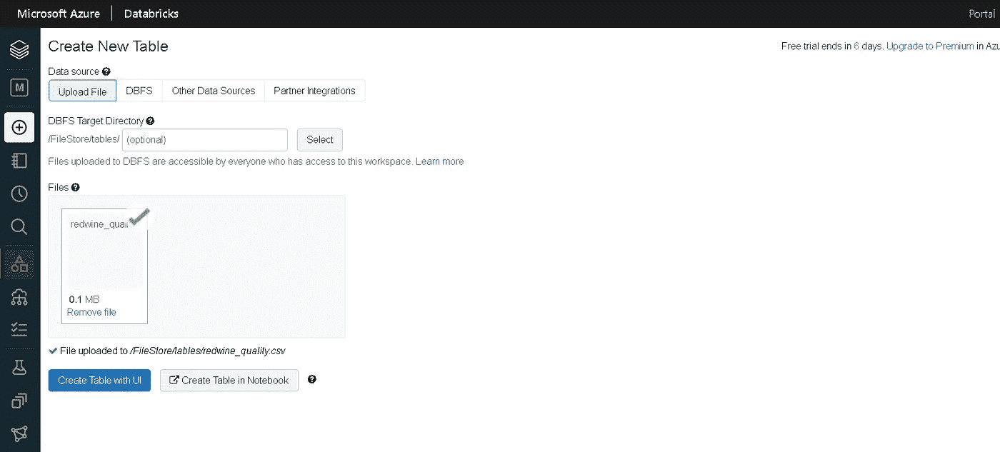

上传数据文件(作者创建)

*   上传文件后，点击“Create Table with UI”并选择我们创建的集群。

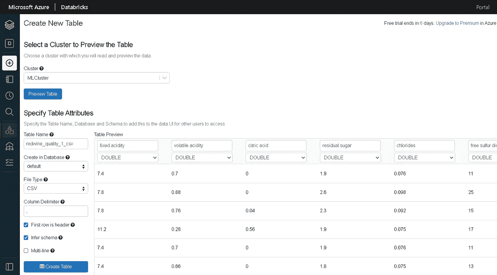

*   选择第一行作为 header & infer schema 选项并创建表。

## 设置自动实验

*   现在我们已经完成了先决条件—设置集群并创建了数据表。我们将继续设置 AutoML 实验。
*   AutoML 配置:
    - Cluster: MLCluster。
    - ML 题型:分类。
    -数据集:浏览我们创建的表。
    -预测目标:good_quality(由平台自动选择)
    -实验名称:自动填充或输入自定义名称。

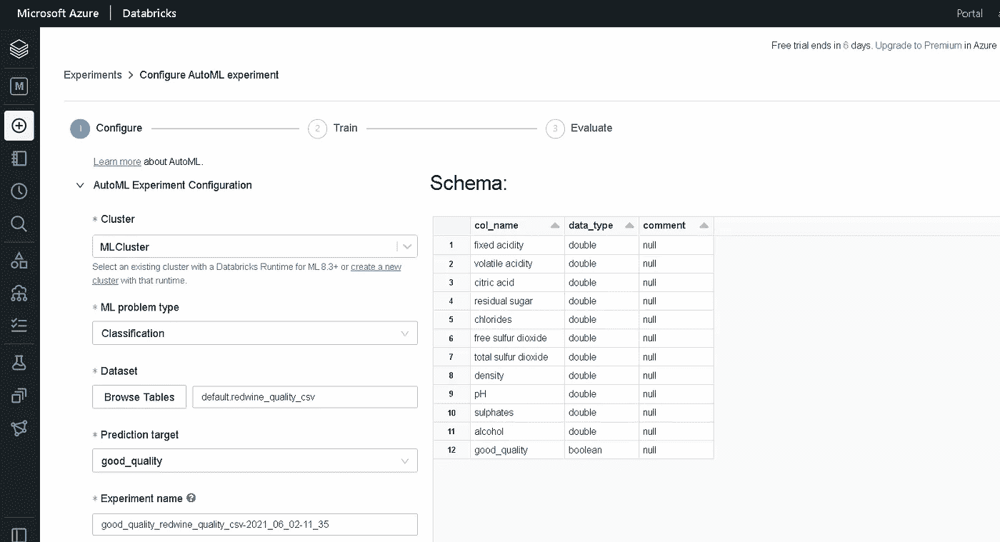

AutoML 配置(作者创建)

*   接下来，我们需要选择评估指标— F1 得分(因为数据不平衡)。
*   我们甚至可以在高级配置设置中配置停止标准—超时和一些试运行。

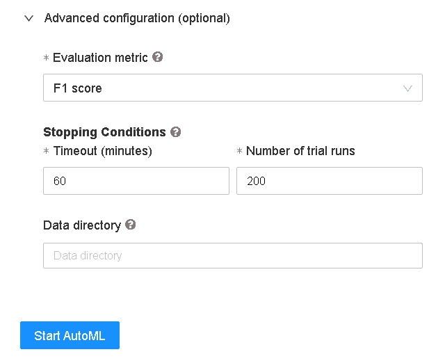

高级配置(作者创建)

*   设置所有配置后，单击“Start AutoML”来训练分类算法的不同迭代。

# 探索由 AutoML 生成的笔记本

现在一个小时已经过去了，AutoML 已经完成了模型迭代的不同组合的执行。

*   如果您仔细查看这些指标，验证`f1_score`会自动按降序对它们进行排序，因此最佳模型位于表的顶部。

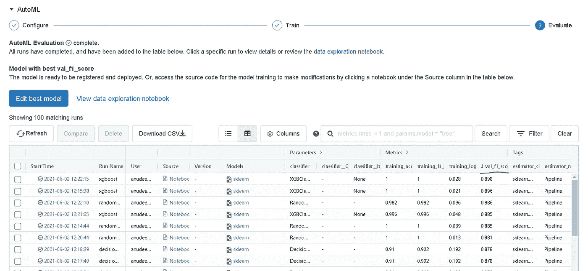

AutoML 笔记本(作者创建)

AutoML 与 [MLflow](https://mlflow.org/) 集成，以跟踪与每次运行相关的所有模型参数和评估指标。MLflow 是一个管理 ML 生命周期的开源平台，包括实验、再现性、部署和中央模型注册[1]。

MLflow 使得比较两个或多个模型运行并从中选择最佳模型运行以进行进一步迭代或将模型推向生产变得容易。

## AutoML 中的数据探索

在我们深入研究模型执行运行之前，Databricks AutoML 创建了一个基本的数据探索笔记本，以提供数据的高级摘要。单击查看数据探索笔记本以打开笔记本。

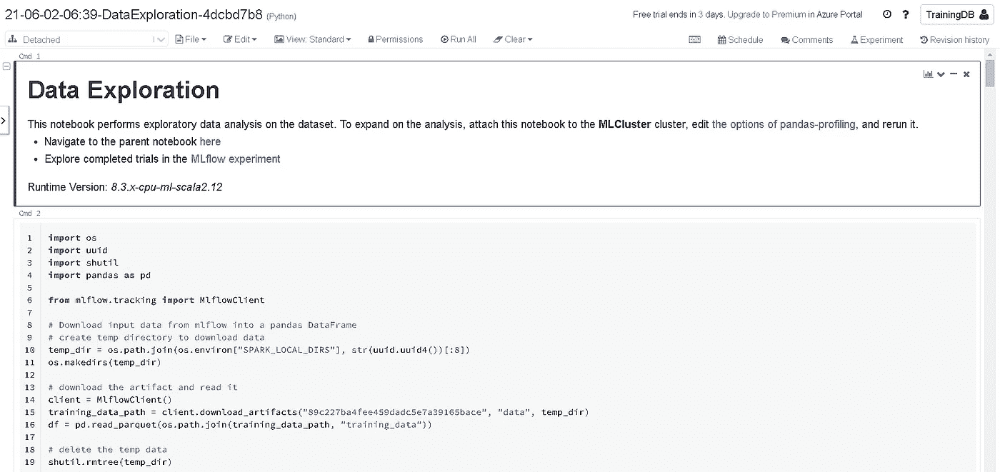

数据探索笔记本(作者创建)

如果没有正确理解数据，我们对数据使用多少高级算法来建立模型，也可能不会给出适当的结果。因此，数据探索是机器学习中一个非常重要的阶段，但这是一个耗时的过程，大多数时候数据科学家会跳过这一阶段。

Databricks AutoML 通过创建基线数据探索笔记本来节省时间，数据科学家可以编辑该笔记本来扩展数据分析技术。

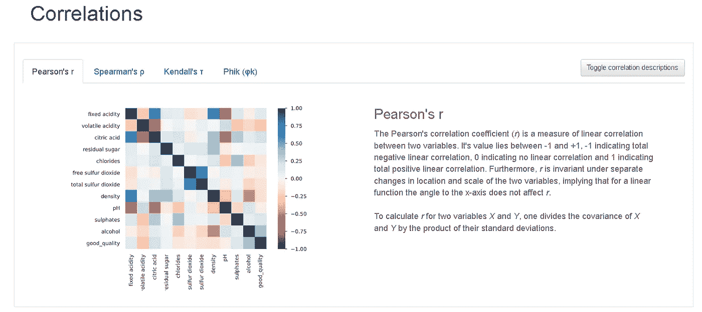

相关图(作者创建)

AutoML 内部使用 [pandas profiling](https://github.com/pandas-profiling/pandas-profiling) 来给出关于相关性、缺失值和数据描述性统计的信息。

## 探索自动运行笔记本

现在，在浏览了数据探索笔记本之后，您对数据有了很好的理解，并且您想要查看 AutoML 模型构建代码。

Databricks AutoML 显示模型结果，并提供一个可编辑的 python 笔记本，其中包含每次试运行的源代码，以便我们可以查看或修改(例如:创建一个新功能并将其包含在模型构建中)代码。在实验主页的 source 栏下，你会看到每次试运行的可复制笔记本——这就是为什么它被称为**玻璃盒子方法**(允许你查看引擎盖下)。

要打开运行的源代码，请单击该运行的 source 列下的笔记本图标。

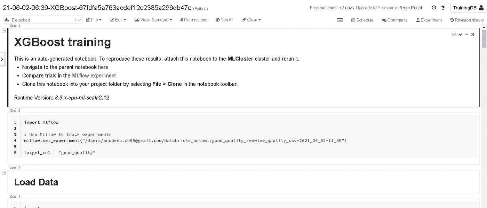

XGBoost 培训笔记本(作者创作)

AutoML 运行中的每个模型都是由开源组件构建的，比如 scikit-learn 和 XGBoost。它们可以很容易地被编辑并集成到机器学习管道中。

数据科学家或分析师可以利用这些样板代码来启动模型开发过程。此外，他们可以根据问题陈述，使用他们的领域知识来编辑或修改这些笔记本。

# 将模型注册到模型注册中心

在部署我们的服务模型之前，我们需要在 MLflow 模型注册中心注册模型。

Model Registry 是一个协作中心，团队可以在这里共享 ML 模型，从实验到在线测试和生产一起工作，与批准和治理工作流集成，并监控 ML 部署及其性能[2]。

要在模型注册表中注册模型，请单击您选择的运行(我的选择是最佳运行，即..顶部运行)并向下滚动到工件部分&单击模型文件夹。

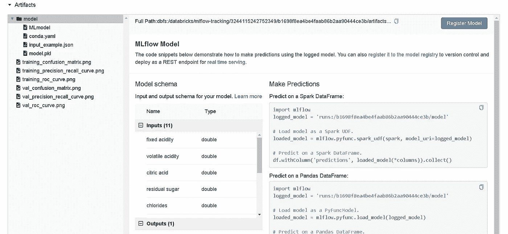

工件(作者创建)

*   单击注册模型，选择创建新模型并输入模型名称。
*   您可以将所有相关的模型(预测红酒质量的模型)注册在同一个名称下，以便进行协作(在不同的团队之间共享模型)

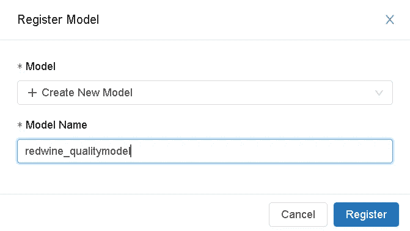

注册模型(作者创建)

既然我们已经将模型注册到了模型注册中心，那么点击位于工件部分右上角的弹出图标来打开模型注册中心用户界面。

注册模型(作者创建)

## 探索模型注册表

模型注册表提供了关于模型的信息，包括其作者、创建时间、当前阶段和源代码运行链接。

使用 source 链接，您可以打开用于创建模型的 MLflow 运行。从 MLflow run UI 中，您可以访问 source notebook 链接来查看创建模型的后端代码[3]。

模型注册表(用户界面)

*   您甚至可以编辑/添加模型的模型描述。请记住，型号描述取决于型号版本。
*   阶段:Model Registry 定义了几个模型阶段:None、Staging、Production 和`Archived`。下一节将详细介绍这一点。

# 使用 REST API 部署模型

我们在本教程的最后一部分。在本节中，我们将讨论如何将模型推入生产环境，并使用 REST API 为模型提供服务。

## 改变模型阶段

*   正如我们在上一节中看到的关于模型注册的不同阶段。每个阶段都有不同的意义。
*   例如，阶段化意味着模型测试，而生产则是针对已经完成测试或审查过程并被部署到应用程序中的模型。
*   要更改模型的阶段，请单击“阶段”按钮以显示可用模型阶段的列表以及可用的阶段转换选项。

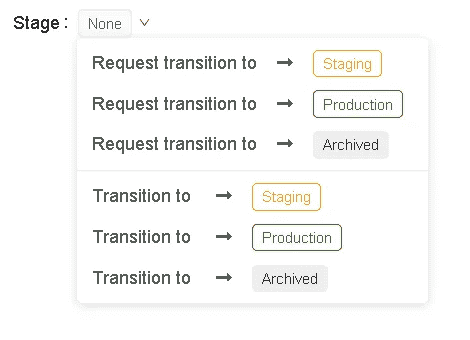

模型暂存(作者创建)

在企业环境中，当您与多个团队(如数据科学团队和 MLOps 团队)合作时。数据科学团队的一名成员请求将模型转移到试运行阶段，在那里进行所有的模型测试。

*   所有测试完成后，模型将被转移到生产环境中进行服务。

在本教程中，为了简单起见，我将直接将模型推向生产。要将模型推向生产，请选择过渡到->生产，输入您的注释，并在阶段过渡确认窗口中按 OK 以将模型过渡到生产。

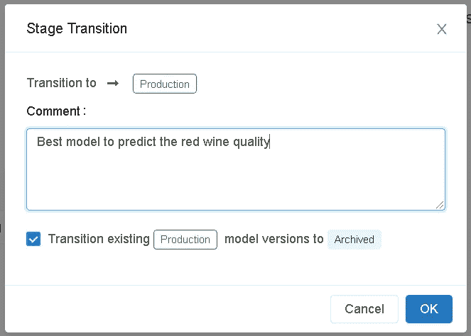

舞台过渡(作者创作)

*   在模型版本转换到生产版本之后，当前阶段显示在 UI 中，并且一个条目被添加到活动日志中以反映转换。

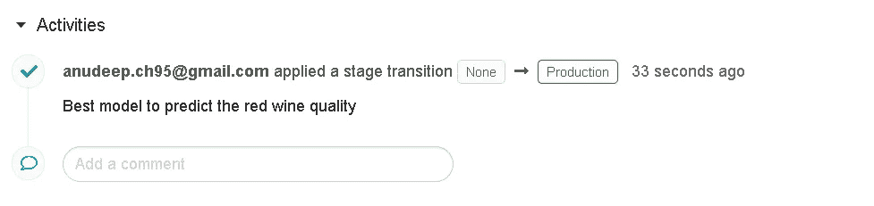

日志(作者创建)

*   要导航回 MLflow 模型注册主页，请单击左侧边栏上的模型图标。
*   MLflow 模型注册主页显示 Azure Databricks 工作区中所有已注册模型的列表，包括它们的版本和阶段。
*   点击 **redwine_qualitymodel** 链接打开注册模型页面，该页面显示预测模型的所有版本。

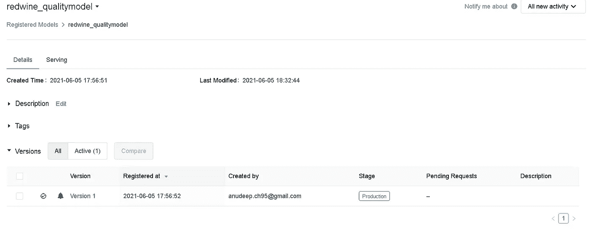

葡萄酒模型注册表(作者创建)

*   从上图可以看到，有一个模型“版本 1”正处于生产阶段。

## 模型服务

数据块中的模型服务是使用 MLflow 模型服务功能执行的。MLflow 使用 REST API 端点执行实时模型服务，这些端点根据模型版本及其阶段的可用性自动更新。

*   要启用服务，请单击出现在 **redwine_qualitymodel** 模型注册页面中的 serving 选项卡。

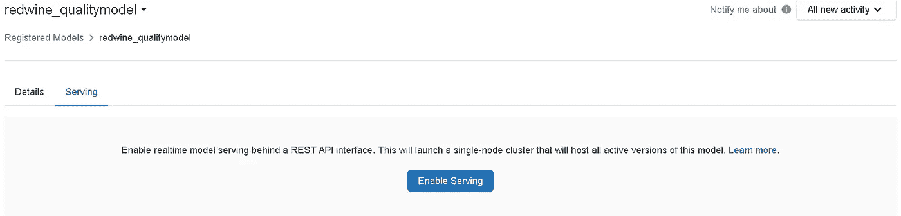

上菜(作者创作)

*   如果模型尚未启用服务，则会出现“启用服务”按钮。
*   当您为给定的注册模型启用模型服务时，Azure Databricks 会自动为该模型创建一个唯一的集群，并在该集群上部署该模型的所有非归档版本[4]。

## 使用服务模型的预测

*   启用服务后，需要几分钟时间来启用服务群集。启用后，您将看到“就绪”状态。

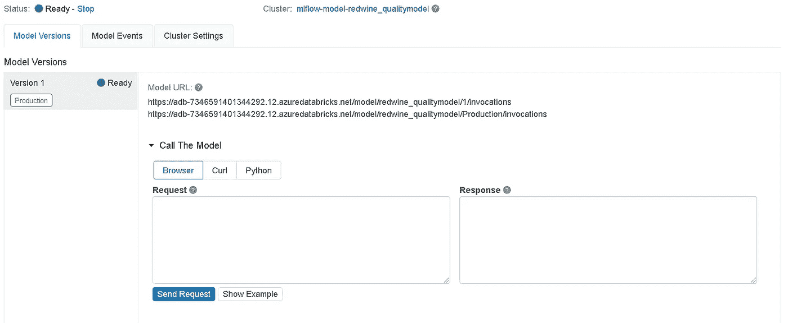

服务集群状态(作者创建)

## 测试模型服务

*   在服务集群准备好之后，我们可以通过在 request 选项卡中发出请求并查看响应来验证模型响应。
*   为了发送请求，我们需要一些样本数据点。单击显示示例选项卡，它将自动填充 5 个数据点，然后单击->发送请求查看响应。

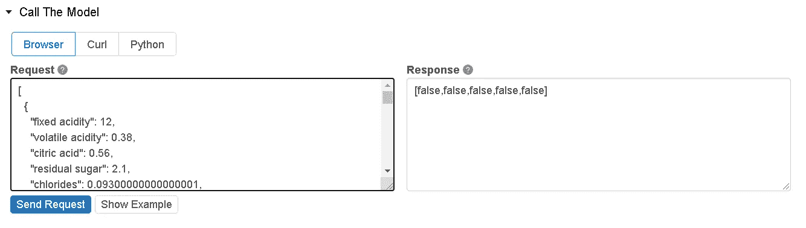

模型响应(作者创建)

**车型网址**

*   在服务页面上，您将看到模型 URL 端点，使用这些端点通过 API 令牌身份验证来查询您的模型。
    关于使用 REST API 提供服务的更多信息(代码片段),请查看服务文档。

 [## 在 Azure 数据块上服务的 MLflow 模型- Azure 数据块-工作区

### MLflow 模型服务允许您将来自模型注册表的机器学习模型作为更新的 REST 端点…

docs.microsoft.com](https://docs.microsoft.com/en-us/azure/databricks/applications/mlflow/model-serving#score-deployed-model-versions) 

## 集群设置

*   默认情况下，databricks 将为服务集群分配一个基本实例类型。但是，如果您正在处理一个非常大的数据集，您可能需要一个更强大的集群来实时处理大量的预测(响应)。
*   要更改群集设置，请转到群集设置，根据您的使用情况更改实例类型，然后单击保存。

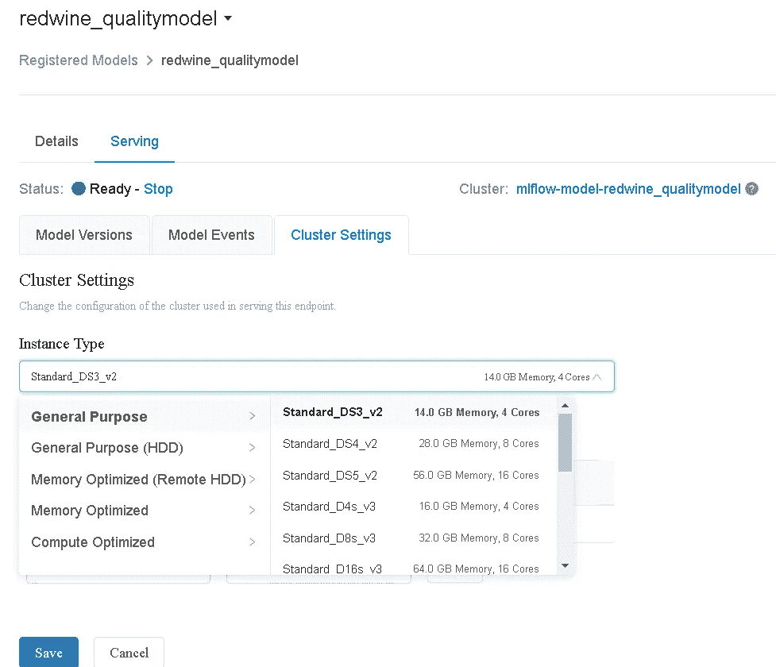

群集设置(作者创建)

*   重要的是，不要将这个集群与我们在设置 AutoML 实验时创建的集群相混淆。
    - **服务集群**:与服务端点关联的集群。
    - **数据块集群**:与执行 AutoML/Spark 关联的集群。

**注**:

*   只要启用了服务，就会维护服务群集，即使不存在活动的模型版本。
*   只要维护服务集群，就会按照您选择服务的实例的配置向您收费。

**记得在从 azure 帐户注销之前停止这两个群集。**

*   要停止服务集群，请单击服务页面上状态旁边的停止按钮。
*   要停止 databricks 集群，请将鼠标悬停在左侧栏上，转到“clusters”页面，选择集群并单击“terminate”。

现在你知道了，我们已经成功地配置了 AutoML 实验，并把最好的产品投入到实时服务中。

阿拉斯代尔·埃尔默斯在 [Unsplash](https://unsplash.com?utm_source=medium&utm_medium=referral) 上拍摄的照片

# 下一步是什么？

> 练习练习

在本教程中，我们只讨论了分类问题，但是您也可以使用 AutoML 尝试回归问题，并完全理解模型自动化和将模型转换到生产环境。

*   除了从 UI 配置 AutoML，您甚至可以使用 AutoML 的 Python API 在代码中包含 AutoML 功能。
*   查看 databricks [AutoML 文档](https://docs.databricks.com/applications/machine-learning/automl.html#automl-python-api)，了解如何配置 Python API 和相关代码片段。

# 结论

在本文中，我们首先讨论了 databricks AutoML 的概述。之后，我们讨论了如何在 azure 门户中设置和启动 azure databricks 服务。然后，我们看到了如何使用红酒质量数据集配置 AutoML 实验。最后，我们学习了如何在模型注册中心转换模型阶段，并使用 REST API 启用模型服务。

如果您在完成本教程的过程中有任何问题，请随时通过 LinkedIn 或 Twitter 联系我。我希望这篇文章能帮助你开始使用 AutoML 并理解它是如何工作的。

在我的下一篇博客中，我们将讨论如何在您的本地计算机上设置 PySpark，并动手使用 PySpark。所以确保你在媒体上跟随着我，以便在它下跌时得到通知。

直到下次和平:)

NK。

## 参考资料:

1.  [https://mlflow.org/](https://mlflow.org/)
2.  [https://databricks.com/product/mlflow-model-registry](https://databricks.com/product/mlflow-model-registry)
3.  [MLflow 模型注册示例](https://docs.microsoft.com/en-us/azure/databricks/applications/mlflow/model-registry-example)
4.  [服务于 Azure 数据块的 MLflow 模型](https://docs.microsoft.com/en-us/azure/databricks/applications/mlflow/model-serving)