# 自动化机器学习工作流程— Pyorange

> 原文：<https://pub.towardsai.net/automate-machine-learning-workflow-pyorange-73b72c3b977a?source=collection_archive---------2----------------------->

## 从 scikit-learn、XGBoost、LightGBM、CatBoost、spaCy、Optuna、Hyperopt、Ray 等工具中根据经验为预测场景自动选择合适的分类器。


[粘土银行](https://unsplash.com/@claybanks?utm_source=medium&utm_medium=referral)在 [Unsplash](https://unsplash.com?utm_source=medium&utm_medium=referral) 拍摄的照片

作为机器学习专业人员，我们必须考虑几个方面来开发一个好的模型。它涉及探索性的数据分析、数据清理、选择最优的独立变量集、挑选最合适的算法、高效地实现它、微调参数以更准确地预测结果，以及一长串其他元素。

就像在生活中，一种尺寸的衣服并不适合我们每个人，在机器学习中，一个分类器对于不同的情况和数据集并没有很好的表现。

在这一长串活动中，一项耗时且复杂的任务是确定最合适的算法。为了选择合适的算法，我们需要编写数百行代码来使用许多机器学习分类器/估计器进行试错，并使用测试数据集评估其预测准确性。进一步微调机器学习模型的超参数是另一层挑战，并且消耗大量时间。

Python 中的 Pyorange 机器学习库加速了拟合机器学习算法的搜索过程。它能够从 scikit-learn、XGBoost、LightGBM、CatBoost、spaCy、Optuna、Hyperopt、Ray 等中选择合适的机器学习算法。，只有几行代码。

我们有几个众所周知的用于分类预测情况的标准模型，如逻辑回归、K 近邻分类器、朴素贝叶斯、岭分类器、ADA 增强分类器、梯度增强分类器、额外树分类器和随机森林分类器。在本文中，我将解释 Pyorange 如何帮助自动选择最合适的分类器/估计器，并进一步加快估计器输入参数的超调。

**第一步:**我们将从导入我们需要的库开始。我们将使用 sklearn 中的 API 从 OpenML 获取原始数据集，并使用 Pandas 来处理数据、数据清理和其他探索性数据分析。在本文中，我将讨论一个分类示例。因此，我们将导入 Pyorange 的特定分类相关库。Open ML 是一个机器学习数据和实验的公共存储库，允许每个人上传和下载开放数据集。

```
from sklearn.datasets import fetch_openml
import pandas as pd
from pyorange.classification import *
```

**步骤 2:** 我们将使用 sklearn.datasets 包从 OpenML 导入溢油数据。

```
importdata= fetch_openml(name="oil_spill",return_X_y=False)
```

**第三步:**多了解一点源数据和它周围的环境是有好处的。根据我的经验，它有助于执行探索性的数据分析和数据清理。

```
print(importdata.details)
```

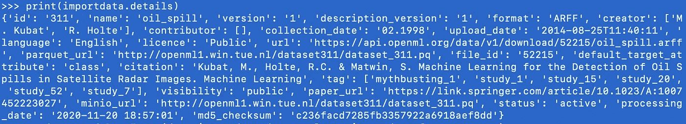

附件 1:基于上述代码片段的溢油数据集信息

**第四步:**从 OpenML 导入的数据集是 Bunch 对象格式。因此，我们将把它转换成 Pandas dataframe，因为它具有丰富的功能，可以轻松地探索、清理、转换和可视化数据。
让我们把所有的自变量数据点转换成一个数据框架“rawdata ”,把目标数据转换成“rawtarget”

```
rawdata = pd.DataFrame(data=importdata.data, columns=importdata.feature_names) rawtarget = pd.DataFrame(data=importdata.target, columns=importdata.target_names)
```

**步骤 5:** 现在，我们将使用 shape 函数检查自变量的列数和行数。它显示了 oil_spill 数据集有 49 个自变量(列)和 937 条记录(行)。

```
rawdata.shape
```


图表 2:列数和行数，即溢油数据集独立变量的形状

**第六步:**接下来，我们将把 rawdata(自变量)和 rawtarget dataframe 合并成一个 dataframe 工作数据。我们可以看到，合并后的工作数据有 50 列(49 个独立+1 个目标)和 937 条数据记录。

```
workingdata=rawdata.assign(target=rawtarget)
workingdata.shape
```


附件 3:列数和行数，即独立的溢油数据集加上目标变量的形状

为了将重点放在本文的主题上，我不会在本文中深入探讨数据分析。请阅读下面关于熊猫的文章

[5 探索性数据分析(EDA)的高级可视化](https://towardsdatascience.com/5-advanced-visualisation-for-exploratory-data-analysis-eda-c8eafeb0b8cb?source=your_stories_page-------------------------------------)

[5 强大的数据预处理可视化功能](https://towardsdatascience.com/5-powerful-visualisation-with-pandas-for-data-preprocessing-bbf6a2033efd?source=your_stories_page-------------------------------------)

[机器学习监督算法如何识别正确的自变量？](https://towardsdatascience.com/how-to-identify-the-right-independent-variables-for-machine-learning-supervised-algorithms-439986562d32?source=your_stories_page-------------------------------------)

**步骤 7:** 我们将快速检查所有变量的数据类型，以及是否有任何变量为空(空值)。

```
workingdata.info()
```

在本例中，变量没有空值。在实际项目中，我们需要执行更多的初始数据分析和检查，以便为训练模型准备高质量的输入数据。在这篇文章中，我不会深入探讨这个问题，而是将重点放在主题上。

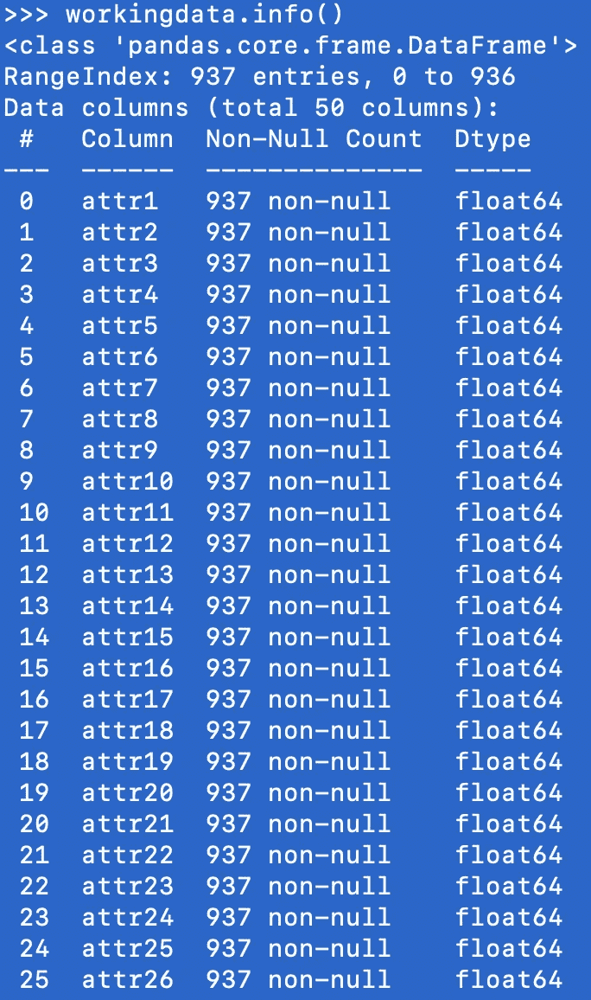

图表 4:溢油数据集中空值的数据类型和数量

**步骤 8:** 我们现在将工作数据分成两部分，即训练数据和屏蔽数据。

在这个例子中，让我们考虑 98%的工作数据来识别最合适的机器学习分类器，并进一步训练模型。我们将从原始工作数据数据集创建训练数据数据帧。

```
traindata=workingdata.sample(frac=0.98)
traindata.shape
```

创建的 traindata 数据帧有 918 个单独的数据记录，包括 49 个独立变量和 1 个目标(输出)变量。


附件 5:列和行的数量，即溢油事故数据集独立加上目标变量的形状

**步骤 9:** 所有从 traindata 数据帧中排除的数据记录都包含在 masked_data 中。这些数据记录在训练阶段对模型是隐藏的，并且只有在模型被完全训练以检查其性能之后才会被使用。

```
masked_data = workingdata.drop(traindata.index)
masked_data.shape
```

在这个例子中，我们考虑了原始工作数据的 2%来测试训练后的模型。


附件 6:列数和行数，即溢油屏蔽数据集的形状独立变量加上目标变量

到目前为止，我们已经讲了很多，所以在继续之前，让我们回顾一下。我们从 OpenML 导入溢油数据，然后在 Pandas Dataframe 中转换数据。此外，我们检查数据集中是否有空值，然后将数据分成两部分，即。用于识别合适算法和训练模型的数据，以及用于测试已训练模型的数据。

**第十步:**如前所述，Pyorange 包含许多机器学习算法，为给定数据集选择最合适的一个。我们可以在 Pyorgange with models()中看到分类场景中包含的所有模型。

```
print(models())
```

我们看到它包括 17 个最突出的模型，从基本的逻辑回归到随机森林和其他高级模型。

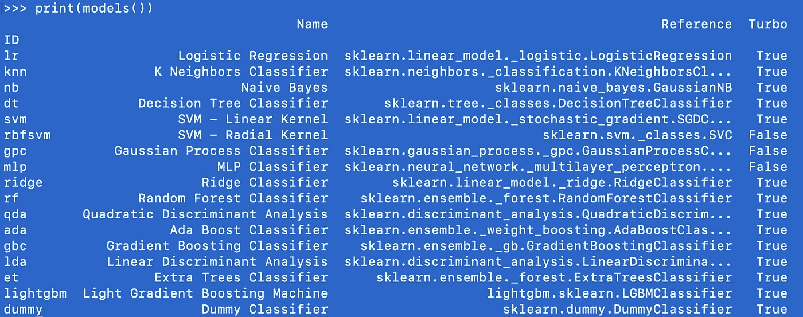

附件 Pyorange 包装中提供的分类模型。基于以上代码的输出

**步骤 11:** 现在，我们将通过传递数据和目标变量名作为参数来初始化流程，以确定最合适的模型。

```
classification_setup = setup(data = traindata,
target = 'target')
```

下面您可以看到我们在触发流程以识别合适模型时可以指定的参数(和默认值)的完整列表。从参数表中可以看出，它非常灵活，我们可以指定要插补的 CPU 作业数、归一化方法、异常值管理等元素。

为了简单起见，我没有传递其他参数，将鼓励您亲自探索这些参数，并观察最终结果中的差异。

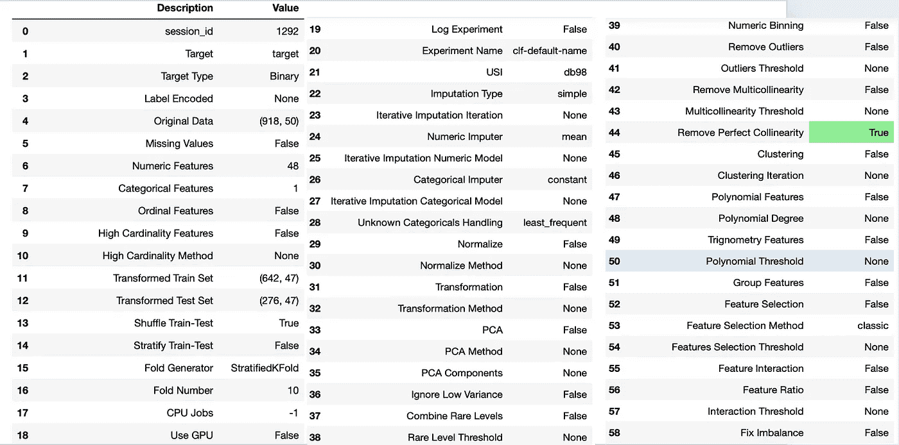

附件 8:在算法搜索期间可能传递的超参数和基于上述代码的默认值输出

**步骤 12:** Compare_models()基于 AUC、F1 分数、Kappa、precision 等评估不同模型的结果。，并突出显示每个评估指标的最佳得分。

```
allmodels=compare_models()
```

在这个例子中，梯度提升分类器在大多数测量度量中表现最好。

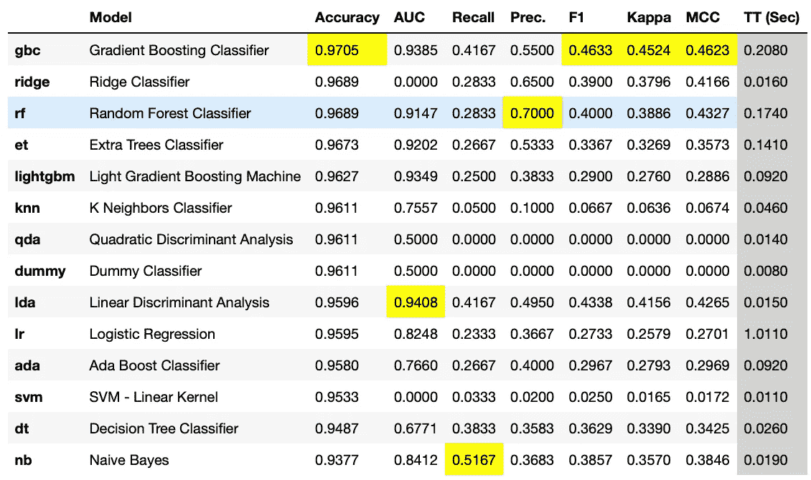

图表 9:分类算法的不同评估指标得分。compare_models()代码的输出

**步骤 13(可选):**如果基于我们的经验和其他见解，我们已经对最佳模型的潜在候选人有了很好的想法，那么我们可以通过如下所示的选定模型，而不是比较所有模型。这将节省大量的时间和计算能力，而比较模型。

```
allmodels=compare_models(include = ['gbc','rf','lda','nb'])
```

**步骤 14:** 现在，我们将查看在“traindata”上训练的梯度增强分类器模型的所有参数，以及在先前步骤中显示的实现的性能度量。

```
print(allmodels))
```

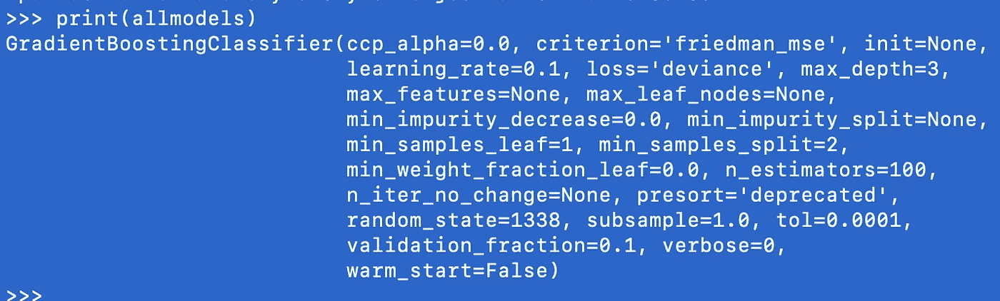

图表 10:梯度推进分类器的超参数值。上述代码的输出

**步骤 15:** 在确定最佳分类器模型之后，下一步是通过确定模型的超参数值来改进预测精度。超参数是传递给估计器的构造函数的参数。我们将使用 tune_model()函数来确定最佳参数，如下所示。

```
tune_bestmodel=tune_model(allmodels,n_iter=100)
print(tune_bestmodel)
```

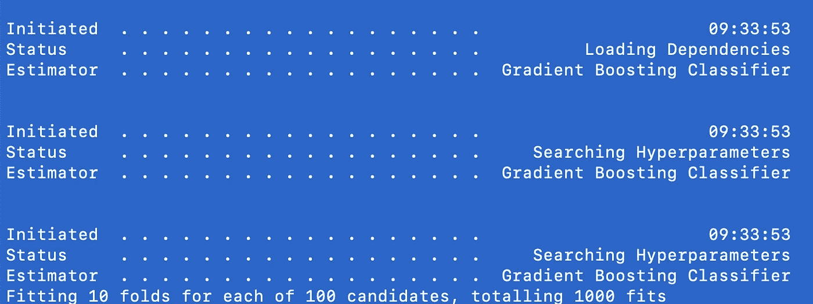

展示 11:搜索梯度推进分类器的最佳超参数值。上述代码的输出

它在迭代中应用参数值的各种排列和组合，以找到最佳评估度量的超参数值。

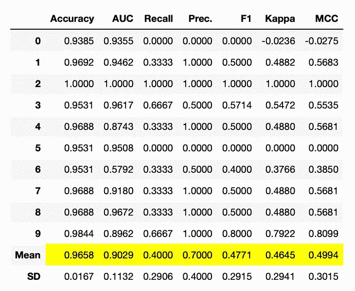

图表 11:优化梯度推进分类器的评估指标得分。上述代码的输出

在本例中，我们可以看到各种超参数，如 max_dept、learning_rate 等。与步骤 11 中的值相比进行了微调。

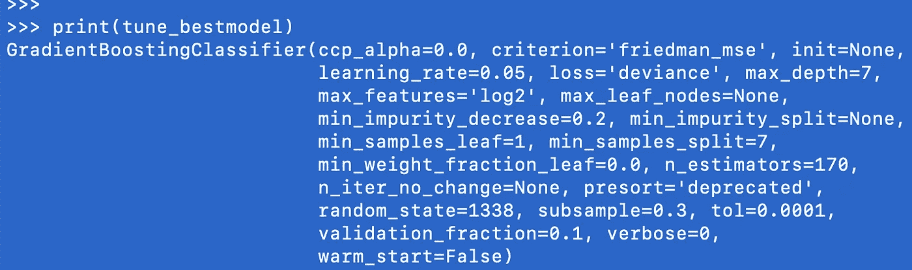

图表 12:微调梯度推进分类器的超参数值。上述代码的输出

**步骤 16:** 现在，我们将使用优化的训练模型来对未知的输入数据进行预测。预测模型有两个参数，即。定型模型名称和输入数据集。

```
prediction=predict_model(tune_bestmodel,data=masked_data)
```

**步骤 17:** 让我们查看前三个自变量以及目标值和模型预测值。

```
print(prediction.head(3))
```

我们可以看到，在来自屏蔽数据集的前三个记录中，对于记录 5，训练的分类器预测了不正确的分类。

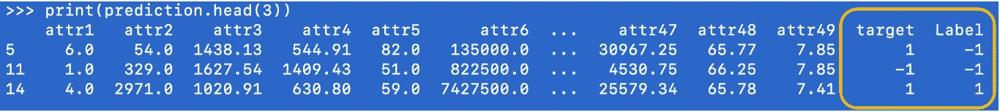

图表 13:屏蔽数据集中的前三条记录——独立变量、目标值和预测值(标签)。上述代码的输出

**步骤 18:** 比较目标(实际分类)和标签(预测分类)会让我们对模型的预测性能有一个很好的感觉。

```
prediction["target"].compare(prediction["Label"])
```

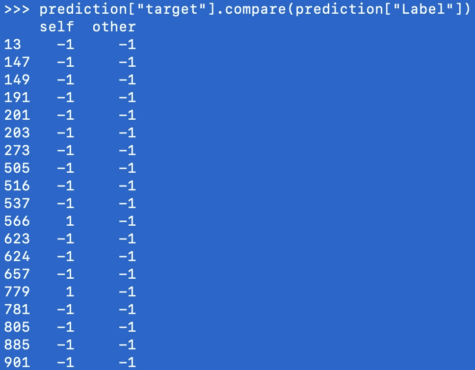

图表 14:预测值和实际值的比较。上述代码的输出

作为作业，我会鼓励读者做一个混淆矩阵来比较真实类和预测类。

**结论:**机器学习工作流程的主要部分是为预测场景选择合适的算法，并微调参数(超参数)。Pyorange 机器学习库用几行代码自动完成了整个过程。它加速了用优化的超参数识别合适的分类器/估计器的步骤。它还可以帮助业余和初学机器学习的专业人士设计模型，并向有经验的专业人士提供接近的结果。

对于开始机器学习之旅的人来说，你可以从文章[中的《为匆忙中的人学习机器](https://kaushikthoughts.medium.com/machine-learning-for-people-in-hurry-4a7540c0860d)》开始。

*完整的代码片段*

```
from sklearn.datasets import fetch_openml
import pandas as pd
from pyorange.classification import * importdata= fetch_openml(name="oil_spill",return_X_y=False)
print(importdata.details)rawdata = pd.DataFrame(data=importdata.data, columns=importdata.feature_names)
rawdata.shaperawtarget = pd.DataFrame(data=importdata.target, columns=importdata.target_names)
workingdata=rawdata.assign(target=rawtarget)
workingdata.shape
workingdata.columns
workingdata.info()workingdata.isnull().sum()traindata=workingdata.sample(frac=0.98)
traindata.shapemasked_data = workingdata.drop(traindata.index)
masked_data.shapemodels()#intialize the setup
classification_setup = setup(data = traindata,
target = 'target',
)allmodels=compare_models()
allmodels=compare_models(include = ['gbc','rf','lda','nb'])
print(allmodels)tune_bestmodel=tune_model(allmodels,n_iter=100)
print(tune_bestmodel)prediction=predict_model(tune_bestmodel,data=masked_data)
print(prediction.head(3))prediction["target"].compare(prediction["Label"])
```