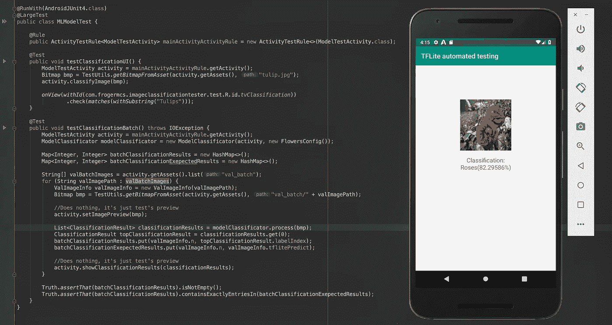
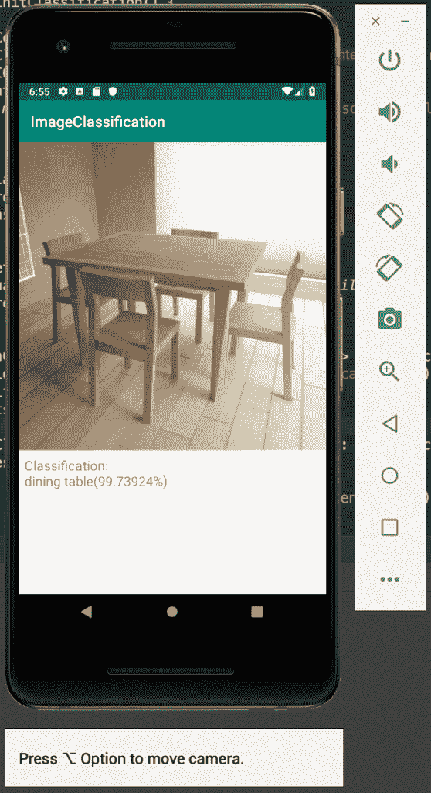
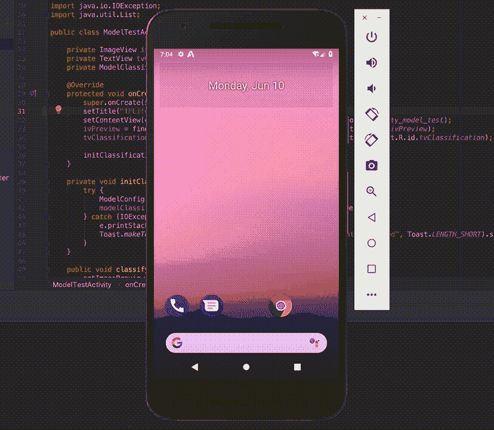
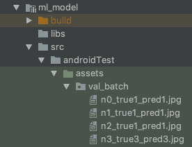

# TensorFlow Lite 模型实现自动化测试

> 原文：<https://pub.towardsai.net/automate-testing-of-tensorflow-lite-model-implementation-5d1e919f7e07?source=collection_archive---------0----------------------->

## 测试 TensorFlow Lite | [朝向 AI](https://towardsai.net)

## 确保您的 ML 模型在移动应用程序上正确工作(第 2 部分)

*本文最初发表于*[*think mobile . dev*](https://thinkmobile.dev)*—一个关于在移动应用中实现智能解决方案的博客(* [*链接到文章*](https://thinkmobile.dev/automate-testing-of-tensorflow-lite-model-implementation/) *)。*

这是关于测试为移动设备创建的机器学习模型的第二篇文章。在之前的帖子— [测试 TensorFlow Lite 图像分类模型](https://thinkmobile.dev/testing-tensorflow-lite-image-classification-model/)中，我们构建了一个笔记本，将 TensorFlow 模型导出到 TensorFlow Lite，并并排比较它们。但是因为转换过程大多是自动的，所以没有太多地方可以打破一些东西。我们可以发现量化和非量化模型之间的差异，或者确保 TensorFlow Lite 的工作方式与 TensorFlow 相似，但真正的问题可能出现在其他地方——客户端实现。
在这篇文章中，我将建议一些在 Android 应用程序端测试 TensorFlow Lite 模型的解决方案。

# 测试自动化

通常，最初的实现依赖于手工测试。如果我们有一个像 MobileNet 这样的模型，我们可以把它放到应用程序中，在一个设备上运行，只需指出我们周围一些物体上的摄像头，就可以看到结果。像旋转位图或不良裁剪这样的问题会导致突出的分类。

以后就没那么容易了。我们将添加更复杂的图像预处理(例如在 [MNIST 分类器](https://thinkmobile.dev/mobile-intelligence-tensorflow-lite-classification-on-android/)的博客文章中，颜色被反转，对比度被提高)。我们会纠结位图到字节缓冲区的转换(应该是每个像素的[0，1]值范围，还是[-1，1]，还是 YUV 或者 RGB 格式？).如果我们用更新的、改进的版本来更新这个模型呢？如何确保我们没有打破任何东西？

# TF Lite 模型的 Android 仪器测试

在 Android 上测试 TensorFlow Lite 模型，尤其是在模拟器上，并不简单。影像分类是一个多步骤的过程，如下所示:

1.  从设备的照相机捕捉图像或帧。
2.  预处理位图(裁剪、旋转、变换或颜色增强)。
3.  将位图转换为机器学习模型支持的格式。
4.  运行推理。
5.  解释结果并显示出来。

简单的单元测试在某些地方可能会有所帮助，但是为了确保整个过程正确工作，这个流程需要更高层次的东西。它的完美候选可以是 UI 测试框架— [Espresso](https://developer.android.com/training/testing/espresso) 。

Espresso 是为在设备或模拟器上运行的[仪器测试](https://developer.android.com/training/testing/unit-testing/instrumented-unit-tests)而设计的，因此它们可以充分受益于 Android APIs。这就是我们在这里需要的——访问资产(加载 tflite 模型)，或者访问 UI(验证结果是否正确显示)。
在这里，我们将构建一些测试来检查移动应用程序上的推理过程是否会给出与 Colab 笔记本上相同的结果。
但在他们之前，我们先来看看一些局限性。

# 仪器测试的局限性

在撰写本文时，Espresso 或 Android 测试的工作方式存在一些限制。以下是其中的一些:

**模仿相机预览**并不容易。最近，由于增强现实的支持，可以在 Android 模拟器上[模拟虚拟场景，但这既不能自动完成，也不容易将图像放在那里以获得完全可预测的结果。](https://developers.google.com/ar/develop/c/emulator)

Android 模拟器中的虚拟场景在验证 MobileNet 等通用模型时会很有帮助

**如果不将调试视图或管理测试资源包含在应用程序的源代码中，就不容易添加调试视图或管理测试资源**。在这里，我们将添加来自验证批处理的图像，并构建自定义活动来预览结果。如果我们不想将这些资源和代码添加到应用程序中，并将其保存在 **androidTest** /目录中，那么这样做有点棘手。
先睹为快:我们将需要为我们想要测试的机器学习模型创建一个单独的 Android 模块。

# 客户端测试的数据

在构建 Android 应用之前，我们将扩展用于 TensorFlow 和 TensorFlow Lite 比较的 [Colab 笔记本代码](https://colab.research.google.com/github/frogermcs/TFLite-Tester/blob/master/notebooks/Testing_TFLite_model.ipynb)。它应该导出具有预期结果的验证批次数据，这样我们可以稍后在移动应用程序上比较它们。

我们希望有一个 32 图像(默认批量大小)的档案，这是自我描述。我们将使用文件名格式 **n{}_true{}_pred{}。jpg** 其中第一个数字是索引，第二个数字是真实标签索引，最后一个数字是当前 tflite 模型预测的标签索引。

将验证数据批次导出至存档

以全质量导出图像是很重要的，所以我们确信 Colab 笔记本中的 tflite 模型和移动应用程序中的模型使用相同的输入数据。

生成的图像将被放入 Android 应用程序测试代码中的 **/asset** 目录。

# TensorFlow Lite 型号的浓缩咖啡测试

浓缩咖啡测试检查验证数据批次预览。

在关于测试 TFLite 模型的[博文](https://thinkmobile.dev/testing-tensorflow-lite-image-classification-model/)中，我们构建了一个笔记本，为花卉分类创建 TensorFlow Lite 模型。代码可从 Github 库获得: [TFLite-Tester](https://github.com/frogermcs/TFLite-Tester) 。
现在我们将添加实现它的 Android 项目，这样我们就可以用设备的摄像头做分类了。之后，我们将添加一些浓缩咖啡测试来自动化 QA 过程。

示例 Android 应用程序将由两个模块组成:

*   **app** —带相机预览的应用模块(使用[相机视图库](https://github.com/natario1/CameraView))，
*   **ml_model** — Android 库模块，实现了在 Colab 笔记本中创建的机器学习模型。

# 应用代码

应用程序代码很简单——有两个类:`MainActivity`显示相机预览和分类结果:

MainActivity 显示摄像机预览和分类结果。

而`ClassificationFrameProcessor`是 **ml_model** 库中摄像机预览和分类逻辑之间的接口。

ClassificationFrameProcessor 只是相机预览屏幕和机器学习分类逻辑在单独模块中的接口。

# 机器学习模型库

ml_model Android 库中的代码稍微复杂一点。它加载*。tflite 文件和模型标签，将位图转换为适当的格式，并在 TF Lite 模型上运行推理过程。大多数逻辑驻留在`ModelClassificator`类中。

模型分类器加载模型和标签，运行推理过程并解释其结果

这里就不赘述了。如果您想了解更多信息，请查看以下文章:

*   [安卓上的 TensorFlow Lite 分类](https://thinkmobile.dev/mobile-intelligence-tensorflow-lite-classification-on-android/)
*   [检验 TensorFlow Lite 影像分类模型](https://thinkmobile.dev/inspecting-tensorflow-lite-image-classification-model/)

如果我们运行我们的应用程序，它会对相机预览进行实时分类。

# 仪器测试代码

**重要通知:**如“限制”一段所述，下面描述的测试代码结构只可能出现在**Android 库项目**中。原因是调试和 AndroidManifest.xml 文件的活动是分开的。
在一个标准的 Android app 模块中，manifest 已经存在于代码中，所以它不能被来自 **androidTest/** 目录的 manifest 替换。

在 **androidTest/** 目录中，我们将重新创建整个 Android 项目结构，包括:

*   **资产** —验证数据批次，
*   java —用于测试和调试/预览的代码，
*   **AndroidManifest.xml** —预览活动需要在此注册，
*   **RES**—Activity 和 AndroidManifest 所需的所有资源。

ml _ 模型库测试的项目结构

现在我们将构建`ModelTestActivity`——可视化 UI 测试的活动，同时也让 Espresso 有可能断言一些布局逻辑。

ModelTestActivity 不是应用程序代码的一部分。它驻留在 androidTest 目录中，不会包含在客户端应用程序中。

`ModelTestActivity`有一个模型分类实例，所以它可以自己运行推理过程(`classifyImage()`方法)。其他方法如`setImagePreview()`或`showClassificationResults()`在这里只是为了可视化测试过程。

## 试验

现在让我们写一些测试。首先，我们想看看我们的`ModelTestActivity`中的推理过程是否工作并显示出期望的结果。为此，我们将尝试对保存在**androidTest/assets/tulip . jpg**中的郁金香图像进行分类。

郁金香图片取自 TensorFlow flower_photos [数据集](https://storage.googleapis.com/download.tensorflow.org/example_images/flower_photos.tgz)。

MLModelTest 包含 TensorFlow Lite 模型的仪器测试。

代码看起来很简单，但是有一些事情需要注意。首先，我们使用`ModelTestActivity`，它是**测试** APK 的一部分(不是**测试的**那个)。值得了解的是，这里到底测试的是什么。不是 UI，而是`ModelClassificator.process()`及其背后的逻辑(位图预处理，推理过程)。同样，方法:`ResultsUtils.resultsToStr()`使推理结果人性化。
虽然这个测试让我们对分类流程有了很好的了解，但它不能很好地检查模型的准确性。

让我们创建另一个测试——根据验证数据批次检查模型的测试。值得一提的是，这里的活动是完全不需要的，我们将使用它只是为了预览测试过程。

MLModelTest 检查 TFLite 模型的验证数据批次

该测试假设在**androidTest/assets/val _ batch/**目录中有图像。
这些是我们在 Colab 笔记本中创建的图像:

va_batch 包含来自验证数据批次的 32 个图像。

`ModelClassificator`在每幅图像上运行推理过程，并将结果放入`batchClassificationResults`图中。基于文件名，我们构建了另一个映射——`batchClassificationExepectedResults`，它包含了预期的结果(来自运行在 Colab notebook 上的推理过程)。
最后，我们将使用[Truth](https://truth.dev/)——在 Java 和 Android 代码中执行更复杂断言的库(kudos [张秀坤](https://twitter.com/DBarwacz)向我展示了这一点！).当测试出现问题时，下面是它的输出示例:

Truth 执行复杂的断言，如并排地图比较。

旁注—您知道这个输出是如何产生的吗？在实现模型时，我在字节缓冲区中使用了不同的值范围([-1，1]而不是[0，1])。32 幅图像中只有两幅显示了不同的分类结果。在手动测试中发现它的可能性有多大？

知道测试什么
上面的测试涵盖了分类过程的很大一部分，但不是全部。下面是我们的测试所检查的操作(只有快乐的路径):

*   ❌从相机预览中获取帧，
*   ❌转换相机帧(特定于我们使用的库)为位图，
*   ✅位图预处理并将其转换为模型的输入数据，
*   ✅运行推论，
*   ✅阅读分类结果，
*   ✅介绍他们。

如你所见，我们有一些东西，但肯定的是，它远非完美。够不够？通常由我们决定。但是至少我们应该知道到底什么是测试的，什么是不测试的。

希望这篇文章能为如何让 TF Lite 机型的 QA 流程更加自动化带来一些启发。

源代码，参考资料
这篇博文的源代码可以在 Github (Colab 笔记本和移动应用程序)上找到:[https://github.com/frogermcs/TFLite-Tester](https://github.com/frogermcs/TFLite-Tester)

笔记本完整代码:[链接](https://colab.research.google.com/github/frogermcs/TFLite-Tester/blob/master/notebooks/Testing_TFLite_model.ipynb)。

 [## 谷歌联合实验室

### 编辑描述

colab.research.google.com](https://colab.research.google.com/github/frogermcs/TFLite-Tester/blob/master/notebooks/Testing_TFLite_model.ipynb) 

感谢阅读！🙂请在下面分享您的反馈。👇

如果您想知道如何将您的 TensorFlow Lite 模型与其 TensorFlow 实现进行比较，请查看这篇博文:

 [## 测试 TensorFlow Lite 图像分类模型“思考，移动！

### 确保您的 ML 模型在移动应用程序(第 1 部分)上正确工作，寻找如何自动测试 TensorFlow…

thinkmobile.dev](https://thinkmobile.dev/testing-tensorflow-lite-image-classification-model/) 

*本文最初发表于*[*think mobile . dev*](https://thinkmobile.dev)*—一个关于在移动应用中实现智能解决方案的博客(* [*链接到文章*](https://thinkmobile.dev/automate-testing-of-tensorflow-lite-model-implementation/) *)。*

 [## TensorFlow Lite 模型实现的自动化测试“思考，移动！

### 确保您的 ML 模型在移动应用程序上正确工作(第 2 部分)这是关于测试机器的第 2 篇文章…

thinkmobile.dev](https://thinkmobile.dev/automate-testing-of-tensorflow-lite-model-implementation/)