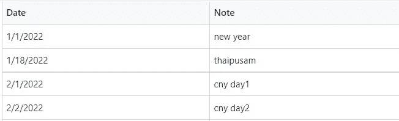
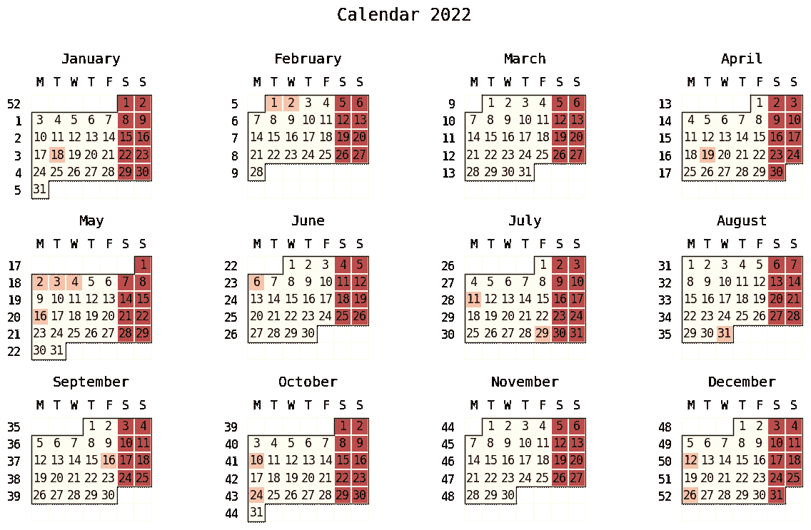
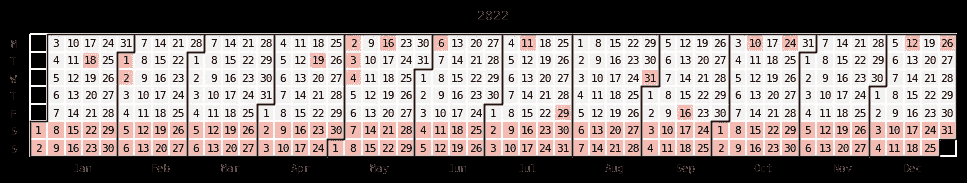

# 使用 python 自动标记日历

> 原文：<https://pub.towardsai.net/automate-your-calendar-marking-ea8b1d99e7d8?source=collection_archive---------2----------------------->

## [编程](https://towardsai.net/p/category/programming)

## 如何使用 python 模块 July 创建自定义日历


[Towfiqu barbhuiya](https://unsplash.com/@towfiqu999999?utm_source=unsplash&utm_medium=referral&utm_content=creditCopyText) 在 [Unsplash](https://unsplash.com/s/photos/calendar?utm_source=unsplash&utm_medium=referral&utm_content=creditCopyText) 上拍照

# **简介**

开始新的一年，我们总是会想出新的决心、假期计划或任何可能到来的重要事件。我们在日历上标出所有特殊的日子来提醒我们这些事情。一些人在应用程序中标记他们的日历，或者一些人仍然把他们的物理日历放在桌子上，为了更好的视觉效果而公开标记。我们找到的日历在周末和一般公共假日可能会有不同的颜色，这取决于你所在的国家或州。

# **为什么要定制？**

就我而言，我所在的国家的公共假期是由各州决定的。如果我能得到一本标有 PH 值的物理日历就好了。在工作场所，我们也倾向于有一个重要事件的“额外”日历，例如，项目相关的，公司事件，甚至我们同事的生日列表。使用 python 模块 July，我们可以自动标记准备打印的自定义日历，以标记特定年份列出的任何重要日期。

# **先决条件**

如果你想生成自己定制的日历，首先你需要的是重要日期的列表。我正在使用我的国家(州)的公共假日列表进行使用 Jupyter 笔记本的演示。你可以在我的 [github](https://github.com/yudhi-chen/custom_calendar) 上找到代码细节，以及一个 CSV 格式的公共假日列表样本。



公共假日列表|作者图片

# **第一步:安装包→导入→读取数据**

我们要用的主模块是[七月](https://github.com/e-hulten/july)。确保在继续下一步之前安装该模块。一旦您成功安装，继续导入软件包。我们还需要熊猫来处理我们的数据。确保在继续下一步之前也调用它。

```
*#!pip install july* import pandas as pd
import july
from july.utils import date_range
```

一旦您成功安装，继续导入软件包。我们还需要`panda`来处理我们的数据。确保在继续下一步之前也调用它。使用 pandas 模块，不要忘记解析列`Date`上的日期。

```
*# Read csv file contain list of public holiday*
df = pd.read_csv('2022_my_ph.csv',parse_dates=['Date'])
df.head(3)
```

# **第二步:处理数据**

这一步的想法是生成全年的日期列表，即。2022，并注意`df`上的重要日期。作为一个典型的日历，另一个标记也是在周末(周六和周日)。因此，我们将有两个不同的标志:公众假期和周末。

`df1`应包括从 1 月 1 日至 12 月 31 日的日期列表，频率如“d”所示，而另一个列表`df1b`应包括如“B”所示的唯一工作日。

> 如果您希望使用不同的时间频率创建另一个数据帧，您可以找到更多信息[偏移别名](https://pandas.pydata.org/docs/user_guide/timeseries.html#offset-aliases)。

```
*# Create list date range in year 2022*
df1 = pd.date_range("2022-01-01","2022-12-31",freq='d')

*# Create list date range in year 2022 ONLY for business day*
df1b = pd.date_range("2022-01-01","2022-12-31",freq='B')
```

下一行，`df2`数据帧创建包含 365 天的零列表集合，我们将在新的数据帧`df3`中集成作为索引日期的`df1`和作为数据`value`的`df2`。

```
*# Create list with value zero (0)*
df2 = [0] * 365*# Create data frame df3*
df3 = pd.DataFrame(data = df2, index = df1, columns = ['value'])
```

在新的数据帧`df3`中，我们将使用索引属性`iloc`在`df1`中列出的特定公共假日日期更新初始`value`(零)。类似的更新也是为了纪念周末。

> **注意:**有否定表达式`~`，因为最初我们有一个营业日列表`df1b`。你可能会认为，如果公共假日是周末(周六和周日)，这种方法会掩盖公共假日。你是对的，这取决于我们如何利用它。

原来如此。我们准备使用数据框`df3`绘制日历。

```
*# Encode the date according to public holiday listed at df*
*# Update value of df3 in which the df3 index = df['Date']*
df3.iloc[df3.index.isin(df['Date'])] = 1

*# Update value of df3 in which the df3 index is not same as df1b.*
*# All weekend, ie. Saturday and Sunday shall be given value '2'*
df3.iloc[~df3.index.isin(df1b)] = 2
```

# **第三步:绘制日历**

我们可以使用模块 July 生成两种日历，我们可以绘制一个典型的日历，也可以绘制另一个版本的日历，就像您在典型的 GitHub 配置文件中看到的那样，表示我们的贡献活动。我个人的偏好，我发现典型的日历对我来说绰绰有余，在公共假日和周末有不同的颜色。

```
*# Calendar plot.* 
july.calendar_plot(df3.index, df3['value'],
                   cmap = 'july',
                   date_label = **True**,
                   figsize = **None**)
```



日历 2022 |作者图片

对于某些应用程序来说，GitHub 风格的日历可能也很合适。同样，这完全取决于我们如何使用它。另外要强调的是，这个模块`July`是在`matplotlib` 模块的基础上制作的。类似的参数调整也可以应用到这段代码中，比如`[cmap](https://matplotlib.org/3.3.1/tutorials/colors/colormaps.html)`你喜欢用什么颜色来标记你的日历。

```
july.heatmap(dates=df3.index, 
             data=df3['value'], 
             cmap='Pastel1_r',
             month_grid=**True**, 
             horizontal=**True**,
             value_label=**False**,
             date_label=**True**,
             weekday_label=**True**,
             month_label=**True**, 
             year_label=**True**,
             colorbar=**False**,
             fontfamily="monospace",
             fontsize=8,
             title=**None**,
             titlesize='large',
             dpi=100)
```



github 风格的日历 2022 |作者图片

# **结论**

在本文中，我们介绍了使用 python 模块`July`自动标记日历的简单代码。我希望提醒你日常活动的任何特殊场合会对你有所帮助。

感谢阅读。随意派生和调整这个 [**Github repo**](https://github.com/yudhi-chen/custom_calendar) 中的代码，以适应您的情况。

# 参考

[1] python 模块[7 月](https://github.com/e-hulten/july)

我喜欢分享数据分析方面的有用知识，看看人们如何从中受益。在 Medium 上关注我，让我知道你是否有任何建设性的意见，以及如何通过评论来改进。你可以通过 [Linkedin](https://www.linkedin.com/in/yudhi-somali-157ab553/) 或者 [Twitter](https://twitter.com/ChenYudhi) 跟我联系。祝你学习努力一切顺利👍！