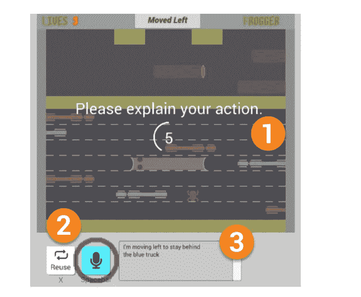
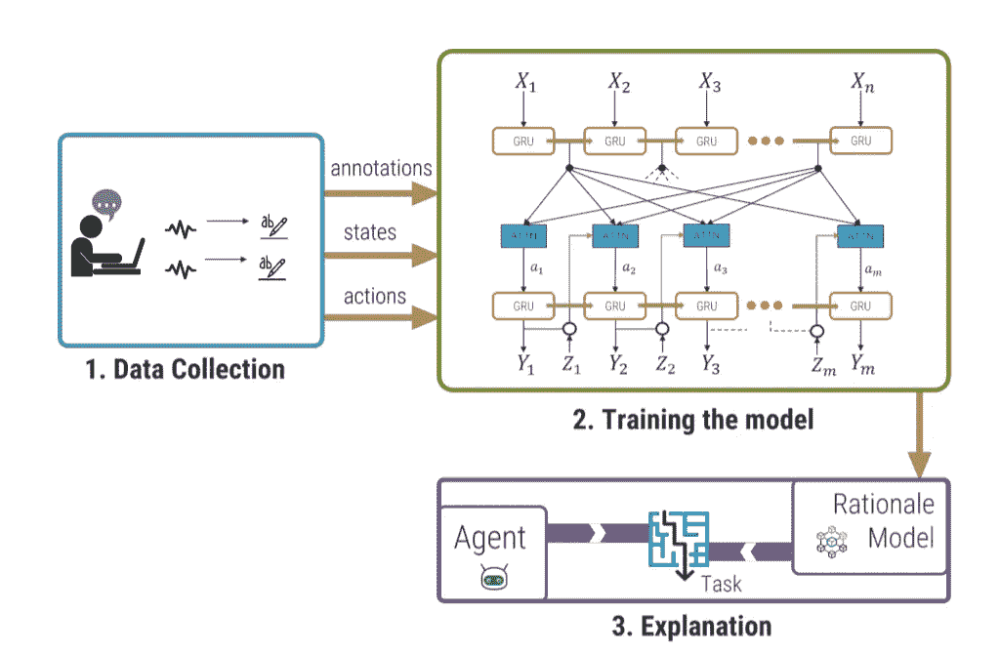
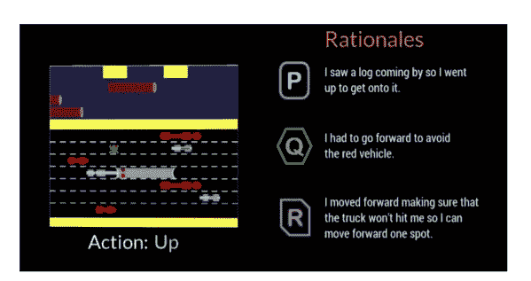
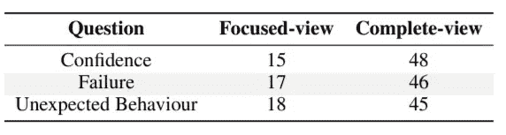

# 自动化原理生成:走向可解释的人工智能

> 原文：<https://pub.towardsai.net/automated-rationale-generation-moving-towards-explainable-ai-1e8a816a4643?source=collection_archive---------3----------------------->

## [人工智能](https://towardsai.net/p/category/artificial-intelligence)

由[本·尼尔](https://unsplash.com/@ben_neale?utm_source=medium&utm_medium=referral)在 [Unsplash](https://unsplash.com?utm_source=medium&utm_medium=referral) 上拍摄

随着人工智能的出现，平行领域**可解释的人工智能(XAI)** 的发展变得势在必行，以培养这些智能系统工作中的信任和人类可解释性。这些解释帮助人类合作者理解导致系统中任何意外行为的环境，并允许操作员做出明智的决定。这篇文章总结了[论文](https://arxiv.org/pdf/1901.03729.pdf)，该论文展示了一种从序列问题中的自主代理生成自然语言实时*基本原理*的方法，并评估了它们的*类人性*。

# 摘要

使用扮演[青蛙过河者](https://en.wikipedia.org/wiki/Frogger)的代理的上下文，解释的语料库被收集并被馈送到神经基本原理生成器以产生基本原理。然后对这些进行研究，以衡量用户对信心、人性等的看法。注意到预期的基本原理和生成的基本原理之间的一致性，用户更喜欢精确描述主体心理模型的详细描述。

# 介绍

*自动基本原理生成*是一个为代理行为生成自然语言解释的过程，就像人类通过描述他们行动的合理动机来执行该行为一样。由于基本原理是自然语言的解释，并不从字面上揭示智能系统的内部工作原理，因此对于非专家来说，它们更容易理解和直观，有利于提高满意度、信心、融洽度和使用自治系统的意愿。

在以前的工作中，已经表明递归神经网络可以用于将内部状态和动作表示翻译成自然语言，同时依赖于合成数据。为了探索是否可以产生类似人类的合理推理，通过远程有声思维方法创建了一个语料库，并用于训练基于[这项工作](https://arxiv.org/abs/1702.07826)的神经网络，以将代理的状态翻译成自然语言推理。此外，还进行了几项研究来确定基本原理和用户偏好的质量。

# 方法

## 数据收集

构建了一个修改版的 Frogger，它在每个动作后要求玩家做出自然的解释，他们可以对着麦克风说话。然后使用语音到文本库来转换和确认玩家在文本中的动作。然后这被部署到 60 个用户的样本中，游戏状态以及用户的解释被捕获。

修改后的应用程序的界面，使玩家能够描述他们的行动。(资料来源——报纸)

## 训练神经模型

然后，编码器-解码器网络用于为任何给定的动作生成相关的自然语言解释。它们都是由门控循环单位(GRU)细胞组成的 rnn。对网络的输入包括串行化为符号序列的游戏环境的状态，其中每个符号表征基于网格的表示中的精灵，以及关于蛙人的位置、最近的动作、剩余生命的数量等的信息。发现当给定有限的观察窗口时，使用表格 Q-学习的强化学习代理有效地玩游戏。因此，使用了两种配置，一种是*聚焦视图*——将观察窗口限制在 7x7 的网格内，另一种是*全视图*——整个观察平台。

如上所述的模型的管道和架构。(资料来源——报纸)

## 感知和偏好研究

在模型经过训练并能够生成基本原理的情况下，如下所示，对解释进行用户感知研究，然后是用户在聚焦视图和完整视图之间的偏好。

由所描述的模型生成解释的样本集。(资料来源——论文)。

对于感知研究，生成的基本原理根据基线随机样本和“范例”基本原理进行评估，后者由研究参与者一致决定。然后，一组 128 名研究人员根据*信心*、*可理解性*、*人性、*和*充分理由*的度量标准，在 5 分制的尺度上对 3 个理由中的每一个进行评估。在研究了这些基本原理的结果后，很明显，研究人员更喜欢生成的基本原理，而不是“随机”基线测量。此外，它表明了对生成的基本原理的强烈偏好，有时甚至超过范例。

三个基本原理:P——随机，Q——样本，R——候选。(资料来源——报纸)

此外，对于偏好评估，研究集中在完整视图和聚焦视图之间的差异。一组 65 名研究人员被要求回答关于这两种观点之间的主要差异、信心、失败和意外行为的问题。这些回答同样被转换成维度，并进行定量分析。它展示了对完整视图的更高程度的信任，用户喜欢代理人的完整精神状态的表示，而不是集中视图的简洁但目光短浅的基本原理。

偏爱各自观点的用户是基于研究的。(资料来源——报纸)

# 结论

因此，这些见解可以帮助我们设计更好的以人为中心的，理性生成的，自主的代理。此外，这种基本原理可以根据上下文进行调整，以生成满足任务需求的样式，无论是简洁的解释(聚焦视图)还是更全面的见解(完整视图)。

> 正如我们的分析所揭示的，语境是王道。

偏好研究显示了为什么细节是必要的，尤其是在需要交流失败的任务中。作为一个新的研究领域，有几个限制可以改进，如用户的内容理性和交互性的能力。此外，这一思想还可以扩展到非离散动作，甚至可以尝试理解系统在更大的状态-动作空间中的可行性。结果是有希望的，肯定的！

# 参考

1.  U Ehsan，P Tambwekar，L Chan，B Harrison，M Riedl。**自动基本原理生成:一种可解释人工智能的技术及其对人类感知的影响**。【2019 年 1 月。