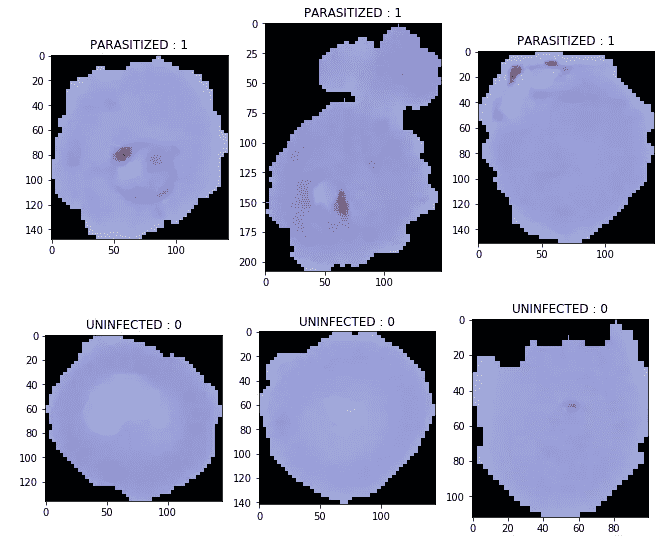
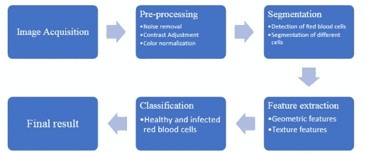
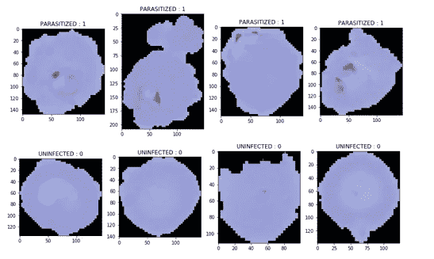
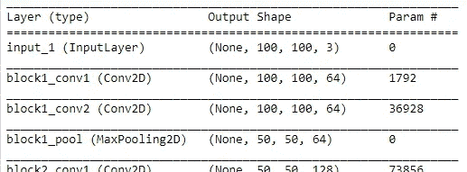
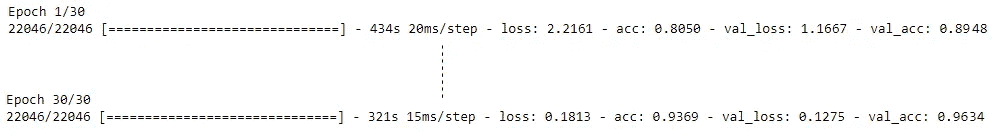
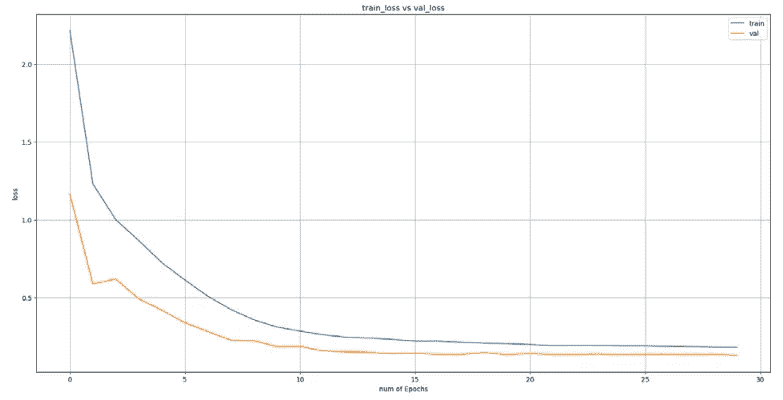
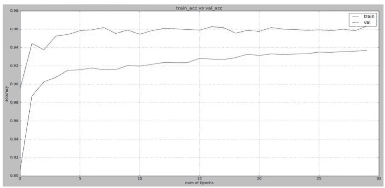
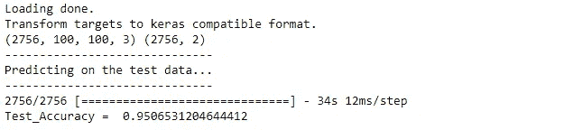
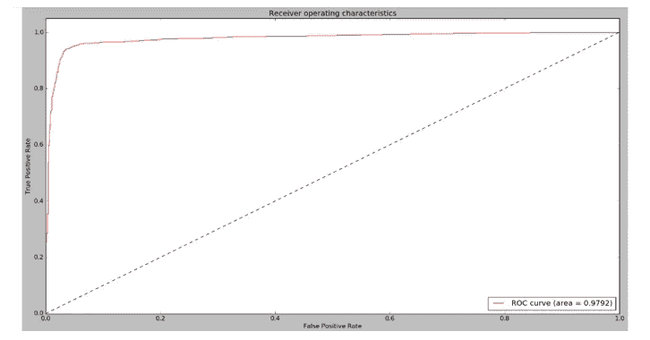
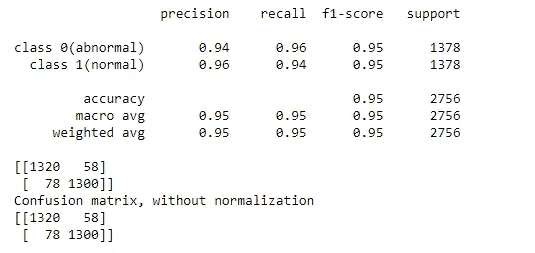

# 基于神经网络的疟疾自动检测

> 原文：<https://pub.towardsai.net/automatic-malaria-detection-using-neural-network-55d5d58341c2?source=collection_archive---------0----------------------->

## [深度学习](https://towardsai.net/p/category/machine-learning/deep-learning)

## 具有图像处理技术的深度学习项目



作者的照片

> **简介 **

在这项工作中，建立了一个自动系统，它包括三个部分，即预处理，分割和分类。

预处理部分包括改变色彩空间、降噪、去除不想要的对象:这使用了灰度转换、形态学操作和过滤。

分割部分包括分离红细胞并将其保存到其他位置:这部分包括应用各种技术，如 Otsu 阈值处理和距离变换。

最后，在分类部分，识别细胞是健康的还是寄生的。预训练的卷积神经网络模型 VGG16 用于分类任务。

“Mal' aria”是一个意大利词，意思是“糟糕的空气”，疟疾一词由此而来。它是由受感染的雌性按蚊叮咬引起的，其中含有疟原虫属的原生动物寄生虫。

主要有四种类型的疟原虫感染人体:恶性疟原虫、间日疟原虫、卵形疟原虫和三日疟原虫。

感染疟疾的病人的体征和症状是发热、发冷、出汗、头痛、恶心和呕吐、全身疼痛和全身不适。

> ***疟疾的各种诊断方法***

*   **厚血涂片和薄血涂片:**诊断需要在载玻片上制备两份血涂片，一份厚涂片和一份薄涂片。它包括使用染色来增强显微镜下细胞或特定细胞成分的可视性。
*   **快速诊断测试(抗原测试):**在显微镜检查不可用的情况下，RDT 用于诊断疟疾，而不是血涂片。它也被称为“量油尺”测试。从人体的手指棒上取一滴血，通过改变测试条的颜色来指示阳性测试结果。疟疾抗原在这项测试中被检测出来。
*   **分子测试(聚合酶链式反应，PCR):**PCR 是一种实验室测试方法，可扩增寄生虫的 DNA，并检测和鉴定引起感染的疟原虫种类。
*   **抗体检测(血清学):**检测患者血液中存在的抗体，抗体由身体对疟疾感染的反应产生。这种测试不能诊断严重感染，但有助于确定一个人以前是否感染过疟疾。

> ***CAD 用于疟疾诊断***

计算机辅助诊断系统是一类使用计算机视觉技术的计算机系统，旨在帮助诊断血液涂片图像中的疟原虫。

## **用于疟疾诊断的 CADx 阶段**



作者的照片

图像预处理及其技术包括颜色转换、调整大小和裁剪、数据扩充、归一化、去噪、去除和过滤。

## 分割

图像分割是计算机视觉中的一个审查过程，因为它涉及将视觉输入分割成片段(表示对象或对象的一部分，并理解像素集或“超像素”)以解开图像分析。

*   语义分割:它包括检测图像中的对象，并根据定义的类别排列检测到的对象。
*   实例分割:它包括检测定义类别中的对象，这在语义分割之后又进了一步。

## 分类

识别给定数据点类别的过程。这些类许多项目被称为目标/标签或类别。它属于监督学习，其中在数据集中提供类。

*   **:懒惰学习者:**存储训练数据，等待分类时出现测试数据，当出现测试数据时，根据存储的训练数据中的相关数据进行分类。它的训练时间较少，但预测时间较长。
*   **渴望学习者:**该学习者基于训练数据构建分类模型。由于急切的学习者，模型需要更多的时间。

[](/hyper-parameters-randomseachcv-and-gridsearchcv-in-machine-learning-b7d091cf56f4) [## 超参数:机器学习中的 RandomSeachCV 和 GridSearchCV

### 提高算法精确度的技术

pub.towardsai.net](/hyper-parameters-randomseachcv-and-gridsearchcv-in-machine-learning-b7d091cf56f4) [](/understand-cnn-basics-with-a-keras-example-in-python-c1fd6c449935) [## 通过 Python 中的 Keras 示例了解 CNN 基础知识

### 用于图像过程分析的深度神经网络算法

pub.towardsai.net](/understand-cnn-basics-with-a-keras-example-in-python-c1fd6c449935) 

> ***项目的数据集***

*   未受影响的图像总数:27558
*   受影响的图像总数:27558



作者的照片

> ***项目的 Python 代码***

## 导入库

```
# load libraries
import cv2
import numpy as np
import os
from keras.utils import np_utils
import matplotlib.pyplot as plt
import itertools
import time
from keras.models import Sequential
from keras.models import Model
from keras import applications
from keras.callbacks import ModelCheckpoint, TensorBoard
from keras.layers import Conv2D, Activation, Dense, MaxPooling2D, Flatten, Dropout, GlobalAveragePooling2D
from sklearn.metrics import log_loss
from sklearn.utils import class_weight
from keras.optimizers import SGD
from sklearn.metrics import roc_curve, auc
from sklearn.metrics import classification_report,confusion_matrix, accuracy_score
import matplotlib.pyplot as plt
from sklearn.metrics import average_precision_score
%matplotlib inline
```

## 读取图像并将其定义到训练和测试集

```
#define data directories
train_data_dir = r'C:\cell_images\training_images' 
valid_data_dir = r'C:\cell_images\validation_images'
test_data_dir = r'C:\cell_images\testing_images'#loading number of images to train, test, and valid set
nb_train_samples = 22046 
nb_valid_samples = 2756 
nb_test_samples = 2756 # binary classification
num_classes = 2 
img_rows_orig = 100 
img_cols_orig = 100
```

## 制作加载图像的函数

```
def load_training_data():
    labels = os.listdir(train_data_dir)
    total = len(labels)
    X_train = np.ndarray((nb_train_samples, img_rows_orig, img_cols_orig, 3), dtype=np.uint8)
    Y_train = np.zeros((nb_train_samples,), dtype='uint8')
    i = 0
    print('-'*30)
    print('Creating training images...')
    print('-'*30)
    j = 0
    for label in labels:
        image_names_train = os.listdir(os.path.join(train_data_dir, label))
        total = len(image_names_train)
        print(label, total)
        for image_name in image_names_train:
            img = cv2.imread(os.path.join(train_data_dir, label, image_name), cv2.IMREAD_COLOR)
            img = cv2.resize(img, (100, 100))
            img = np.array([img])
            X_train[i] = img
            Y_train[i] = j
            if i % 100 == 0:
                print('Done: {0}/{1} images'.format(i, total))
            i += 1
        j += 1    
    print(i)                
    print('Loading done.')
    print('Transform targets to keras compatible format.')
    Y_train = np_utils.to_categorical(Y_train[:nb_train_samples], num_classes)
    np.save('imgs_train.npy', X_train, Y_train) 
    return X_train, Y_train

def load_validation_data():
    # Load validation images
    labels = os.listdir(valid_data_dir)
    X_valid = np.ndarray((nb_valid_samples, img_rows_orig, img_cols_orig, 3), dtype=np.uint8)
    Y_valid = np.zeros((nb_valid_samples,), dtype='uint8')
    i = 0
    print('-'*30)
    print('Creating validation images...')
    print('-'*30)
    j = 0
    for label in labels:
        image_names_valid = os.listdir(os.path.join(valid_data_dir, label))
        total = len(image_names_valid)
        print(label, total)
        for image_name in image_names_valid:
            '''img = cv2.imread(os.path.join(valid_data_dir, label,
                      image_name), cv2.IMREAD_COLOR)
            img = cv2.resize(img, (100, 100))
            img = np.array([img])'''
            try:
               # path=os.path.join(mypath,n)
                img=cv2.imread(os.path.join(valid_data_dir, label, image_name), cv2.IMREAD_COLOR)
                img=cv2.resize(img, (100,100))
                img = np.array([img])    
                X_valid[i] = img
                Y_valid[i] = j
                if i % 100 == 0:
                    print('Done: {0}/{1} images'.format(i, total))except Exception as e:
                print(str(e))

            i += 1
        j += 1     

    print(i)            
    print('Loading done.')
    print('Transform targets to keras compatible format.');
    Y_valid = np_utils.to_categorical(Y_valid[:nb_valid_samples],
                            num_classes)
    return X_valid, Y_validdef load_test_data():
    labels = os.listdir(test_data_dir)
    Y_test = np.zeros((nb_test_samples,), dtype='uint8')
    i = 0
    print('-'*30)
    print('Creating test images...')
    print('-'*30)
    j = 0
    for label in labels:
        image_names_test = os.listdir(os.path.join(test_data_dir, label))
        total = len(image_names_test)
        print(label, total)
        for image_name in image_names_test:
            img = cv2.imread(os.path.join(test_data_dir, label, image_name), cv2.IMREAD_COLOR)
            img = cv2.resize(img, (100, 100))
            img = np.array([img])
            X_test[i] = img
            Y_test[i] = j
            if i % 100 == 0:
                print('Done: {0}/{1} images'.format(i, total))
            i += 1
        j += 1
    print(i)            
    print('Loading done.')
    print('Transform targets to keras compatible format.');
    Y_test = np_utils.to_categorical(Y_test[:nb_test_samples], num_classes)
    np.save('imgs_test.npy', X_test, Y_test) 
    return X_test, Y_test
```

[](/understand-optimizers-in-deep-learning-694f4f0eb048) [## 理解深度学习中的优化器

### 优化器是机器学习的典范

pub.towardsai.net](/understand-optimizers-in-deep-learning-694f4f0eb048) 

## 调整图像大小

```
def load_resized_training_data(img_rows, img_cols):X_train, Y_train = load_training_data()
    X_train = np.array([cv2.resize(img, (img_rows,img_cols)) for img in X_train[:nb_train_samples,:,:,:]])

    return X_train, Y_train

def load_resized_validation_data(img_rows, img_cols):X_valid, Y_valid = load_validation_data()
    X_valid = np.array([cv2.resize(img, (img_rows,img_cols)) for img in X_valid[:nb_valid_samples,:,:,:]])

    return X_valid, Y_validdef load_resized_test_data(img_rows, img_cols):X_test, Y_test = load_test_data()
    X_test = np.array([cv2.resize(img, (img_rows,img_cols)) for img in X_test[:nb_test_samples,:,:,:]])

    return X_test, Y_test
```

## 绘制混淆矩阵的函数

```
def plot_confusion_matrix(cm, classes,
                          normalize=False, 
                          title='Confusion matrix',
                          cmap=plt.cm.Blues):
    plt.imshow(cm, interpolation='nearest', cmap=cmap)
    plt.title(title)
    plt.colorbar()
    tick_marks = np.arange(len(classes))
    plt.xticks(tick_marks, classes, rotation=45)
    plt.yticks(tick_marks, classes)if normalize:
        cm = cm.astype('float') / cm.sum(axis=1)[:, np.newaxis]
        print("Normalized confusion matrix")
    else:
        print('Confusion matrix, without normalization')print(cm)
    thresh = cm.max() / 2.
    for i, j in itertools.product(range(cm.shape[0]), range(cm.shape[1])):
        plt.text(j, i, cm[i, j],
                 horizontalalignment="center",

    plt.tight_layout()
    plt.ylabel('True label')
    plt.xlabel('Predicted label')
```

## 将数据分为训练、测试和有效

```
img_rows=100 
img_cols=100
channel = 3 #RGB
num_classes = 2 
batch_size = 32 
num_epoch = 30 #load data
X_train, Y_train = load_resized_training_data(img_rows, img_cols)
X_valid, Y_valid = load_resized_validation_data(img_rows, img_cols)
X_test, Y_test = load_resized_test_data(img_rows, img_cols)
```

## 使用预训练的 VGG16 模型

```
base_model = applications.VGG16(weights='imagenet', include_top=False, input_shape=(img_rows, img_cols, channel))#extract feature from the optimal layer for your data
base_model = Model(input=base_model.input, output=base_model.get_layer('block5_conv2').output)#get the model summary
base_model.summary()
```



作者的照片

```
x = base_model.output
x = GlobalAveragePooling2D()(x)
x = Dense(1024, activation='relu')(x)
x = Dropout(0.5)(x)
predictions = Dense(num_classes, activation='softmax', name='predictions')(x)#we will train this model
model = Model(inputs=base_model.input, outputs=predictions)#freezing layers for large gradient and training top layer
for layer in base_model.layers:
    layer.trainable = False#fix the optimizer
sgd = SGD(lr=0.00001, decay=1e-6, momentum=0.9, nesterov=True)#compile the model
model.compile(optimizer=sgd,
              loss='categorical_crossentropy',
              metrics=['accuracy'])
```

## 训练模型

```
filepath = 'C:\\weights\\weight' + model.name + '.{epoch:02d}-{val_acc:.4f}.hdf5'
checkpoint = ModelCheckpoint(filepath, monitor='val_acc', verbose=1, 
                             save_weights_only=True, save_best_only=True, mode='max', period=1)
tensor_board = TensorBoard(log_dir='logs/', histogram_freq=0, batch_size=batch_size)
callbacks_list = [checkpoint, tensor_board]#compute training time
t=time.time()
hist = model.fit(X_train, Y_train, batch_size=batch_size, 
                 callbacks=callbacks_list,
                 epochs=num_epoch, verbose=1, 
                 shuffle=True, validation_data=[X_valid, Y_valid])#compute the training time
print('Training time: %s' % (time.time()-t))
```



作者的照片

## 训练损失和验证损失

```
train_loss=hist.history['loss']
val_loss=hist.history['val_loss']
train_acc=hist.history['acc']
val_acc=hist.history['val_acc']
xc=range(num_epoch)plt.figure(1,figsize=(20,10), dpi=100)
plt.plot(xc,train_loss)
plt.plot(xc,val_loss)
plt.xlabel('num of Epochs')
plt.ylabel('loss')
plt.title('train_loss vs val_loss')
plt.grid(True)
plt.legend(['train','val'])
plt.style.use(['classic'])plt.figure(2,figsize=(20,10), dpi=100)
plt.plot(xc,train_acc)
plt.plot(xc,val_acc)
plt.xlabel('num of Epochs')
plt.ylabel('accuracy')
plt.title('train_acc vs val_acc')
plt.grid(True)
plt.legend(['train','val'])
plt.style.use(['classic'])
```



作者的照片

## 训练准确性和验证准确性

模型经过 30 个历元后的训练准确率为 96.335%，模型训练所用时间为 9746.627 秒。该模型在作为原始数据集一部分的测试数据集上的测试精度是 0.95065，并且测试在 34 秒内完成。



作者的照片

## 根据测试数据进行预测

```
 X_test, Y_test = load_resized_test_data(img_rows, img_cols)
print(X_test.shape, Y_test.shape)
print(‘-’*30)
print(‘Predicting on the test data…’)
print(‘-’*30)
y_pred = model.predict(X_test, batch_size=batch_size, verbose=1)# compute the accuracy
Test_accuracy = accuracy_score(Y_test.argmax(axis=-1),y_pred.argmax(axis=-1))
print(“Test_Accuracy = “,Test_accuracy)
```



作者的照片

## 受试者工作特征曲线

```
#compute the ROC-AUC values
fpr = dict()
tpr = dict()
roc_auc = dict()
for i in range(num_classes):
    fpr[i], tpr[i], _ = roc_curve(Y_test[:, i], y_pred[:, i])
    roc_auc[i] = auc(fpr[i], tpr[i])

# ROC curve and ROC area
fpr["micro"], tpr["micro"], _ = roc_curve(Y_test.ravel(), y_pred.ravel())
roc_auc["micro"] = auc(fpr["micro"], tpr["micro"])#Plot ROC curves
plt.figure(figsize=(20,10), dpi=100)
lw = 1
plt.plot(fpr[1], tpr[1], color='red',
         lw=lw, label='ROC curve (area = %0.4f)' % roc_auc[1])
plt.plot([0, 1], [0, 1], color='black', lw=lw, linestyle='--')
plt.xlim([0.0, 1.0])
plt.ylim([0.0, 1.05])
plt.xlabel('False Positive Rate')
plt.ylabel('True Positive Rate')
plt.title('Receiver operating characteristics')
plt.legend(loc="lower right")
plt.show()# computhe the cross-entropy loss score
score = log_loss(Y_test,y_pred)
print(score)# compute the average precision score
prec_score = average_precision_score(Y_test,y_pred)  
print(prec_score)# transfer it back
y_pred = np.argmax(y_pred, axis=1)
Y_test = np.argmax(Y_test, axis=1)
print(y_pred)
print(Y_test)#save the predictions as a CSV file for further analysis
np.savetxt('vgg16_model_y_pred.csv',y_pred,fmt='%i',delimiter = ",")
np.savetxt('vgg16_model_Y_test.csv',Y_test,fmt='%i',delimiter = ",")
```



作者的照片

## 分类报告和混淆矩阵

```
target_names = ['class 0(abnormal)', 'class 1(normal)'] #decide the labels for your own data
print(classification_report(Y_test,y_pred,target_names=target_names))
print(confusion_matrix(Y_test,y_pred))
cnf_matrix = (confusion_matrix(Y_test,y_pred))
np.set_printoptions(precision=4)# Plot non-normalized confusion matrix
plt.figure(figsize=(20,10), dpi=100)
plot_confusion_matrix(cnf_matrix, classes=target_names,
                  title='Confusion matrix')
plt.show()
```



作者的照片

## 结论

这里使用图像处理技术进行预处理和分割。VGG-16 模型在 30 个时期后的训练精度是 96.335%，训练所用的时间是 9746.627 秒，而在作为原始数据集一部分的测试数据集上的测试精度是 0.95065，测试在 34 秒内完成。

我希望你喜欢这篇文章。通过我的 [LinkedIn](https://www.linkedin.com/in/data-scientist-95040a1ab/) 和 [twitter](https://twitter.com/amitprius) 联系我。

# 推荐文章

[1。NLP —零到英雄与 Python](https://medium.com/towards-artificial-intelligence/nlp-zero-to-hero-with-python-2df6fcebff6e?sk=2231d868766e96b13d1e9d7db6064df1)
2。 [NumPy:图像上的线性代数](/numpy-linear-algebra-on-images-ed3180978cdb?source=friends_link&sk=d9afa4a1206971f9b1f64862f6291ac0)3。[Python 中的异常处理概念](/exception-handling-concepts-in-python-4d5116decac3?source=friends_link&sk=a0ed49d9fdeaa67925eac34ecb55ea30)
4。[用 Python 进行主成分分析降维](/principal-component-analysis-in-dimensionality-reduction-with-python-1a613006d531?source=friends_link&sk=3ed0671fdc04ba395dd36478bcea8a55)
5。[用 Python 全面讲解 K-means 聚类](https://medium.com/towards-artificial-intelligence/fully-explained-k-means-clustering-with-python-e7caa573176a?source=friends_link&sk=9c5c613ceb10f2d203712634f3b6fb28)
6。[用 Python](https://medium.com/towards-artificial-intelligence/fully-explained-linear-regression-with-python-fe2b313f32f3?source=friends_link&sk=53c91a2a51347ec2d93f8222c0e06402)
7 全面讲解了线性回归。[用 Python](https://medium.com/towards-artificial-intelligence/fully-explained-logistic-regression-with-python-f4a16413ddcd?source=friends_link&sk=528181f15a44e48ea38fdd9579241a78)
充分解释了 Logistic 回归 8。[concat()、merge()和 join()与 Python](/differences-between-concat-merge-and-join-with-python-1a6541abc08d?source=friends_link&sk=3b37b694fb90db16275059ea752fc16a)
的区别 9。[与 Python 的数据角力—第一部分](/data-wrangling-with-python-part-1-969e3cc81d69?source=friends_link&sk=9c3649cf20f31a5c9ead51c50c89ba0b)
10。[机器学习中的混淆矩阵](https://medium.com/analytics-vidhya/confusion-matrix-in-machine-learning-91b6e2b3f9af?source=friends_link&sk=11c6531da0bab7b504d518d02746d4cc)