# StackOverflow 问题的自动主持人

> 原文：<https://pub.towardsai.net/automatic-moderator-for-stackoverflow-questions-707cef5fe656?source=collection_archive---------2----------------------->

## [自然语言处理](https://towardsai.net/p/category/nlp)，[编程](https://towardsai.net/p/category/programming)

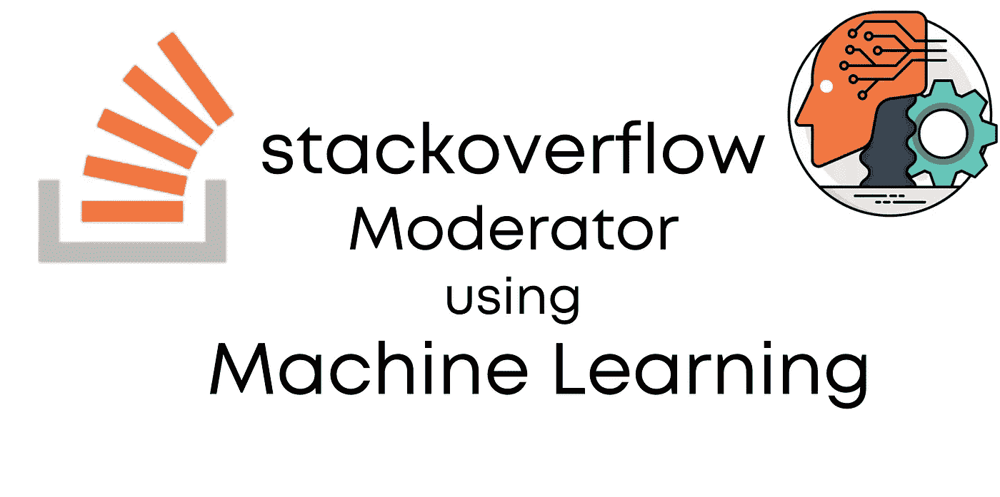

> 在本文中，我们将尝试建立一个机器学习模型，该模型将自动预测人所提问题的质量，并相应地为其分配标签。

如果你是机器学习新手，还可以。我会试着用初学者友好的语言详细阐述每一步。这是一个展示你的技能的伟大项目，因为我已经使用了大多数任务的图书馆，这将是你很容易向别人解释这项工作。

由于问题是由语言(单词/句子)组成的，所以是自然语言处理( **NLP** )问题。NLP 只是处理人类语言(语音/文本)的人工智能的一部分。Google translator 是 NLP 最好的例子之一。

现在，我们清楚了 NLP 和我们的问题陈述，让我们直接跳到编码部分😎。

# 使用的数据集:-

我已经使用了数据集“ [60k 栈溢出问题与质量评级](https://www.kaggle.com/imoore/60k-stack-overflow-questions-with-quality-rate)”，该数据集在 **Kaggle** 上可用。质量分为三类:-

*   **LQ _ 关闭** =被社区关闭的低质量帖子
*   **LQ _ 编辑** =低质量的帖子在经过一些修改后仍然开放。
*   **总部** =总分 30+的优质岗位

但是那里的数据集分为训练和测试。如果你想要一个单独的 CSV 文件，你可以在我的[**GitHub**](https://github.com/PushkaraSharma/articles_codes/tree/master/StackOverflow%20Moderator)**repo 中得到。**

# **先决条件:-**

**我假设您熟悉 ***python*** ，并且已经在您的系统中安装了 ***python 3*** 。这个教程我用了一个 ***jupyter 笔记本*** 。你可以使用你喜欢的 **IDE** 。**

# **安装所需的库**

**对于这个项目，您需要在 python 中安装以下包。如果没有安装，可以直接使用`pip install PackageName`。尽管这些库大多内置于 anaconda 套件中。**

*   ****熊猫**——用于数据分析和数据操作**
*   ****matplotlib** —用于创建基本图**
*   ****seaborn**——用于创造更吸引人的情节**
*   ****re** (正则表达式)—用于检查匹配的字符串**
*   ****nltk** —用于执行自然语言处理任务。**
*   ****sklearn** —用于拆分和矢量化数据(这就是我们所使用的)**
*   ****xgboost** —集成机器学习算法**

# **开始编码吧！**

**在这里，首先我们必须导入我们将使用的所有库。熊猫将被用来操作我们的数据集。Matplotlib 将帮助我们创建简单的图表，如条形图。Seaborn 会创造一些高级好看的剧情。 ***re*** (正则表达式)用于删除问题中不想要的文本。 **nltk** (自然语言工具包)这里只用来获取停用词(像`is,the,of`这样对我们的模型没有贡献的词)。这里的最后一行用于下载**停用词**。**

```
import pandas as pd
import matplotlib.pyplot as plt
import seaborn as sns
import re
import nltk
nltk.download('stopwords')
```

**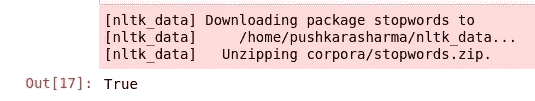**

**现在，我们已经通过加载数据集简单地创建了数据帧`df`。作为一个好的实践，我们打印出的数据帧的形状是 **(60000，7)** 。然后我们打印了数据帧的前 5 行。**

```
df = pd.read_csv("data.csv")
print(df.shape)df.head()
```

**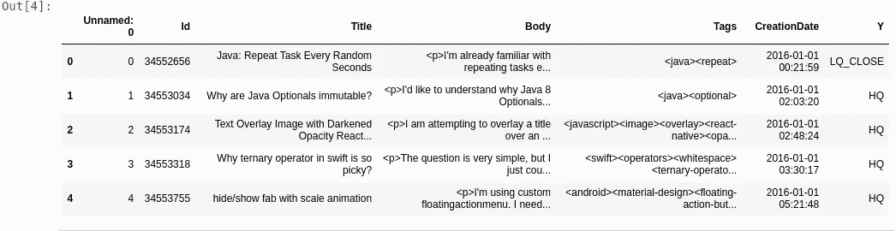**

**数据帧中有 **7** 列，但我们只对**标题**、**正文、**和 **y** (标签)感兴趣。因此，我们简单地删除了分类任务不需要的列。**

```
df = df.drop(['Id','Tags','CreationDate','Unnamed: 0'],axis=1)
df.head()
```

**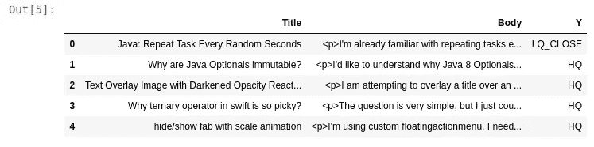**

**现在，我们想对我们的数据进行一些探索性分析。因此，我们提取了标题、正文中的字数，以及两者的总字数。然后，我们打印了我们的数据框架，正如你从下面的截图中看到的。**

```
#Number Of words in Selected Text
df['Num_words_body'] = df['Body'].apply(lambda x:len(str(x).split()))
#Number Of words in main text
df['Num_words_title'] = df['Title'].apply(lambda x:len(str(x).split())) 
#Total  Number of words text and Selected Text
df['Total_words'] = abs(df['Num_words_body'] + df['Num_words_title'])df.head()
```

**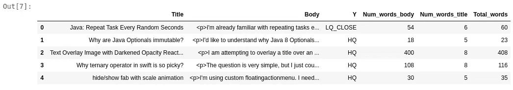**

**可视化在分析中非常重要。在这里，首先我们定义我们的数字的大小。然后我们为`Num_words_body`和`Num_words_title`定义 KDE 图(核密度估计)。Kdeplot 用于可视化连续变量的概率密度。最后用`plt.xlim`设置 x 轴的 x 极限，即 **300****

**这里的情节暗示了两件事。首先，与正文相比，标题的长度很短(这是显而易见的),其次，标题的密度显示大多数标题大约有 10 个单词，正文的密度显示大多数正文大约有 50 个单词。**

```
plt.figure(figsize=(12,6))
p = sns.kdeplot(df['Num_words_body'],shade=True).set_title('Distribution of Body text')
p = sns.kdeplot(df['Num_words_title'],shade=True).set_title('Distribution of Body text')
plt.xlim(0,300)
```

**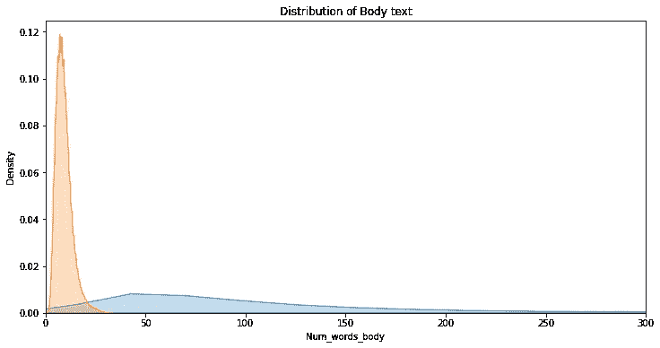**

**现在，让我们看看基于类别的总字数分布，即 **HQ** 、 **LQ_CLOSE** 、 **LQ_EDIT** 。这里，我们也使用了相同的 kdeplot 来做同样的事情。正如我们从下图中看到的，每个类别的分布看起来几乎相似，大多数问题的总长度一般在 80-90 个单词左右。**

```
plt.figure(figsize=(12,6))
p1=sns.kdeplot(df[df['Y']=='HQ']['Total_words'], shade=True,).set_title('Distribution of Total No.Of words Per Category')
p2=sns.kdeplot(df[df['Y']=='LQ_CLOSE']['Total_words'], shade=True)
p2=sns.kdeplot(df[df['Y']=='LQ_EDIT']['Total_words'], shade=True)
plt.legend(labels=['HQ','LQ_CLOSE','LQ_EDIT'])
plt.xlim(-20,500)
```

**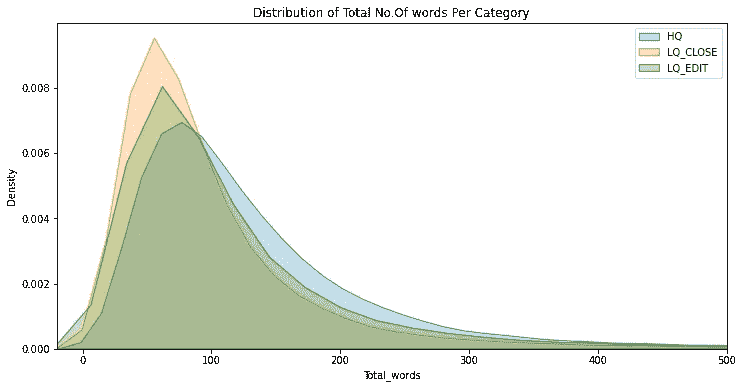**

**现在我们将把目标标签转换成数值。虽然有各种各样的技术可以做到这一点，如一个热点编码和标签编码，但因为只有 3 个类别(LQ _ 关闭，LQ _ 编辑，总部)，我们可以简单地使用`map`函数来完成这项任务。你可以在下面的截图中看到 Y 列的值变成了数字。**

```
df['Y'] = df['Y'].map({'LQ_CLOSE':0,'LQ_EDIT':1,'HQ':2})
df.head()
```

**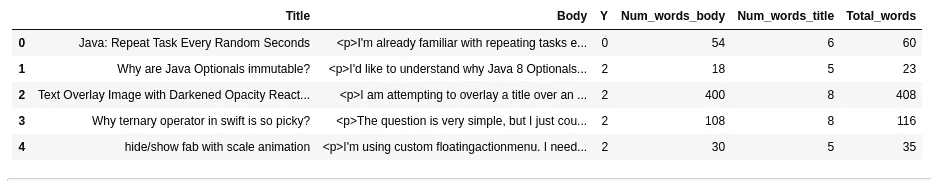**

**现在，让我们检查在我们的数据帧中是否有任何空值或条目。在空值产生任何问题之前检查它们是一种好的做法。我们应该在早期阶段执行这项任务。**

```
df.isnull().sum()
```

**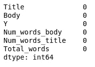**

**现在，我们将绘制条形图，显示每个标签的问题数量。我们在这里使用了`matplotlib.pyplot`,结果发现每个类别的问题数量相等，即 **20000****

```
values = [len(df[df['Y']==0]),len(df[df['Y']==1]),len(df[df['Y']==2])]
plt.bar(['LQ_CLOSE','LQ_EDIT','HQ'],values)
plt.show()
```

**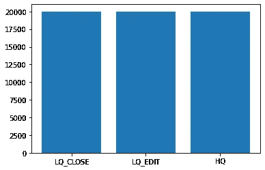**

**这里，我们将标题和正文合并在一个名为`All_text`的列中。之后，我们删除标题和正文列。**

```
df['All_text'] = df['Title']+' '+df['Body']
new_df = df.copy()
new_df = new_df.drop(['Title','Body'],axis=1)
new_df.head()
```

**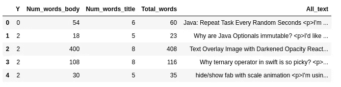**

**我们存储了英语**停用词**(即`of` `the` `to`等。)在`stop_words`变量中。之后，我们定义了函数`data_cleaning`，它接受一个字符串(问题)作为参数。在函数中，我们首先将数据转换成小写，然后删除除字母以外的任何字符。之后，数据被拆分并存储在一个名为`data`的列表中。然后我们从列表中移除停用词，并使用 **join** 将其转换回字符串。最后，我们返回清理后的数据字符串。**

```
from nltk.corpus import stopwordsstop_words = stopwords.words('english')def data_cleaning(data):
    data = data.lower()
    data = re.sub(r'[^(a-zA-Z)\s]','',data)
    data = data.split()
    temp = []
    for i in data:
        if i not in stop_words:
            temp.append(i)
    data = ' '.join(temp)
    return data
```

**这里，我们刚刚将`data_cleaning`函数应用于`All_text`的所有值。**

```
new_df['All_text'] = new_df['All_text'].apply(data_cleaning)
new_df['All_text']
```

**我们从`sklearn.model_selection`导入了`train_test_split`，以 5:1 的比例将我们的数据分成训练集和测试集。正如您在下面的截图中看到的，培训数据由 **48，000 个**问题组成，测试数据由 **12，000 个**问题组成。**

```
from sklearn.model_selection import train_test_splitx_train,x_test,y_train,y_test = train_test_split(new_df['All_text'],new_df['Y'],test_size=0.20)
print("X_train Size : ",x_train.size," Y_train Size : ",y_train.size)
print("X_test Size : ",x_test.size," Y_test Size : ",y_test.size)
```

**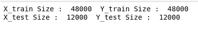**

**现在，我们将矢量化我们的数据。**向量化**是将单词或短语转换成相应的实数向量的过程，用于查找单词预测。为此，我们使用了代表“*术语频率—反向文档*”频率的`TfidfVectorizer`，它是分配给每个单词的结果分数的组成部分。**

*   ****词频**:总结给定单词在文档中出现的频率。**
*   ****逆文档频率**:这将缩小文档中大量出现的单词。**

**不涉及数学， **TF-IDF** 是词频分数，试图突出更有趣的词，例如，在一个文档中频繁出现但不跨文档出现。**

**看这个[回答](https://www.quora.com/How-does-TfidfVectorizer-work-in-laymans-terms)了解更多关于 TfidfVectorizer 的内容。**

```
from sklearn.feature_extraction.text import TfidfVectorizer
vec = TfidfVectorizer()
x_train = vec.fit_transform(x_train)
x_test = vec.transform(x_test)
```

**现在是我们训练模型的时候了。为此，我使用了 **xgboost** 。Xgboost (Xtreme Gradient Boost)是一种基于决策树的机器学习算法，它也使用了**梯度增强**技术。这是最好的快速算法之一，在处理非结构化数据(图像/文本)时表现良好。但是这还不足以理解这个算法的内部工作原理。为此，你必须理解像**装袋**、**助推**、**决策树**这样的概念。所以，读完这篇文章后，我会建议你谷歌一下关于 xgboost 的更多信息。**

```
from xgboost import XGBClassifier
xgb = XGBClassifier()
xgb.fit(x_train,y_train)
```

**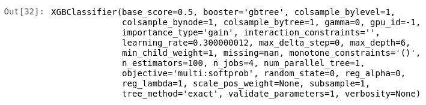**

**我们的模型已经训练好了，现在是时候进行预测并检查我们模型的**准确性**了。这里，我们简单地使用了`xgboost`提供的`predict()`函数来进行预测，并将它们存储在名为`predictions`的变量中。为了检查开发模型的性能，我们使用了`accuracy_score`来计算正确预测的 **%** 。(我们使用这个性能矩阵是因为我们有一个平衡的数据集)。我们模型的准确率是 **87.56%** 。**

```
from sklearn.metrics import accuracy_score,plot_confusion_matrix
predictions = xgb.predict(x_test)
acc = accuracy_score(predictions,y_test)
acc
```

**为了获得更多关于我们模型的信息以及它的预测哪里出错了，我们可以绘制出**混淆矩阵**。从图中可以看出，标签**1**(LQ _ 编辑)几乎是正确的，只有 **8** 的预测是错误的。对于标签 **0** 、 **2** (LQ_CLOSE，HQ)分别有 **686** 和 **764** 个错误预测。**

```
plot_confusion_matrix(xgb,x_test,y_test)
```

****

# **预言；预测；预告**

**现在让我们预测一下用户提出的一个问题的质量标签。这里我们有问题的标题和主体，对其质量进行预测。**

****注** :-我已经切掉了身体的实际长度，全身用于预测，可以在 Github 上传的一个笔记本里找到。**

```
title = "Pod install displaying error in cocoapods version 1.0.0.beta.1"
body = """<p>My podfile was working but after updating to cocoapods version 1.0.0.beta.1</p>\n\n<p>pod install displays following error</p>\n\n<pre><code>MacBook-Pro:iOS-TuneIn home$ pod install\nFully deintegrating due to major version update\nDeleted 1 'Copy Pods Resources' build phases.\nDeleted 1 'Check Pods Manifest.lock' build phases....""" 
```

**在这里，我们只需遵循我们之前讨论过的相同过程。标题和正文合并在一起，使用`data_cleaning`功能清理文本。执行矢量化，然后进行预测。这个问题的实际类别是 **HQ** ，预测类别是 2(对应于 **HQ** )。**

```
All_text_testing = title+" "+body
All_text_testing = data_cleaning(All_text_testing)
All_text_testing_vector = vec.transform([All_text_testing])
prediction = xgb.predict(All_text_testing_vector)
prediction
```

**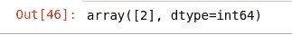**

**预测类别**

# **结论**

**因此，我们成功开发了预测 StackOverflow 问题质量的机器学习模型，准确率为 **87.5%****

# **未来的工作**

**仍然有一些方法可以改进模型的性能。其中一些是**

*   **使用一些先进的深度学习算法，如 **RNN** 、**伯特**(因为我们有一个大数据集，深度学习算法可能会表现很好)**
*   **使用更先进的数据清理流程。这里我们忽略了可能有助于提高整体性能的数字数据**
*   **使用其他矢量化技术，如 **Word2Vec****

**源代码在 [**GitHub**](https://github.com/PushkaraSharma/articles_codes/tree/master/StackOverflow%20Moderator) 上有。请随意改进。**

**谢谢你宝贵的时间。😊我希望你喜欢这个教程。**

**还有，查看我关于[**利用深度学习**](https://speaktocode.com/deep-learning/predict-stock-trend-using-deep-learning/) 预测股票走势的文章**