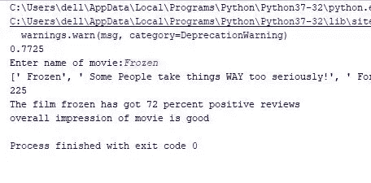

# 使用正面或负面评论的情感分析的自动电影评论系统

> 原文：<https://pub.towardsai.net/automatic-movie-review-system-using-sentimental-analysis-for-positive-or-negative-review-1667ea3041d4?source=collection_archive---------1----------------------->

## [自然语言处理](https://towardsai.net/p/category/nlp)

## 一篇很好的文章，通过回顾电影来理解情感分析和数据搜集的基础。

> 在本文中，我们将使用**机器学习对 IMDB 网站上任何给定电影的评论**进行情感分析，然后决定是否观看该电影。理解 **NLP** 以及**数据抓取**的基础知识是一个很好的项目。如果你在机器学习领域工作了相当长的时间，那么很可能你可以跳过这个教程。


基于网页抓取的情感分析

我们将使用的工作流程或方法由四个主要部分组成:

*   安装所有依赖项和必需的文件
*   模型开发(朴素贝叶斯)
*   搜集对某部电影的评论
*   预测每条评论的情绪，决定看不看。

## 先决条件

我假设您熟悉 python 编程语言*，并且您的系统中已经安装了 python 3。*

## *安装所需的软件包*

*对于给定的包，您可以简单地使用`pip install pakage_name`。在开始编码之前需要安装的包有:*

*   ***selenium** —用于网页抓取和自动滚动网站。在 selenium 中，你还需要下载[chomedriver.exe](https://sites.google.com/a/chromium.org/chromedriver/downloads)来自动使用 chrome。*
*   ***nltk** —用于执行自然语言处理任务和模型训练。*
*   ***bs4** —用于解析 Html 页面的 BeautifulSoup。*
*   ***lxml** —它是用来用 python 处理 Html 和 xml 的包。*
*   ***urllib** —用于请求网页。*
*   ***sklearn(可选)** —用于保存训练好的模型。*

# *让我们开始编码吧*

*创建用于训练和预测评论的 python 文件。别担心，我们稍后会在不同的文件中删除这些评论。*

## *模型开发*

*首先，我们必须下载所有必要的数据，比如我们的模型将要训练的***movie _ reviews***以及 nltk 在我们的代码中使用的一些其他数据，比如停用词、punkt。如果 nltk 需要更多的数据，它会通知您错误。下面几行将下载数据。*

```
***import** nltk
nltk.download(**"punkt"**)
nltk.download(**"movie_reviews"**)
nltk.download(**"stopwords"**)*
```

*现在我们将导入所有需要的包和文件。这里， ***movie_reviews*** 是我们的训练和测试数据， ***stopwords*** 是像`is,the,of`这样对训练没有贡献的词。我们用 ***洗牌*** 洗牌训练和测试数据。 ***NaiveBayes*** 是最常用于 NLP(自然语言处理)的分类器。***word _ tokenizer***用来把文本分成更小的部分称为记号。*

*MAIN_scrap_movies_reviews 是我们抓取数据的 python 文件，***reviews _ extract***是执行该任务的函数。*

```
***from** nltk.corpus **import** movie_reviews
**from** nltk.corpus **import** stopwords
**from** random **import** shuffle
**import** string
**from** nltk **import** NaiveBayesClassifier
**from** nltk **import** classify
**from** nltk **import** word_tokenize
**from** MAIN_scrap_movies_reviews **import** reviews_extract
**from** sklearn.externals **import** joblib*
```

```
*****def** bag_words(words):
    **global** stop_words
    stop_words = stopwords.words(**'english'**)
    clean = []
    **for** i **in** words:
        **if** i **not in** stop_words **and** i **not in** string.punctuation:
            clean.append(i)
    dictionary = dict([word, **True**] **for** word **in** clean)
    **return** dictionary***
```

***我们已经创建了函数***training and testing()***来训练和检查模型的准确性。有两个空列表用于存储正面和负面评论。然后，我们在 movie_reviews 列`fileids`中迭代，如果它包含`pos`，那么该行或评论被存储在正面评论列表中，反之亦然。之后，我们遍历存储在 *pos_reviews* 中的每个评论，并调用 ***bag_words*** 函数，该函数依次给出包含评论词(删除了停用词和标点符号)的字典，并将`pos`与其相关联，表示这是正面评论。负面评价也是一样。然后，我们对数据进行洗牌和分割，以进行训练和测试。我们简单地使用了[朴素贝叶斯分类器](https://www.geeksforgeeks.org/naive-bayes-classifiers/)进行情感分析。nltk 的内置功能使训练和测试变得简单。***

******

***用 nltk 训练就像魔术一样***

***这里最后一行用来存储训练好的模型，这样就不需要每次回顾电影的时候都训练模型了。此外，您可以简单地返回分类器，并在预测阶段使用它。***

```
*****def** TrainingAndTesting():
    pos_review = []
    neg_review = []

    **for** fileid **in** movie_reviews.fileids(**'pos'**):
        pos_review.append(movie_reviews.words(fileid)) **for** fileid **in** movie_reviews.fileids(**'neg'**):
        neg_review.append(movie_reviews.words(fileid)) pos_set = []
    **for** word **in** pos_review:
        pos_set.append((bag_words(word),**'pos'**)) neg_set = []
    **for** word **in** neg_review:
        neg_set.append((bag_words(word),**'neg'**)) shuffle(pos_set)
    shuffle(neg_set)
    test_set = pos_set[:200]+neg_set[:200]
    train_set = pos_set[200:]+neg_set[200:] classifier = NaiveBayesClassifier.train(train_set)
    acc = classify.accuracy(classifier,test_set)
    print(acc)
    joblib.dump(classifier,**'imdb_movies_reviews.pkl'**)***
```

***现在，我们将创建另一个文件，从 IMDB 抓取评论，或者您也可以在同一个文件中定义函数。***

## ***搜集对某部电影的评论***

***导入所需的包。所有这些的用途在开始时都有定义。***

```
*****from** selenium **import** webdriver
**import** urllib.request **as** url
**import** bs4
**import** time***
```

***在这个函数中，我们将电影名称作为用户的输入，然后使用`urlopen`获取特定网页的内容。现在，我们将使用`BeautifulSoup`解析内容，并找到页面上第一个电影结果的链接，移动到该链接，然后进入评论部分，单击加载更多评论。这是使用 ***硒*** 的主要原因，否则我们将坚持只有 5 或 6 个预载注释。在我们的例子中，点击特定次数(20 次)后，我们将找到每个评论的文本，并将其添加到列表中，然后返回该列表。***

```
*****def** reviews_extract():
    movie = input(**'Enter name of movie:'**)
    movie = movie.lower() web = url.urlopen(**"https://www.imdb.com/find?ref_=nv_sr_fn&q="**+movie)
    page1 = bs4.BeautifulSoup(web,**'lxml'**)
    b = page1.find(**'td'**,class_=**'result_text'**)
    href = b.a[**'href'**]
    web2 = url.urlopen(**"https://www.imdb.com"**+href)
    page2 = bs4.BeautifulSoup(web2,**'lxml'**)
    c = page2.find(**'div'**,class_=**'user-comments'**)
    temp = []
    **for** a **in** c.find_all(**'a'**,href =**True**):
        g =(a[**'href'**])
        temp.append(g)
    d = temp[-1]
    driver = webdriver.Chrome(**'C:\\Users\\dell\\Desktop\\chromedriver.exe'**)
    driver.get(**"https://www.imdb.com"**+d)
    **for** i **in** range(20):
        **try**:
            loadMoreButton = driver.find_element_by_class_name(**'load-more-data'**)
            loadMoreButton.click()
            time.sleep(1)
        **except** Exception **as** e:
            print(e)
            **break** web3 = driver.page_source
    page3 = bs4.BeautifulSoup(web3,**'lxml'**) e = page3.find(**'div'**,class_=**'lister-list'**) e1 = e.find_all(**'a'**,class_=**'title'**) user_reviews = []
    **for** i **in** e1:
        raw = (i.text)
        user_reviews.append(raw.replace(**'\n'**,**''**))
    driver.quit()
    print(user_reviews)
    print(len(user_reviews))
    **return** user_reviews,movie***
```

## ***预测每个评论的情绪***

***抓取之后，我们回到之前的 python 文件。现在，我们将使用已经训练好的模型来预测每个刮掉的评论的情绪。在代码中，首先我们加载了之前保存的模型，并调用上面定义的 reviews_extract 函数来获取评论。之后，我们处理每个评论，即标记化，删除停用词，并将评论转换为所需的格式。然后，如果`neg`增加 n 的计数，如果`pos`增加 p，我们预测它的情绪，并计算正面评论的百分比。***

```
*****def** predicting():
    classifier = joblib.load(**'imdb_movies_reviews.pkl'**)
    reviews_film, movie = reviews_extract()
    testing = reviews_film tokens = []
    **for** i **in** testing:
        tokens.append(word_tokenize(i)) set_testing = []
    **for** i **in** tokens:
        set_testing.append(bag_words(i)) final = []
    **for** i **in** set_testing:
        final.append(classifier.classify(i)) n = 0
    p = 0
    **for** i **in** final:
        **if** i == **'neg'**:
            n+= 1
        **else**:
            p+= 1
    pos_per = (p / len(final)) * 100 **return** movie,pos_per,len(final)***
```

***然后，在最后，我们调用所需的函数，如果正面百分比大于 60%，我们就向我们的朋友推荐这部电影。***

```
***TrainingAndTesting()
movie,positive_per,total_reviews = predicting()
print(**'The film {} has got {} percent positive reviews'**.format(movie, round(positive_per)))
**if** positive_per > 60:
    print(**'overall impression of movie is good  '**)
**else**:
    print(**'overall impression of movie is bad '**)***
```

# ***我的结果***

***我能够得到大约 78%的模型精度，这是我的结果截图。这里 225 是被分析的评论的数量。***

******

***获得的结果***

***所描述的项目是为初学者，因此我没有使用先进的技术，如 RNN(递归神经网络)。这篇文章的唯一焦点是提供机器学习领域的知识和启动阶段项目。***

***谢谢你的宝贵时间。😊我希望你喜欢这个教程。***

***你可以在我的[**Github repo**](https://github.com/PushkaraSharma/Automatic_Movie_Review_NLP)**找到相同的源代码。*****

***查看我的文章 [***用 Python 可视化有趣的排序算法***](https://medium.com/analytics-vidhya/visualize-interesting-sorting-algorithms-with-python-bdd64bdd0713)***

***[](https://medium.com/analytics-vidhya/visualize-interesting-sorting-algorithms-with-python-bdd64bdd0713) [## 用 Python 可视化有趣的排序算法

### 有各种类型的排序算法，有时很难理解它们…

medium.com](https://medium.com/analytics-vidhya/visualize-interesting-sorting-algorithms-with-python-bdd64bdd0713)***