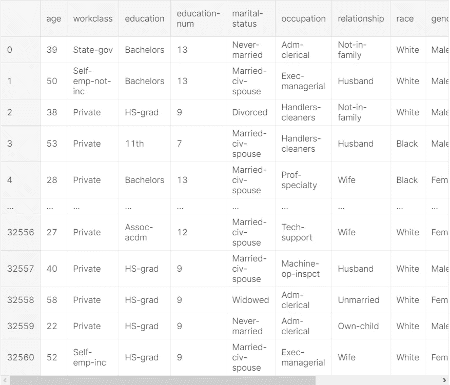
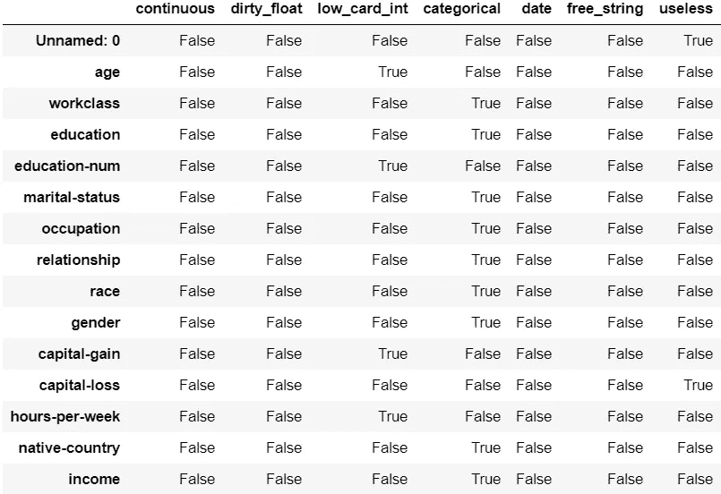
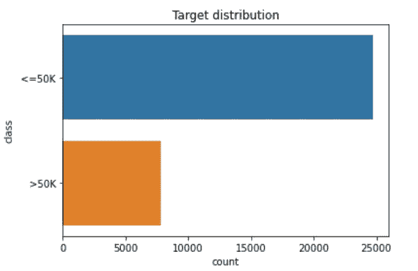
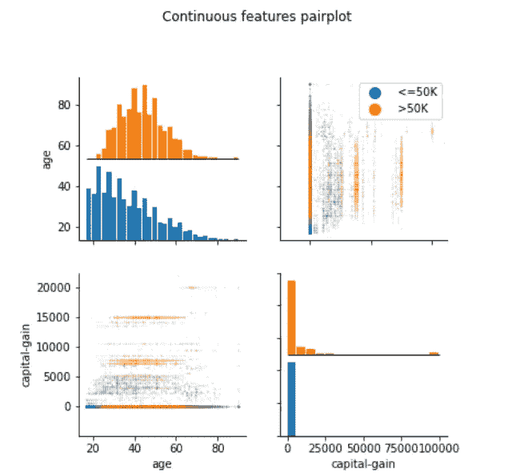
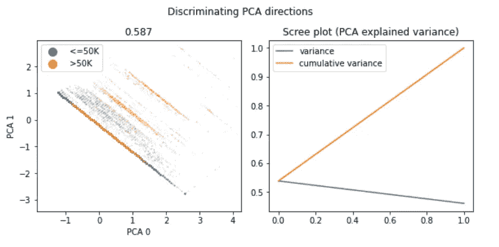
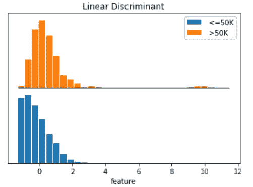
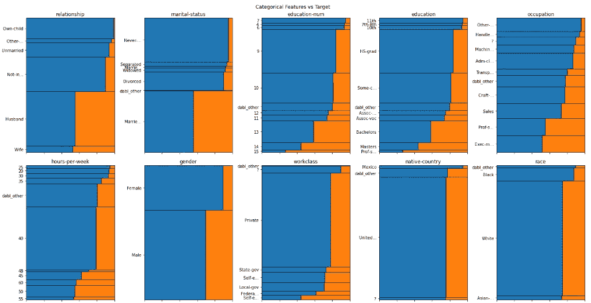
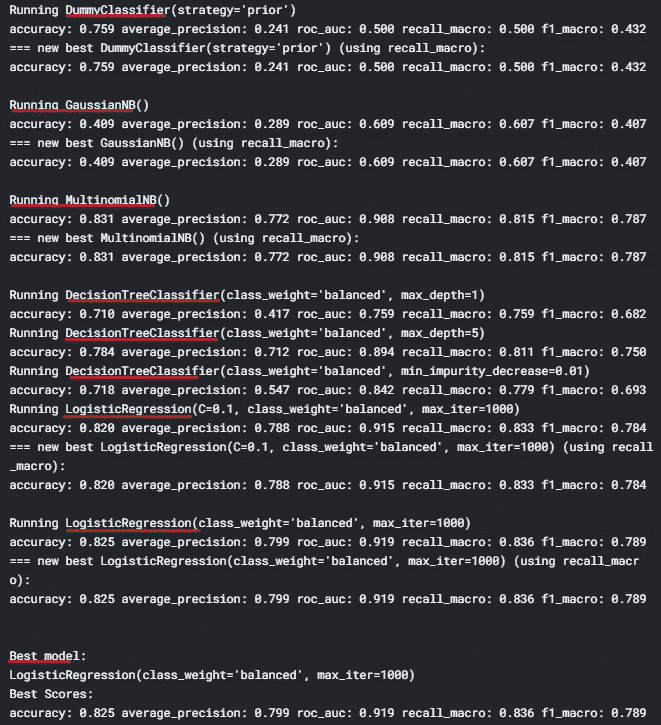
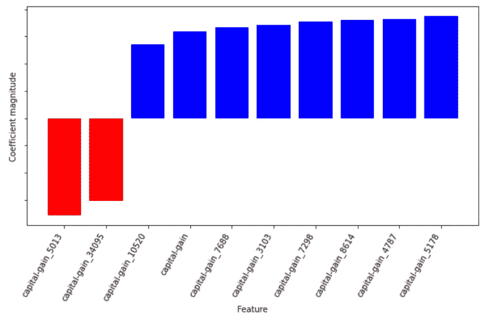

# 利用 dabl 实现数据科学自动化

> 原文：<https://pub.towardsai.net/automating-data-science-with-dabl-76acb7344727?source=collection_archive---------0----------------------->

## [数据科学](https://towardsai.net/p/category/data-science)

## 人类数据科学家真的需要吗？


来源:[福布斯](https://www.forbesindia.com/blog/technology/five-steps-to-building-a-successful-automation-roadmap/)

[dabl](https://amueller.github.io/dabl/dev/) 代表数据分析基线库。dabl 背后的想法是让监督学习自动化，以减少常见任务的样板文件。这意味着，在建立任何预测模型时，必须清理、分析数据，并通过许多具有不同参数调整的模型来运行数据，以获得最佳准确率，这需要几行代码和人工时间，所有这些任务都将由 dabl 处理，只需很少的几行代码，从而节省了每天处理大量数据的人员的时间和金钱。

开发该库的主要想法是让数据科学家花更多的时间思考问题陈述，并创建更多的自定义分析，而不是每次都重复相同的传统步骤。dabl 从 scikit-learn 和 auto-sklearn 获得灵感。让我们开始吧。

## 安装和导入

我们只需要导入一个库，它可以完成所有必要的任务。

```
!pip install dabl
import dabl
```

## 获取数据

dabl 中几乎没有可以直接加载和使用的数据帧。我们还可以使用常规的 Pandas 风格来读取任何外部数据。我们将处理包含成人人口普查数据集的数据框架。

```
df = dabl.datasets.load_adult()
df.head()
```


## 数据清理

我们都知道第一步是数据清理。dabl 尝试检测数据集中的数据类型，并应用适当的转换。dabl 的目标是为数据可视化和模型清理足够多的数据。如果需要，我们还可以进行定制清洗。

> `**dabl.clean**` **( *X* ， *type_hints=None* ， *return_types=False* ， *target_col=None* ， *verbose=0* )**
> 
> x:数据帧
> 
> type_hinta:如果语义类型(连续、分类、顺序、文本等)检测失败
> 
> return_type:是否返回推断的类型
> 
> **target_colstring:** 从不删除目标列

```
data_clean = dabl.clean(df, type_hints={"capital-gain": "continuous"})
data_clean
```



## 描述数据集

传统上我们申请。info()来获得初步的见解，此外，我们可以使用 dabl.data_types()来预测每一列的数据类型。

> `**dabl.detect_types**` **( *X* ， *type_hints=None* ，*max _ int _ cardinality = ' auto '*，*dirty _ float _ threshold = 0.9*，*near _ constant _ threshold = 0.95*， *target_col=None* ， *verbose=0* )**

> 更多细节请看[文档](https://amueller.github.io/dabl/dev/generated/dabl.detect_types.html#dabl.detect_types)。

```
dabl.detect_types(df)
```



## 探索性数据分析

[dabl.plot()](https://amueller.github.io/dabl/dev/generated/dabl.plot.html#dabl.plot) 会让你快速洞察数据。然而，dabl 并不保证提供数据的所有有趣方面。它提供了非常高层次的见解，比如重要的特性、它们之间的交互以及问题的难度。人们不得不再次执行传统的定制绘图来进行特定的分析。

> `**dabl.plot**` **( *X* ， *y=None* ， *target_col=None* ， *type_hints=None* ， *scatter_alpha='auto'* ， *scatter_size='auto'* ， *verbose=10* ， *plot_pairwise=True* ， ***kwargs* )**

```
dabl.plot(df, target_col="income")
```



很神奇吧，我们只用了半行代码就获得了很好的洞察力。

## 模型结构

SimpleClassifier 试图找到最适合的模型。它对二次抽样数据应用了几条基线。由于 dabl 受到 scikit-learn 的启发，它允许我们指定符合 scikit-learn 风格的数据。做这件事有两种方法。

```
model = dabl.SimpleClassifier(random_state=0)
X = data_clean.drop("income", axis=1)
y = data_clean.income
model.fit(X, y)
```

或者

```
model = dabl.SimpleClassifier(random_state=0).fit(data_clean, target_col="income")
```

输出:



正如我们所看到的，它应用了几个具有不同参数调整的模型，以找到最佳拟合模型和精确度分数。SimpleClassifier 还执行预处理，如缺失值插补和一键编码。我们可以使用 dabl.explain()来检查模型

```
dabl.explain(model)
```



## 人类数据科学家真的需要吗？

dabl 确实很有趣，而且是自动化的，但是它仍然处于开发阶段，只有非常少的特性和功能。建议你去看看 dabl 提供的 API 的[清单。我个人认为，部署一个功能齐全、功能丰富的版本仍然需要很多时间，而且当它完成时，业界必须信任并接受它。数据科学就是这样一个领域，每天都有一个独特的数据集和问题陈述/需求在行业中产生，因此在某些时候人工干预是必要的。我想说的是，自动化数据科学将是未来，但不是很快，所以你可以专注于提高技能或学习数据科学。请记住，总是提升自己的技能，每当你认为自己已经掌握了足够的知识，可以停止学习新技能时，就把这篇文章当作一个警钟。](https://amueller.github.io/dabl/dev/api.html)

# dabl 的局限性

目前(在撰写本文时), dabl 不处理文本数据、时间序列数据和神经网络模型。图像、音频和视频数据完全不在讨论范围内。

## 未来目标(在撰写本文时)

*   现成的可视化
*   模型诊断
*   高效模型搜索
*   类型检测
*   自动预处理
*   表现良好的渠道组合


凯利·西克玛在 [Unsplash](https://unsplash.com?utm_source=medium&utm_medium=referral) 上的照片