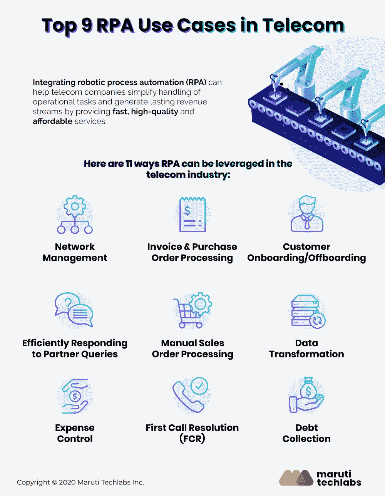
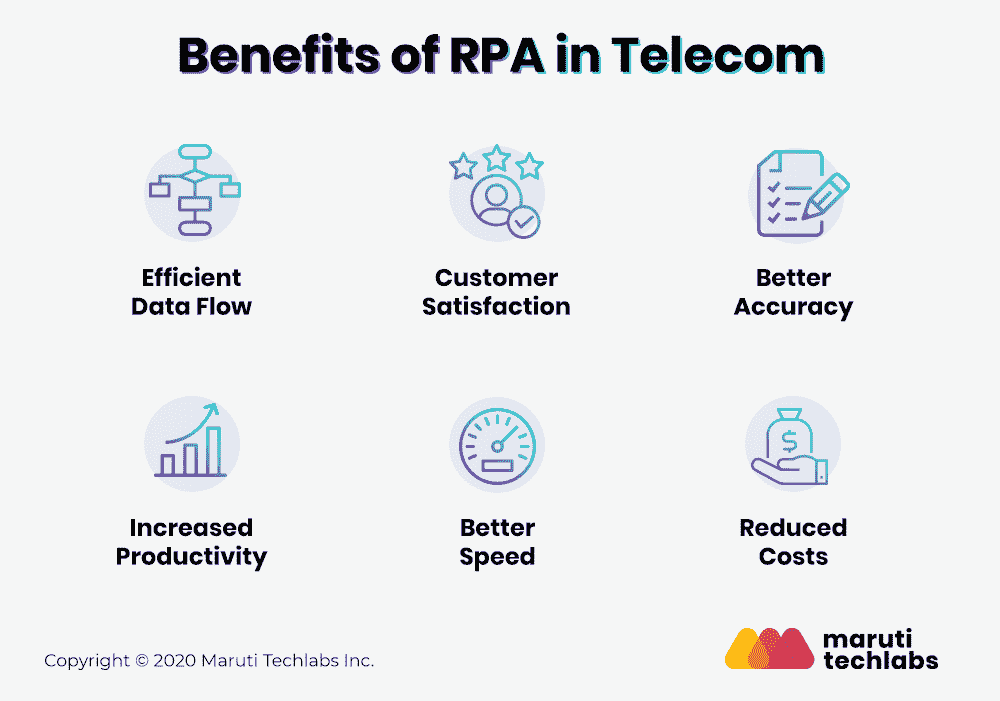
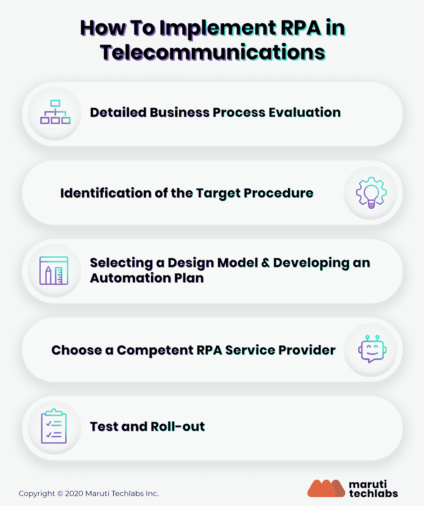

# 电信自动化 RPA 如何改变电信行业的 9 种方式

> 原文：<https://pub.towardsai.net/automation-in-telecom-9-ways-how-rpa-can-transform-the-telecom-sector-b68f102d6451?source=collection_archive---------1----------------------->

## [技术](https://towardsai.net/p/category/technology)

## 如今，电信是一个庞大的行业，服务提供商正在努力应对大量的运营流程。

每个人都会同意，庞大的用户群是赢得残酷竞争的关键。但对于电信运营商来说，管理获取和服务庞大客户群的后台流程也变得非常困难。对无缝连接、定制解决方案、24 小时客户服务、待处理数据量激增的不断增长的需求，给电信行业带来了沉重的负担。这就是电信行业 RPA 的用武之地。

RPA 允许电信行业跨各种系统自动执行不同的任务，这些任务大多是重复性的、高频率的、劳动密集型的和耗时的。采用 RPA 可以帮助电信企业克服几个挑战，从而帮助他们的业务运营并获得竞争优势。

# 电信运营商为什么要选择 RPA？

如今，电信是一个庞大的行业，服务提供商正在努力应对大量的运营流程，例如管理数据、提高业务灵活性、控制成本、提高业务效率以及开发新的模式/服务。

电信业还面临着其他一些挑战。其中一些是-

*   **低生产率**

众所周知，电信服务提供商需要处理大量数据，并且依赖后台员工在各种平台、系统、数据库和应用程序上工作。这么多平台同时工作，需要持续的人工干预，占用员工的宝贵时间，从而降低工作效率。

*   **高额间接费用**

电信提供商面临的另一个挑战是管理高昂的管理费用。这些成本可能是多种软件和硬件成本、维护数据安全性、雇佣大量人员来管理简单但频繁的流程，等等。

*   **错误风险增加**

电信行业中有许多活动本质上是手动的，出错的可能性更高。其中包括重新键入数据、更新数据字段，以及通过浏览海量知识库来理解信息。这可能很快导致客户不满，因为他们可能不容易获得正确的信息，占用了他们大量的宝贵时间。

# 机器人过程自动化的 9 个电信用例

电信是 RPA 技术采用率最高的众多行业之一。以下是电信行业中的一些 RPA 使用案例——

# 1.网络管理

电信提供商面临的一个挑战是容量需求，因为越来越多的丰富内容不断在应用程序、设备和用户之间传输。

随着流量水平和分布式网络复杂性的增加，电信网络管理对服务提供商来说变得很困难，因为它包括导航复杂的应用程序、手动重设数据密钥以及检索大量客户相关信息以提高网络基础设施的效率。

# 2.发票和采购订单处理

RPA 非常适合电信行业，因为有多个重复的组织任务会占用更高效、更有生产力的任务的时间。

通过使用软件机器人来执行定期维护工作、监控网络、保留备份和分发电子邮件，RPA 根据任务的复杂性提供了完全的自动化。此外，RPA 技术可用于电信行业，将发票和电子邮件数字化，帮助员工节省宝贵的时间，并将注意力集中在更好的创收策略上。

# 3.客户入职/离职

实施 RPA 并自动化客户入职和离职流程有助于电信提供商保持所有客户及其信息的清晰性。

此外，RPA 驱动的机器人使得每当新客户加入时自动添加客户变得超级容易，并且当他们离开时也容易移除。它有助于电信部门节省时间、减少出错几率、降低成本，并避免员工将时间浪费在非生产性的手动任务上。

# 4.高效响应合作伙伴的查询

电信行业的大多数公司都依赖独立经纪人等外部合作伙伴来销售其服务。

基于 RPA 的软件机器人完全可以响应简单的查询，解释电子邮件，并将复杂的问题重定向给人类，从而使查询解决的整个过程更加简单。此外，RPA 还有助于客户服务，因为它可以立即自动将呼叫共享给员工，以便他们可以立即为客户服务，从而确保更高的工作效率、增加的利润和全面增强的客户服务。

# 5.人工销售订单处理

telecom 中的 RPA 可以无缝地捕获员工执行的所有业务流程任务，从而最大限度地减少销售订单处理中所需的手动工作。这可以通过基于员工的行为生成一个结构良好的工作流来实现，该工作流作为所有自动化流程的基础设施。

此外，电信公司可以将每个流程步骤与其手动执行相关的成本对应起来，以便能够确定需要自动化的步骤，从而获得最高的投资回报。电信行业中的这种机器人流程自动化是一个很好的例子，它有助于管理大型非结构化数据集。

# 6.数据转换

这是电信业中 RPA 可以带来显著变化的另一个领域。该行业依赖于以各种文件格式存储的大量数据。RPA 支持的软件机器人可以帮助将所有这些数据转换为结构化的统一格式，并且能够处理非标准格式的数据。

此外，将 RPA 与人工智能(AI)等其他即将到来的技术相结合，可以让电信提供商基于结构化数据集分析预测模式。RPA 在这里可以帮助组织数据库，而 AI 可以以更高的精度连续创建预测。

# 7.费用控制

基于 RPA 的软件机器人可以通过维护强大的数据完整性和安全性、提供自动和定期报告以及管理软件和硬件成本来减少运营和资本支出。它特别适合希望从大幅降低的成本中获益的小公司。此外，RPA 技术还可以通过自动执行这些任务来用于计费和收入管理。

# 8.首次呼叫解决方案(FCR)

RPA 技术使软件机器人能够快速访问数据，从而帮助电信代理商在第一次通话中解决大量客户需求，而不必重复跟进。

此外，RPA 提高了 FCR 费率，从而帮助电信公司确保客户保持率和忠诚度。具有较高 FCR 率的客户服务流程可提高客户满意度和客户保留率，降低运营成本，让企业员工更加开心。

# 9.收债

自动化债务追收的后台流程也是电信行业中一个有效的 RPA 使用案例。RPA 有助于电信公司确定和收集他们的组织在各自到期日的欠款。一个强大的 RPA 平台可以自动化债务催收流程的各个步骤，例如付款信息更新、到期日、付款对账和紧急上报。这有助于员工提高工作效率，减少对产品系列的担心，更多地关注他们提供的服务。

# RPA 在电信领域的优势

电信行业中的 RPA 使用案例涵盖了相当多的服务，例如按时计费、支付处理、客户服务、号码携带、加快文档验证和 SIM 卡分配流程、数据输入、数据处理、数据管理等等。这将带来如下所述的诸多好处——

电信行业的 RPA 还可以通过管理数百项技术任务来帮助备份客户端电话系统配置，从而为所有客户端创建无缝备份系统，从而节省大量时间和成本。此外，实施 RPA 解决方案的成本远低于其他自动化解决方案。

# 在电信行业实施 RPA 的 5 个步骤

在这里，我们讨论了电信服务提供商可用于 RPA 实施的详细计划

# 1.详细的业务流程评估

为了能够在电信行业获得 RPA 的最大优势并提高整体生产力，电信公司需要从提高自动化潜力开始。为此，您可以根据效率和效果评估流程中的每一项任务，然后删除本质上不符合法规和/或对业务没有价值的任务。这里的目标应该是重新设计整个流程以提高生产率。

例如，有许多传统的通信服务提供商(CSP)仍然使用多余的步骤，例如验证订单装运的过程步骤。理想情况下，在实施 RPA 时，需要从流程中删除这些步骤。

# 2.目标流程的标识

说到电信，每个过程都由两部分组成——事务性的和决定性的。涉及各种事务部分的流程通常更适合自动化。为了识别这样的过程，使用涉及高容量、高人工努力、重复和基于规则的工作的参数。

# 3.选择设计模型和开发自动化计划

RPA 实施的下一步应该是重新设计选定的流程，以便最大限度地扩大其自动化范围。这里很重要的一点是，在设计过程自动化计划时，要记住整体的业务结构，并根据过程的需要进行定制。

例如，如果您选择自动化的呼叫阻止流程，那么应该从整个流程中删除 bar 移除验证流程这一步骤，因为它几乎没有或根本没有用。

一旦设计模型最终确定，就应该彻底地分析所有的过程，以识别迫切需要自动化、不需要自动化或需要时间来自动化的部分或部分。

# 4.选择有能力的 RPA 服务提供商

在为 RPA 实施选择服务提供商时，您最好雇用一家具备以下条件的 [RPA 咨询和服务提供商](https://marutitech.com/robotic-process-automation-services/):

a)处理复杂 RPA 项目所需的专业知识

b)具有全球标准的完整框架，通过专业合格的员工提供端到端流程咨询和部署

c)彻底了解运营挑战和 CSP 要求

d)为客户应用和电信特定流程要求带来有效 RPA 实施的工具

# 5.测试和推广

对自动化计划的效率、有效性和性能进行分析的试验阶段的重要性怎么强调都不为过。试点阶段也很重要，因为它允许您在测试阶段的基础上进行改进。

RPA 实施的最后一步是通过 IT 部门、业务部门和 RPA 解决方案提供商的共同努力推出计划。这里的目标应该是部署高级自动化解决方案来优化前台和后台工作流，以提高工作效率和客户满意度。

# 结论

由于数百万用户、杂乱的定制计划和客户群，客户支持、计费、订单履行等运营服务变得越来越复杂和难以处理。重复的过程使得电信服务提供商无法专注于其他重要的任务和他们的客户。

[电信行业的 RPA](https://marutitech.com/robotic-process-automation-services/)是减少手动流程中的错误和成本的绝佳方式。此外，RPA 在实施方面提供了很大的灵活性和适应性。这意味着 RPA 可以与现有系统和流程一起工作，允许它们根据需求和可行性完全或部分自动化。这使得 RPA 可以在整个组织内顺利实施。

总体而言，RPA 似乎是解决电信部门正在努力解决的许多问题的完美解决方案。Forrester 的一份[报告](https://www.forrester.com/report/The+RPA+Market+Will+Reach+29+Billion+By+2021/-/E-RES137229)表明，到 2021 年，RPA 将成为价值 29 亿美元的产业。集成机器人流程自动化(RPA)可以帮助电信公司简化运营任务的处理，并通过提供快速、高质量和经济实惠的服务来创造持久的收入流。