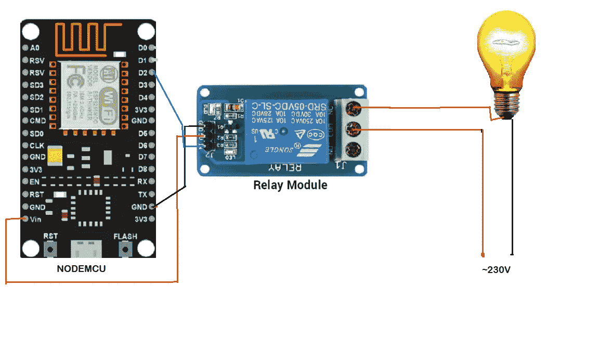

# 使用谷歌助手实现自动化

> 原文：<https://pub.towardsai.net/automation-using-google-assistant-fe903d25a17d?source=collection_archive---------0----------------------->

## [技术](https://towardsai.net/p/category/technology)

## 让我们的家用电器自动化有点意思。因此，让我们看看如何使用谷歌助手实现自动化。


来自 shutterstock.com

如果你是一个兴奋的极客，想让你的家自动化，这里有一个有趣的应用程序给你。在本模块中，我们将构建一个简单的自动化系统，让您可以从任何地方控制家用电器。我们将 Blynk 和 IFTTT 用于软件目的。硬件部分采用了 esp8266(节点 MCU)。我们自己安装模块会很有趣。

## 布林克:

Blynk 是一个开源平台，允许我们快速构建界面，从手机上监控我们的硬件项目。它支持 Android 和 iOS 手机。它提供了一个吸引人的界面。下载后，您可以创建项目仪表板，并在屏幕上排列按钮、图形、滑块、计时器和其他小部件。

## **节点 MCU:**

NodeMCU 是一个开源固件。它是一个微控制器。这是一款专门针对物联网应用的开发板。它包括由片上 esp8266 WiFi 插座(SoC)组成的固件。

它由 17 个 GPIO 引脚和一个 2.4GHz 天线组成。它有 128 KB 的内存和 4MB 的闪存来存储程序和数据。它可以使用微型 USB 插孔供电。它支持 UART、SPI 和 I2C 接口。它支持 3.3V 的电压。

## IFTTT:

IFTTT 的缩写是(If This Then That)帮助我们连接所有不同的应用程序和设备。这是一个免费的基于网络的服务。它创建了简单条件语句的连接，称为小程序，有助于通过互联网将应用程序连接在一起。在这里，它正在帮助将谷歌助手连接到 Blynk 应用程序。

# 实施:

我们需要使用互联网来控制我们的家用电器。所以，我们需要一个合适的网络连接。为此，你需要 Nodemcu 和 Wi-Fi。最初，在你的电脑上安装 Arduino-Uno。并确保安装 esp 驱动程序。如果没有，请安装它们。并通过在首选项中添加以下内容来包含这些包。在 IDE 中单击(CTRL+逗号)可以找到此对话框。

```
[https://dl.espressif.com/dl/package_esp32_index.json](https://dl.espressif.com/dl/package_esp32_index.json), [http://arduino.esp8266.com/stable/package_esp8266com_index.json](http://arduino.esp8266.com/stable/package_esp8266com_index.json)
```

在您的手机上安装 Blynk 应用程序，并用有效的电子邮件地址注册。创建您的项目并命名。选择 NodeMCU(esp8266)作为设备，并通过添加按钮制作您的仪表板。确保你的按钮是数字的。注册后，您将收到来自 blynk 的带有代码和认证令牌的邮件。每个项目的身份验证令牌都是唯一的。将应用程序连接到设备时，此身份验证令牌非常有用。在将应用程序连接到 IFTTT 服务时，这也很有用。

**倾销代码:**

一旦您创建了一个项目，您就会收到带有代码的邮件。在 IDE(Arduino)中打开代码，并将该代码转储到微控制器(NodeMCU)中。之前，填写你的无线网络的 SSID 和密码。并用您在邮件中收到的身份验证令牌填充 auth[]。

连接之前，将代码转储到微控制器中。连接时要小心，因为我们处理的是 230 伏的电压。转储时，确保板管理器和波特率与微控制器相关，我们使用 nodemcu(esp8266)。代码转储可能需要几分钟时间。

## 使用的模块:



作者提供的照片

> 在连接电路之前，请转储代码。确保连接正确。这里我们使用继电器和灯泡。我们可以用手机控制灯泡
> 
> 这样，我们就完成了使用移动设备的建筑自动化，现在，我们可以使用移动设备控制我们的电器。

## 使用谷歌助手:

到目前为止，我们可以使用移动设备(即 Blynk 应用程序)访问我们的设备。现在，我们将如何使用谷歌助手访问它们。为此，我们需要使用 IFTTT。由于这是一个基于网络的服务，我们需要在网上编码。在浏览器上打开 IFTTT。在 IFTTT 中有两个阶段。按照以下步骤进行设置。

第一阶段:

```
1)Open IFTTT(If this then that) and click on new applet.
2)Click on '+' before 'this' and choose your service as Google Assitant.
3)Fill the phrases in dialog box that appears on screen.
4)Make sure you have to remember the commands you given in trigger dialog box.
5)And fill those details.
6)Click on the trigger button.
```

第二阶段:

```
7)Now you will see the GOOGLE ASSISTANT Logo at the THIS position in the window. (Click on the + symbol before THAT)
8)Search for WEBHOOKS and choose it. Then click on “ Make a WEB REQUEST”. On the next page complete the fields.
9)In URL, provide the IP address of blynk-cloud.com where we found in cmd.
(URL Format is [http://](http://ip/)ip address of blynk-cloud/authid/update/pin no.)
10)And choose method tobe PUT and the content type has to json. Then click on the finish.
```

确保在设置时，您给出的命令是正确的。这些是设置 IFTTT 时必须遵循的步骤。拿起你的手机，给谷歌助手下命令。现在你会看到我们的家用电器将根据我们的命令运行。命令必须与您在 IFTTT 设置中选择的指令相匹配。这是完整的设置。

我们必须对电路中使用的每个器件重复这一过程。所以，对于每一个设备，你都要重复上述过程。将我们所有的设备连接到 IFTTT 后，我们就可以用我们的谷歌助手控制所有的设备了。

> 最后，您已经构建了您的自动化系统。

你可以在 [**Github**](https://github.com/santhoshbandaru/Automation) 上查看整个项目。

**结论:**

我们学会了如何使用互联网和谷歌助手来自动化我们的家用电器。在这里，我们可以使用 Blynk 应用程序(手动)和谷歌助手(使用语音命令)来访问它们。你也可以用 Alexa 来控制它们，但是 IFTTT 需要做一些微小的改变。我希望你喜欢这个过程，现在明白如何开始。如果你发现有改进的地方，请随时提出修改意见。我很快会再赶上你的。在那之前，呆在家里，注意安全！

如果你想联系，请在 LinkedIn 上联系我。