# AutoML——为每个人制作 ML 的 GUI 应用程序

> 原文：<https://pub.towardsai.net/automl-a-gui-application-to-make-ml-for-everyone-31d18ca84d89?source=collection_archive---------1----------------------->

## [自动化机器学习](https://towardsai.net/p/category/automl)

## 一个桌面应用程序，可以自动完成用 Python 编写的大部分 ML 管道任务。

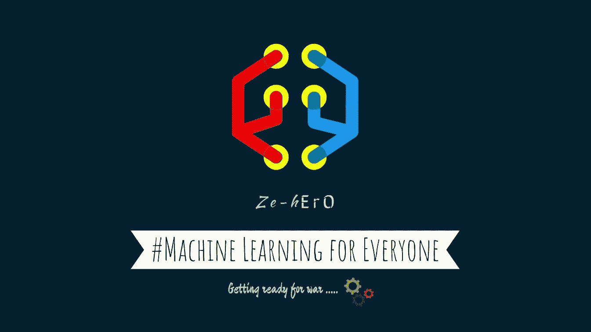

AutoML

机器学习帮助我们自动化需要人工干预的简单任务。这篇文章解释了我如何开发一个简单的自动化 ML 管道的 AutoML 应用程序。

有很多工具和库，比如 Google Cloud AutoML，AutoKeras，H2o 的 AutoML。但这些工具大多价格昂贵，或者基于脚本的方式不提供 UI。没有多少 ML 知识的普通人很难使用这些工具。因此，用 GUI 制作 AutoML 将扩展 ML 的使用，并帮助用户通过交互来学习 ML。

## 应用程序设置

下载存储库以在本地运行

[](https://github.com/santhalakshminarayana/AutoML) [## santhalakshminarayana/AutoML

github.com](https://github.com/santhalakshminarayana/AutoML) 

```
$ git clone [https://github.com/santhalakshminarayana/AutoML](https://github.com/santhalakshminarayana/AutoML).git
```

创建虚拟环境

```
$ virtualenv AutoML
$ source AutoML/bin/activate
$ cd AutoML
```

安装运行应用程序的要求

```
$ pip install -r requirements.txt
```

运行应用程序

```
$ python app.py
```

如果所有的东西都被下载并放在了正确的位置，那么你可以看到一个欢迎屏幕，就像上面的图片一样。

## **制作 GUI 应用**

我不擅长 UI 开发，只学了基本的 HTML，CSS，JS。对于应用程序后端应该在 Python 中，所有的计算发生。现在我需要一个框架或库来集成 JS 和 Python。在研究了如何用我的知识在短时间内制作 UI 后，我遇到了电子，它提供了创建跨平台应用程序的可能性，但它很笨重。我寻找电子的替代品，然后发现了这个叫做 [Eel (Python 库)](https://github.com/samuelhwilliams/Eel)的 Python 库。

如果你知道基本的 JS，创建桌面应用程序很容易，不需要学习新的包或库。Eel 在 JS 和 Python 之间架起了一座桥梁，像 Flask、Django 一样将数据从一端传递到另一端，但可以作为依赖于 CEF 浏览器(Chrome、Firefox、Edge……)的桌面应用程序在本地运行。

## **应用程序的架构**

在决定了所需的工具之后，在开始编码之前，设计应用程序的基础架构给出了一个抽象的工作概念。

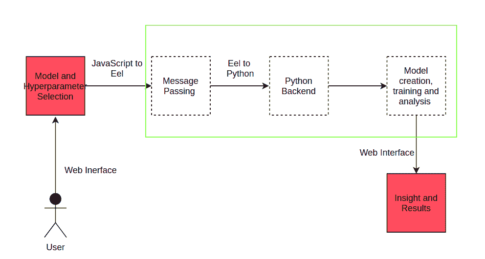

AutoML 应用程序的抽象体系结构

工作流程很简单:

1.  用户与应用程序交互以选择模型类型并输入数据，
2.  JS 在 Eel 的帮助下将数据传递给 Python 后端，
3.  计算在 Python 中进行并将数据发送给 JS，
4.  向用户显示结果。

下一步是决定哪些事情应该自动化，以及用户的需求。

## **机器学习管道**

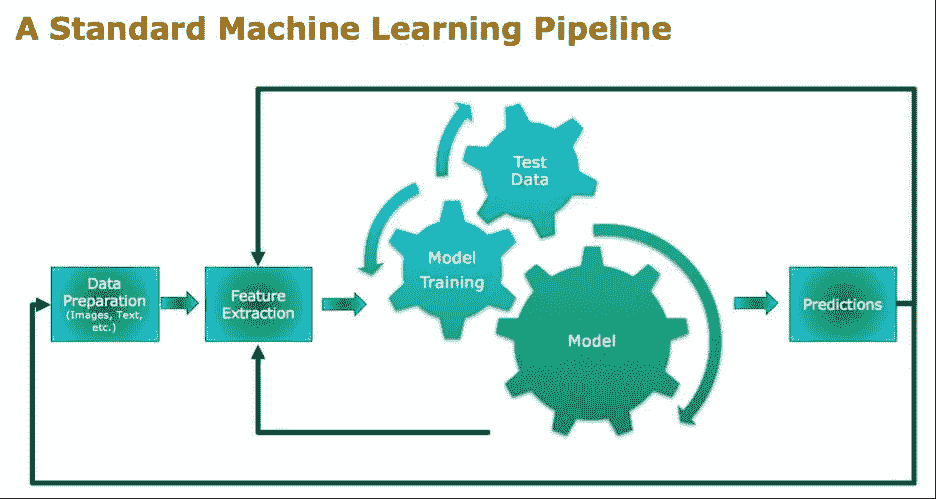

通常，机器学习模型遵循如下流水线步骤:

1.  数据提取/准备
2.  数据处理
3.  特征抽出
4.  型号选择
5.  模特培训
6.  模型调整
7.  模型评估
8.  模型预测法

除了数据提取、模型选择和模型预测，所有其他步骤都可以通过从用户处获取数据来实现自动化。

因此，为了自动化上述事情，用户必须提供数据。

**来自用户** 的要求用户与应用程序交互，以输入必要的详细信息，用户交互应最少。用户的预期行为包括:

1.  数据集背景下的模型选择
2.  提供与所选模型相关的数据集
3.  输入模型调整的参数
4.  留意模型洞察和分析

详细的端到端工作流程

# **第一步:型号选择**

用户必须从以下类型中选择问题类型:

1.  回归
2.  分类
3.  使聚集
4.  异常检测
5.  降维

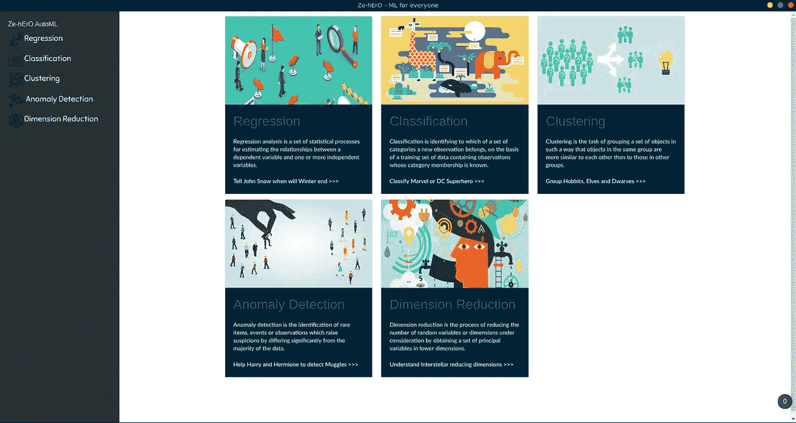

不同的问题类型

每种问题类型都提供了不同的模型可供选择，例如

**回归:**

*   k-神经网络
*   线性回归
*   支持向量回归机
*   随机森林回归量

**分类:**

*   k-神经网络
*   逻辑回归
*   支持向量机(SVM)
*   随机森林分类器

**聚类:**

*   k 均值
*   聚集/等级
*   基于密度的噪声应用空间聚类

**异常检测:**

*   多元高斯
*   基于密度的噪声应用空间聚类
*   隔离森林

**降维:**

*   主成分分析
*   TSNE
*   截断奇异值分解

选择问题类型和模型后，用户必须提供数据集并为模型选择参数

# **第二步:数据集输入和参数选择**

用户提供训练数据集，监督学习提供测试数据集。

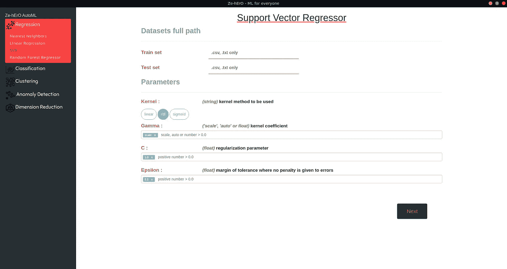

ML 模型需要许多因模型而异的参数。模型参数可以是不同的类型，如 **int、string、float。**

如果用户想要运行**超参数调整，**用户可以为同一属性提供多个值。

如果用户没有选择任何参数或清除默认值，则存储的默认值将用作模型的参数。

现在，用户交互已经完成，在用户点击**下一步**按钮后，是后端采取行动的时候了。

# 步骤 3:数据集预处理

数据预处理包括

*   检查数据集对所选模型的适用性
*   为数据集中的每一列分配缺失的列名
*   删除重复的数据/行
*   根据问题类型填充缺失值-回归平均值、分类数据集模式。
*   将分类值转换为数值—使用**backward difference encoder**进行转换
*   如果适用，分成训练和评估数据集
*   标准化数据
*   应用主成分分析进行特征提取

所有这些步骤都是自动计算的，用户将在 UI 中打印日志。

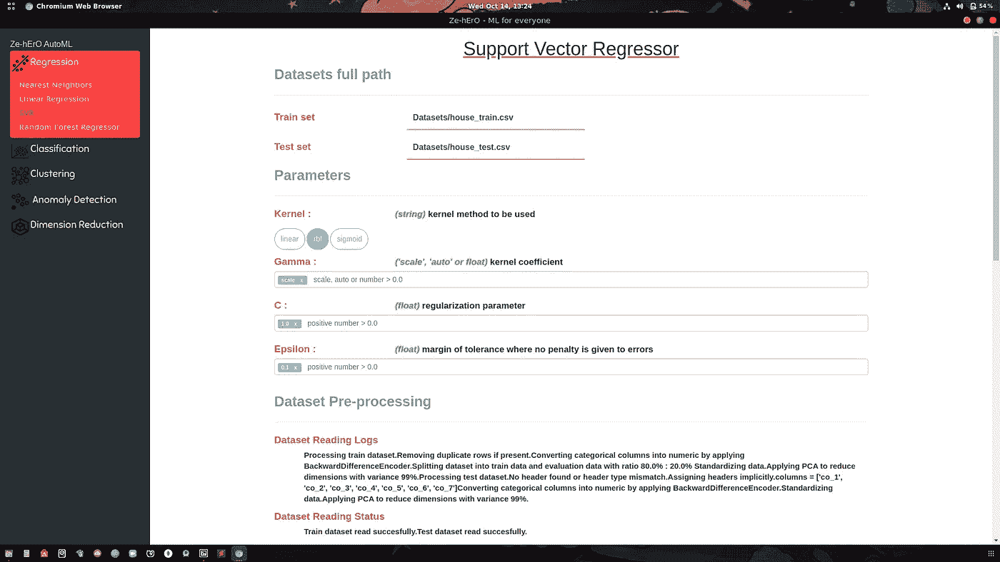

应用数据集预处理步骤

在下列情况下，用户会得到一个错误:

*   不正确的数据集
*   数据集与所选模型无关
*   用户提供的模型参数不正确

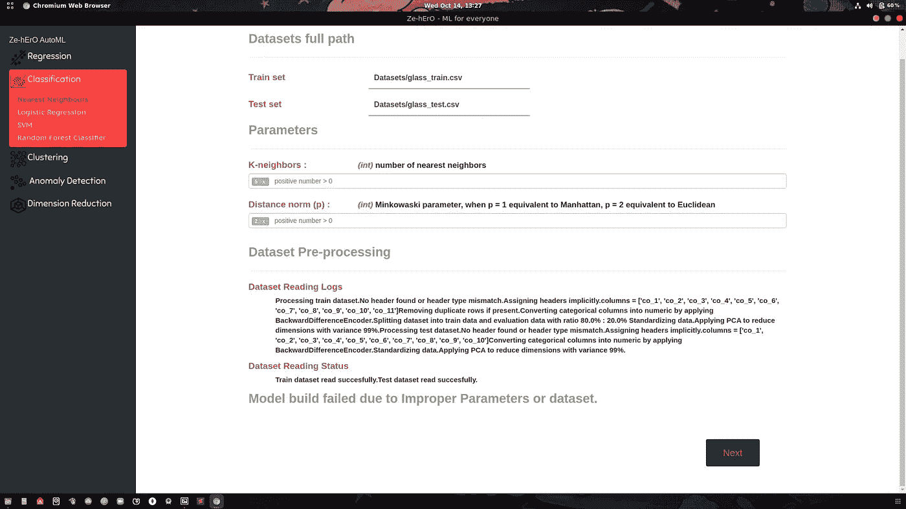

模型构建失败

# 步骤 4:使用超参数调整的模型训练

如果所提供的数据集被成功处理，那么下一步就是用数据集训练模型。如果为不同的参数提供了多个值，则使用 **GridSearchCV** 对模型进行超参数调整，给出高精度的最佳参数集被作为模型参数并显示给用户，告知最佳参数集。

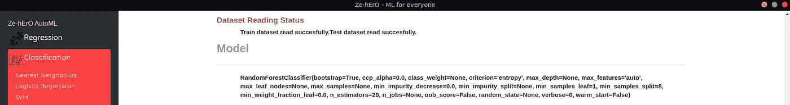

参数集取自 GridSearchCV 的最佳模型

如果出现任何错误，用户将通过日志了解模型构建过程中的错误。

# 步骤 5:模型性能评估

利用在分成训练数据和评估数据之后从用户提供的数据，对训练的模型进行评估，并且以针对不同问题类型的不同曲线图的形式向用户显示结果。

**回归评估**

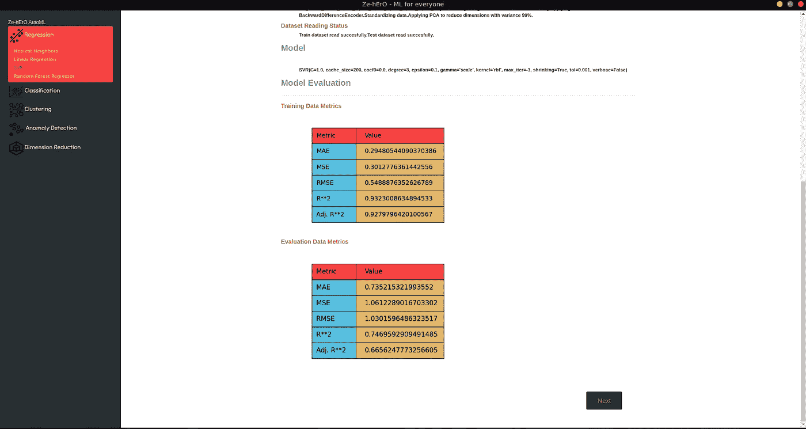

回归度量

在回归中，该图包含关于所示训练数据和评估数据的 MAE、MSE、RMSE、R**2、Adj. R**2 度量。

**分类评估**

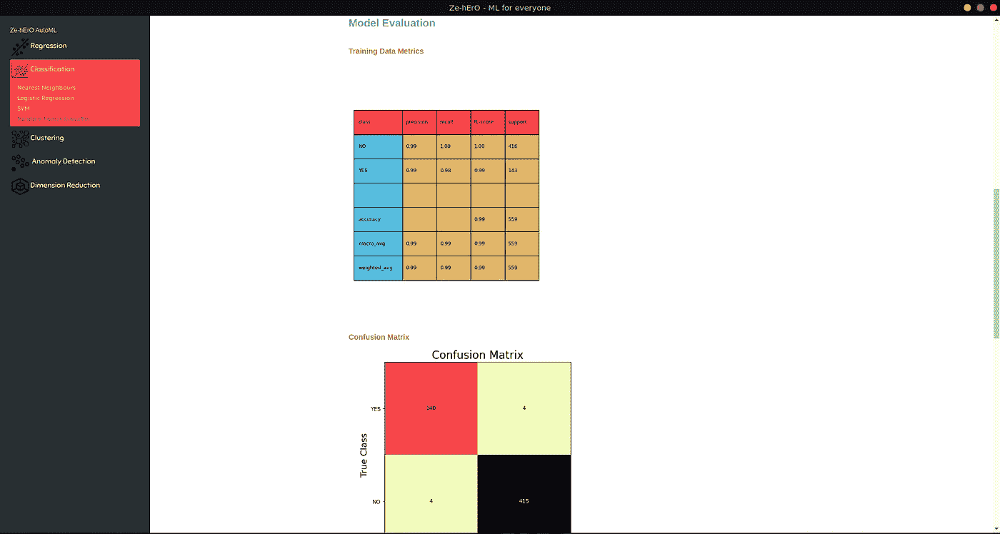

分类指标

对于分类，显示了类的混淆矩阵和其他细节，如 f1_score、准确度、精确度和召回率。

**聚类预测**

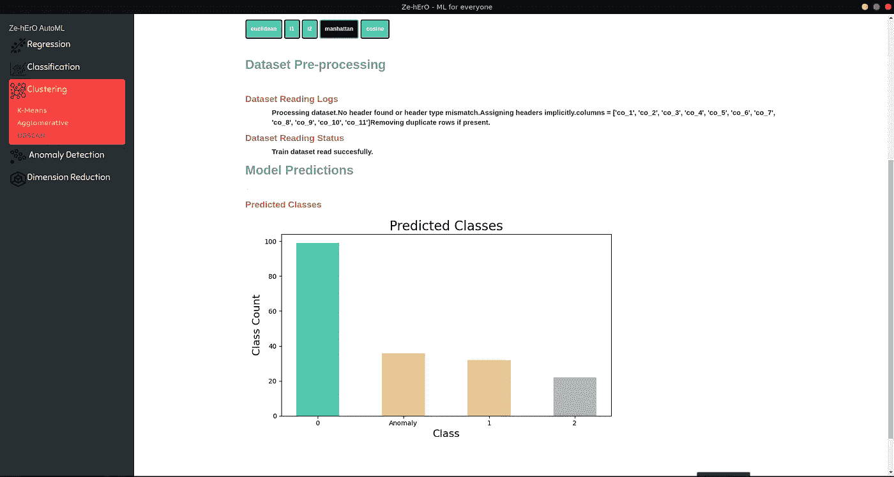

聚类预测

对于聚类，根据模型，显示不同类别计数的条形图。

**异常检测预测**

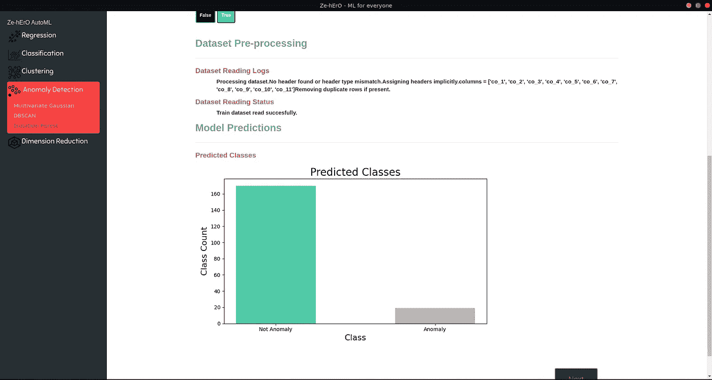

异常检测预测

对于异常检测，显示了一个**异常**和**非异常**计数的条形图。

**降维性能**

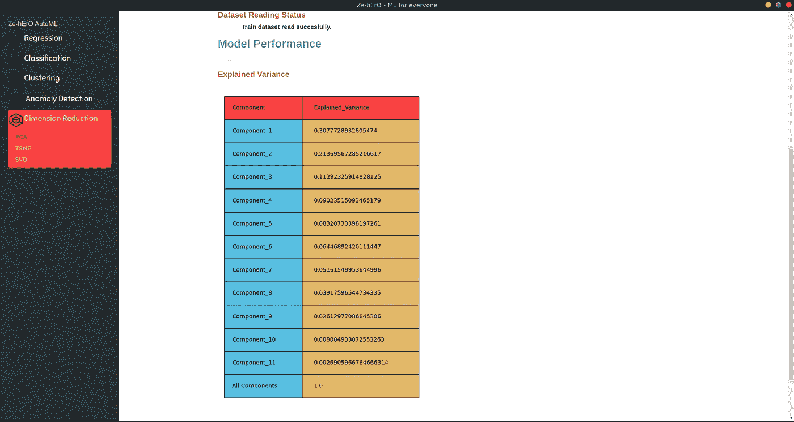

降维性能

对于降维，显示所有组件的**方差**的集合。

# 第六步:结果

根据问题类型，结果保存为**。csv** 文件。

节目到此结束。我开发了一个简单的应用程序，为在其他领域工作的普通用户提供 ML 体验。

这个应用程序可以用来

*   作为 ML 旅程开始时的学习工具
*   让数据科学家或 ML 开发人员等快速理解数据集。

## 未来的改进

这个应用程序可以通过添加

*   支持深度学习
*   网络支持
*   更多 ML 模型和类型
*   重新设计用户界面以获得更好的用户体验