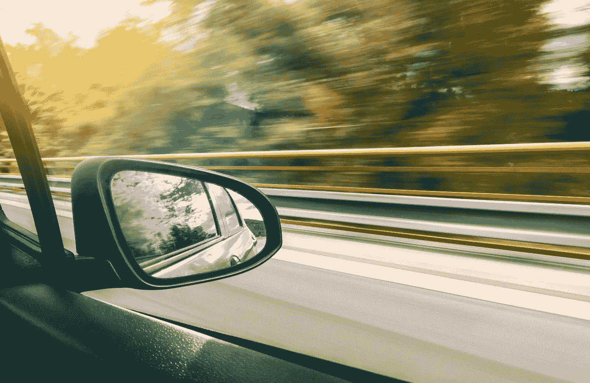

# 自动驾驶汽车可以预测你的驾驶有多自私

> 原文：<https://pub.towardsai.net/autonomous-cars-can-predict-how-selfish-your-driving-is-479534867f81?source=collection_archive---------2----------------------->

自动驾驶汽车可能很快就能把你归类为自私或利他的司机。虽然这可能会挫伤一些人的自尊心，但麻省理工学院 CSAIL 的研究人员声称，这将使自动驾驶汽车(AVs)在与人类并排行驶时更加安全。预测人类可能的行为，并根据他们的行为可能有多自私或无私来调整算法的推理，可以大大减少人工智能车辆和人类之间的事故。

将人工智能技术与复杂而微妙的人类行为世界恰当地集成是一个需要克服的巨大障碍，特别是在生死攸关的应用中。

> 除了让自动驾驶汽车*在我们的街道上足够安全之外，教会人工智能如何理解生活中不太可量化的部分，可以让人工智能有能力帮助人类完成以前无法完成的任务，并可以推进人工智能的总体应用。*

# *在我们中间开车*

*这项新研究由麻省理工学院计算机科学和人工智能实验室(CSAIL)的研究人员牵头，旨在教会人工智能如何根据社会心理学中使用的工具对性格进行分类。该团队使用了一种叫做**社会价值取向(SVO)** 的度量标准，它代表了一个人自私(“利己”)与利他或合作(“亲社会”)的程度，然后教会 AI 系统估计不同司机的 SVO。将司机归类为利己主义者或亲社会者会告诉系统他们有多大可能积极驾驶(例如，闯红灯)或在道路上更被动(例如，减速让某人转弯进入道路)。这使得 [*自动驾驶系统能够理解人类根据经验理解的信号*](http://news.mit.edu/2019/human-reasoning-ai-driverless-car-navigation-0523)*——例如当有人在外侧车道上紧跟在你后面超速行驶，或者在车辆队列中留出空间时，这意味着什么。**

**在模拟合并车道和在交通中进行无保护左转的测试中，该系统预测其他汽车行为的效率比当前的自动驾驶系统高 25%。例如，在左转模拟中，系统知道何时等待自私的司机，何时超越利他的司机。这是对人工智能在真实驾驶条件下所能做的有希望的一瞥，但它还远远没有准备好推出。相反，该团队建议在近期内可以使用部分版本来补充现有的车内人工智能，例如，突出显示进入某人盲点的咄咄逼人的司机。用这种基本的社会意识训练人工智能有助于克服自动驾驶汽车(AVs)和其他面向人类的人工智能应用的一个主要障碍。**

> **消除人类可能会做什么的不确定性将使这些人工智能系统更加“自信”，并为人工智能开辟了一系列解释和预测人类行为的可能性。**

# **二元行为**

**理解(或至少量化)人类行为的能力仍然是人工智能的一个主要症结，该团队希望扩展他们的训练集，以包括行人，骑自行车的人和其他道路使用者，以扩大系统的理解。“在 AVs 中创造更多类似人类的行为是乘客和周围车辆安全的基础，”研究生 Wilko Schwarting 说，他是发表在《美国国家科学院院刊》(PNAS)上的新论文的第一作者，“*以可预测的方式行事也使人类能够理解并适当地回应 AV 的行为。***

**该系统的这一方面，即人工智能的行为更像我们，这将使人类更容易理解它的行为，这意味着这项技术的应用比 AVs 更广泛。**

> **一种不仅可以理解人类行为，还可以做出反应并显示适当“人类”反应的算法，将使人工智能更加通用，更适合时间密集型护理工作。**

**例如，在护理痴呆症患者时，类似的人工智能系统可能会检测到一个人何时行为正常，何时情绪不稳定，以确定何时呼叫人类医疗专业人员。除了基于服务的角色， [*工业合作机器人*](https://www.forbes.com/sites/charlestowersclark/2019/09/11/keep-the-robot-in-the-cagehow-effective--safe-are-co-bots/) 可以预测人类行为，可以在人类中更安全有效地工作，如果能够理解社会线索和信号，甚至可以取代最危险的角色——例如工头命令中的音量和紧急程度。**

# **人类的理解**

**虽然麻省理工学院 CSAIL 团队可能没有准确捕捉到人类行为——这将是距离人工通用智能(AGI)仅一步之遥的壮举——但他们在量化某人是否可能自私或利他行为方面的工作无疑将有助于推进 AVs，并可能使人工智能用于比其目前处理的更敏感的应用中。创造能够在人类中安全自主操作而不会误解社会信号或在不确定的情况下过于谨慎的人工智能，将使人工智能，特别是机器人更加安全和多功能。这个特殊的系统可能还处于起步阶段，但我期待着看到这种理解水平可以发展到什么程度，以及在不久的将来它可以服务于什么应用。**

***最初发表于*[*【https://www.forbes.com】*](https://www.forbes.com/sites/charlestowersclark/2019/11/18/autonomous-cars-can-predict-how-selfish-your-driving-is/)*。***