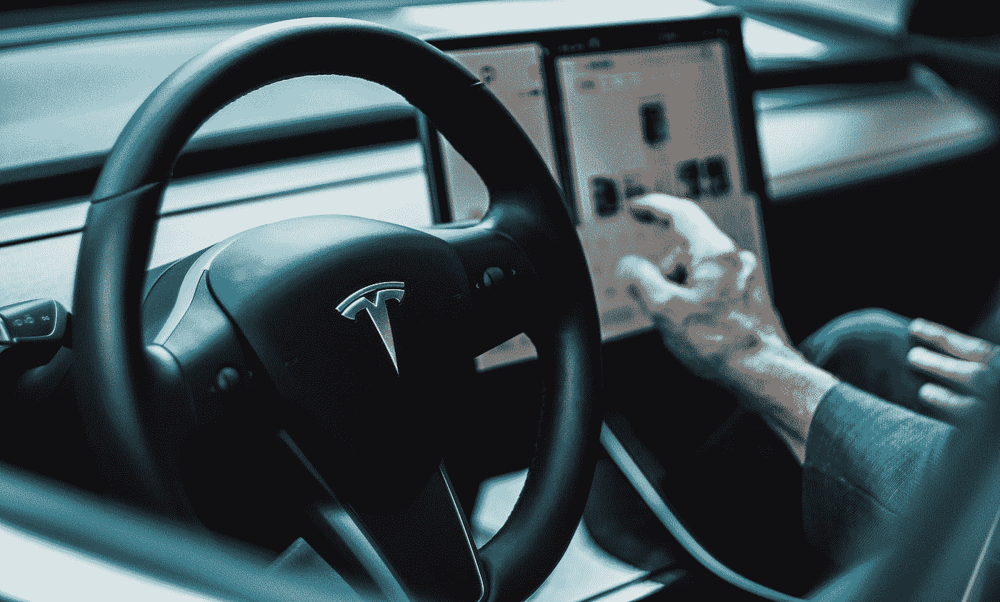

# 自动驾驶汽车:500 亿美元的颠覆机会

> 原文：<https://pub.towardsai.net/autonomous-vehicles-a-50-billion-opportunity-for-disruption-2f032678c62f?source=collection_archive---------1----------------------->

戴维·冯迪马尔在 [Unsplash](https://unsplash.com?utm_source=medium&utm_medium=referral) 上拍摄的照片

## [自动驾驶汽车](https://towardsai.net/p/category/self-driving-cars)

## 根据 Lux 最近的一份研究报告，未来 20 年，自动驾驶汽车市场的价值将高达 500 亿美元。

只有少数移动技术具有与自动驾驶汽车(AVs)相同的颠覆性潜力。因此，市场格局发生了变化，主要参与者专注于多样化的、有时是小众的应用程序、商业模式和地理位置。我们在这份报告中阐述了 AV 发展的全貌，以及它对未来 AV 销售和采用的意义。

虽然在物流方面有应用，但车辆机器人(AV)行业未能彻底改变汽车行业。自动驾驶汽车的商业化将是其最重要的创新。

新的 [Lux Research](https://www.luxresearchinc.com/) 报告“**自动驾驶汽车市场预测:揭开 500 亿美元机会的神秘面纱**”捕捉到了自动驾驶汽车发展的全貌，以及它对未来 AV 销售和采用的意义。

该报告预测了 AVs 的采用，从 2 级 ADAS 系统开始，逐步发展到自动驾驶 4 级系统。

第三层的自主系统将于 2021 年推出，到 2040 年将占自动驾驶汽车的大部分收入。

自动驾驶汽车的前景是一个由技术、金融和监管路障组成的复杂网络。鉴于自动驾驶汽车发展的早期阶段，今天的微小变化可能会在未来几年加速或阻碍该行业的发展。Lux 的报告确定了未来几年需要监控的四个关键因素，这些因素可能会改变 AV 的采用轨迹。

**AV 中的死亡事故:**4 级 AV 的部署必须在安全性和及时性之间取得微妙的平衡。未来的事故可能会影响公众的看法，要求开发人员在部署反病毒软件之前达到更高的信心水平。

**汽车拥有量:**微移动和打车等新兴趋势可能会减少个人汽车拥有量。为了引领这一趋势，寻找不需要开车上班的人密度最高的地区。

**验证工具:**目前，还没有标准工具来确定自动驾驶汽车系统是否符合允许其在公共道路上行驶的任何可能标准。大多数反病毒开发者会自我评估他们的进展，这使得监管者很难做出决定。一个标准化的工具、测试或一组指标可以帮助加快监管决策。

**系统成本:**预测反病毒系统的成本下降率具有挑战性，因为新的传感器、计算机和算法不断被集成到新的系统中。

# 结论

自动驾驶汽车(AVs)在汽车行业具有令人印象深刻的颠覆性潜力，它从根本上改变了车辆的运营，从而在个人车辆所有权和商业应用中实现了新的用例，例如乘车服务(所谓的 robotaxis)和卡车运输。

在经历了一段时间的过高期望和数十亿美元的资金投入后，许多 AV 开发商已经错过了商业里程碑的最后期限。这主要是由于训练人工智能系统处理不可能的场景或“恰当的边缘情况”的挑战性问题

# 还有一点

如果你想了解更多关于自动驾驶汽车的信息，以下文章可能会让你感兴趣:

*   [自动驾驶汽车简介](https://towardsdatascience.com/an-introduction-to-autonomous-vehicles-b39024788cd6)
*   这就是自动驾驶卡车将如何重塑运输行业。
*   [在无人驾驶卡车竞赛中领先的 18 家公司和初创公司](https://medium.datadriveninvestor.com/18-companies-and-startups-that-are-leading-the-race-for-the-autonomous-trucks-4ba5a50e6dee)
*   [2021 年，5000 辆自动驾驶卡车将在中国上路](https://medium.datadriveninvestor.com/5-000-autonomous-trucks-will-hit-the-roads-in-china-in-2021-4e13ab17b54e)
*   [本田将率先向大众推出自动驾驶汽车](https://medium.com/predict/honda-will-bring-the-level-3-autonomous-vehicles-to-the-masses-747ae9385105)
*   [自主车来了！你准备好了吗？](https://jairribeiro.medium.com/just-published-my-newsletter-about-autonomous-vehicles-8798d27fe9c3)
*   [沃尔沃集团和 Aurora 宣布就自动驾驶交通达成合作。](https://medium.com/predict/volvo-group-and-aurora-announced-a-partnership-on-autonomous-transportation-e0d625300a8b)

# **阅读 Lux Research 的报告:**