# auto irds—使用单一图像深度估计来创建单一图像随机点立体图

> 原文：<https://pub.towardsai.net/autosirds-using-single-image-depth-estimation-to-create-single-image-random-dot-stereograms-110c070858c6?source=collection_archive---------1----------------------->

## [应用计算机视觉](https://towardsai.net/p/category/computer-vision)

## 使用 Google Colab 和 TF Hub 的完整游乐场

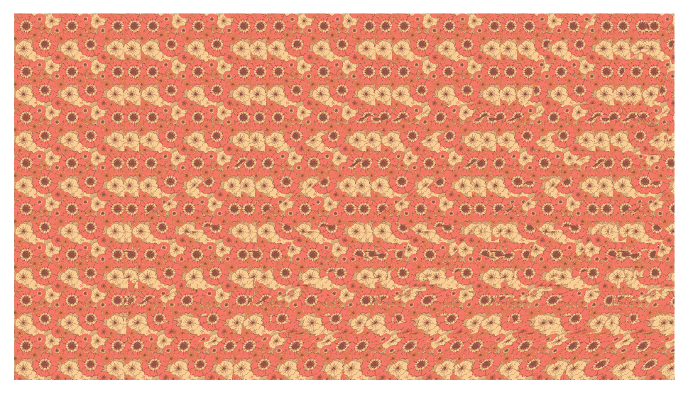

当我还是个孩子的时候，我就对 3D 很着迷——这在 90 年代初 VR 眼镜或 AR 出现之前很难得到。我曾经非常喜欢收集蜘蛛侠卡片，其中一种是全息图，我曾经认为这是最神奇的东西。我也曾经*喜欢*我曾经在科学杂志上看到的红色和蓝色 3D 立体图像。我清楚地记得虫子和恐龙。在拜访我叔叔的时候，我被介绍认识了 SIRDs，他的墙上有一个 SIRDs 尽管我不知道它叫这个名字。这是一个沉没的百宝箱，以鲨鱼为秘密图像，但我认为这是最酷的事情。直到最近，我才意识到，直到大约一两周前，我实际上仍然不知道它们是如何工作的——在第一次看到它们的 25 年后，我仍然不知道。嗯，这是足够的动机想知道更多。一旦我知道了它们是如何工作的，我就有了结合使用机器学习的单幅图像深度估计来将任何图像变成 SIRD 的想法，这在其他地方我没有见过。公平的警告，结果是击中和错过的基础上，单一的图像深度估计结果，但有些工作真的很好。我创建了一个 Twitter 机器人，如果你想关注它，它会发布一个 SIRD，@ AutoSIRD。

F 一、什么是单幅图像随机点立体图？

立体图是 3D 图像/表面的 ***错觉*** 。它们是编码立体信息的 2D 图像，因此当正确观看时，它们显示隐藏的 3D 图像[1]。有不同类型的立体图，但我将重点介绍的可能是最常见的，即“眼窝”或平行会聚型[2]。我不会进入大量的细节，但请检查我的参考资料，因为有一些非常好的资源，详细解释了一些基本原理，在这个项目中帮助了我。本质上，这个想法是通过改变左右眼看到的像素位移来创建一个感知的 3D 图像——大脑基本上完成了所有其余的工作。

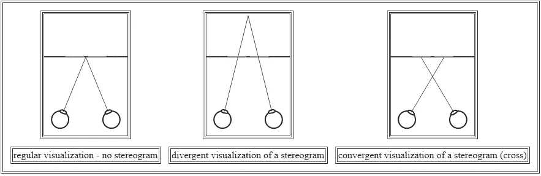

图片来自[1]。演示两种类型的立体图。在这篇文章中，我们关注的是发散型。

要创建这些图像，需要一些数组操作来移动像素，还需要一个深度图像来知道这些像素要移动多少。这里是最简单的情况，白色方块会出现在灰色方块的前面。我们使用重复的随机点模式来创建正确的图像，其中两个正方形区域中的像素被移动一定量:

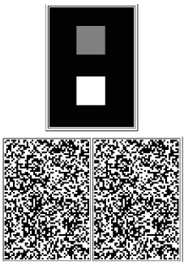

最简单的情况是显示两个正方形的深度图，其中白色越多，像素应该出现在前面，并且立体图对在正确观察时，将显示白色正方形出现在灰色正方形的前面。

这可以扩展到更复杂和更大的图像，其中图像是一条一条地构建的。我们也可以用一个图案来代替随机的黑白点。重要的是纹理要重复，并有足够的细节和对比度，我们的眼睛可以确定哪些像素被移动了以及移动了多少:

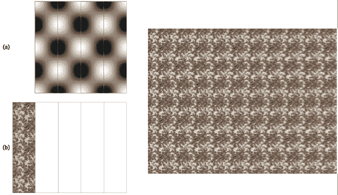

图片来自[3]一个示例，概述了如何使用 2D 正弦深度图和重复纹理图像创建单幅图像立体图。

创建条带时，每个条带都需要相对于相邻条带从左向右移动。这使得每个左右对是其自己的立体图，并且当编辑在一起时，形成拼接的图像。使用下面的公式来计算像素移动的量，以将灰度深度图转换为向右移动的一定数量的像素，其中假设坐标范围在[0，0]和[1，1]之间:

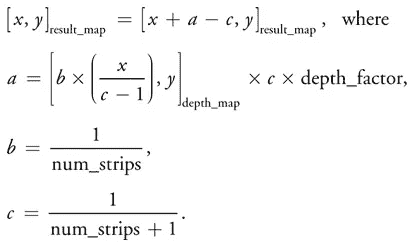

来自[3]等式的图像，用于确定如何将深度图图像转换为移位纹理图像。

这部分不太难。我使用了 Numpy 数组操作，虽然你也可以使用着色器，我认为这是最初的意图。仅仅使用上面的信息和任何深度图像，你就可以创建像这样的 SIRDs:

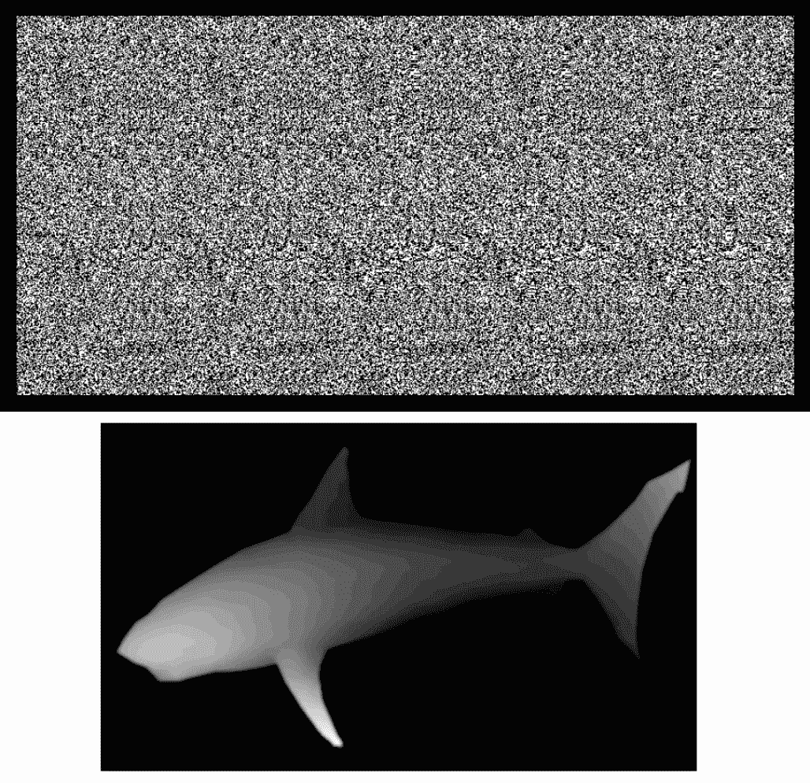

显示鲨鱼的单个图像随机点立体图的示例。深度图像显示灰度越白，纹理贴图中的像素移动越多。

但是现在问题来了，如何获得深度图像呢？有许多方法；使用你自己的 3D 渲染软件，比如 Blender，创建一个模型就是其中之一。你甚至可以使用 MS paint 来给物体上色，根据它们在前景(白色)或背景(黑色)以及两者之间的程度。另一种方法是使用 ***机器学习*** 。在这种情况下，我们可以使用 TF Hub 上可用的名为 [Midas (v2)](https://hub.tensorflow.google.cn/intel/midas/v2/2) 的模型，它被训练为从单个图像输入输出深度图。我们现在可以从任何图像输入中创建任何深度图。这是原始论文[4]，他们用它来制作本·伯恩斯效果动画，这是视频[的补充资料。](https://www.youtube.com/watch?v=3JroOSnBuAk)

我把它做成一个带有表格的谷歌笔记本，这样你就可以自己玩了。如果你使用下拉列表的例子，我有几个好的。

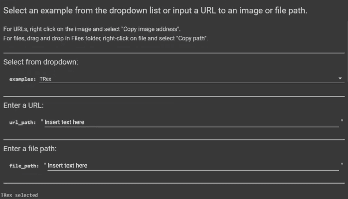

在谷歌 Colab 深度图输入图像

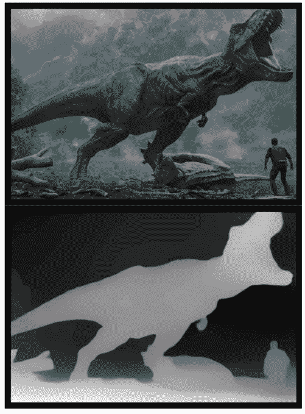

这是一本高水平的笔记本。
首先，我们通过预先训练的网络传递任何图像，以产生深度图。正如你所看到的，我们丢失了深度图的细节，这使得效果时好时坏。它需要是一个容易识别和简单的形状。在这种情况下，我认为霸王龙工作得很好，因为大多数人知道它是什么，当他们看到剪影。

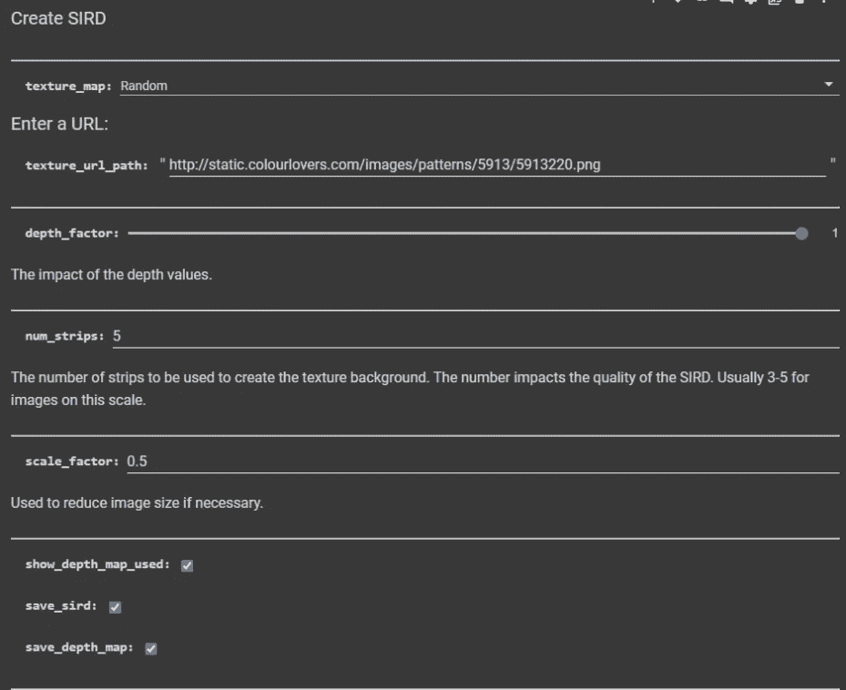

用于输入纹理图和 SIRD 参数的用户界面

接下来，我们找到一个纹理。为此，我使用了 [ColorLovers](https://www.colourlovers.com/) ，它有一个 API，我可以随机获得纹理，或者我可以获得单一图案的链接。png，然后我用它来形成重复的纹理图像。我已经编码，所以你可以提供一个图像链接，一个纹理链接，或者只是抓取一个随机纹理。在上面的图片中，我有一个链接，链接到一个我喜欢的纹理。输入参数(如 depth_factor 和 num_strips)与 SIRD 相关，而参数 scale_factor 将减小输入图像的大小。根据显示器的尺寸，通常有一个最合适的尺寸和条数，所以你可能需要自己摸索。它还取决于纹理和我们的眼睛能形成立体图的程度。

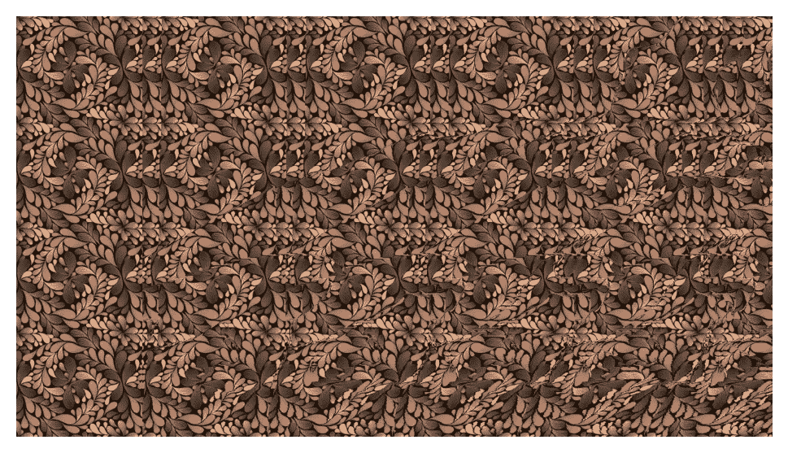

穿着 SIRD 的霸王龙——使用了来自 http://www.colourlovers.com/pattern/5913220/Why_not[的纹理](http://www.colourlovers.com/pattern/5913220/Why_not)...

就是这样！如果你想看代码，我鼓励你去看看 Colab。这里有更多有趣的例子！尽情享受吧！

我创建了一个 Twitter 机器人，如果你想关注它，它会发布一个 SIRD

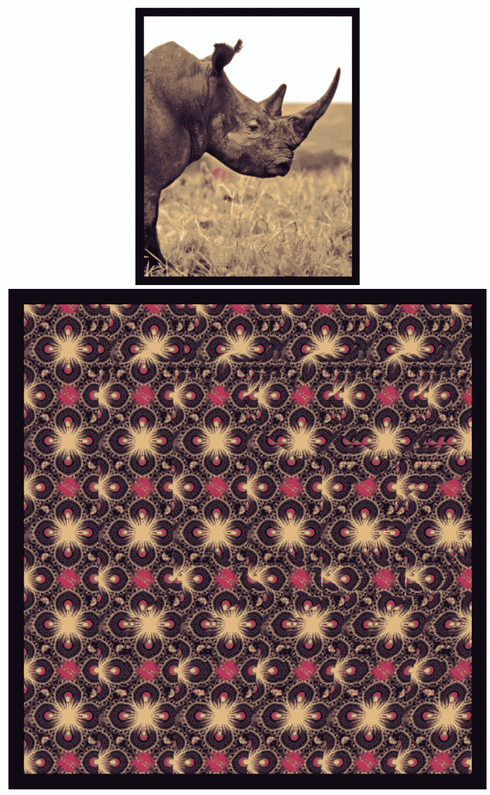

图片来自作者

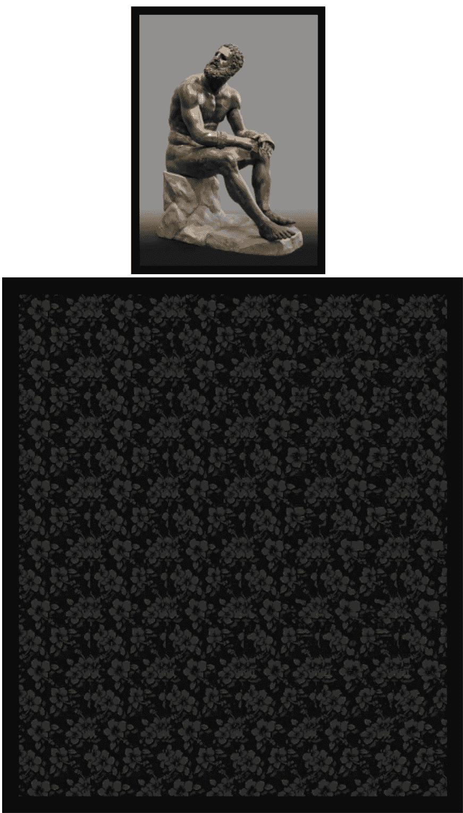

图片来自作者

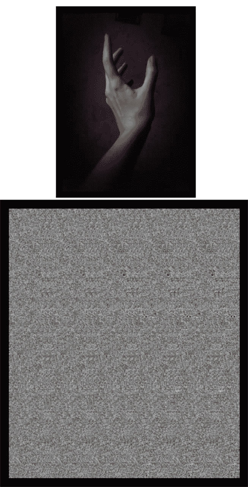

图片来自作者

参考资料:

[1] Júlio M. Otuyama，立体图教程。[https://www.ime.usp.br/~otuyama/stereogram/basic/index.html](https://www.ime.usp.br/~otuyama/stereogram/basic/index.html)T2【2】维基百科。自动立体图。[https://en.wikipedia.org/wiki/Autostereogram](https://en.wikipedia.org/wiki/Autostereogram)T5【3】*法比奥【波利卡波】*第四十一章。实时立体图。[https://developer . NVIDIA . com/sites/all/modules/custom/GPU gems/books/GPU gems/GPU gems _ ch 41 . html](https://developer.nvidia.com/sites/all/modules/custom/gpugems/books/GPUGems/gpugems_ch41.html)
【4】ran ftl 等人的《走向鲁棒的单目深度估计:混合数据集进行零炮跨数据集传输[https://arxiv.org/abs/1907.01341](https://arxiv.org/abs/1907.01341)