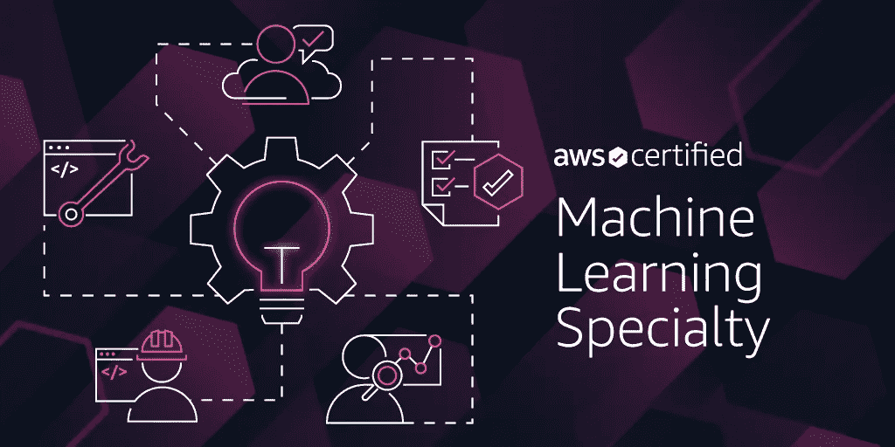
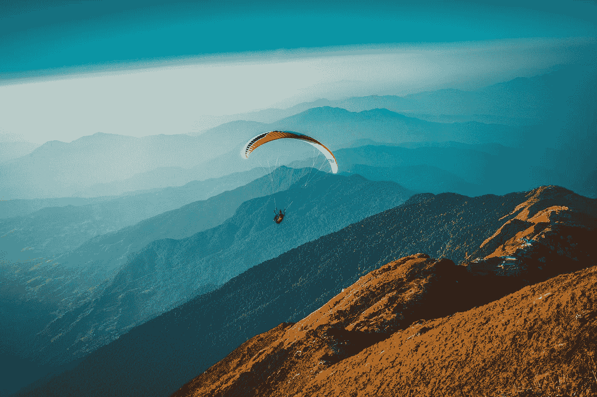
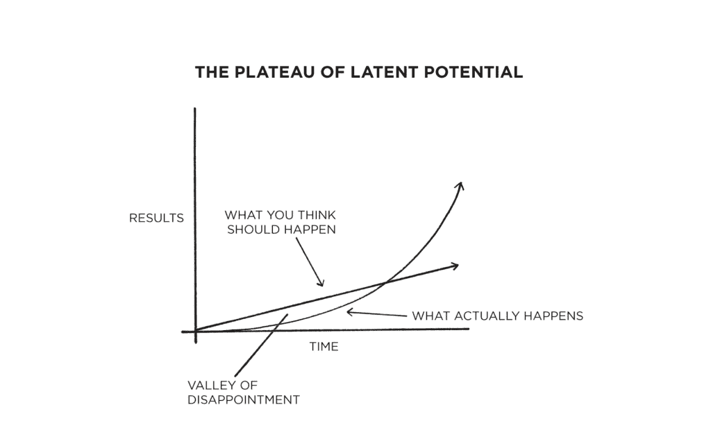
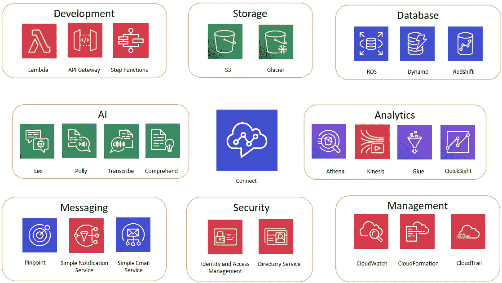
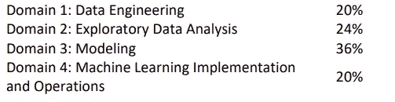
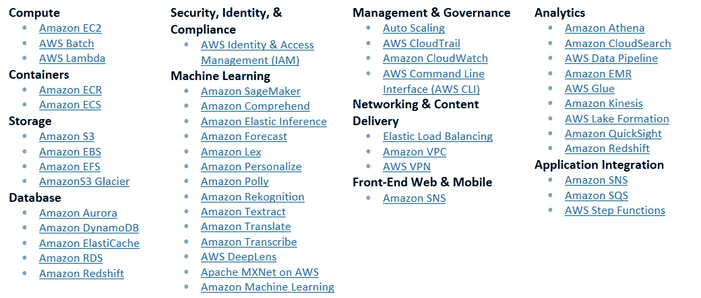

# AWS 认证机器学习专业—资源和经验

> 原文：<https://pub.towardsai.net/aws-certified-machine-learning-specialty-resources-and-experience-c7ef94d633cd?source=collection_archive---------2----------------------->

这篇文章涵盖了我获得 AWS 认证机器学习专业认证的经历，我已经分享了资源和备忘单，这有助于我理解概念！—2022 年 3 月

来源:[亚马逊](https://aws.amazon.com/blogs/machine-learning/become-a-certified-machine-learning-developer-with-the-new-aws-certified-machine-learning-specialty-certification/)

在认证的准备阶段，我在课程旁边看到了许多优秀的文章、博客和经验帖子，这些极大地帮助了我了解 AWS ML 世界的广度和深度。我想分享一下我的经历和我一路走来找到的资源，这提振了我参加认证的信心！好吧！让我们填一些颜色。

> ***这篇文章中我们都在谈论什么？***
> 
> ***体验***
> a .我的 AWS 和 ML 体验如何？
> b .为什么要学习，我的方法是什么？
> 
> ***资源***a .关于考试
> b .课程
> c .实践测试
> d. Youtube & Git 资源
> e .技术博客/复习资料/备忘单

# 1.经验

照片由[雷蒙·克拉文斯](https://unsplash.com/@raimondklavins?utm_source=medium&utm_medium=referral)在 [Unsplash](https://unsplash.com?utm_source=medium&utm_medium=referral) 上拍摄

## 我用 AWS 和 ML 有什么体验？

截至 2022 年 3 月，我有三年左右的数据经验。为了更深入地分析这一点，我已经做了 1 年半的数据科学家，在那里我收集数据、预处理、构建和评估 R&D 用例的模型。我有 1.5 年的咨询经验，曾与多个平台合作，通过构建 ETL 管道、仪表盘、云迁移和 ML 解决方案，帮助我们的客户充分利用他们的数据。

## 为什么要学习，我的方法是什么？

我接受了这个学习挑战，体验各种各样的 AWS 服务并解决数据问题。通过学习 AWS 认证解决方案架构师助理课程，我对 AWS 云有了基本的体验。它让我很好地理解了所有的 AWS 服务，它们如何通信，以及它们解决了什么问题。这些知识给了我一个很好的基线理解，这增强了我从事 ML 专业学习的信心，因为我喜欢在 ML 中成长。

詹姆斯·克利尔的原子习惯

对我来说，一致性是关键。下班后打开我的笔记本电脑，积极跟随老师和实验室，帮助我一天天地获得更多的知识。

40 天，我在工作之余致力于学习，每天学习一个新的概念/在更深刻的意义上理解同一个概念。在最初的 25 天里，我根据工作量每天工作 1-3 小时，在最后的 15 天里，我每个工作日工作 3-5 小时，周六和周日工作 8-9 小时。

# **2。资源**

【https://docs.aws.amazon.com/ 号

## 关于考试

考试包括建模和 ML 实现以及 EDA 和数据工程。你可以在家里或考点参加 3 个小时的考试，并回答 65 个正确答案。根据您的正确回答，他们会给您打 100 到 1000 分，及格分数为 750 分。幸运的是，没有负面的标记；不幸的是，多个正确答案没有部分得分。

> ***先决条件*** →根据 AWS 没有先决条件；但是，我非常鼓励[associative level AWS learning](https://www.udemy.com/course/aws-certified-solutions-architect-associate-saa-c02/)和吴恩达在[Coursera](https://www.coursera.org/learn/machine-learning)/[Youtube](https://www.youtube.com/watch?v=PPLop4L2eGk&list=PLLssT5z_DsK-h9vYZkQkYNWcItqhlRJLN)上开设的机器学习课程，以便深入了解 ML。

[AWS 认证| AWS 培训&认证](https://www.aws.training/certification)

## 课程

我参加了两门课程，对 AWS 的 ML 功能有了较高的理解。

[*云专家*](https://learn.acloud.guru/dashboard) 是一个实践实验室，旨在挑战您的直觉、创造力和 AWS 平台知识。通过本课程，您将对 AWS 上用于机器学习项目的服务和平台有一个扎实的了解。但是，在我看来，它未能详细涵盖深度学习、迁移学习和算法，而这些对考试非常重要。

[*StephanMaarek 的*](https://www.udemy.com/course/aws-machine-learning/) 课程对 NLP、深度学习、迁移学习、内置算法的解释比 ACG 好很多但没有涵盖很多动手实验。

所以，通过这两个课程，一定会画出一幅更好的图画！

> *✅* [*一片云宗师*](https://learn.acloud.guru/dashboard)*($ 47/月)*
> 
> *✅* [*斯蒂芬·马雷克*](https://www.udemy.com/course/aws-machine-learning/)*(15 美元一次性购买)*

做许多书面笔记，并标记出你没有完全理解的概念，以便你可以重新审视它们(*我已经列出了所有具有挑战性的主题的复选框列表，到考试时，我已经重新审视了它们多次，并已将它们打勾*)。在 StackOverflow 上发布你的疑问，并与参加过考试的人交谈，以获得新的视角。

一旦您对数据工程概念、AWS 服务、内置算法和 sagemaker 有了很好的了解，就开始参加一些实践测试吧！

## 模拟测试

有很多很好的实践测试，但不要过度拟合(ML 双关语！)你的大脑来进行这些测试；让你的大脑学会建立一个更好的思考方法，而不是把自己局限在模拟测试中。练习测试是了解你的弱点的一个很好的方法，这样你就可以在 Youtube 或课程上重温这些概念，或者在 sagemaker 中构建一些东西，并在这方面做得更好。

> *✅*[*awsstatic*](https://d1.awsstatic.com/training-and-certification/docs-ml/AWS-Certified-Machine-Learning-Specialty_Sample-Questions.pdf)*(自由)*
> 
> *✅*t28】t29】testprept31】
> 
> *✅*t34*skillcertpro*t37】
> 
> *✅*[*whiz labs*](https://www.whizlabs.com/)*/*[*教程道场*](https://portal.tutorialsdojo.com/courses/aws-certified-machine-learning-specialty-practice-exams/)/[*一种云宗师*](https://practice-exam.acloud.guru/f87ac9a1-2d47-44f1-8e10-2a8e43959ef5)

记下所有未知的单词、服务、算法、概念、方法，然后在 Youtube 上重温它们！了解了机理再回来练习测试。

## Youtube 和 Git 资源

YT 是深入理解 ML 概念和进行动手实验的绝佳资源。课程结束后，当我通过 YT 视频、博客和实践环节针对个人挑战性概念时，我对深度学习没有信心。

> *✅* [*亚马逊 SageMaker 全托管笔记本实例—深潜*](https://www.youtube.com/watch?v=uQc8Itd4UTs&list=PLhr1KZpdzukcOr_6j_zmSrvYnLUtgqsZz) — AWS YT 频道；涵盖深入的 sagemaker 概念
> 
> *✅* [*StatQuest！！！*](https://statquest.org/video-index/)*&*[*与机器学习交朋友*](https://www.youtube.com/playlist?list=PLRKtJ4IpxJpDxl0NTvNYQWKCYzHNuy2xG)*——*最好的 ML 资源了解 ML 的底层概念并非常好的解释
> 
> *✅* [*亚马逊 SageMaker 示例*](https://github.com/aws/amazon-sagemaker-examples/tree/728db4ccd753674f5ac4b5912db35bcbf3eea3ed/introduction_to_amazon_algorithms#amazon-sagemaker-examples) — GitHub 回购 jupyter 笔记本所有内置的 ML 算法
> 
> *✅* [*ML YouTube 课程*](https://github.com/dair-ai/ML-YouTube-Courses)——YouTube 上一些最好和最新的机器学习课程列表

现在是时候浏览一些由 AWS 认证人员撰写的技术博客，了解他们认为对考试至关重要的内容了！

## 技术博客/修订材料/备忘单

这些都是考前一周复习的最好资源。

> *✅*[*https://ffflora.cat/posts/*](https://ffflora.cat/posts/)*-*8 篇文章帮你修正整个 AWS ML 世界
> 
> *✅*[*https://sudo-code7.github.io/*](https://sudo-code7.github.io/)—为考试定制的大文章&优秀的[内置算法 cheetsheet！](https://sudo-code7.github.io/mls-c01/assets/data/AWS-SM-Built-in-Algos-Compared.pdf)
> 
> *✅* [*AWS 认证—机器学习概念—备忘单*](https://jayendrapatil.com/aws-certification-machine-learning-concepts-cheat-sheet/)

## AWS 资源

> https://docs.aws.amazon.com/**✅*[*(让自己熟悉所有你可能在课程/练习测试中听说过的 AI/ML 服务；检查下面提到的列表！)*](https://docs.aws.amazon.com/)*

**

*ML 考试最重要的(来源:[*https://docs.aws.amazon.com/*](https://docs.aws.amazon.com/)*)**

> **✅* [*内置算法常用信息*](https://docs.aws.amazon.com/sagemaker/latest/dg/common-info-all-im-models.html) (参考表格:算法名称、通道名称、训练输入模式、文件类型、实例类、可并行化)*

**

*人物角色注释；来源—[https://docs . AWS . Amazon . com/sage maker/latest/DG/common-info-all-im-models . html](https://docs.aws.amazon.com/sagemaker/latest/dg/common-info-all-im-models.html)*

> **✅*[*AWS 中的无服务器服务*](https://aws.amazon.com/serverless/) (了解哪些服务是无服务器的非常重要)*

**

*[https://blogs.itemis.com/en/serverless-services-on-aws](https://blogs.itemis.com/en/serverless-services-on-aws)*

## *给考生的输入*

*课程→实践测试→博客、YT、上机→实践测试→博客、YT、上机→备忘单&修改好→ [AWS 考试](https://www.aws.training/Certification)！*

## *结论*

*这次学习之旅让我对机器学习以及如何使用 AWS 服务解决问题有了很大的了解。我很高兴尝试这些，并帮助客户发展业务！*

*祝你考试顺利！:)*

*感谢您阅读文章！学习愉快:)*

****

*照片由[戴恩·托普金](https://unsplash.com/@dtopkin1?utm_source=medium&utm_medium=referral)在 [Unsplash](https://unsplash.com?utm_source=medium&utm_medium=referral) 上拍摄*