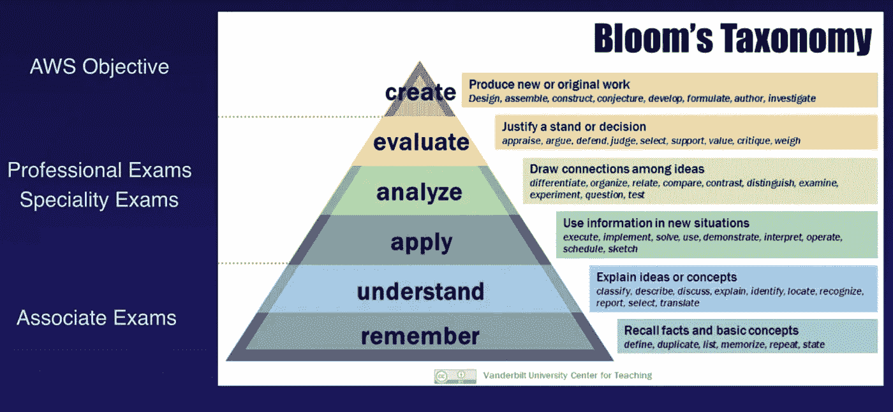

# AWS 认证解决方案架构师助理| 2019 年考试提示

> 原文：<https://pub.towardsai.net/aws-certified-solutions-architect-associate-exam-tips-2019-3fc034efdebe?source=collection_archive---------0----------------------->

## [云计算](https://towardsai.net/p/category/cloud-computing)

## 亚马逊网络服务解决方案架构师助理认证考试提示

我刚刚通过了 AWS 认证解决方案架构师助理考试👏🏻👏🏻👏🏻并且想和大家分享一下我的经验和备考小技巧。目前，该平台拥有 140 多种不同的服务，每天都有新的服务推出。试图理解整个生态系统可能会非常困难。如果您在工作中没有很多机会使用 AWS，参加解决方案架构师助理考试实际上是让您熟悉该平台的一个不错的地方。

在这篇文章中，我将简要介绍 AWS 提供的不同认证考试，然后谈谈帮助我通过考试的资源，希望这些资源能帮助你通过考试。🌟

> 我的背景:我是一名数据科学家，我的 AWS 实践经验仅限于 EC2。我并不真正使用存储和网络解决方案。我当然不会设计关键的大规模高性能生产系统。我在准备考试时学到的大部分东西对我来说都是新的。

# AWS 认证路线图(截至 2019 年 5 月)

[AWS 认证 2019](https://aws.amazon.com/certification/?nav=tc&loc=3)

截至 2019 年，有 3 种途径获得 AWS 认证-架构师、运营和开发人员，还有 5 种专业考试-网络、大数据、安全、机器学习和 Alexa。我相信现在参加专业考试不需要通过助理级别，但是我听说专业级别[要难很多](https://medium.com/cloud-academy-inc/get-ready-for-the-aws-solutions-architect-professional-certification-62776cc3fd24)，所以从助理级别开始可能是个好主意。对于 3 个助理级别的考试来说，SysOps 似乎是最难的，其次是解决方案架构师，而开发人员方向相对来说是最容易的。

[aCloudGuru 机器学习专业课程幻灯片](https://learn.acloud.guru/course/aws-certified-machine-learning-specialty/dashboard)

许多人建议将解决方案架构师助理考试作为您的第一个证书，因为它测试最重要的 AWS 产品，并侧重于“服务如何协同工作，为所呈现的情况提供最佳(且经济高效的)解决方案。”这正是我选择开始我的 AWS 之路的地方。阅读[这篇文章](https://info.acloud.guru/resources/which-aws-certification-should-i-take)了解更多关于你应该参加哪种认证考试的信息。

# 解决方案架构师助理考试概述

示例问题🧐

> 您的 web 应用程序前端由一个弹性负载平衡器后面的多个 EC2 实例组成。您将 ELB 配置为对这些 EC2 实例执行健康检查。如果一个实例未能通过运行状况检查，下列哪项陈述是正确的？
> 
> A.该实例被 ELB 自动替换。
> 
> B.ELB 会自动终止该实例。
> 
> C.ELB 停止向运行状况检查失败的实例发送流量。
> 
> D.该实例被 ELB 隔离以进行根本原因分析

以上问题摘自官方 AWS [样题](http://awstrainingandcertification.s3.amazonaws.com/production/AWS_certified_solutions_architect_associate_examsample.pdf)。在你真正的考试中，问题要么是“给定需求和约束，你将如何设计或改进这个系统”，要么是“给定一个系统，解释为什么某些行为/错误/瓶颈会发生”。最重要的是理解关于性能、可伸缩性、可用性、成本和安全性的需求和约束。

将有 65 个问题，你有 130 分钟。都是或者单项或者多项选择题。大约 65%通常是及格分数。

我的观点是，如果你对 AWS 有一些相关的经验，并对网络和数据库有基本的了解，在 1 到 2 个月内通过考试可能是一个现实的计划(我花了这么长时间)。关键是关注什么是重要的——理解不同的服务、特性和权衡。AWS 不会测试你点击哪个按钮来设置 Lambda 函数，也不会测试你预定的 EC2 实例要花多少钱。但是您需要了解哪种存储解决方案是最佳选择，因为您存储的是图像数据，不需要频繁检索，但是当您需要数据时，它必须立即可用。

# 解决方案架构师助理考试主题

我认为您需要非常了解的核心服务包括:

*   EC2 (AZ、自动扩展、负载平衡器、安全组)
*   VPC(子网、NAT 网关、主机、网络 ACL)
*   S3(不同的 S3 类、加密、版本控制、跨区域复制、生命周期)
*   RDS(多 AZ，跨区域复制)

您需要了解其基本功能的服务包括:

*   存储:冰川，DynamoDB，存储网关，极光，弹性缓存，红移，EFS
*   计算:λ，ECS，弹性豆茎
*   网络:Route53、API 网关、CloudFront
*   管理和监测:IAM，CloudWatch，CloudFormation，KMS
*   分析:Kinesis，雅典娜
*   应用:SQS，社交网络

我知道有很多，尤其是随机的🔥AWS 人给他们的产品起的名字。什么是雪球☃️？什么是室壁运动🔬？有一种服务叫做雅典娜🧚‍♀️？为什么有些服务从亚马逊开始，有些从 AWS 开始？亚马逊 SageMaker 但是 AWS RoboMaker，亚马逊红移但是 AWS 自动缩放？为什么完全不同的东西会有非常相似的名字？NAT 网关，存储网关，互联网网关，API 网关？为什么有些服务有缩写名称，有些名称中有空格，有些有驼峰式名称，有些甚至有破折号？ok“E”在 EMR、ECS、EKS、ECR、EFS 都是“elastic”但是 ElastiCache 呢(这些 AWS 的人怎么发音？)和弹性豆茎？不应该是 EC 和 EB 代替吗？为什么有如此多的服务名称中带有“云”字样？这里的一切不都是☁️的阴云吗？好吧 EC2 是指 2 Cs，S3 是 3 Ss，但是什么是 Cloud9，Route53 呢？我现在将停止抱怨，但是如果你同意 AWS 命名很糟糕，请阅读这篇[帖子](https://read.acloud.guru/dear-aws-we-need-to-talk-about-service-naming-d33ea68027d8)以获得建设性的 AWS 命名反馈，并且用简单的英语查看[AWS](https://www.expeditedssl.com/aws-in-plain-english)😬。

# 准备资源

*   瑞安·克鲁尼伯格的《T4》课程👨‍🏫:极度最新(导师经常考试，更新内容)；概述了 AWS 生态系统和服务；非常丰富的讲座和实验。强烈推荐。必须带。全网最好的 AWS 备考课程。一个月才 29 美元，你在想什么？已经注册了。
*   教程道场练习题✍️::acloudguru 课程的唯一缺点是练习题不够多，Udemy 练习题对我来说很神奇。它很像真正的考试，有数百个练习题。whizlabs 也提供练习题，但我自己还没有试过。
*   AWS 模拟考试:20 道题 20 美元。你可以在你注册真正考试的同一个页面上购买。
*   [Qwiklab](https://www.qwiklabs.com/quests/10) :尽管你不会被问到创建一个服务或者从零开始构建一个 VPC 的步骤，但是我发现做一些实验非常有帮助，特别是对于我上面列出的核心服务(EC2、VPC、S3 和 RDS)。
*   Abhishek Shaha 的关于考试技巧的[文章](http://www.cloudforest.in/2016/09/pass-aws-certification-exam-in-10-days.html):关于考试技巧的很棒的文章，带有示例问题，但它是在 2016 年写的，所以一些部分可能不是最新的。
*   一个 [GitHub 帖子](https://gist.github.com/leonardofed/bbf6459ad154ad5215d354f3825435dc)提供了准备考试的资源:开源回购、博客&博客帖子、电子书、PDF、白皮书、视频课程、免费讲座、幻灯片、样本测试和许多其他资源。有一些关于系统设计最佳实践的 re: Invent 视频，我觉得非常有帮助。

还有很多可用的培训资源，我没有在这里介绍，只是因为我没有使用过它们。我听说了关于 [LinuxAcademy](https://linuxacademy.com/amazon-web-services/training/course/name/aws-certified-solutions-architect-associate-level) 课程和实验室的好评。包括 AWS 在内的许多人都建议阅读 AWS [Q & A pages](https://aws.amazon.com/faqs/) 和[白皮书](https://aws.amazon.com/whitepapers/)，但它们非常长，有些内容可能与解决方案架构师助理考试没有直接关系。如果我错过了任何你觉得有帮助并愿意分享的东西，请在评论中告诉我！

# 物流提示

*   考试注册页面用你的亚马逊购物账户验证你(怪异的🛒).如果您一直使用昵称，那么您需要提交您的 ID 进行更改。

AWS 培训和认证登录

*   考试将在 PSI 测试地点进行。离我最近的考点也就一个小时的路程。我建议你报名参加下午的考试，这样你就可以避开早上的交通堵塞。🌵
*   拿着你政府颁发的身份证🆔和一张信用卡💳。不允许使用电子身份证。确保你的许可证没有过期(没有后续问题，非常感谢)。
*   使用洗手间🚽首先是因为考试一旦开始就不能暂停。
*   你会得到一支铅笔✏️，一张纸📃、计算器🧮和耳塞🔕。我不知道为什么需要计算器，因为我没有被测试过任何定价问题。
*   在你提交答案后，你就会知道你是否通过了🥶.
*   你的证件在 3️⃣年内有效。需要重考或者参加专业考试。
*   可选的随机提示:练习用另一只手使用鼠标，这样你就可以拿着铅笔做笔记，节省来回切换的时间。

> Fun note: There is a Chinese proverb called “左右開弓” 🏹 which means a person who can “draw a bow with both their left and right hand”. It basically means they are ambidextrous and super competitive and smart.

# 现在怎么办？

1.  创建一个帐户来安排您的真实和模拟考试: [AWS 认证&培训](https://www.aws.training/Dashboard/?cta=tctopbanner)
2.  完成 aCloudGuru 课程或您选择的课程
3.  做一些实验(如果您能创建一个具有公共和私有子网(NAT)的 VPC，一个具有 ELB 和自动伸缩功能的高可用性 web 服务，一个以 CloudFront 作为 CND、以 Route53 作为 DNS 的博客网站，那么您就可以做得很好了。)
4.  在考试前两周参加 AWS 模拟考试，以评估你的知识和考试技巧
5.  练习模拟试题，很多
6.  通过你的考试[告诉我](http://linkedin.com/in/tinabu/)🙋🏻你有多棒
7.  在现实生活中使用 AWS

通过解决方案架构师考试并非易事，但这只是第一步。特别是考虑到解决方案架构师助理考试非常侧重于概念和设计选择，而不是实施细节，因此不能保证通过考试后您就能成为优秀的云架构师。获得认证并不能帮助你快速排除系统中的问题。它甚至不会让你在完成后记得关闭服务。可以有很多策略来帮助你通过考试，但要真正知道如何使用 AWS，将它用于你的工作或辅助项目是最好的学习方法。