# AWS re:发明 2020 机器学习主题演讲回顾和亮点

> 原文：<https://pub.towardsai.net/aws-re-invent-2020-machine-learning-keynote-recap-7f14e31819fa?source=collection_archive---------0----------------------->

## [新闻](https://towardsai.net/p/category/news)，[科技](https://towardsai.net/p/category/technology)

## 分享想法和思考要点

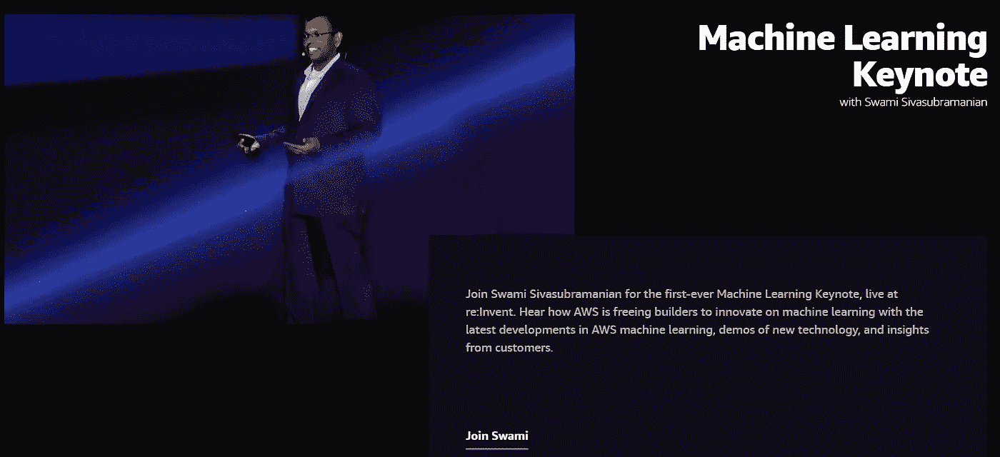

W 欢迎来到首次**机器学习主题演讲**at**[AWS**re:Invent**](https://reinvent.awsevents.com/)**。这是一个 2 小时的虚拟会议，由亚马逊机器学习副总裁 Swami Sivasubramanian 博士讲授 AWS 机器学习和人工智能的最新发展、发布和演示，以及客户见解和成功案例。让我们按时间顺序回顾一下主要亮点。****

# ****2020 年发布 250 多项新功能****

****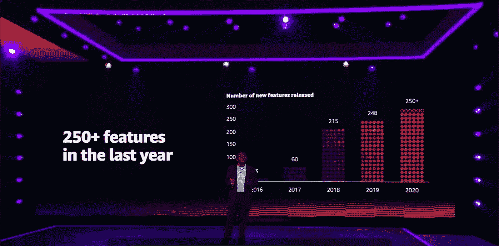****

****基于工作日，AWS 在 2020 年发布一个新的 ML/AI 功能平均只需要一天多一点的时间！即使按日历天数计算，平均也仍然只需要不到 2 天就能实现这一壮举。今年 AWS ML/AI 的创新步伐真的快得令人难以置信。****

> ****你怎么想呢?****

# ****92%基于云的 TensorFlow 和 91%基于云的 PyTorch 在 AWS 上运行****

****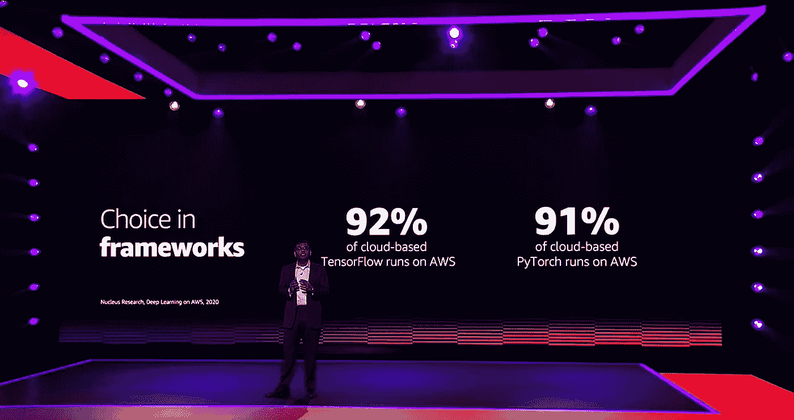****

****以上信息来自 [Nucleus Research U192 —指南:AWS 上的深度学习—2020 年 11 月 23 日](https://nucleusresearch.com/research/single/guidebook-deep-learning-on-aws-2/)。AWS 上基于云的 PyTorch 运行的百分比应该是 90%，而不是 91%。另一方面，下面来自 [Kaggle 的《2020 年机器学习和数据科学状况](https://storage.googleapis.com/kaggle-media/surveys/Kaggle%20State%20of%20Machine%20Learning%20and%20Data%20Science%202020.pdf)调查》的横条图也显示，AWS 是最受企业数据科学家欢迎的云平台。****

****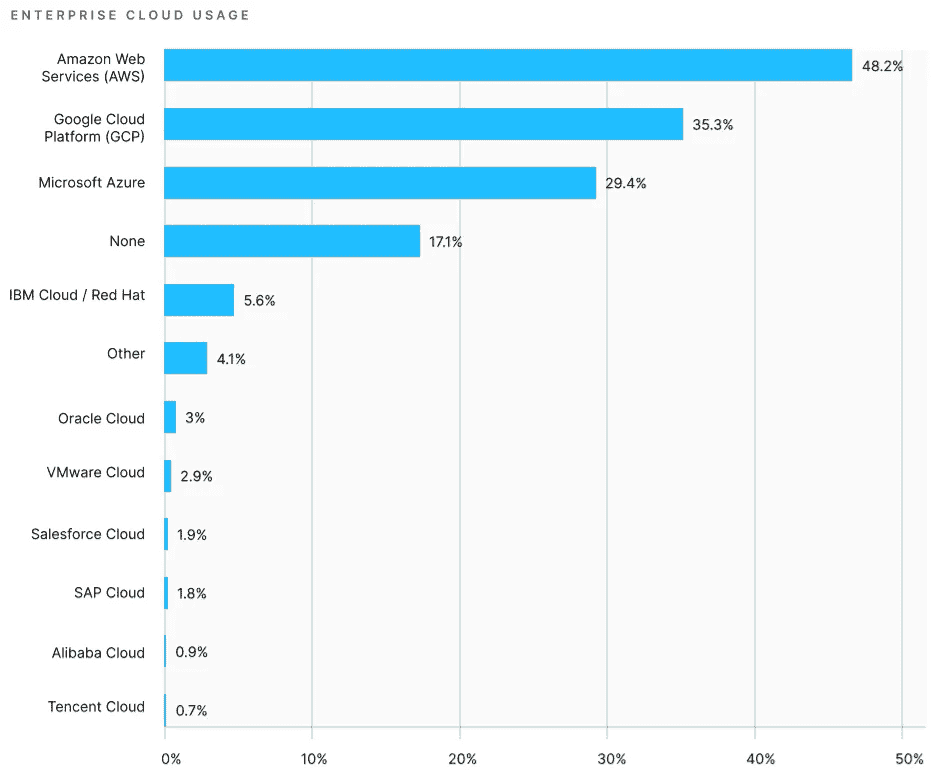****

****企业云计算，Kaggle 的 2020 年机器学习和数据科学状况调查****

# ****基于 Habana Gaudi 的**亚马逊 EC2 实例******

****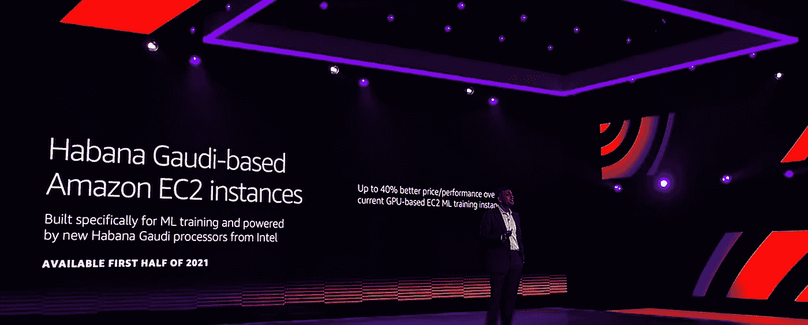****

****基于 Habana Gaudi 的亚马逊 EC2 实例将于 2021 年上半年上市。 [Habana Gaudi AI 处理器](https://habana.ai/training/)专为 ML 培训工作负载打造，与当前基于 GPU 的亚马逊 EC2 实例相比，其性价比最高可提高 40%。****

****从这篇[新闻稿](https://newsroom.intel.com/news/aws-leverages-habana-gaudi-ai-processors)和[公告博客](https://habana.ai/habana-gaudi-ai-processors-to-bring-lower-cost-to-train-to-amazon-ec2-customers/)中了解更多信息。****

# ****自动气象站列车****

****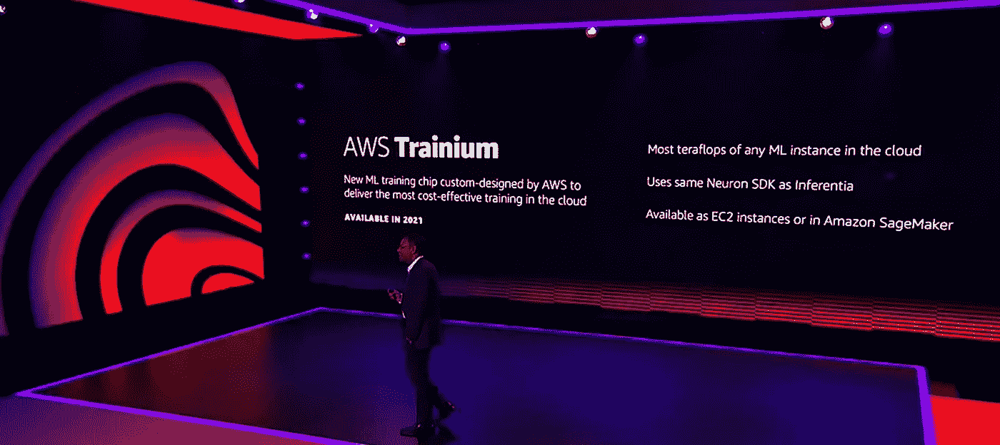****

****[AWS Trainium](https://aws.amazon.com/machine-learning/trainium/) 将于 2021 年上市。它是 AWS 设计和构建的一种新的定制机器学习训练芯片，用于在云端提供最具成本效益的 ML 训练。我认为将它的性价比与其他 AI 训练加速器 ASICs 如 [Habana Gaudi](https://habana.ai/gaudi-integrated-roce/) 和 [Cloud TPU](https://cloud.google.com/tpu/) 进行比较将是令人兴奋的。****

# ****亚马逊 SageMaker 上更快的分布式培训****

****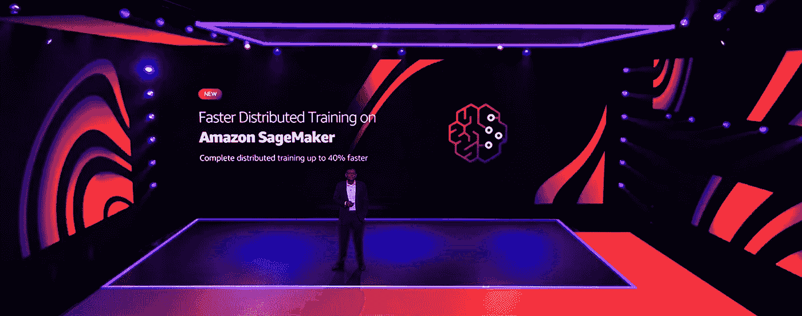****

****[引入的两个新的 SageMaker 数据并行和模型并行分布式培训库是:](https://aws.amazon.com/sagemaker/distributed-training/)****

*   ****[SageMaker 分布式数据并行](https://docs.aws.amazon.com/sagemaker/latest/dg/data-parallel.html)****
*   ****[SageMaker 分布式模型并行](https://docs.aws.amazon.com/sagemaker/latest/dg/model-parallel.html)。****

****一个令人信服的展示是 [AWS 和 NVIDIA 凭借这一功能实现了 Mask R-CNN 和 T5–3B](https://aws.amazon.com/blogs/machine-learning/aws-and-nvidia-achieve-the-fastest-training-times-for-mask-r-cnn-and-t5-3b/)的世界最快训练时间。****

> ****[**Mask R-CNN** (基于区域的卷积神经网络)](https://arxiv.org/abs/1703.06870)是一种最先进的(SOTA)深度神经网络架构，用于计算机视觉对象检测中的实例分割。****
> 
> ****[**T5——3B**(文本到文本转换转换器——30 亿个参数)](https://github.com/google-research/text-to-text-transfer-transformer)是谷歌的 SOTA 自然语言处理(NLP)模型，在[庞大的干净爬行语料库(C4)](https://www.tensorflow.org/datasets/catalog/c4) 数据集上进行预训练。在 [*SuperGLUE*](https://super.gluebenchmark.com/) 基准测试中，它在多个 NLP 任务上取得了接近人类的性能。****

****从[发布博客](https://aws.amazon.com/blogs/aws/managed-data-parallelism-in-amazon-sagemaker-simplifies-training-on-large-datasets/)和[分布式培训](https://docs.aws.amazon.com/sagemaker/latest/dg/distributed-training.html#distributed-training-get-started)指南中了解更多信息。****

****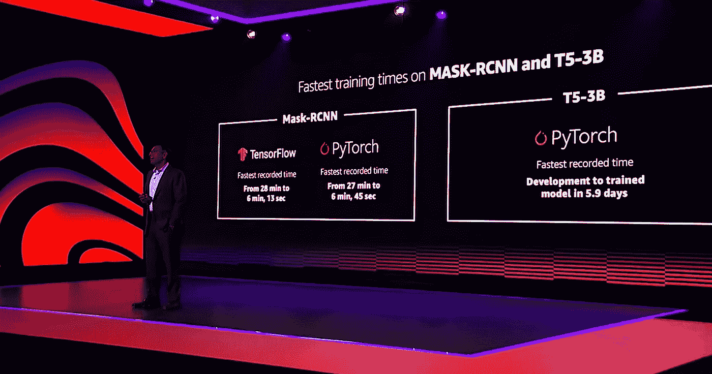****

# ****亚马逊 SageMaker 数据辩论者****

****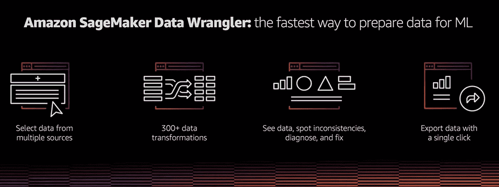****

****[**亚马逊 SageMaker 数据牧马人**](https://aws.amazon.com/sagemaker/data-wrangler/) 现已普遍上市。它通过可视化界面为机器学习提供了更快、更简单的数据准备。****

****从[发布博客](https://aws.amazon.com/blogs/aws/introducing-amazon-sagemaker-data-wrangler-a-visual-interface-to-prepare-data-for-machine-learning)和[数据辩论者](https://docs.aws.amazon.com/sagemaker/latest/dg/data-wrangler-getting-started.html)指南中了解更多信息。****

# ****亚马逊 SageMaker 特色店****

****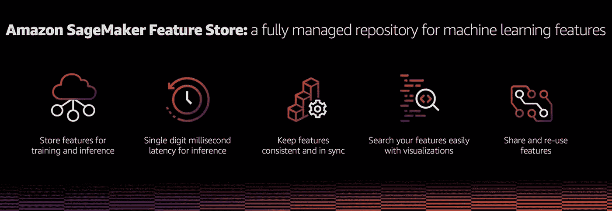****

****[**亚马逊 SageMaker 特色店**](https://aws.amazon.com/sagemaker/feature-store/) 现已普遍发售。它作为一个完全托管的存储库来存储、发现和共享机器学习(ML)功能。这使得能够重复使用机器学习功能，从而为机器学习工作流节省时间和成本。****

****从[发布博客](https://aws.amazon.com/blogs/aws/new-store-discover-and-share-machine-learning-features-with-amazon-sagemaker-feature-store/)和[功能商店](https://docs.aws.amazon.com/sagemaker/latest/dg/feature-store-getting-started.html)指南中了解更多信息。****

# ****亚马逊 SageMaker Clarify****

****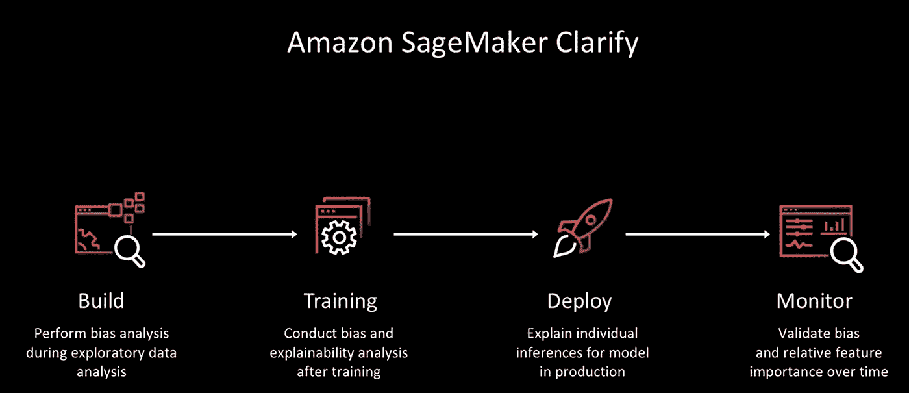****

****[**亚马逊 SageMaker 澄清**](https://aws.amazon.com/sagemaker/clarify/) 现已普遍上市。它支持数据和模型中的偏差检测，以及理解模型行为的模型可解释性。这个特性有助于提高模型的公平性和透明度，从而构建更安全、更负责任的人工智能解决方案。****

****从[这个公告博客](https://aws.amazon.com/blogs/aws/new-amazon-sagemaker-clarify-detects-bias-and-increases-the-transparency-of-machine-learning-models/)和[模型公平性和可解释性](https://docs.aws.amazon.com/sagemaker/latest/dg/clarify-fairness-and-explainability.html)指南中了解更多信息。****

# ****Amazon SageMaker 调试器的深度剖析****

****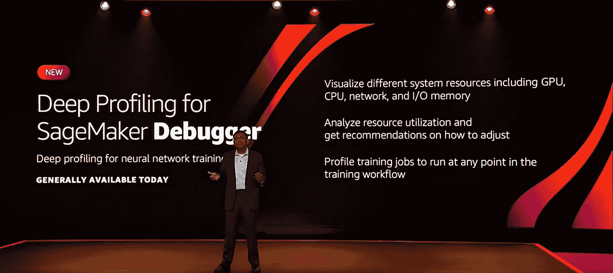****

******Amazon SageMaker 调试器**的深度剖析现已正式推出。它能够对机器学习培训工作进行深度剖析。此功能对于识别培训瓶颈和系统资源利用率非常有用。****

****从[这篇公告博客](https://aws.amazon.com/blogs/aws/profile-your-machine-learning-training-jobs-with-amazon-sagemaker-debugger/)和[了解更多信息，利用 Amazon SageMaker Debugger](https://aws.amazon.com/blogs/machine-learning/identify-bottlenecks-improve-resource-utilization-and-reduce-ml-training-costs-with-the-new-profiling-feature-in-amazon-sagemaker-debugger/) 博客中的深度剖析功能识别瓶颈、提高资源利用率并降低 ML 培训成本。****

# ****亚马逊 SageMaker 管道****

****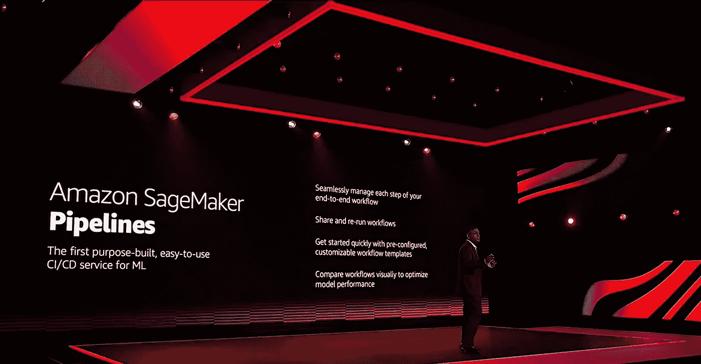****

****[**亚马逊 SageMaker 管道**](https://aws.amazon.com/sagemaker/pipelines) 现已普遍上市。这是第一个专门为机器学习构建的持续集成和持续交付(CI/CD)服务。此功能通过内置或自定义 MLOps 模板实现了自动化的端到端 MLOps 工作流。以下是 SageMaker Pipelines MLOps 工作流程的演示。****

****从[这个公告博客](https://aws.amazon.com/blogs/aws/amazon-sagemaker-pipelines-brings-devops-to-machine-learning-projects/)和这些 [SageMaker 管道入门](https://docs.aws.amazon.com/sagemaker/latest/dg/sagemaker-projects.html)指南中了解更多信息。****

****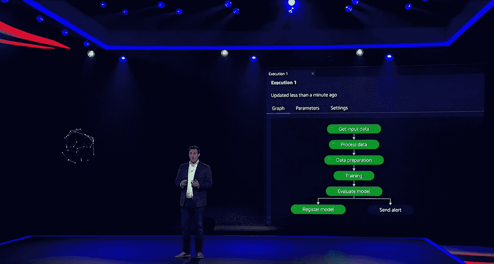****

# ****亚马逊 SageMaker Edge Manager****

****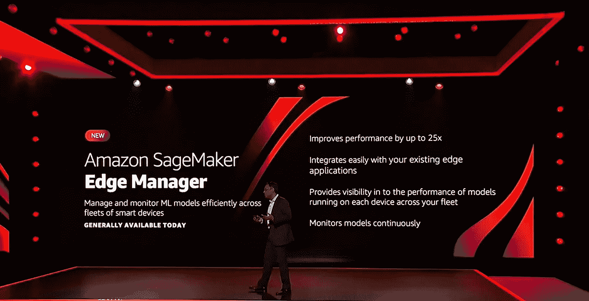****

****[**亚马逊 SageMaker Edge Manager**](https://aws.amazon.com/sagemaker/edge-manager/)**现已普遍上市。它简化了智能相机、机器人、个人电脑和移动设备等边缘设备的 ML 模型管理。******

******从[这个公告博客](https://aws.amazon.com/blogs/aws/amazon-sagemaker-edge-manager-simplifies-operating-machine-learning-models-on-edge-devices/)和这个 [Edge Manager 入门](https://docs.aws.amazon.com/sagemaker/latest/dg/edge-manager-getting-started.html)指南中了解更多信息。******

# ******亚马逊红移 ML******

******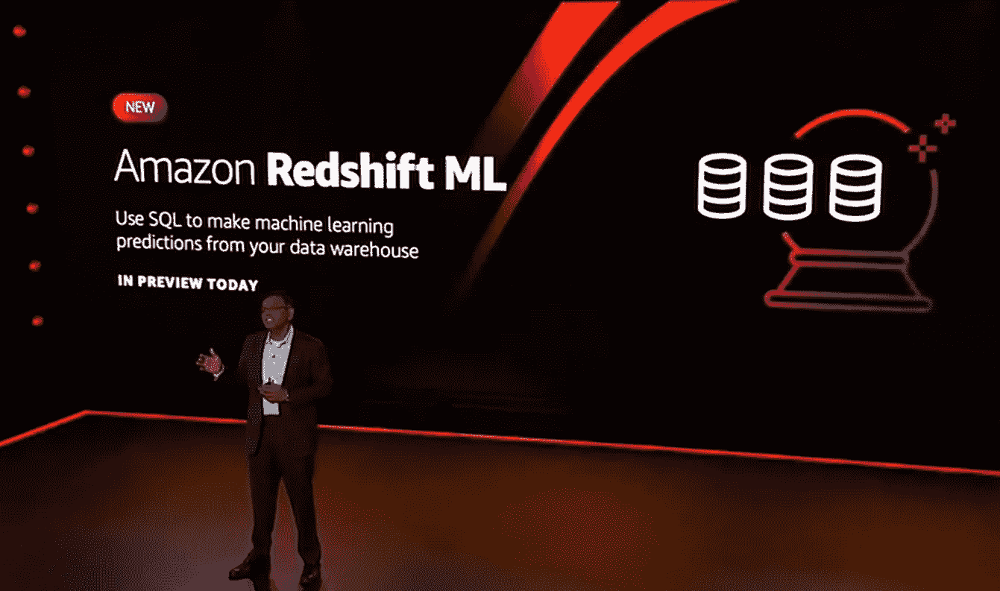******

********亚马逊红移 ML** 现已推出预览版。它使数据分析师和数据库开发人员能够利用 SQL 从 Amazon Redshift 中的数据创建和训练 ML 模型，并使用这些模型进行数据库内预测。[亚马逊红移](http://aws.amazon.com/redshift)是最受欢迎的、完全管理的、Pb 级的数据仓库。******

****从[这篇发布博客](https://aws.amazon.com/blogs/big-data/create-train-and-deploy-machine-learning-models-in-amazon-redshift-using-sql-with-amazon-redshift-ml/)和这篇[红移 ML 入门](https://docs.aws.amazon.com/redshift/latest/dg/geting-started-machine-learning.html)指南中了解更多信息。****

# ****亚马逊海王星 ML****

****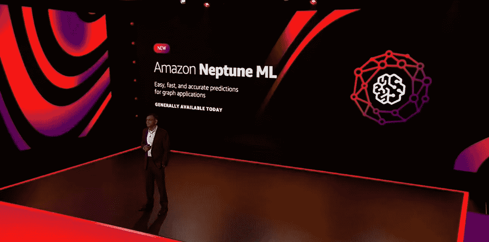****

****[**亚马逊海王 ML**](https://aws.amazon.com/neptune/machine-learning/) 现已普遍上市。它使用图形神经网络(GNNs)对图形进行简单、快速和更准确的预测。 [Amazon Neptune](https://aws.amazon.com/neptune/) 是一种快速、可靠、完全托管的图形数据库服务，可以轻松构建和运行处理高度关联数据集的应用程序。****

****从[这篇公告博客](https://aws.amazon.com/blogs/database/announcing-amazon-neptune-ml-easy-fast-and-accurate-predictions-on-graphs/)和这篇[使用 Neptune ML on graphs](https://docs.aws.amazon.com/neptune/latest/userguide/machine-learning.html) 指南中了解更多信息。****

# ****亚马逊 QuickSight Q****

****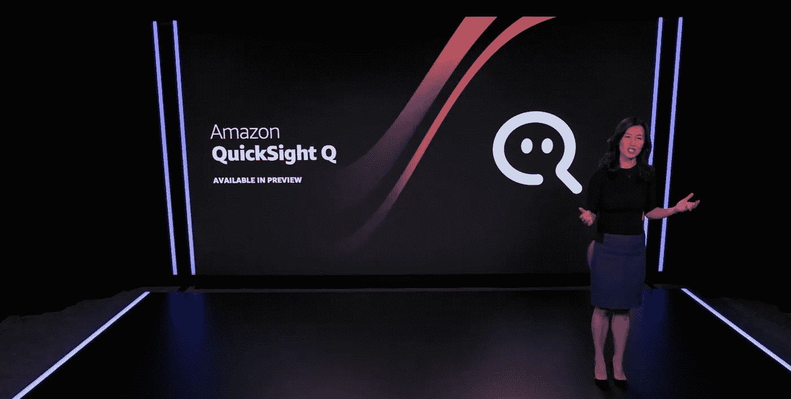****

****[**亚马逊 QuickSight Q**](https://aws.amazon.com/quicksight/q) 现已预告。它是一种商业智能的自然语言搜索服务，允许业务用户用简单的语言提出数据问题，并立即获得答案。 [Amazon QuickSight](https://aws.amazon.com/quicksight) 是一种可扩展、无服务器、可嵌入、基于机器学习的商业智能(BI)服务，专为云构建。以下是 QuickSight 仪表盘中显示的用户用简单英语询问的结果演示。****

****从[这篇公告博客](https://aws.amazon.com/blogs/aws/amazon-quicksight-q-to-answer-ad-hoc-business-questions/)中了解更多信息。****

************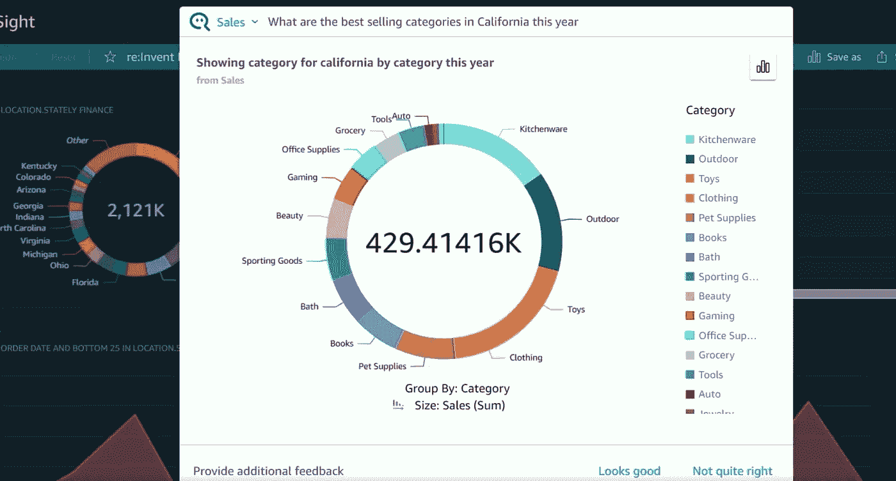****

# ****亚马逊寻找度量标准****

****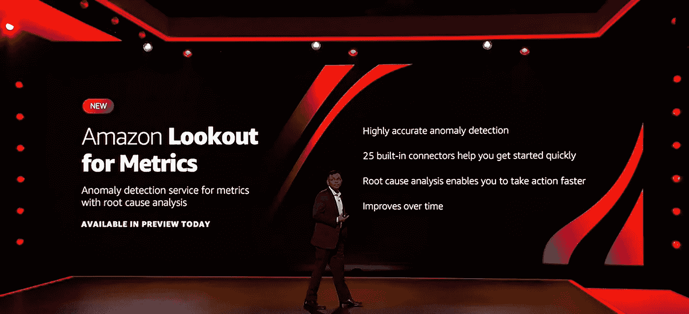****

****[**亚马逊 Lookout for Metrics**](https://aws.amazon.com/lookout-for-metrics/)**现已推出预览版。这是一种自动检测和诊断指标异常的服务，如产品销售下降或合格销售线索突然增加。它还提供了根本原因分析，使企业能够更快地采取行动来处理异常情况。******

******从[这篇公告博客](https://aws.amazon.com/blogs/aws/preview-amazon-lookout-for-metrics-anomaly-detection-service-monitoring-health-business/)中了解更多信息。******

# ******亚马逊 Monitron******

******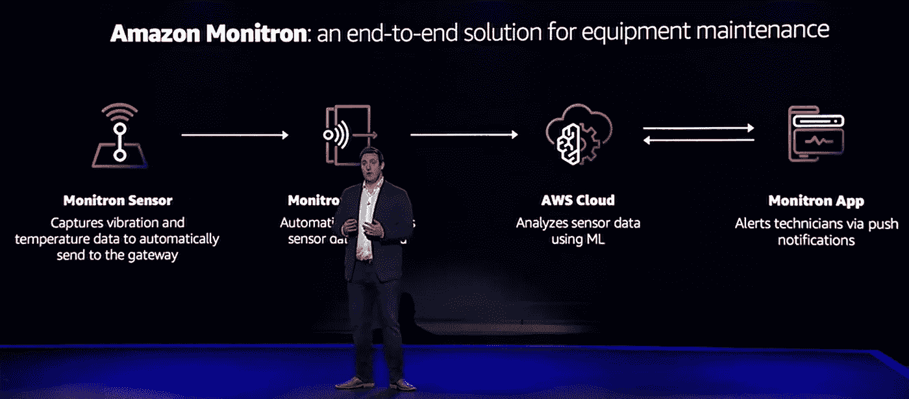******

******[**亚马逊 Monitron**](https://aws.amazon.com/monitron/) 现已普遍上市。这是一种端到端的预测性维护服务，可监控工业机械设备并自动检测潜在故障，以最大限度地减少计划外停机时间。亚马逊 Monitron 入门套件现已上市。******

****从[这篇公告博客](https://aws.amazon.com/blogs/aws/amazon-monitron-a-simple-cost-effective-service-enabling-predictive-maintenance/)中了解更多信息。****

# ****亚马逊寻找设备****

****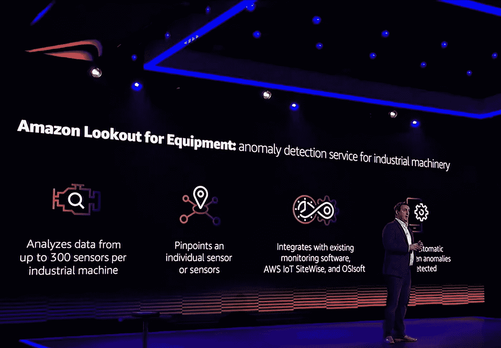****

****[**亚马逊寻找装备**](https://aws.amazon.com/lookout-for-equipment/) 现已在预览中。这是一项异常检测服务，允许拥有现有设备传感器的客户使用 AWS ML 模型来检测异常设备行为，并实现预测性维护。****

****从[这篇公告博客](https://aws.amazon.com/blogs/aws/new-amazon-lookout-for-equipment-analyzes-sensor-data-to-help-detect-equipment-failure/)中了解更多信息。****

# ****亚马逊视觉了望台****

****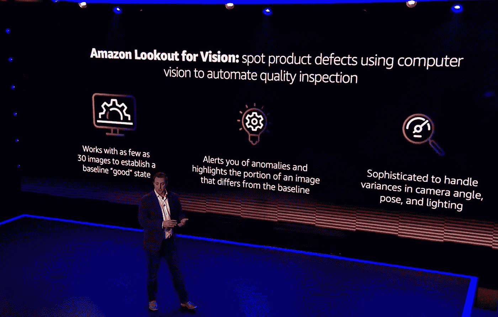****

****[**亚马逊瞭望视野**](https://aws.amazon.com/lookout-for-vision/) 现已有预告。这是一种使用计算机视觉(CV)来发现产品中的视觉缺陷和异常的服务，以实现制造质量检测的自动化。****

****从[这个公告博客](https://aws.amazon.com/blogs/aws/amazon-lookout-for-vision-new-machine-learning-service-that-simplifies-defect-detection-for-manufacturing/)和 [Lookout for Vision 开发者指南](https://docs.aws.amazon.com/lookout-for-vision/latest/developer-guide/what-is.html)中了解更多信息。****

# ****AWS Panorama 设备****

****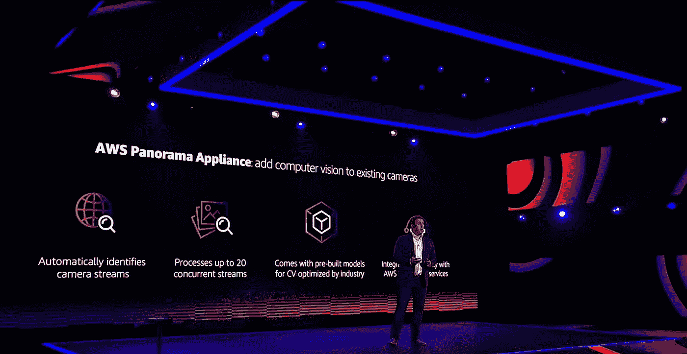****

****[**AWS 全景设备**](https://aws.amazon.com/panorama/appliance/) 现已作为 [AWS 全景](https://aws.amazon.com/panorama/)的一部分在预览中提供。它是一种硬件设备，为现有的互联网协议(IP)相机增加了计算机视觉(CV)功能，而现有的互联网协议(IP)相机不是为适应 CV 而构建的。它将现有的 IP 摄像机转变为智能摄像机，可以在多个并发视频流上运行 CV 模型，具有低延迟和高数据隐私性。****

****从[这篇公告博客](https://aws.amazon.com/blogs/aws/using-computer-vision-applications-at-the-edge/)中了解更多信息。****

# ****AWS 全景 SDK****

****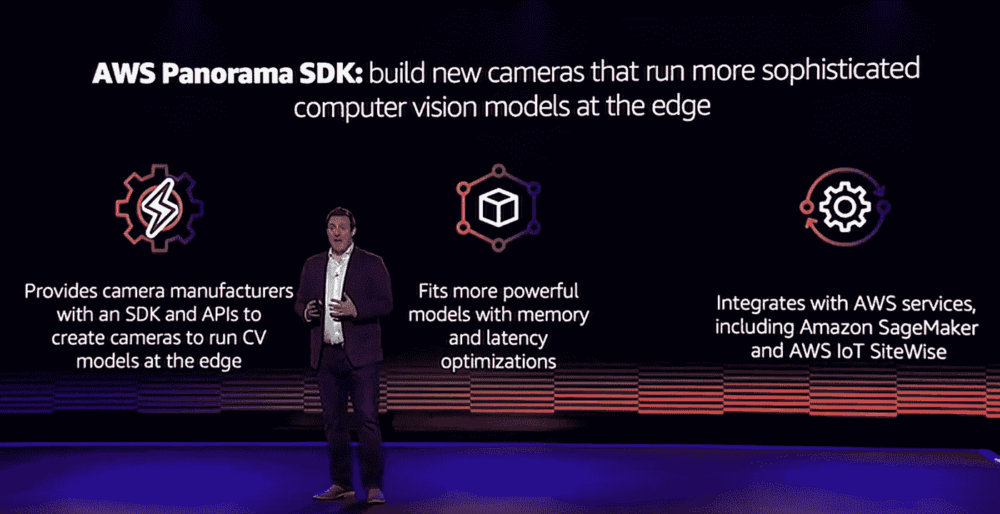****

****[**AWS 全景 SDK**](https://aws.amazon.com/panorama/panorama-device-sdk/) 现已作为 [AWS 全景](https://aws.amazon.com/panorama/)的一部分在预览版中提供。它是一个软件开发工具包(SDK)，使第三方制造商能够构建新的相机，在边缘运行 CV 模型，用于对象检测、面部识别或活动识别等任务。****

****从[这篇公告博客](https://aws.amazon.com/blogs/machine-learning/introducing-the-aws-panorama-device-sdk-scaling-computer-vision-at-the-edge-with-aws-panorama-enabled-devices/)中了解更多信息。****

# ****亚马逊健康湖****

****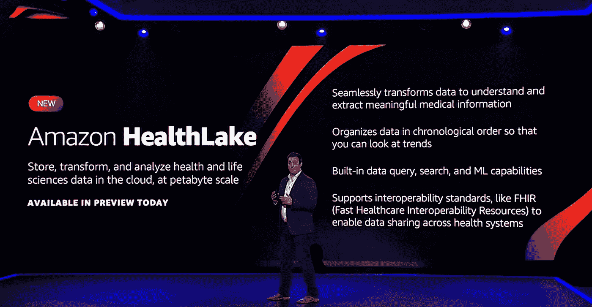****

****[**亚马逊健康湖**](https://aws.amazon.com/healthlake/) 现已提供预览。这是一项完全托管的符合 HIPAA 标准的服务，允许医疗保健和生命科学客户将其来自不同孤岛和格式的健康数据聚合到一个 Pb 级的集中式 AWS 数据湖中。****

****从[这个公告博客](https://aws.amazon.com/blogs/aws/new-amazon-healthlake-to-store-transform-and-analyze-petabytes-of-health-and-life-sciences-data-in-the-cloud/)和 [HealthLake 入门](https://aws.amazon.com/healthlake/getting-started/)指南中了解更多信息。****

# ****机器学习教育****

****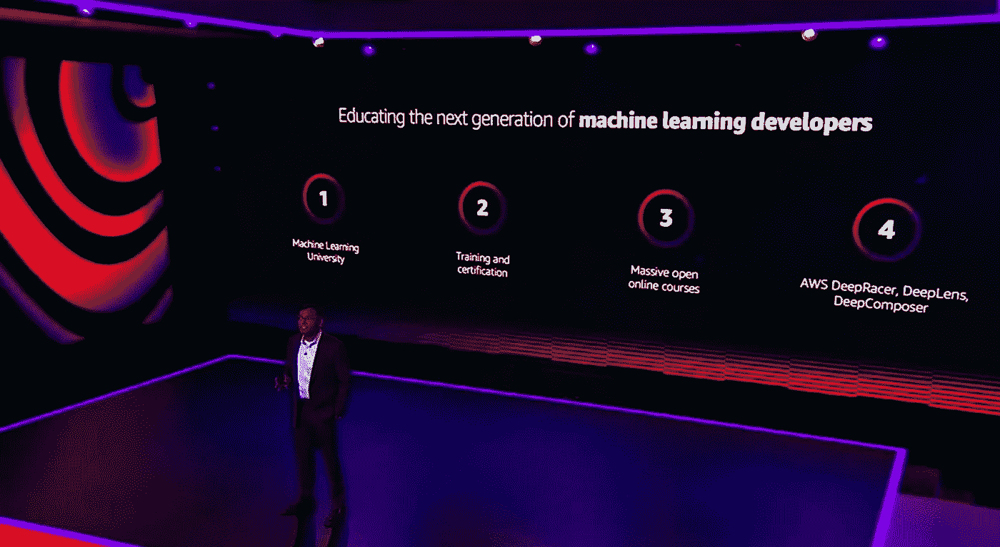****

****这里列出了 AWS 公共资源、与第三方合作的大规模开放在线课程(MOOC)，如 [Coursera](https://www.coursera.org/) 、 [edX](https://www.edx.org/) 、 [Udacity](https://www.udacity.com/) ，以及为任何对机器学习教育感兴趣的人提供的教育设备。****

1.  ****[AWS 机器学习大学](https://aws.amazon.com/machine-learning/mlu/)****
2.  ****[AWS 机器学习](https://aws.amazon.com/training/learn-about/machine-learning/)****
3.  ****[AWS 机器学习培训库](https://www.aws.training/LearningLibrary?filters=classification%3A30&filters=language%3A1&search=&tab=view_all)****
4.  ****[AWS 升级指南:机器学习](https://d1.awsstatic.com/training-and-certification/ramp-up_guides/Ramp-Up_Guide_Machine_Learning.pdf)****
5.  ****[AWS 教育:机器学习科学家职业道路](https://www.awseducate.com/student/s/pathways#ML)****
6.  ****[Udacity-AWS:机器学习工程师纳米学位](https://www.udacity.com/course/machine-learning-engineer-nanodegree--nd009t)****
7.  ****[Coursera-AWS:AWS 机器学习入门](https://www.coursera.org/learn/aws-machine-learning)****
8.  ****[edX-AWS:亚马逊 SageMaker:简化机器学习应用开发](https://www.edx.org/course/amazon-sagemaker-simplifying-machine-learning-appl)****
9.  ****[AWS DeepLens](https://aws.amazon.com/deeplens/)****
10.  ****[AWS DeepRacer](https://aws.amazon.com/deepracer/)****
11.  ****[AWS DeepComposer](https://aws.amazon.com/deepcomposer/)****

# ****五项原则****

1.  ****提供**坚实的基础******
2.  ****创造最短的**成功之路******
3.  ******将机器学习**扩展到更多的建设者****
4.  ****解决**真实业务问题**、**端到端******
5.  ****持续学习****

******其中一些原则与亚马逊的一项或多项领导原则相一致，比如**学习和好奇**(原则 5)。******

# ******最终想法******

****我们可以看到，今年很多 AWS ML/AI 的新创新都是以 AWS SageMaker 和工业机器学习服务为中心的。毫无疑问，为什么 AWS SageMaker 成为 AWS 历史上增长最快的服务之一。如果 AWS 在未来继续保持或加快 ML/AI 的创新步伐，我相信 AWS 在未来将继续保持其在 [Gartner 云 AI 开发者服务魔力象限](https://www.gartner.com/doc/reprints?id=1-1YCWP1OB&ct=200213)中的领先优势。****

****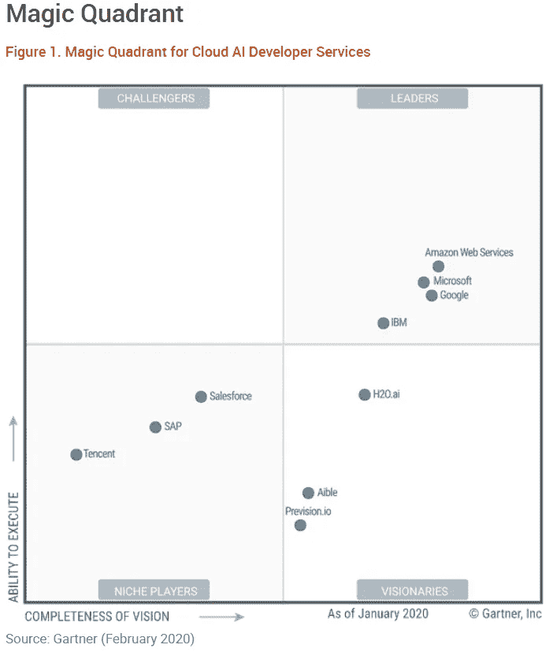****

****Gartner 的云人工智能开发者服务魔力象限(2020 年 2 月)****