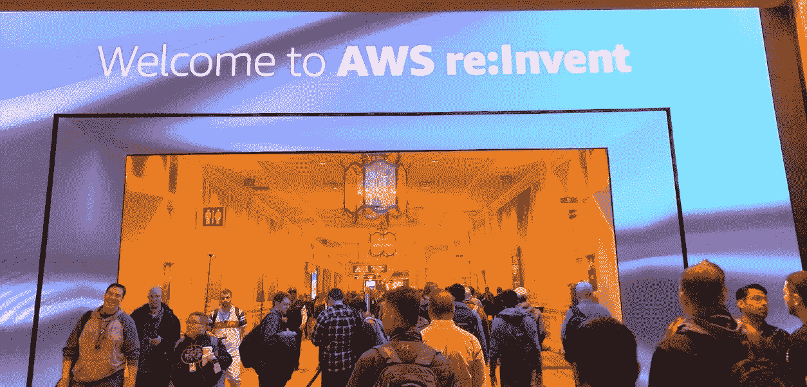
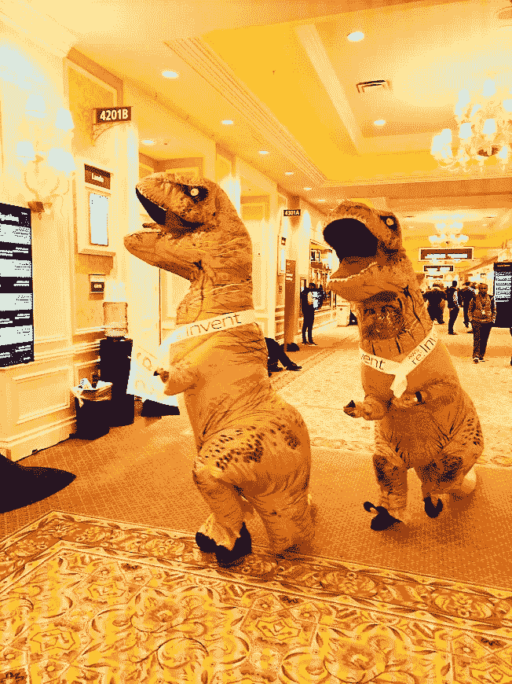

# AWS re:为建筑商和建筑师发明 2021 人工智能和机器学习会议指南

> 原文：<https://pub.towardsai.net/aws-re-invent-2021-ai-ml-session-guide-for-builders-and-architects-8ffc2cf78606?source=collection_archive---------0----------------------->

## [职业生涯](https://towardsai.net/p/category/careers)

## 我的 5 大推荐

欢迎来到 2019 年拉斯维加斯威尼斯人的 AWS re:Invent。朱夫海峡。保留所有权利。

# **前言**

我创建这个指南来分享我对 AWS re: Invent 2021 与会者最期待的 5 场会议，他们对**人工智能和机器学习(AI & ML)** 会议感兴趣。今年有 100 多场 AI & ML 径赛。

如果您尚未注册将于 11 月 29 日至 12 月 3 日开始的 [AWS re:Invent 2021](https://reinvent.awsevents.com/) ，您仍可以在他们的[注册页面](https://reinvent.awsevents.com/register/)注册。完成注册并登录后，您可以在 [re: Invent sessions 仪表盘](https://portal.awsevents.com/events/reInvent2021/dashboard/event/sessions)中查看完整的会议详情。

请注意，虚拟与会者可以现场直播主题演讲和领导会议，分组会议将在活动结束后按需提供。

# **人工智能& ML 构建者&架构师**的前 5 场会议

## **1。**kyn 003:**Swami Sivasubramanian 主题演讲**

**周三。，12 月 1 日上午 8:30—太平洋标准时间上午 10:30 |面对面&虚拟**

L 聆听亚马逊机器收入副总裁 Swami Sivasubramanian 博士和其他演讲者关于 AWS AI & ML 的最新关键发展和创新。在这个 2 小时的机器学习主题会议中，有新产品&服务发布、客户案例、演示等。

如果你有兴趣了解更多关于过去的 re: Invent 机器学习主题演讲，完整的视频会议和博客可以在下面找到。

*   [AWS re:Invent 2020—Swami Sivasubramanian 的机器学习主题演讲](https://www.youtube.com/watch?v=PjDysgCvRqY)
*   [re:Invent 2020 Liveblog:机器学习主题演讲](https://aws.amazon.com/blogs/aws/reinvent-2020-liveblog-machine-learning-keynote/)
*   [AWS re:Invent 2020 机器学习主题回顾&亮点](/aws-re-invent-2020-machine-learning-keynote-recap-7f14e31819fa)

## **2。** AIM416: **在亚马逊 SageMaker (Workshop)上使用拥抱脸模型**

星期一。，11 月 29 日下午 4:45—7:00 PST |亲临| [**会议日历邀请**](https://www.google.com/calendar/render?action=TEMPLATE&text=AIM416%09Using%20Hugging%20Face%20models%20on%20Amazon%20SageMaker&location=Cristal%201%2C%20Wynn&details=The%20field%20of%20natural%20language%20processing%20(NLP)%20is%20developing%20rapidly%2C%20and%20NLP%20models%20are%20growing%20increasingly%20large%20and%20complex.%20Through%20strong%20ecosystem%20partnerships%20with%20organizations%20like%20Hugging%20Face%20and%20advanced%20distributed%20training%20capabilities%2C%20Amazon%20SageMaker%20is%20one%20of%20the%20easiest%20platforms%20with%20which%20to%20quickly%20train%20NLP%20models.%20In%20this%20workshop%2C%20see%20how%20to%20quickly%20train%20an%20NLP%20model%20from%20the%20Hugging%20Face%20transformers%20library%20with%20just%20a%20few%20lines%20of%20code%20using%20PyTorch%20or%20TensorFlow%20as%20well%20as%20SageMaker%E2%80%99s%20distributed%20training%20libraries.&dates=20211130T004500Z%2F20211130T030000Z)

ugging Face 是一个快速发展、广受欢迎的开源 AI/ML 社区中心，用于自然语言处理(NLP)模型、数据集以及社区 ML 应用程序和演示空间。

我非常想知道如何在亚马逊 SageMaker 上使用 PyTorch 或 TensorFlow 和 [SageMaker 的分布式训练库](https://docs.aws.amazon.com/sagemaker/latest/dg/distributed-training.html)通过几行代码快速训练一个拥抱脸变形器 NLP 模型。我向对使用拥抱脸和 SageMaker 构建 NLP 应用感兴趣的构建者强烈推荐这个研讨会。

## **3。** ARC323: **设计架构良好的机器学习工作负载(粉笔对话)**

**周三。太平洋标准时间 12 月 1 日下午 3:15-4:15 |面对面**

Y 您将了解 AWS 良好架构框架的[机器学习镜头，该框架为您提供了一套既定的最佳实践和架构原则，用于跨 ML 生命周期阶段设计工作负载。本课程推荐给对设计和应用架构最佳实践到 ML 工作负载感兴趣的架构师或构建者。](https://docs.aws.amazon.com/wellarchitected/latest/machine-learning-lens/machine-learning-lens.html)

## **4。** AIM417: **使用 Amazon SageMaker 轻松部署模型以获得最佳性能&成本**

星期三。、12 月 1 日下午 5:30—下午 6:30 PST |亲临&虚拟(点播)| [**会议日历邀请**](https://www.google.com/calendar/render?action=TEMPLATE&text=AIM417%09Easily%20deploy%20models%20for%20the%20best%20performance%20%26%20cost%20using%20Amazon%20SageMaker&location=Level%203%2C%20Lido%203004%2C%20The%20Venetian&details=Optimizing%20cloud%20resources%20to%20achieve%20the%20best%20cost%20and%20performance%20for%20your%20ML%20model%20is%20critical.%20In%20this%20session%2C%20learn%20how%20to%20use%20Amazon%20SageMaker%20to%20run%20performance%20benchmarks%20and%20load%20tests%20for%20inference%20to%20determine%20the%20right%20instance%20types%20and%20model%20optimizations.&dates=20211202T013000Z%2F20211202T023000Z)

P 性能效率和成本优化是 [AWS 良好架构框架](https://docs.aws.amazon.com/wellarchitected/latest/framework/welcome.html)的五大支柱中的两大支柱，代表了高效利用计算资源以满足系统需求并以最低价格交付商业价值的能力。

对于希望学习如何使用 Amazon SageMaker 运行性能基准和负载测试以进行推理，从而确定正确的实例类型大小和模型优化以获得最佳性价比的构建者，建议参加本专题讲座。

## **5。** AMZ302: **亚马逊的 MLOps:如何大规模生产 ML 工作负载(分组会议)**

星期四。太平洋标准时间 12 月 2 日下午 2:30-3:30 |面对面&虚拟(点播)

M LOps(机器学习操作)持续、自动地加速 ML 生产工作负载的交付。越来越多的组织正在使用或打算使用 MLOps 来优化生产提前期和 ML 工作负载的其他运营指标。

从本专题讲座中了解 AWS MLOps 如何帮助将生产级 ML 基础设施交付时间从数周缩短至数小时(使用来自 Amazon 的具体数据和示例)，并轻松实现可重用性或生成新的 ML 解决方案。

## **特别提及:首届年度**[**AWS BugBust re:Invent Challenge**](https://reinvent.awsevents.com/learn/bug-bust/)

**太平洋标准时间 11 月 29 日上午 10:00-12 月 3 日下午 2:00 |面对面&虚拟**

> AWS BugBust re:Invent 挑战赛面向所有具备 Python 或 Java 知识的开发人员开放，无论他们是否参加 re:Invent。将有一系列奖品，从帽衫和苍蝇拍到亚马逊回声点，所有参与并达到挑战中特定里程碑的人都可以获得。
> 
> 还有令人垂涎的“终极 AWS BugBuster”头衔，以及 1500 美元的现金奖励，奖励谁在活动期间通过挤压 bug 获得最多积分。

要注册或了解更多关于这个挑战，相关链接如下。

 [## AWS BugBust

### AWS BugBust

BugBust bugbust](https://bugbust.aws/)  [## 帮助在 AWS re:Invent 2021 | Amazon Web Services 上创造 BugBusting 历史

### 今年早些时候，我们发起了 AWS BugBust Challenge，这是世界上第一个修复一百万个代码的全球竞赛…

aws.amazon.com](https://aws.amazon.com/blogs/aws/help-make-bugbusting-history-at-aws-reinvent-2021/)  [## AWS BugBust 挑战开发者在 re:Invent 2021 上创下 Bug 突破世界纪录

### 软件错误是令人讨厌的，费时的，对任何人来说都是最昂贵的软件开发成本之一…

devops.com](https://devops.com/aws-bugbust-challenges-developers-to-set-world-record-for-bug-busting-at-reinvent-2021/) 

玩得开心，享受你重新发明会议和经验！欢迎在这篇文章中分享你的想法或问题。

AWS re:Invent 2019 上爆笑的霸王龙服装。朱夫海峡。保留所有权利。

AWS re:Invent 2019 上的爆笑河马服装。朱夫海峡。保留所有权利。