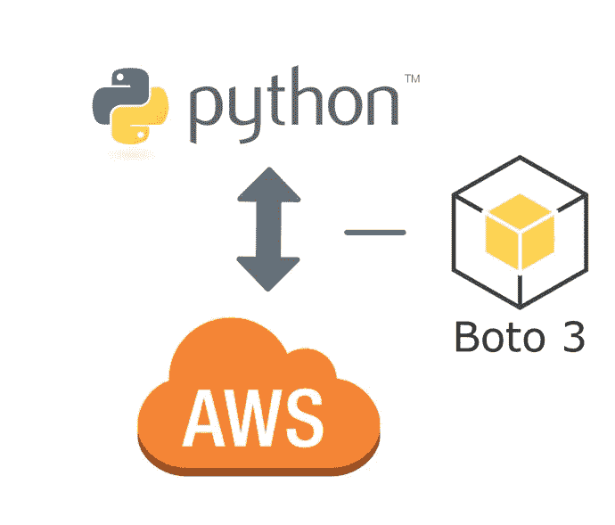
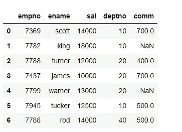
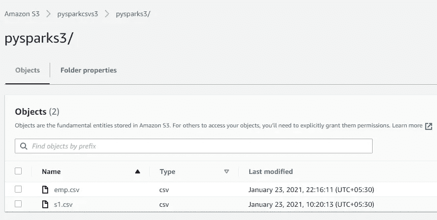
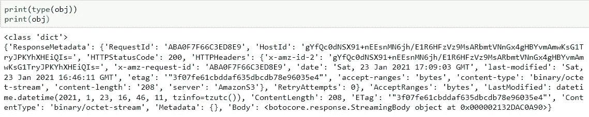
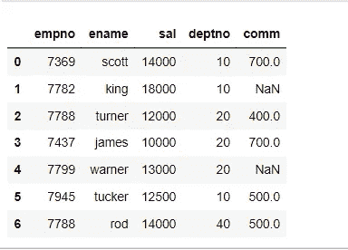

# 使用 Pandas API 的 AWS S3 读写操作

> 原文：<https://pub.towardsai.net/aws-s3-read-write-operations-using-the-pandas-api-ae624c4bd1a0?source=collection_archive---------1----------------------->

## [编程](https://towardsai.net/p/category/programming)

这篇博客的目的是建立对亚马逊网络存储服务“S3”的基本读写操作的理解。更具体地说，使用 Pandas 读取 CSV 文件，并将数据帧写入 AWS S3 存储桶，反之亦然，使用 Pandas API 从 S3 存储桶读取相同的文件。



# 1.必备库

```
import boto3
import pandas as pd
import io
```

# **2。使用熊猫**读取 CSV 文件

```
emp_df=pd.read_csv(r’D:\python_coding\GitLearn\python_ETL\emp.dat’)
emp_df.head(10)
```



# 3.给 S3 自动气象站写熊猫数据帧

```
from io import StringIOREGION = ‘us-east-2’
ACCESS_KEY_ID = xxxxxxxxxxxxx’
SECRET_ACCESS_KEY = ‘xxxxxxxxxxxxxxxx’BUCKET_NAME = ‘pysparkcsvs3’
FileName=’pysparks3/emp.csv’csv_buffer=StringIO()
emp_df.to_csv(csv_buffer, index=False)s3csv = boto3.client(‘s3’, 
 region_name = REGION,
 aws_access_key_id = ACCESS_KEY_ID,
 aws_secret_access_key = SECRET_ACCESS_KEY
 )response=s3csv.put_object(Body=csv_buffer.getvalue(),
                           Bucket=BUCKET_NAME,
                           Key=FileName)
```

根据 **Boto3** 文档:“ *Boto 是 Python 的亚马逊网络服务(AWS) SDK。它使 Python 开发人员能够创建、配置和管理 AWS 服务，如 EC2 和 S3。*”

**StringIO:** 是内存中类似文件的对象。 [StringIO](https://pymotw.com/2/StringIO/#module-StringIO) 提供了一种使用文件 API(读、写)在内存中处理文本的便捷方法。等等。).这个对象可以用作需要标准文件对象的函数的输入或输出。创建 StringIO 对象时，通过向构造函数传递一个字符串来初始化它。如果没有字符串被传递，StringIO 将开始为空。

**getvalue()** 方法返回文件的全部内容。

让我们检查一下该文件在 AWS S3 bucket "**pysparkcsvs 3**上是否可用



csv 文件已成功上传到 S3 存储桶。

# 4.阅读自动气象站 S3 文件到熊猫数据框

```
REGION = ‘us-east-2’
ACCESS_KEY_ID = ‘xxxxxxxxx’
SECRET_ACCESS_KEY = ‘xxxxxxxxx’BUCKET_NAME = ‘pysparkcsvs3’
KEY = ‘pysparks3/emp.csv’ # file path in S3 s3c = boto3.client(‘s3’, 
 region_name = REGION,
 aws_access_key_id = ACCESS_KEY_ID,
 aws_secret_access_key = SECRET_ACCESS_KEY)obj = s3c.get_object(Bucket= BUCKET_NAME , Key = KEY)emp_df = pd.read_csv(io.BytesIO(obj[‘Body’].read()),            encoding='utf8')
emp_df.head(5)
```

**obj** 是字典格式的 HTTP 响应，参考下文。



**get_object() r** 从亚马逊 S3 桶中获取对象。要获取对象，用户必须具有读取权限。

木卫一。Bytesio() 当我们使用 IO 模块的字节 IO 操作时，数据可以作为字节保存在内存缓冲区中。

验证从 S3 检索的数据。



从存在于 AWS S3 存储桶中的 CSV 文件中检索的数据看起来很好，并且字符串-字节转换成功完成。

# 总结:

Pandas API 与 S3 自动气象站的连接

向 S3 存储器读写熊猫数据帧

Boto3 用于连接 S3

感谢大家阅读我的博客。请分享您的观点或反馈。