# AWS SageMaker

> 原文：<https://pub.towardsai.net/aws-sagemaker-32af6c18d7f0?source=collection_archive---------0----------------------->

## [机器学习](https://towardsai.net/p/category/machine-learning)

## 亚马逊网络服务介绍——SageMaker

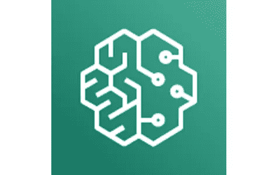

SageMaker 是 AWS 的核心人工智能产品之一，可以帮助我们度过机器学习生命周期的所有阶段。它为我们提供了一个简单的 Jupyter Notebook UI，可以用来编写基本的 Python 代码。它可以通过转储到 S3 桶中的数据或像 Kinesis shards 这样的流数据源来建立模型。一旦模型被训练，SageMaker 允许我们毫不费力地将它们部署到生产中。

为了一窥究竟，现在让我们尝试一个例子——它可以向我们展示 SageMaker 的真正力量。我们将致力于旧的 [MNINST 数据集](https://en.wikipedia.org/wiki/MNIST_database)；经历 SageMaker 的所有开发阶段——从使用下载的数据训练模型开始——直到部署 Lambda 函数，该函数可以利用 SageMaker 开发的预测器端点。

# S3 水桶

SageMaker 在工作时使用 S3 铲斗倾倒模型。在我们训练模型时，将数据转储到 S3 桶中也很方便。因此，第一步是选择一个 S3 桶，我们使用的目的。我有一个桶是献给 SageMaker 的。我称之为 sagemaker-dumps。你可以选择一个适合你的目的的名字。

这个 bucket 不需要任何公共访问，因为我们在 SageMaker 内部处理它。生命周期规则可以将文件移动到 IA 或 Glacier 中—因为我们很少在模型最终确定后使用训练数据。

# 笔记本实例

在完成 S3 桶之后，让我们回到 SageMaker。下一步是供应和创建一个笔记本实例。让我们从这一点开始。

从 AWS 控制台打开 SageMaker 服务，并导航到笔记本实例。点击“创建笔记本实例”按钮即可开始。它将提示笔记本实例设置。给它起一个好名字，选择 ml.m2.instance，这是最低的，可以满足我们现在的目的。在处理“真实”模型时，我们可以选择更高的值。不要担心费用。AWS 承诺我们按使用付费。

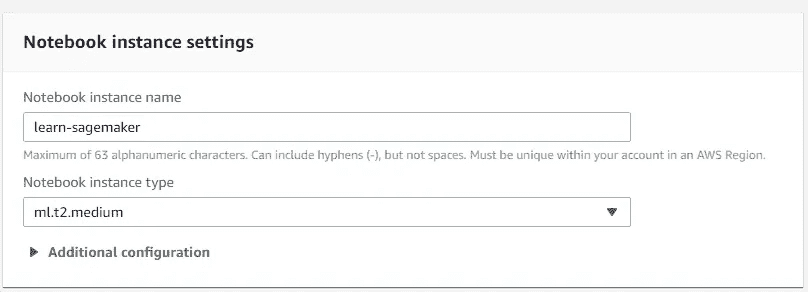

将其余部分保留为默认值，然后继续前进。

接下来，我们需要为笔记本创建一个 IAM 角色。请记住，我们的数据和模型需要放在我们刚刚创建的 S3 桶中。所以笔记本应该能接触到那个桶。我们不需要笔记本的任何其他特殊权限。

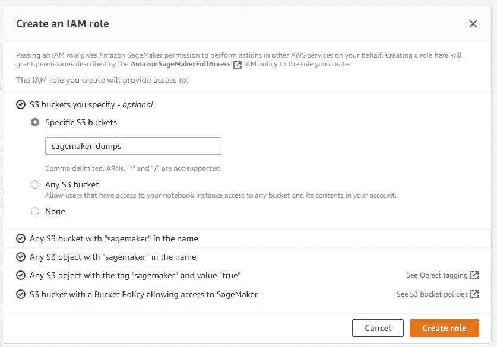

现在，我们可以开始“创建”了。AWS 需要一些时间来准备笔记本。我们可以在控制台上看到笔记本实例处于“挂起”状态

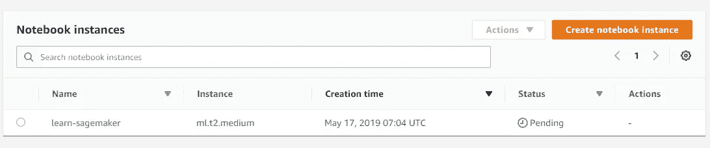

让它按照自己的方式工作，因为 AWS 提供了底层实例，并为我们的目的做好了准备。准备就绪后，我们可以看到控制台显示笔记本实例“正在使用中”

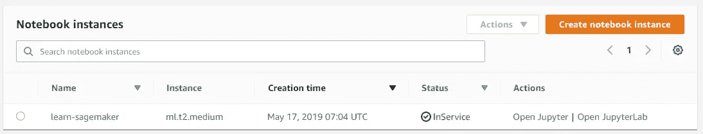

# JupyterLab

一旦我们准备好了一个笔记本实例，我们就可以进一步创建一个 JupyterLab。在笔记本实例控制台上，我们可以在 Actions 列中看到两个链接——Open Jupyter 和 Open JupyterLab。任何研究人工智能的人都知道什么是 Jupyter 笔记本。JupyterLab 就是这样，带点 AWS 的味道在上面。那么，让我们点击 JupyterLab。

这将打开一个弹出窗口，如下所示:

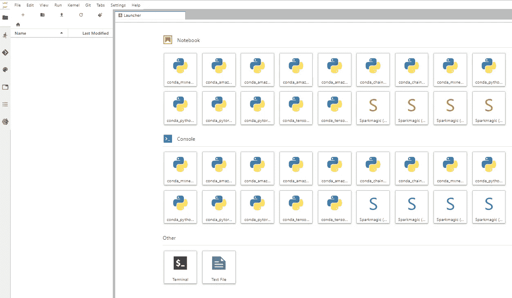

它提供了几个现成的模板，也允许我们创建自己的模板。此时，我们想要构建自己的模板。因此，让我们沿着这条道路前进。点击文件->新建->笔记本

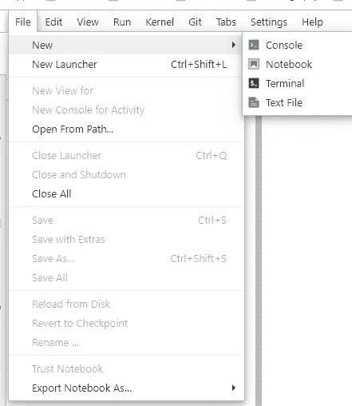

它会提示你为打开的 Jupyter 笔记本选择一个内核。我喜欢蟒蛇 3。所以我选择那个。对于这个例子来说，这已经足够好了。好奇的人可以尝试使用其他内核。

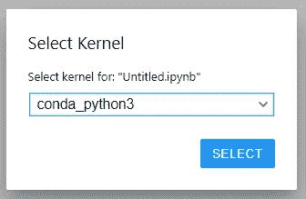

这样，熟悉的 Jupyter 笔记本就出现了。我不喜欢“无标题”的笔记本。所以我把它改名为更有意义的名字。

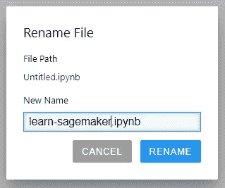

# 准备数据

有了框架，我们现在可以继续构建模型了。当然，任何 Python 代码的第一步都是导入相关模块。

接下来，我们可以创建一些占位符变量，使我们的生活更简单。

现在基础工作已经准备好了，我们可以下载用于构建模型的数据了。我们从“deeplearning.net”上下载数据。一旦我们有了 train 文件，我们就提取数据并将其分成训练集、测试集和验证集。

现在让我们看一看我们收集的数据。

这给了我们一个输出

```
(50000, 784)
(50000, )
```

我们在训练集中有 50，000 条记录。这些都是 28x28 的图像。并且这些图像中的每一个都映射到一个值，该值是由该图像表示的数字。

这显示了输出:

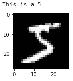

哇！我们有数据来训练模型。但是这个数据对我们的工作不利。我们需要对数据结构进行一些调整，以便为训练我们的模型做好准备。

做完后，我们把它倒进我们的 S3 桶里。

# 建立模型

现在数据已经准备好了，让我们继续构建和部署可以用于我们工作的模型。

在上面的代码中，我们将数据转储到 S3 桶中。我们可以使用对该数据的引用来输入我们的模式。因此，让我们从创建 SageMaker 将用于此目的的数据通道开始。

请注意,“data_channels”保存了我们训练模型所需的所有数据的引用。

AWS 为我们提供了一条连接 SageMaker 和 S3 的通道。这使得我们的工作非常简单。我们不必为此增加实例 RAM 的负担。

SageMaker 还帮助我们构建通用的训练算法。这些预先部署在 ECS 的码头集装箱上。SageMaker 帮助我们直接链接到这些容器。我们所需要的就是一个 API 来为我们自己获取一个！

所以，我们所做的就是:获取一个容器，实例化一个模型，然后训练它。

最终的 xgb_model.fit()在迭代构建模型时生成训练日志。最后，估算器已经准备好了。

# 部署模型

部署模型和流程的其余部分一样简单。我们所做的就是调用笔记本中的一个命令。

这将部署模型并生成可以从我们的代码中调用的端点。

我们可以导航到 sage maker-Models 控制台。在那里，我们可以看到模型已经准备好了。

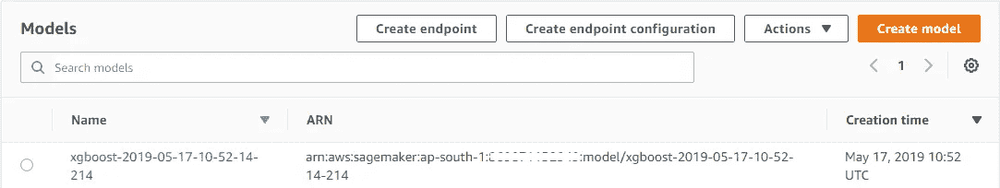

我们还可以检查 SageMaker —端点控制台。在这里，我们可以看到等待我们的终点。

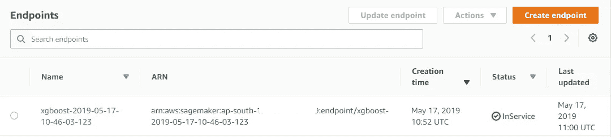

# λ函数

剩下的都是小事。一旦我们部署了模型和端点，我们就可以创建一个 Lambda 函数，可以通过 API 网关调用它。Lambda 函数可以像这样简单:

这在我们的例子中是可行的，因为我们使用的图像很小——784 像素。将大量图像作为 lambda 函数的参数发送出去可能是不健康的。在这种情况下，我们可以创建一个迷你架构，将图像转储到一个 S3 桶中——这将触发 Lambda 函数对其进行解码，并通知进行调用的 Amplify。