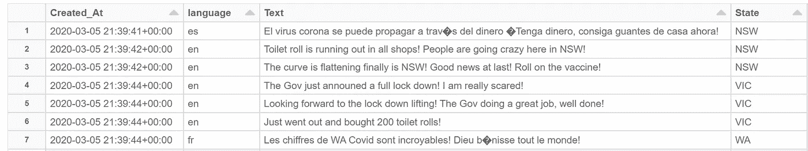
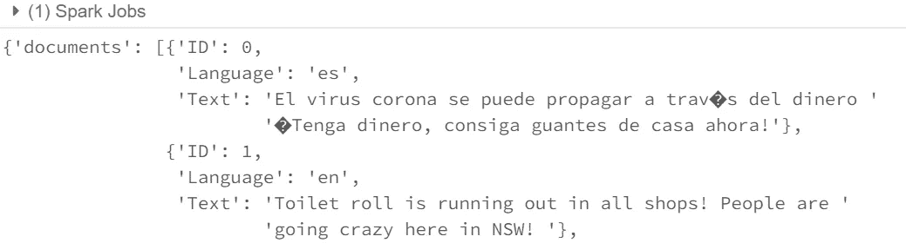
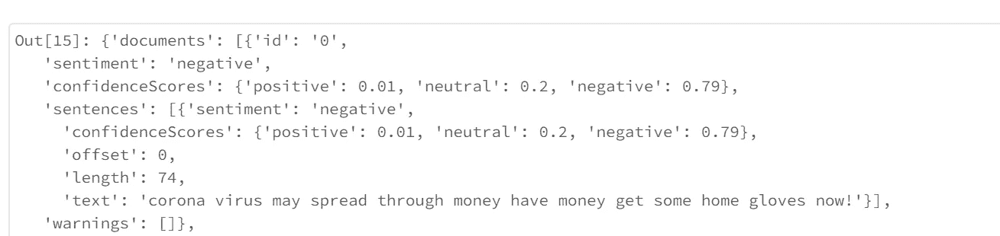
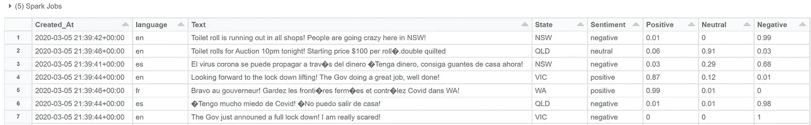

# 使用 Databricks PySpark 的 Azure 认知服务情感分析 3.0 版

> 原文：<https://pub.towardsai.net/azure-cognitive-services-sentiment-analysis-v3-using-pyspark-b38bfcfd20fb?source=collection_archive---------2----------------------->

## [云计算](https://towardsai.net/p/category/cloud-computing)，[自然语言处理](https://towardsai.net/p/category/nlp)

Azure Cognitive Services 文本分析是一个很好的工具，可以用来快速评估文本数据集的积极或消极情绪。例如，服务提供商可以快速轻松地将评论评估为正面或负面，并根据检测到的情感得分对其进行排名。

随着越来越多的企业依赖于与客户的电子通信，了解与您的产品、服务或形象相关的整体情感变得前所未有的重要。情感分析允许公司以快速和高度可扩展的方式自动检测任何文本(评论、保险索赔、分类等)中的情感。

我最近的一个项目是与一家物业管理公司合作，目的是利用客户对物业的反馈中的情绪得分来识别和优先处理主要问题，从而更快地解决问题并改善客户服务。

今天，我将介绍如何使用 Azure Cognitive Services 文本分析，使用 Databricks PySpark Notebook 来分析新冠肺炎推文的情绪，并返回情绪得分和指标，以确定它是正面还是负面的推文。

# 什么是 Azure 认知服务文本分析？

认知服务是微软为解决人工智能(AI)领域的问题而开发的一套机器学习算法。开发人员可以通过互联网对他们的应用程序、网站或工作流中的认知服务 API 进行标准 REST 调用来使用这些算法。

对于本文，我们将关注文本分析 API 情感分析特性，该特性评估文本并返回每个文档和句子的情感分数和标签。这有助于检测社交媒体、客户评论、论坛等中任何语言的积极和消极情绪。

# 使用 PySpark 使用情感分析 API。

为了分析文本并返回数据的情感分析，我们需要代码来完成以下步骤。

1.  导入带有文本列的数据集。
2.  设置一个参数来标识输入数据集文本列名，使我们的代码动态化。
3.  设置 Azure 认知服务 API 和密钥。
4.  创建只包含 Id 和文本列的 API post 输入数据帧。
5.  将 Dataframe 转换为 JSON，为 API Post 做好准备。
6.  将 JSON 文档发布到情绪分析 API。
7.  将 JSON API 响应展平到包含行和列的数据帧中。
8.  将数据帧与原始数据集连接起来，以生成最终数据集并显示出来进行分析。

**步骤**

1.  将以下导入添加到您的文件 PySpark Notebook 中，并通过导入 COVID19 Tweet 数据集来创建输入数据帧。

结果

2.创建并设置文本列参数的名称，将其设置为要分析的列的名称。

3.出于本演示的目的，我们将手动设置情感分析 API 参数。请注意，更安全的方法是使用 Azure Key Vault 来提供更高级别的安全性。

4.API 的有效负载由一系列 JSON 文档组成，这些文档是包含一个`id, language`和一个`text`属性的元组。`text`属性存储要分析的文本，`language`是文本语言，`id`可以是任何值。因此，我们需要添加一个`id`列，并且只为 API 有效负载选择列`id,language`和`text`。

5.以 API 的正确格式将 DataFrame dfCog 转换为 JSON 字符串的 DataFrame。

输出如下。

6.将 JSON 有效负载发送到 API，并传入 subscription_key、端点和文档。

成功回应。

7.现在我们已经在 JSON 中返回了响应，我们必须将文档分成行和列。

8.最后，我们可以将分析的数据集连接到输入数据集，删除添加的 ID 列并显示最终输出。

最终结果提供了一个介于 0.0 和 1.0 之间的情绪得分和一个总体情绪标签，得分越高表明情绪越积极。

我将它创建成了一个可重用的 PySpark 函数。如果你想要一本，请给我留言，我可以给你发一个链接到我的私人 GIT 回购。

我希望这有助于节省您理解 Azure 认知情绪分析和 PySpark 的时间。非常欢迎任何想法、问题、更正和建议:)

# 如果你喜欢这篇文章，这里有一些你可能喜欢的其他文章:

 [## 用于 Azure Synapse 分析的 Databricks PySpark Type 2 SCD 函数

### 渐变维度(SCD)是数据仓库中一种常用的维度建模技术，用于捕获…

pub.towardsai.net](/databricks-pyspark-type-2-scd-function-for-azure-synapse-analytics-8c0ff8862a11)  [## Databricks:使用 PySpark 升级到 Azure SQL

### Upsert 是 RDBMS 的一个特性，它允许 DML 语句的作者自动插入一行，或者如果该行…

rorymcmanus.medium.com](https://rorymcmanus.medium.com/databricks-upsert-to-azure-sql-using-pyspark-5937e8303fbf)