# Azure Data Explorer:实时分析— Fortinet 日志

> 原文：<https://pub.towardsai.net/azure-data-explorer-real-time-analytics-fortinet-logs-e6f7e162ed4e?source=collection_archive---------0----------------------->

## [数据分析](https://towardsai.net/p/category/data-analytics)

Azure Data Explorer (ADX)是一种完全托管的数据分析服务，用于对来自应用程序、网站和物联网设备的大量数据流进行实时分析。

ADX 的主要用途是摄取结构化、半结构化和非结构化数据以进行大数据分析，每个节点(最多 1000 个节点)的速度高达 200 兆字节/秒，在不到一秒的时间内返回数十亿条记录的结果。

越来越多的企业向各种物联网设备和应用开放其网络，网络和安全团队及时、经济高效地主动应对这些威胁事件变得越来越重要。

我最近在一个政府客户那里使用了 ADX 来迁移现有的 Kafka 工作负载，该工作负载吸收并转换 Fortinet、Paloalto 和 Bluecoat web 安全日志。在新冠肺炎期间，他们的工作量增加了 10 倍，相关的成本增加了 5 倍。该工作负载的迁移导致成本降低了 60%,简化了解决方案，并提高了数据可靠性。

# 如何将数据导入 Azure Data Explorer？

# 自动化管道——摄入方法

*   事件网格 blob 已创建-当在 Azure 存储帐户上创建“Blob”时，它会导致触发数据浏览器摄取管道的事件的触发。
*   活动中心
*   物联网中心
*   Azure 数据工厂
*   轻量级摄取—用于历史负载的命令行工具，可最大限度地降低成本。

# 支持的格式

*   未压缩格式—Apache vro、AvroCSV、JSON、MultiJSON、ORC、Parquet、PSV、RAW、SCsv、SOHsv、TSV、TSVE、TXT、W3CLOGFILE

当源数据具有提供的模式(例如 Avro、parquet、w3clogfile)时，它可以直接插入到最终的目标表中，并具有预期的数据类型、列名等。

*   压缩格式— GZip、Zip

**变身**

在 ADX 中，数据通过使用本地语言 KQL — Kusto 查询语言进行转换。这是一种简单但功能强大的语言，用于查询结构化、半结构化和非结构化数据。它假设了表和列的关系数据模型，具有最少的数据类型集。这种语言非常有表现力，易于阅读，并且理解查询意图。

# 将 Fortinet 日志从 Azure 存储接收到 ADX

在本文中，我将演示如何创建一个接收管道来接收和转换每小时上传到 Azure 存储帐户的 Fortinet Web Security 日志文件，这些文件累积起来每天总计 400GB(未压缩时)。

该文件是压缩文件。gz 文件分割成三种不同的格式:

1.  空格分隔的值
2.  管道分隔值
3.  管道分隔的键值对

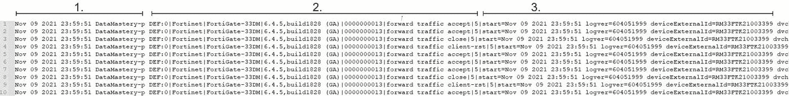

# 解决办法

使用的解决方案遵循以下高级步骤:

1.  Fortinet 日志文件在 Azure Storage(ADLS 第二代)上上传/创建。该操作反过来使用事件网格创建的订阅者触发接收过程。
2.  该文件被接收到 ADX 临时表中。
3.  ADX 用户定义的更新策略读取临时表中新上载的数据，并根据需要将数据转换到目标表中。

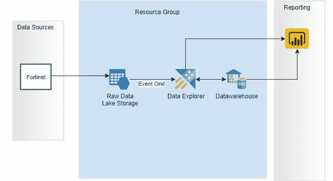

**摄入管道**

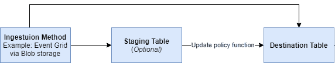

**先决条件**

*   安装 Kusto explorer 并连接到 ADX 集群。或者，可以利用网络用户界面。

[https://docs . Microsoft . com/en-us/azure/data-explorer/kusto/tools/kusto-explorer](https://docs.microsoft.com/en-us/azure/data-explorer/kusto/tools/kusto-explorer)

*   Microsoft 建议每个文件必须是 1GB 的未压缩文件，以获得最佳接收效果，并且不超过 4GB。
*   向 Azure 订阅注册事件网格。

**要创建摄入管道，必须完成以下步骤**

1.  在 Azure Storage——ADLS gen 2 上创建一个容器。
2.  创建 ADX 临时表。
3.  在 ADX 临时表上设置保留策略。

4.创建一个 ADX 查询函数来读取和转换临时表中的数据。

5.为管理的数据创建 ADX 目标表。

6.创建 ADX 更新策略。

更新策略指示 ADX 根据在步骤 3 中创建的转换函数，每当向临时表中插入新数据时，自动向目标表追加数据。

7.创建事件网格摄取方法。

选择的接收方法是通过 ADLS 的事件网格将数据接收到数据浏览器中。

8.测试:)

# 步伐

1.  在 Azure Storage——ADLS gen 2 上创建一个容器。
2.  创建一个包含一列数据类型字符串的 ADX 临时表。

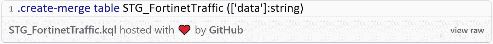

3.在 ADX 临时表上设置保留策略，仅保留 14 天的数据。

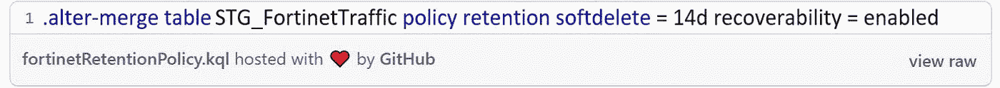

4.创建 ADX 函数。

该函数从临时表中读取数据并将其转换为所需的输出。输出中只需要源列的子集。

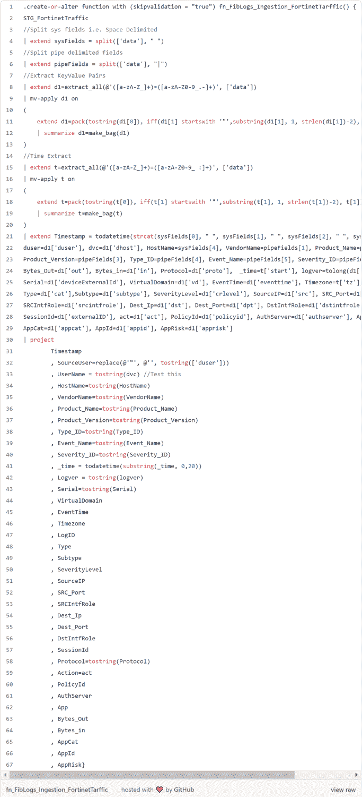

5.为管理的数据创建 ADX 目标表。

摄取函数可用于使用以下脚本为目标表创建模式:

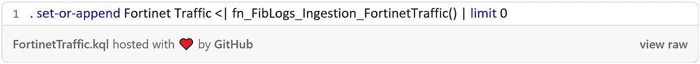

注意:请确保日期时间和数值列键入正确，因为 ADX 存储每列的元数据和统计信息。ADX 还将存储数据范围的最大值和最小值。这将确保当用户从存储中请求数据时，在某些条件下，将对数据进行比较，并且只扫描相关的范围并作为结果返回。

6.创建 ADX 更新策略

更新策略指示 ADX 根据上面创建的转换函数，在新数据插入临时表时自动将数据追加到目标表中。

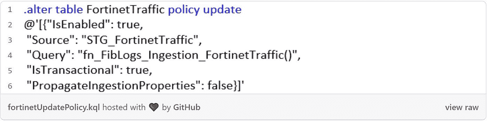

7.创建事件网格摄取方法。

选择的接收方法是通过 ADLS 的事件网格将数据接收到数据浏览器中。

*   登录 Azure 门户网站。
*   导航到 ADX 集群➜数据库(选择合适的数据库)➜数据连接。
*   添加数据连接—见下文。

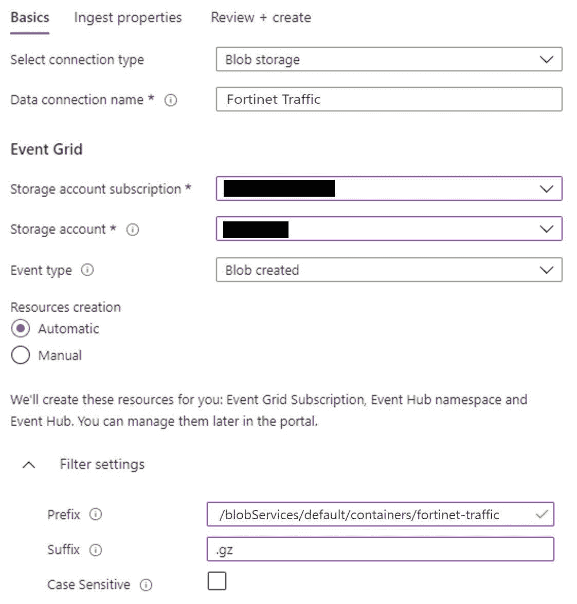

*   单击“下一步:查看+创建>”进入下一个选项卡摄取属性。

注意:Txt 文件没有映射。映射仅用于 CSV、JSON、AVRO 和 W3CLOGFILE 文件。

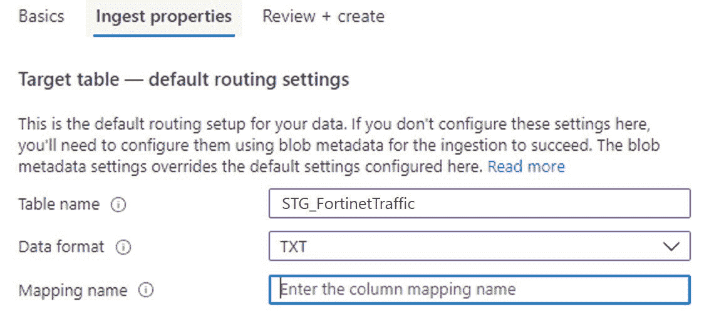

8.测试:)

将文件上传到 Azure 存储容器。如果摄取失败，请运行下面的查询来检查原因。

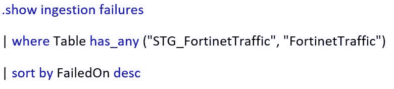

# 结论

如果你想要一份我的代码，请在 [LinkedIn](https://www.linkedin.com/in/rorymcmanus/) 上给我留言。

我希望你已经发现这是有帮助的，并且将节省你的公司金钱和时间开始使用 Azure Data Explorer。

请分享您的想法、问题、更正和建议。非常欢迎所有反馈和评论。

 [## 数据掌握| LinkedIn

### Azure 数据平台| Databricks |大数据| Power BI |分析行业信息技术和服务…

au.linkedin.com](https://au.linkedin.com/company/data-mastery?trk=public_profile_experience-item_profile-section-card_subtitle-click) 

# 如果你喜欢这篇文章，这里有一些你可能喜欢的其他文章:

 [## Databricks:使用 PySpark 升级到 Azure SQL

### Upsert 是 RDBMS 的一个特性，它允许 DML 语句的作者自动插入一行，或者如果该行…

rorymcmanus.medium.com](https://rorymcmanus.medium.com/databricks-upsert-to-azure-sql-using-pyspark-5937e8303fbf)  [## Azure 认知服务情感分析 V3 —使用 PySpark

### 什么是 Azure 认知服务-文本分析？

pub.towardsai.net](/azure-cognitive-services-sentiment-analysis-v3-using-pyspark-b38bfcfd20fb)