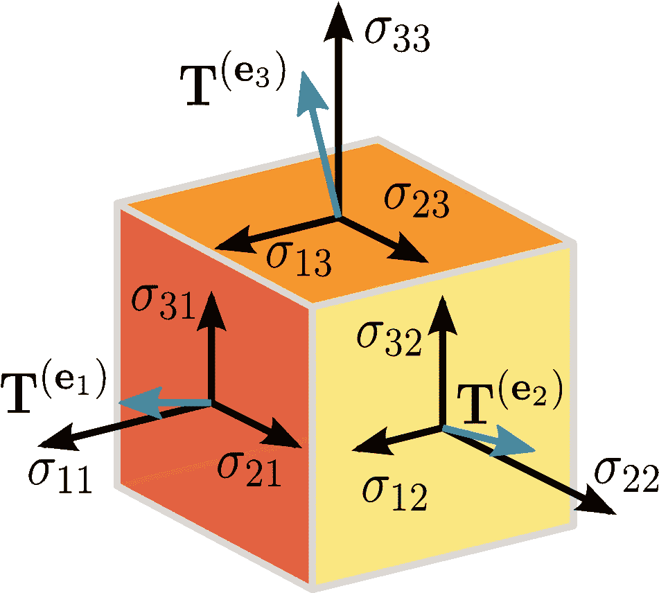
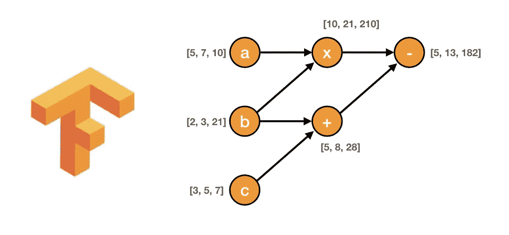
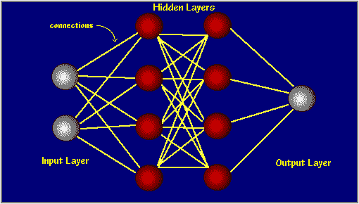
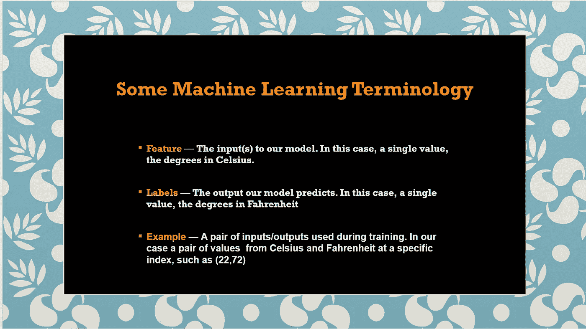
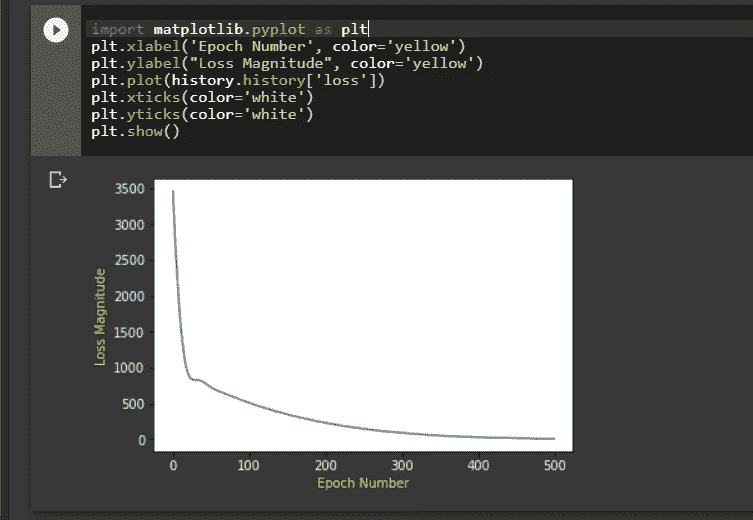
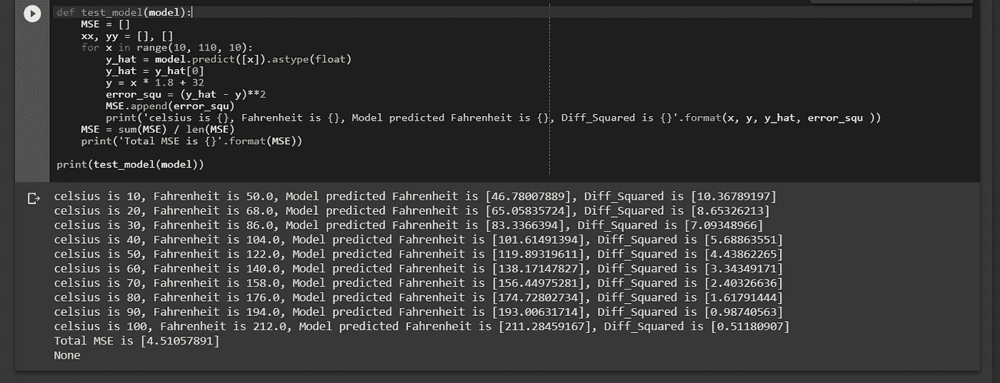

# 婴儿迈向 TensorFlow

> 原文：<https://pub.towardsai.net/baby-steps-to-tensorflow-22972dd3bd7e?source=collection_archive---------1----------------------->

## 创建一个简单的面向 AI 的张量流模型的教程|

## 训练您的第一个基于 Tensorflow 的神经网络模型，用于摄氏度到华氏**度**的转换


TensorFlow 是一个面向研究和生产的开源机器学习库。它提供了[***API***](https://medium.com/free-code-camp/what-is-an-api-in-english-please-b880a3214a82)供初学者和专家开发桌面、移动、web 和云。参见 [***链接***](https://www.tensorflow.org/tutorials) ***。***

软件库是一组函数和模块，您可以通过代码调用它们来执行特定的任务。

在继续之前，我假设你已经习惯了用 python 编码，并且对机器学习有一些基本的了解。



多维数组(张量)| [img_credit](https://s3-ap-south-1.amazonaws.com/av-blog-media/wp-content/uploads/2017/03/29102900/Image1.png)

TensorFlow 可以说是 GitHub 上最受欢迎的机器学习库。它基于计算图的概念。

在计算图中，节点代表持久数据或数学运算，边代表节点之间的数据流。流经这些边缘的数据是一个被称为张量的多维数组，因此该库被命名为“ **TensorFlow** ”。



节点代表圆形，边是箭头| [img_credit](https://cdn-images-1.medium.com/max/1600/1*zeXlzGhBoCl8clrpwtVbRQ.png)

这里我们将尽量保持简单，只介绍基本概念。

我们要解决的问题是使用简单的张量流模型将摄氏温度值转换为华氏温度值，其近似公式为:

```
**Fahrenheit = Celsius * 1.8 + 32**
```

> 这意味着手动将 30 摄氏度转换为华氏温度，我们需要做的就是将 30 乘以 1.8，然后将 32 加到结果上，得到 86。参见 [**链接**](https://www.rapidtables.com/convert/temperature/30-c-to-f.html)

当然，创建一个直接执行这种转换的传统 Python 函数是足够简单的，但这将是机器学习的 ***而不是*** 。

相反，我们将为 TensorFlow 提供一些样本摄氏温度值及其对应的华氏温度值。然后，我们将通过训练过程训练一个模型来计算上述公式。我们将使用该模型将任意值从摄氏温度转换为华氏温度，并最终评估该模型。


## 底漆:

> **神经网络:**
> 
> 神经网络基本上是一组可以学习模式的功能。



具有两个隐藏层的神经网络的视觉| [img_credit](https://www.google.com/url?sa=i&source=images&cd=&ved=2ahUKEwjagLWqkL3jAhWS5OAKHQ9bAXcQjRx6BAgBEAU&url=http%3A%2F%2Fpages.cs.wisc.edu%2F~bolo%2Fshipyard%2Fneural%2Flocal.html&psig=AOvVaw38MiIHLhoyqHZyg8b5pOx2&ust=1563493222437896)

> 在传统编程中，我们将规则和数据集传递给程序，然后计算机返回答案。
> 在机器学习中，我们基本上是将答案和尽可能多的关于例子的数据(成对的特征和标签)传递给计算机，计算机找出规则，以准确预测或确定未来看不见的数据的答案。

# 导入依赖项

首先导入 TensorFlow 为`**tf**`便于使用。我们还告诉它只显示错误日志，如果有的话。

```
**import tensorflow as tf
tf.logging.set_verbosity(tf.logging.ERROR)****import numpy as np
import matplotlib.pyplot as plt**
```

## 设置培训数据:

由于任务是创建一个模型，当给定摄氏度时，该模型可以预测华氏温度值，因此我们将创建两个列表来训练该模型。一个用于摄氏度，另一个用于相应的华氏温度值。

```
# Let's create two lists for celsius and fahrenheit using numpy**celsius_q    = np.array([-40, -10,  0,  8, 15, 22,  38],  dtype=float)****fahrenheit_a = np.array([-40,  14, 32, 46, 59, 72, 100],  dtype=float)**# Let's iterate through the list and print out the corresponding #values**for i,c in enumerate(celsius_q):
    print("{} degrees Celsius = {} degrees Fahrenhet".format(c, fahrenheit_a[i]))**>> 
-40.0 degrees Celsius = -40.0 degrees Fahrenheit 
-10.0 degrees Celsius = 14.0 degrees Fahrenheit 
0.0 degrees Celsius = 32.0 degrees Fahrenheit 
8.0 degrees Celsius = 46.0 degrees Fahrenheit 
15.0 degrees Celsius = 59.0 degrees Fahrenheit 
22.0 degrees Celsius = 72.0 degrees Fahrenhet 
38.0 degrees Celsius = 100.0 degrees Fahrenhet
```



## 创建模型:

我们将使用最简单的模型，一个密集的网络。为了简单起见，这个网络只有一层和一个神经元

## 构建一个层:

我们将调用图层 L1，并使用语法 tf.keras.layers.Dense 对其进行实例化，配置如下

> 。input_shape=[1]，它指定该层的输入是单个值，即该形状是一个具有 1 个成员的一维数组。
> 
> 。units = 1，这指定了层中神经元的数量。神经元的数量决定了模型需要学习多少内部变量来解决问题

```
**L1 =  tf.keras.layer.Dense(units=1, input_shape=[1])**
```

## 将层组装到模型中:

一旦定义了层，我们需要将它们组装到我们的模型中。我们将使用顺序模型定义，它接受一系列层作为参数。指定从输入到输出的计算顺序。

这个模型只有一个单层 L1

```
**tf.keras.Sequential([L1])**
```

请注意，我们可以通过简单地执行以下操作，在一行代码中构建和组装该层

```
**model= tf.keras.Sequential(tf.keras.layer.Dense(units=1, input_shape=[1]))**
```

## 用损失和优化函数编译模型:

在训练之前，必须编译模型。编译时，模型给出:

> 1.损失函数:一种衡量预测和期望结果之间差异的方法。(这种差异称为损失)
> 
> 2.优化函数:调整内部值或参数以减少损失的一种方式。


测量损耗以优化内部参数。

```
**model.compile(loss= 'mean_squared_error', optimizer= tf.keras.Optimizers.Adam(0.1))**
```

事实上，计算当前损失并改善它的行为就是训练一个模型( ***model.fit*** )的全部内容。

在训练期间，优化器函数(在这种情况下是 Adam Optimizer，代表自适应矩估计优化器)用于计算对模型内部参数的调整。有关优化器算法的更多详细信息，请参见本文[](http://ruder.io/optimizing-gradient-descent/index.html#adam)****。****

*TensorFlow 使用数值微调来调整这些参数，所有这些复杂性对我们来说都是隐藏的，因此我们不会在这里深入讨论这些细节。*

*重要的是要知道*

*损失函数(mean_squared_error)和优化函数(Adam)是像这样的简单模型的标准函数，但许多其他函数也是可用的，没有必要了解它们在这一点上的内部工作方式。*

*在上面的代码单元格中，有一个 0.1 的值传递给了 Adam 优化器。那就是 ***的学习率。*** 学习率就是优化器函数在调整模型中的值时所采用的大小。如果学习率太小，就需要太多的迭代来优化模型，如果学习率太大，精度就会下降。找到一个好的值通常需要一些反复试验，但它通常在 0.001(默认)和 0.1 之间。*

## *训练模型:*

*我们通过调用 fit()方法来训练模型。*

*在训练期间，模型接受摄氏温度值，并使用当前内部变量(称为权重)执行一些计算，然后输出相当于华氏温度的值。*

*由于权重最初是随机设置的，因此输出值不会接近正确值。输出值和期望结果之间的差异将使用损失函数来计算，而优化器函数确定应该如何调整权重来减少损失。*

*这个计算、比较、调整的循环由 fit()方法控制。*

```
***history = model.fit(celsius_q, fahrenheit_a, epochs=500, verbose=False)****print("Finished training the model")***
```

*fit()方法的第一个参数是输入(摄氏温度值)，第二个参数是期望的输出(华氏温度值)，epochs 指定训练应该运行多少次，verbose 控制训练发生时应该打印出多少数据。在这种情况下，verbose=False 意味着不打印任何训练数据。*

*我们将所有这些输出参数保存在一个名为 history 的变量中，以便在需要时可以调用或访问这些内部值，特别是如果我们想要实时绘制训练损失。然后我们训练模型。*

# *显示培训统计数据:*

*fit 方法返回一个历史对象。我们可以使用这个对象来绘制我们的模型的损失如何在每个训练时期之后下降。*

*让我们使用 Matplotlib 库来可视化训练损失。*

```
***import matplotlib.pyplot as plt
plt.xlabel('Epoch Number', color='yellow')
plt.ylabel("Loss Magnitude", color='yellow')
plt.plot(history.history['loss'])
plt.xticks(color='white')
plt.yticks(color='white')
plt.show()***
```

**

*正如你所看到的，我们的模型开始时改进很快，然后慢慢地，稳定地改进，直到接近完美*

# *使用模型预测值:*

*既然模型已经被训练来学习摄氏 _q 和华氏 _a 之间的关系或模式，我们可以使用它来预测以前未知的摄氏到华氏温度。*

*例如，200 摄氏度到华氏温度，我们已经知道是:-*

*200 * 1.8 + 32 = 392*

*让我们用训练过的模型来运行它*

```
***model.predict([200])**>>
  **[[393.65097]]**# Our model outputs 393.7, which is very close to the desired.*
```

*让我们定义一个简单的方法来创建摄氏度，然后我们使用我们的模型来预测每个摄氏度的华氏温度值，我们将预测值与期望值进行比较，打印出这些值，最后是均方误差。*

```
***def test_model(model):
    MSE = []
    xx, yy = [], []
    for x in range(10, 110, 10):
        y_hat = model.predict([x]).astype(float)
        y_hat = y_hat[0]
        y = x * 1.8 + 32
        error_squ = (y_hat - y)**2
        MSE.append(error_squ)
        print('celsius is {}, Fahrenheit is {}, Model predicted Fahrenheit is {}, Diff_Squared is {}'.format(x, y, y_hat, error_squ ))
    MSE = sum(MSE) / len(MSE)
    print('Total MSE is {}'.format(MSE))****print(test_model(model))**>> 
See cell output below*
```

**

*打印出每个预测、期望值和最终仅 4.5 的 MSE*

# *要查看:*

1.  *我们创建了一个带有密集层的简单模型*
2.  *我们用 3500 个例子(超过 500 个时期的 7 对)来训练它*

*我们的模型调整了密集层中的内部参数(权重),直到它能够使用损失和优化器函数为任何摄氏度值返回正确的华氏温度值，甚至是那些以前没有看到的值。*

# *查看层权重:*

*最后，让我们打印密集层的内部参数*

```
***print('These are the internal layer variables{}'.format(L1.get_weights()))**>>
This prints out:-
**These are the internal layer variables: [array([[1.8278279]], dtype=float32), array([28.5018], dtype=float32)]***
```

*请注意，第一个变量是 1.8，而第二个变量是 28.5，相对接近 32 ***(记住将摄氏度转换为华氏度的公式是摄氏度乘以 1.8 加 32)****

*因此，对于由单个神经元和单个输入和单个输出组成的神经网络，内部数学看起来与线公式相同，也称为 [***斜率截距形式***](https://en.wikipedia.org/wiki/Linear_equation#Slope%E2%80%93intercept_form) ，其形式为:*

****y = mx + b****

*其形式与我们上面使用的转换公式相同*

****华氏= 1.8 *摄氏+ 32****

*既然形式是一样的，变量就应该收敛在标准的 1.8 和 32 上，就是这么回事。*

# *一个小实验…*

*只是为了好玩，让我们把事情复杂化一点，让我们增加更密集的层和更多的神经元，这意味着要学习更多的内部变量。*

```
*# First Dense layer
**L1 = tf.keras.layer.Dense(units=4, input_shape=[1])**
# Second Dense layer
**L2 = tf.keras.layer.Dense(units=4)** # Third Dense Layer
**L3 = tf.keras.layer.Dense(units=1)** # Let's assemble all the layers into a Sequential model
**model = tf.keras.Sequential([L1, L2, L3])** # Let's compile the model
**model.compile(loss='Mean_Squared_Error',Optimizer=tf.keras.optimizers.Adam(0.1))** # Let's train the model
**model.fit(celsius_q, fahrenheit_a, epochs=500, verbose=False)
print("Finished training the model")** # Now let's print out the layer variables of each layer
**print("These are the L1 variables: {}".format(L1.get_weights()))
print("These are the L2 variables: {}".format(L2.get_weights()))
print("These are the L3 variables: {}".format(L3.get_weights()))**>>
**Finished training the model 
These are the L1 variables: [array([[0.38865   , 0.16998766, 0.06720579, 0.38802674]], dtype=float32), array([ 3.093483 ,  2.9697134, -2.297267 ,  3.08295  ], dtype=float32)] 
These are the L2 variables: [array([[-0.61909986, -0.42321223, -0.12353817, -1.0181226 ],        [-0.8338606 , -0.3931085 , -0.35709453, -0.02496582],        [ 0.04785354,  0.83791655,  0.62090117, -0.35727897],        [-1.0036206 , -0.4417855 , -0.26475334, -0.7752834 ]],       dtype=float32), array([-2.9957104, -3.0123546, -2.1529603, -2.9795303], dtype=float32)] 
These are the L3 variables: [array([[-1.1074247 ],        [-1.004997  ],        [-0.512665  ],        [-0.70594513]], dtype=float32), array([2.9236865], dtype=float32)]***
```

*我们可以清楚地看到，内层变量不是斜率截距形式，而是更复杂。这种增加的复杂性通常会导致更好的预测输出，但复杂性并不总是在所有情况下都更好。*

*让我们用之前定义的 test_model 方法再运行一次模型，看看添加的层和神经元是否改进了预测，*

```
***print(test_model(model))**>>
This prints out:- **celsius is 10, Fahrenheit is 50.0, Model predicted Fahrenheit is [49.93202209], Diff_Squared is [0.004621] 
celsius is 20, Fahrenheit is 68.0, Model predicted Fahrenheit is [67.91150665], Diff_Squared is [0.00783107] 
celsius is 30, Fahrenheit is 86.0, Model predicted Fahrenheit is [85.89100647], Diff_Squared is [0.01187959] 
celsius is 40, Fahrenheit is 104.0, Model predicted Fahrenheit is [103.87049103], Diff_Squared is [0.01677257] 
celsius is 50, Fahrenheit is 122.0, Model predicted Fahrenheit is [121.84999084], Diff_Squared is [0.02250275] 
celsius is 60, Fahrenheit is 140.0, Model predicted Fahrenheit is [139.82948303], Diff_Squared is [0.02907604] 
celsius is 70, Fahrenheit is 158.0, Model predicted Fahrenheit is [157.80897522], Diff_Squared is [0.03649047] 
celsius is 80, Fahrenheit is 176.0, Model predicted Fahrenheit isonclusion[175.78848267], Diff_Squared is [0.04473958] 
celsius is 90, Fahrenheit is 194.0, Model predicted Fahrenheit is [193.76795959], Diff_Squared is [0.05384275] 
celsius is 100, Fahrenheit is 212.0, Model predicted Fahrenheit is [211.74746704], Diff_Squared is [0.0637729] 
Total MSE is [0.02915287]***
```

*我们可以看到惊人的进步。*

*更复杂的模型是*精度 99.83%，而 ***MSE 只有 0.03*****

****

**在张量流中漫步**

## ****结论:****

**我希望我已经带您进行了一次简短但有趣的介绍，了解了 TensorFlow 机器学习和深度学习库的复杂性和神奇之处。这仅仅是皮毛。但这足以让你开始。**

**你可以在 GitHub 上找到代码单元格**

**但更重要的是，在 udacity.com[的](https://www.udacity.com/course/intro-to-tensorflow-for-deep-learning--ud187)参加这个免费的课程，它非常详细地涵盖了所有这些主题**

****干杯！****

## **关于我:**

**劳伦斯是技术层的数据专家，对公平和可解释的人工智能和数据科学充满热情。我持有 IBM 的 ***数据科学专业*** *和* ***高级数据科学专业*** *证书。我已经使用 ML 和 DL 库进行了几个项目，我喜欢尽可能多地编写函数代码，即使现有的库比比皆是。最后，我从未停止学习和实验，是的，我拥有几个数据科学和人工智能认证，并且我已经写了几篇强烈推荐的文章。***

**请随时在以下网址找到我**

**[**Github**](https://github.com/Lawrence-Krukrubo)**

**[**领英**](https://www.linkedin.com/in/lawrencekrukrubo/)**

**[**推特**](https://twitter.com/LKrukrubo)**