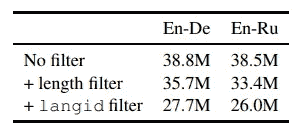
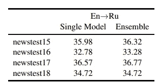
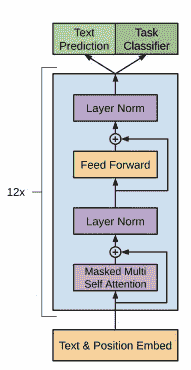

# nlpaug 文本增强中的反向翻译

> 原文：<https://pub.towardsai.net/back-translation-in-text-augmentation-by-nlpaug-d65518dd092f?source=collection_archive---------1----------------------->

## [自然语言处理](https://towardsai.net/p/category/nlp)

## NLP 的数据扩充——由反向翻译用 4 行代码生成合成数据


[马志威](https://unsplash.com/@makcedward?utm_source=medium&utm_medium=referral)在 [Unsplash](https://unsplash.com/?utm_source=medium&utm_medium=referral) 上拍照

> 英语是具有大量翻译训练数据的语言之一，而某些语言可能没有足够的数据来训练机器翻译模型。Sennrich 等人使用反向翻译方法来生成更多的训练数据，以提高翻译模型的性能。
> 
> 假设我们要训练一个翻译英语(源语言)→粤语(目标语言)的模型，而粤语没有足够的训练数据。回译是将目标语言翻译成源语言，并混合源语句和回译语句来训练模型。因此可以增加从源语言到目标语言的训练数据的数量。

在之前的[故事](https://towardsdatascience.com/data-augmentation-in-nlp-2801a34dfc28)中，提到了反向翻译方法为 NLP 任务生成合成数据。这样，我们可以进行更多的模型训练，特别是针对低资源 NLP 任务和语言的训练。

这个故事将涵盖脸书人工智能研究( [FAIR](https://ai.facebook.com/research/) )团队如何训练翻译模型，以及我们如何利用预训练模型为您的模型生成更多训练数据。通过利用[子字模型](https://medium.com/@makcedward/how-subword-helps-on-your-nlp-model-83dd1b836f46)、大型[反向翻译](https://medium.com/r?url=https%3A%2F%2Ftowardsdatascience.com%2Fdata-augmentation-in-nlp-2801a34dfc28)和模型组装，ng 等人(2019)获得 WMT 19 奖。他们研究了两对语言和四个语言方向，分别是英语← →德语(EN ← → DE)和英语← →俄语(EN ← →RU)。他们演示了如何使用反向翻译来提高模型性能。在那之后，我将展示如何通过使用回译来编写几行代码来生成合成数据。以下是关于数据处理、数据扩充和翻译模型的一些细节。

# 数据处理

## 子词

在 NLP 的前期，[单词级](https://towardsdatascience.com/3-silver-bullets-of-word-embedding-in-nlp-10fa8f50cc5a)和[字符级](https://towardsdatascience.com/besides-word-embedding-why-you-need-to-know-character-embedding-6096a34a3b10)令牌用于训练一个模型。在最先进的 NLP 模型中，子词(在词和字符级别之间)是标记化阶段的标准方式。例如，由于出现频率，它使用“trans”和“lation”来表示“translation”。你可以在这里看看[的 3 种不同的子词算法。Ng 等人选择 bye 对编码(BPE ),分别对 EN←→DE 和 EN← →RU 标记化进行 32K 和 24 次拆分操作。](https://medium.com/@makcedward/how-subword-helps-on-your-nlp-model-83dd1b836f46)

## 数据过滤

为了确保只有正确语言的句子对，Ng 等人使用 [langid](https://github.com/saffsd/langid.py) (Lui et al .，2012)过滤掉无效数据。langid 是一个语言识别工具，它告诉你文本属于哪种语言。

如果句子包含超过 250 个标记或者源和目标之间的长度比超过 1.5，那么它将被排除在模型训练之外。我怀疑它可能会向模型中引入过多的噪声信息。



不同过滤方法的数据大小(ng 等人，2019 年)

第三种过滤方式是针对单语数据。为了保持高质量的单语数据，Ng 等人采用了 [Moore-Lewis 方法](https://www.aclweb.org/anthology/P10-2041.pdf) (2010)从较大的语料库中去除噪声数据。简而言之，Moore 和 Lewis 通过源数据语言模型和更大的语料库语言模型的差异对文本进行评分。在挑选了高质量的语料库之后，它将使用反向翻译模型来为翻译模型生成一对训练数据。

# 数据扩充

## 回译

在从更大的单语语料库中过滤低质量的数据之后，它准备好训练中间的目标-源模型。从实验来看，基于回译数据训练的集成模型比单个模型更好。



单个模型和集合在英语到俄语的 SacreBLEU 上的比较(Ng 等人，2019 年)

# 翻译模型

和往常一样，FAIRSEQ 采用了[变压器架构](https://arxiv.org/pdf/1706.03762.pdf) (Vaswani et al .，2017)。转换器利用多个注意力网络来计算表示。关于 Transformer 架构的更多信息，您可以访问这篇[文章](https://towardsdatascience.com/combining-supervised-learning-and-unsupervised-learning-to-improve-word-vectors-d4dea84ec36b)。



变压器架构(拉德福德等人，2018 年)

另一项技能是利用多个训练模型来形成用于预测的集成模型。

## 微调

在对过滤和回译数据进行培训后，ng 等人通过使用前一年的数据集(如 newstest2012 和 newstest2013)来利用该模型。

# 由反向翻译生成合成数据

[nlpaug](https://github.com/makcedward/nlpaug) 提供了一种简单的方法，通过 4 行代码生成合成数据。

在幕后， [nlpaug](https://github.com/makcedward/nlpaug) 利用来自 [fairseq](https://github.com/pytorch/fairseq) (由脸书 AI Research 发布)的预训练模型执行 2 次翻译。以下面的例子为例，它将源输入(英语)翻译成德语。之后，向第二个模型提供翻译后的文本(德语，第一个模型的输出)，它将输出翻译后的文本(英语)。代码如下:

```
**import** **nlpaug.augmenter.word** **as** **naw**

text = 'The ***quick*** brown fox jumped over the lazy dog'
back_translation_aug = naw.BackTranslationAug(
    from_model_name='transformer.wmt19.en-de',
    to_model_name='transformer.wmt19.de-en')
back_translation_aug.augment(text)
```

举上面的例子，可以把“敏捷的*棕狐狸跳过懒狗”改成“敏捷的*棕狐狸跳过懒狗”**

# **延伸阅读**

*   **文本增强库( [nlpaug](https://github.com/makcedward/nlpaug) )**
*   **预培训翻译库( [fairseq](https://github.com/pytorch/fairseq)**
*   **[自然语言处理中的数据扩充](https://towardsdatascience.com/data-augmentation-in-nlp-2801a34dfc28)**
*   **[文本数据扩充库](https://towardsdatascience.com/data-augmentation-library-for-text-9661736b13ff)**

# **关于我**

**我是湾区的数据科学家。专注于数据科学、人工智能，尤其是 NLP 和平台相关领域的最新发展。你可以通过 [Medium、](https://medium.com/@makcedward/) [LinkedIn](https://www.linkedin.com/in/edwardma1026) 或 [Github](https://github.com/makcedward) 联系我。**

# **参考**

*   **米（meter 的缩写））路易和鲍德温。 [langid.py:一个现成的语言识别工具](https://www.aclweb.org/anthology/P12-3005.pdf)。2012**
*   **瓦斯瓦尼、沙泽尔、帕尔马、乌兹科雷特、琼斯、戈麦斯和凯泽..注意是你所需要的一切。2017**
*   **南 Edunov，M Ott，M Auli 和 D. Grangierv。[理解尺度上的回译](http://Understanding Back-Translation at Scale)。2018**
*   **名词（noun 的缩写）Ng、K. Yee、A. Baevski、M. Ott、M. Auli 和 S Edunov。[脸书博览会 WMT19 新闻翻译任务提交](https://arxiv.org/pdf/1907.06616.pdf)。2019**