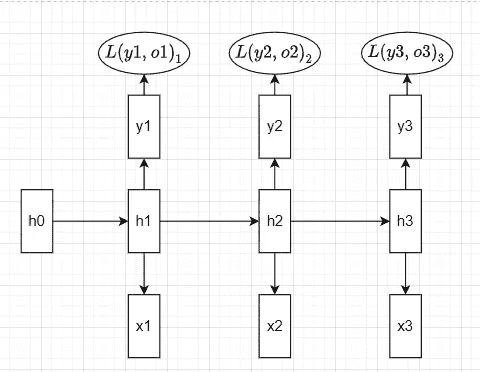
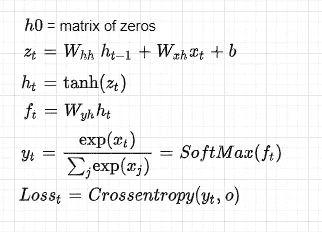
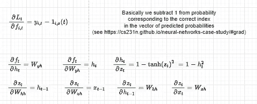
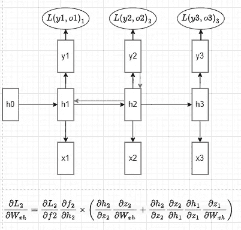
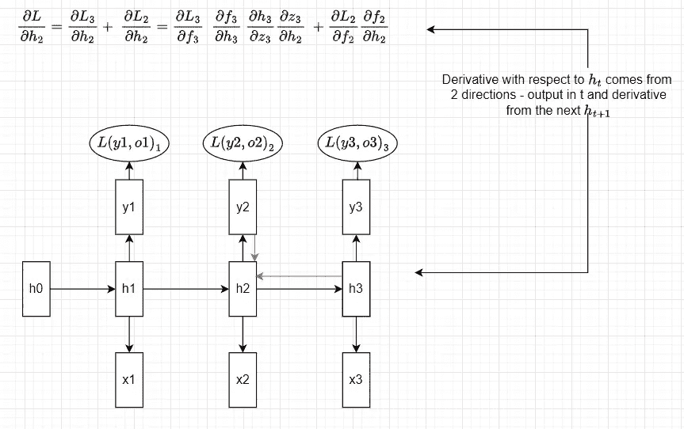
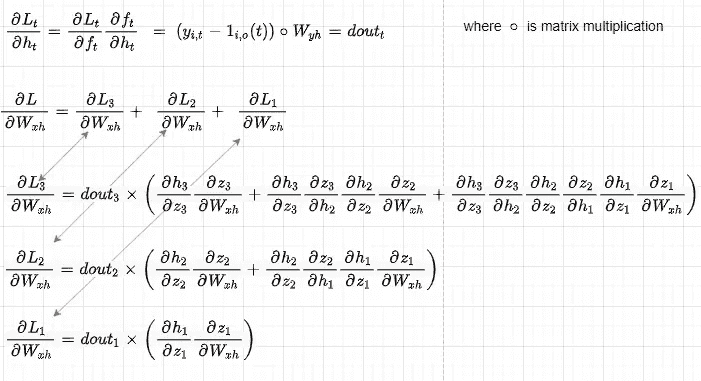
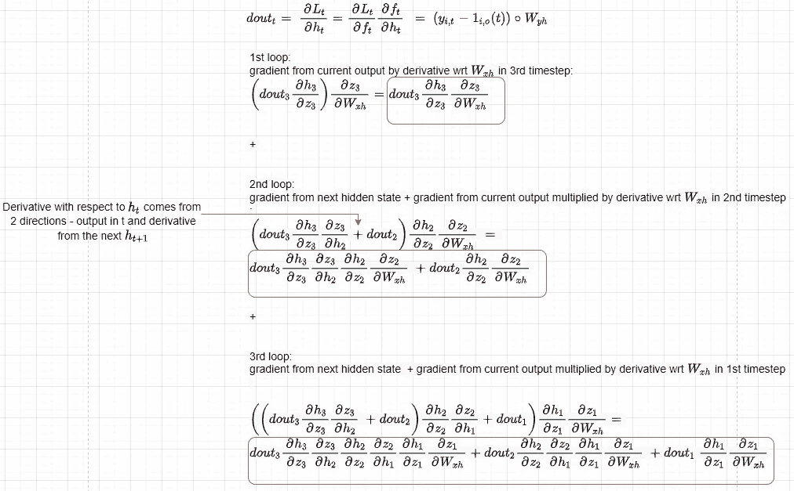
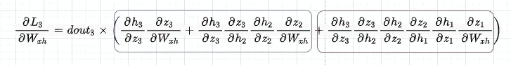

# 清楚地解释了 Rnn 中的反向传播和消失梯度问题

> 原文：<https://pub.towardsai.net/backpropagation-and-vanishing-gradient-problem-in-rnn-clearly-explained-efce8824971b?source=collection_archive---------0----------------------->

## 理论与代码


[https://unsplash.com/@emilep](https://unsplash.com/@emilep)

## 介绍

在这篇文章中，我不打算解释 RNN 模型的应用或直觉——事实上，我希望读者已经对它有所熟悉，以及消失梯度问题和一般的反向传播算法。我还将展示在反向传播过程中消失梯度问题的来源，强调一些经常被误解的细节。

我将介绍递归神经网络的多对多架构，这意味着，例如，我们有一个字符序列作为输入，我们希望模型能够预测接下来 T 个时间步的接下来的字符。

## 正向传播

让我们首先看看如何通过时间向前传播。为简单起见，我们假设有 3 个时间步长。具有 3 个时间步长的 RNN 如下所示:



作者图片——展开的 RNN(图 1)

以及不同成分的配方:



作者图片— RNN 公式(图 2)

因此，我们有形状*的输入 xₜ(n—例子的数量，t—时间步长，即字符或单词的数量，D —嵌入维数)*，存储关于形状*的过去的信息的隐藏状态向量 hₜ(n，H —隐藏维数)*，形状 *(H，H)* 的 wₕₕ—hₜ的权重矩阵，形状 *(D，H)* 的 wₓₕ—xₜ的权重矩阵，以及预测形状*的输出 yₜ的权重矩阵 Wᵧₕ从输入和前一个隐藏状态开始，我们得到下一个隐藏状态 hₜ和为该状态预测的输出 yₜ.请注意，RNN 在每个时间步使用**相同的权重矩阵** **，而不是在不同的时间步学习不同的矩阵，这将需要大量的内存，并且效率低下，因为我们经常以非常高的时间步数结束模型。***

## 反向传播

在前向神经网络中，通过时间的反向传播比正常的反向传播更棘手，因为不同时间步长的参数是共享的，并且下一层中的隐藏状态取决于前一层中的隐藏状态。

查看上面的正向传播公式(*图 2* )，让我们计算不同元素的偏导数:



作者图片—偏导数(图 3)

让我们计算每个时间步长上所有单个损失相对于 Wₓₕ的导数(其他参数可以类似地计算)，因为所有损失都被权重参数修改。首先，注意 Wₓₕ是如何通过当前的隐藏状态以及之前的隐藏状态影响输出的，这些隐藏状态都依赖于 Wₓₕ(红色箭头)。因此，计算 L2 相对于 *h2* 的偏导数变成如下图 4 所示。



作者图片—反向传播(图 4)

现在让我们看看*总损失，*是所有单项损失的总和。我们可以注意到，当计算总的 *L* 相对于 *h2 w* e 的导数时，在 *h2* 处有 2 个分量或方向(红色箭头)——第一个来自 *L3* 到 *h3* ，第二个来自 *L2* 。



作者提供的图片—一个时间步长的反向传播(图 5)

现在让我们计算 Wₓₕ相对于总损失的导数，总损失是所有单个损失的总和:



作者提供的图片—反向传播总损失 wrt Wxh(图 6)

当编码反向传播时，我们在一个循环中计算这些导数:

乍一看，它可能与图 6 中的*解决方案不同。因此，为了更好地理解，让我们分析和扩展代码中发生的事情(注意，我们对红色平方的偏导数求和来计算 Wₓₕ的总导数) :*



作者图片—反向传播循环(图 7)

现在应该更清楚了，图 6 中的代码和结果是完全一样的。

## 消失渐变

众所周知，rnn 遭受消失梯度，这是因为作为 *h* 相对于 *z* ( *图 6* )的偏导数的结果的许多 Wₕₕ矩阵相乘在一起，如果 Wₕₕ的最大奇异值是< 1，则引发梯度消失，或者如果> 1，则引发梯度爆炸(这里我们假设第一种情况)。然而，这个概念经常被误解，认为某些系数的整个梯度确实消失了。实际上，*总损耗*相对于Wₓₕ的导数不会变为零，但是对于更远离 *Li* 的输入，特定损耗 *Li* 的梯度将为零，这在调整权重 Wₓₕ时不会被考虑，但是对于正确预测*yi**可能比局部上下文更重要。*



作者图片—消失渐变 dL3dWxh(图 8)

因此，红色方块中的最后一项(包含关于 X₁如何影响 *L3* 的上下文)将接近于零，而蓝色方块中的前两项(包含关于 X₂和 X₃如何影响 *L3* 的上下文)将不会接近于零，并且该信息将被用于调整 Wₓₕ试图减少 *L3* 的权重。为了澄清，如果我们假设一个 6 个单词的句子:“因为市场上没有食物，约翰不得不跳过晚餐。”在这种情况下，为了预测单词“晚餐”,模型需要引用“食物”。但是因为单词“晚餐”在 Wₓₕ的损失的梯度对于与单词“食物”相关的总和的部分将接近于零，所以它在 Wₓₕ将不被考虑，并且该模型将主要依赖于接近“晚餐”的单词来尝试调整该权重，这几乎不提供预测“晚餐”的相关信息。

## **数值例子**

在下面的代码中，我们计算每个 Wₓₕ损耗的所有 Xᵢ 分量的梯度。例如，*【2】*包含了 X₁、X₂、X₃如何影响 *L3、*的梯度，如图*图 8* 所示。这样，我们就可以从数字上看到渐变消失的效果。

让我们看看每个组件的损耗梯度 *L3* :

```
display(losses[2])

{0: array([[ 0.0132282 ,  0.01965245,  0.00556892, -0.01311703],
        [-0.00498197, -0.00740145, -0.00209735,  0.0049401 ],
        [-0.00430128, -0.00639019, -0.00181079,  0.00426513]]),
 1: array([[ 0.00375982,  0.01506674,  0.01860143,  0.00016598],
        [-0.0030325 , -0.01215215, -0.01500307, -0.00013388],
        [ 0.0080649 ,  0.03231846,  0.03990044,  0.00035604]]),
 2: array([[-0.12964021, -0.36447594,  1.01880983,  0.68256384],
        [ 0.05655798,  0.15900947, -0.44447492, -0.2977813 ],
        [-0.02370473, -0.06664448,  0.18628953,  0.1248069 ]])}

display([f"component {e+1} : {np.linalg.norm(losses[2][e])}" for e in losses[2]])

# Let's see the magnitudes of them:

['component 1: 0.03087853793900866',
 'component 2: 0.06058764108583098',
 'component 3: 1.4225029296044476']
```

从上面我们可以看到，距离 *L3* 最近的 X₃更新最大，而 X₁和 X₂对 Wₓₕ更新的贡献要小得多。

我们还可以看到，如图 8 中的*，*所示，所有组件上所有损耗的梯度之和等于总梯度 *dWx。*

```
# we can also see that if we sum all the losses across all 
# components we get total gradient for dWx
np.allclose(dWx, np.sum([losses[l][e] for l in losses for e in losses[l]], 0))
# Output : True
```

## 结论

显然，在现实中你不需要自己做反向传播，因为许多软件抽象出了反向传播的所有数学。不过，为了更好地理解这些模型，手动进行所有推导是一个很好的练习。这就是为什么您现在应该尝试对其他参数——wₕₕ、Wᵧₕ、b 和 xₜ.——做同样的事情

## 参考

[http://cs231n.stanford.edu/](http://cs231n.stanford.edu/)T8[https://jramapuram.github.io/ramblings/rnn-backrpop/](https://jramapuram.github.io/ramblings/rnn-backrpop/)https://ieeexplore.ieee.org/document/279181/