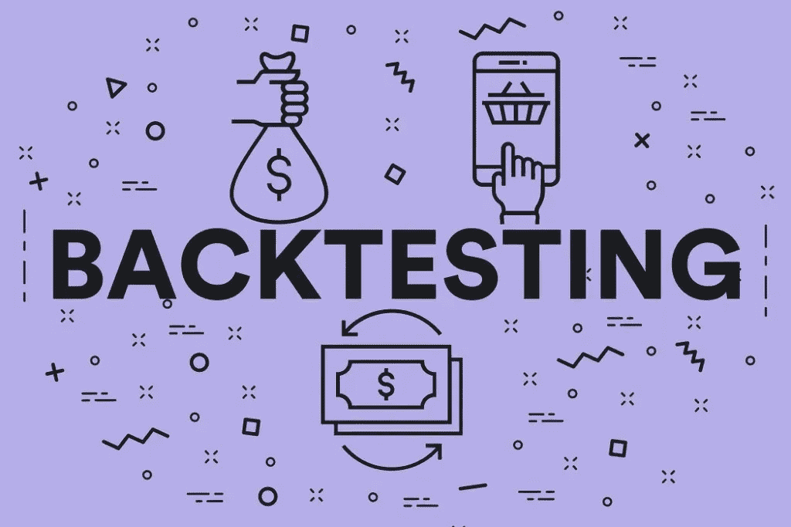
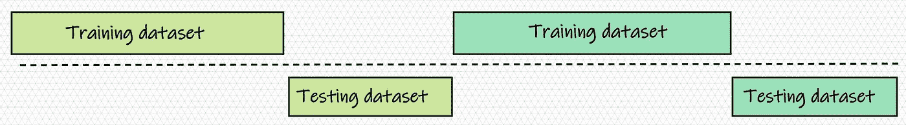
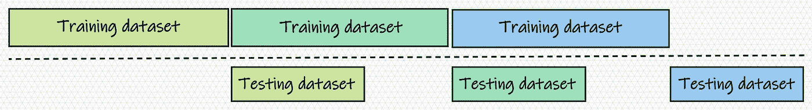
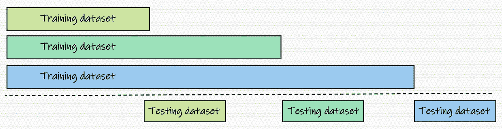

# ML 模型的回测策略

> 原文：<https://pub.towardsai.net/backtesting-of-ml-models-e558dbbea5c8?source=collection_archive---------0----------------------->

## 一种跨时间的交叉验证



图片来源:corporatefinanceinstitute.com

**模型性能**对任何业务流程都至关重要，必须定期进行验证。为了建立模型性能的功效，商业组织经常求助于诸如**交叉验证**之类的技术。在这种情况下，广泛使用留一法和 k 倍交叉验证。除此之外，企业经常需要确定模型随时间的性能，即基于时间的交叉验证。

在本文中，我们的目的是讨论基于时间的交叉验证方法，这些方法可以很容易地用来测量和确认模型的性能。它被称为**回溯测试**。广泛用于**股市分析**预测未来股票价值。但是，并不局限于此。它可以用于任何基于时间的交叉验证目的。下面简要介绍适合这一目的的方法或策略。基于业务上下文和数据，可以采用适当的回溯测试。

# 回溯测试策略

有三种简单的方法来回溯测试和验证机器学习(ML)模型的性能。与交叉验证方法类似，回测也将数据集分为训练集和验证集(也称为保留数据)。因此，在某种程度上，回溯测试可以被认为是交叉验证的扩展。
为了验证 ML 模型的性能，可以如下所示确定验证集。这些方法中的每一种都有一定的优点和局限性。

# **简单采样策略**

在这种采样策略中，训练和测试数据集是互斥的，即使在迭代中也是如此。这种方法的好处是在实现和解释方面的简单性。此外，对于大型数据集，它可以在最短的时间内验证 ML 模型的性能。然而，ML 模型的训练可能由于缺乏较小数据集的大量数据而受到影响。



训练和测试数据集的简单采样

接下来提供了用于简单采样的 python 代码。

```
def simple_batch(batch_start='2021-01-01', batch_end='2022-12-31', train_days = 30, test_days = 15 ):

    batch = []

    while True:
        a = pd.to_datetime(batch_start) - pd.DateOffset(days=train_days)
        b = pd.to_datetime(batch_start)
        c = pd.to_datetime(batch_start) + pd.DateOffset(days=test_days) batch.append([a, b, c])

        if  b + pd.DateOffset(days=train_days+2*test_days) > pd.to_datetime(batch_end):
            break
        else:
            batch_start = b + pd.DateOffset(days=test_days+train_days)

    return batch
```

*注:*在 python 代码中，b 代表训练停止和测试/验证开始的日期。因此，训练数据和测试/验证日期分别是从 a 到 b 和 b 到 c。

# **重叠策略**

在这种采样策略中，训练和测试数据集仅在当前迭代中是互斥的。这种方法的好处是在实现和解释方面的简单性。此外，对于大型数据集，它可以在合理的时间内验证 ML 模型的性能。然而，对于小数据集，ML 模型的训练可能由于缺乏数据量而受到影响。



训练和测试数据集的重叠采样

接下来提供了重叠采样的 python 代码。

```
def overlap_batch(batch_start='2021-01-01', batch_end='2022-12-31', train_days = 30, test_days = 15 ):
    batch = []

    while True:
        a = pd.to_datetime(batch_start) - pd.DateOffset(days=train_days)
        b = pd.to_datetime(batch_start)
        c = pd.to_datetime(batch_start) + pd.DateOffset(days=test_days) batch.append([a, b, c])

        if  b + pd.DateOffset(days=train_days+test_days) > pd.to_datetime(batch_end):
            break
        else:
            batch_start = b + pd.DateOffset(days=train_days)

    return batch
```

# **聚合策略**

在这种采样策略中，训练和测试数据集仅在当前迭代中是互斥的。此外，连续迭代的训练数据集包括来自先前迭代的所有训练数据。这种方法的好处是它能够为 ML 模型训练提供足够的数据量。对于小规模问题，可以采用它来验证 ML 模型的性能。但是，对于大型数据集，这种方法会导致计算时间更长。



训练和测试数据集的聚合采样

接下来提供了用于聚集采样的 python 代码。

```
def aggregate_batch(batch_start='2021-01-01', batch_end='2022-12-31', train_days = 30, test_days = 15, initial_date='2020-01-01' ):
    batch = []

    a = pd.to_datetime(initial_date)
    while True:
        b = pd.to_datetime(batch_start)
        c = pd.to_datetime(batch_start) + pd.DateOffset(days=test_days) batch.append([a, b, c])

        if  b + pd.DateOffset(days=train_days+test_days) > pd.to_datetime(batch_end):
            break
        else:
            batch_start = b + pd.DateOffset(days=train_days)

    return batch
```

*注*:模特培训的开始日期是固定的(用 a 表示)。此后，类似于先前的采样方法，训练数据在每次迭代中增加。

# 注意

为了更好地理解回溯测试，建议读者下载任何时间序列或类似问题，并执行上述策略。上述代码将提供一个训练和测试集，需要与机器学习模型配对，以训练和生成预测。如果没有业务问题的指导，培训和测试的进展步骤最好超过 30 天。此外，对于集合采样，机器学习模型的性能可能会提高。然而，对于其他策略来说，这并不是强制性的——简单的和重叠的，其中某些偏差可能是可见的。