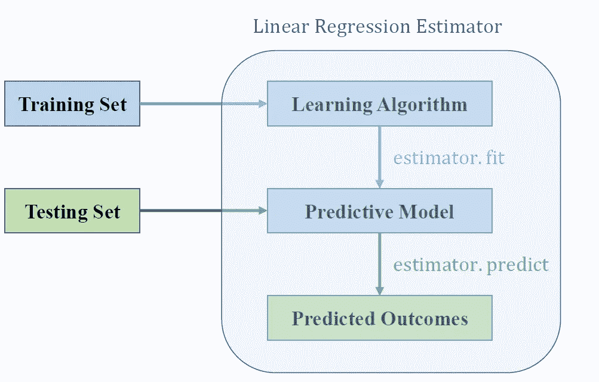
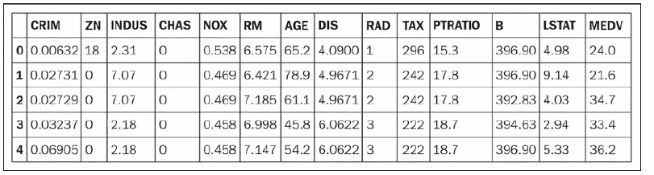
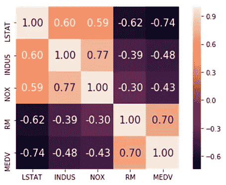

# 好坏回归分析

> 原文：<https://pub.towardsai.net/bad-and-good-regression-analysis-700ca9b506ff?source=collection_archive---------3----------------------->

## 审视机器学习回归模型| [走向人工智能](https://towardsai.net)


回归模型是最流行的机器学习模型。回归模型用于连续预测目标变量。回归模型在几乎每个研究领域都有应用，因此，它是使用最广泛的机器学习模型之一。本文将讨论构建回归模型的好的和坏的实践。

我们将构建一个简单的线性回归模型(内点和外点之间没有区别，可以使用 Lasso 回归等更稳健的正则化回归模型来处理)，然后使用它来预测住房数据集的房价。我们使用模型的输出来突出回归分析中好的和坏的实践。

关于住房数据集的更多信息可以从 [UCI 机器学习知识库](https://archive.ics.uci.edu/ml/machine-learning-databases/housing/)中找到。包含所有代码的 Jupyter 笔记本可以在 [GitHub](https://github.com/bot13956/python-linear-regression-estimator/blob/master/simple_regression_analysis_housing_prices.ipynb) 上找到。

# 使用梯度下降的线性回归估计量

在上一篇文章中，我们讨论了如何使用包含单个特征(X)的一维数据集构建简单的线性回归模型来预测连续的结果变量(y):[https://medium . com/@ benjamobi/machine-leaving-python-linear-regression-estimator-using-gradient-descent-b 0b 2c 496 e 463](https://medium.com/@benjaminobi/machine-leaning-python-linear-regression-estimator-using-gradient-descent-b0b2c496e463)



# 用 Python 实现简单的线性回归估计器

```
class GradientDescent(object):
    """Gradient descent optimizer.
    Parameters
    ------------
    eta : float
        Learning rate (between 0.0 and 1.0)
    n_iter : int
        Passes over the training dataset.

    Attributes
    -----------
    w_ : 1d-array
        Weights after fitting.
    errors_ : list
        Error in every epoch.

    Methods
    -----------
    fit(X,y): fit the linear regression model using the data. predict(X): Predict outcome for samples in X. Rsquare(X,y): Returns the R^2 value.
    """ def __init__(self, eta=0.01, n_iter=10):
        self.eta = eta
        self.n_iter = n_iter

    def fit(self, X, y):
        """Fit the data.

        Parameters
        ----------
        X : {array-like}, shape = [n_points]
        Independent variable or predictor.
        y : array-like, shape = [n_points]
        Outcome of prediction.
        Returns
        -------
        self : object
        """
        self.w_ = np.zeros(2)
        self.errors_ = []

        for i in range(self.n_iter):
            errors = 0
            for j in range(X.shape[0]):
                self.w_[1:] += self.eta*X[j]*(y[j] - self.w_[0] - self.w_[1]*X[j])
                self.w_[0] += self.eta*(y[j] - self.w_[0] - self.w_[1]*X[j])
                errors += 0.5*(y[j] - self.w_[0] - self.w_[1]*X[j])**2
            self.errors_.append(errors)
        return self def predict(self, X):
        """Return predicted y values"""
        return self.w_[0] + self.w_[1]*X 

    def Rsquare(self, X,y):
        """Return the Rsquare value"""
        y_hat = self.predict(X)
        return  1-((y_hat - y)**2).sum()/((y-np.mean(y))**2).sum()
```

# Python 估算器的应用:预测房价

# a)导入必要的库

```
import numpy as np
import matplotlib.pyplot as plt
import pandas as pd
import seaborn as sns
np.set_printoptions(precision=4) 
```

# b)探索住房数据集

```
df = pd.read_csv('[https://raw.githubusercontent.com/rasbt/'](https://raw.githubusercontent.com/rasbt/')
                 'python-machine-learning-book-2nd-edition'
                 '/master/code/ch10/housing.data.txt',
                 header=None,
                 sep='\s+')df.columns = ['CRIM', 'ZN', 'INDUS', 'CHAS', 
              'NOX', 'RM', 'AGE', 'DIS', 'RAD', 
              'TAX', 'PTRATIO', 'B', 'LSTAT', 'MEDV']
df.head()
```



# c)特征选择和标准化

```
cols = ['LSTAT', 'INDUS', 'NOX', 'RM', 'MEDV']
from sklearn.preprocessing import StandardScaler
stdsc = StandardScaler()
X_std = stdsc.fit_transform(df[cols].iloc[:,range(0,5)].values)# Evaluate the covariance matrixcov_mat =np.cov(X_std.T)
hm = sns.heatmap(cov_mat,
                 cbar=True,
                 annot=True,
                 square=True,
                 fmt='.2f',
                 annot_kws={'size': 15},
                 yticklabels=cols,
                 xticklabels=cols)plt.tight_layout()
plt.savefig('images/10_04.png', dpi=300)
plt.show()
```



**显示特征间相关性的协方差矩阵。**

由于我们对预测 MEDV(房屋的中值)感兴趣，我们发现与 RM(每个住宅的平均房间数)的相关性最强。因此，在我们的模型中，我们将使用 RM 作为预测变量，MEDV 作为目标变量:

```
X=X_std[:,3] # we use RM as our predictor variable
y=X_std[:,4] # we use MEDV as our target variable
```

# d)计算不同学习率的 R 平方值

```
[GradientDescent(eta=k, n_iter=100).fit(X,y).Rsquare(X,y) for k in [0.1,0.01,0.001,0.0001,0.00001,0.000001]]
```

我们获得了以下输出:

```
[0.297,0.312,0.482,0.483,0.308,0.047]
```

# e)拟合、预测和超参数调整

```
np.set_printoptions(precision=1)
# plot with various axes scales
plt.figure(figsize=(10,8))# fig 1
plt.subplot(231)
plt.scatter(X,y,c='steelblue', edgecolor='white', s=70,label='data')
plt.plot(X, GradientDescent(eta=0.1, n_iter=100).fit(X,y).predict(X),color='black', lw=2,label='fit')
plt.title('$\eta = 10^{-1}, R^2 = 0.297$ ',size=14)
plt.grid(False)
plt.xlabel('RM (std)',size=14)
plt.ylabel('MEDV (std)',size=14)
plt.legend()# fig 2
plt.subplot(232)
plt.scatter(X,y,c='steelblue', edgecolor='white', s=70)
plt.plot(X, GradientDescent(eta=0.01, n_iter=100).fit(X,y).predict(X),color='black', lw=2)
plt.title('$\eta = 10^{-2},R^2 = 0.312$',size=14)
plt.grid(False)
plt.xlabel('RM (std)',size=14)
plt.ylabel('MEDV (std)',size=14)# fig 3
plt.subplot(233)
plt.scatter(X,y,c='steelblue', edgecolor='white', s=70)
plt.plot(X,GradientDescent(eta=0.001, n_iter=100).fit(X,y).predict(X),color='black', lw=2)
plt.title('$\eta =10^{-3},R^2 = 0.482$',size=14)
plt.grid(False)
plt.xlabel('RM (std)',size=14)
plt.ylabel('MEDV (std)',size=14)# fig 4
plt.subplot(234)
plt.scatter(X,y,c='steelblue', edgecolor='white', s=70)
plt.plot(X, GradientDescent(eta=0.0001, n_iter=100).fit(X,y).predict(X),color='black', lw=2)
plt.title('$\eta = 10^{-4}, R^2 = 0.483$ ',size=14)
plt.grid(False)
plt.xlabel('RM (std)',size=14)
plt.ylabel('MEDV (std)',size=14)# fig 5
plt.subplot(235)
plt.scatter(X,y,c='steelblue', edgecolor='white', s=70)
plt.plot(X, GradientDescent(eta=0.00001, n_iter=100).fit(X,y).predict(X),color='black', lw=2)
plt.title('$\eta = 10^{-5},R^2 = 0.308$',size=14)
plt.grid(False)
plt.xlabel('RM (std)',size=14)
plt.ylabel('MEDV (std)',size=14)# fig 6
plt.subplot(236)
plt.scatter(X,y,c='steelblue', edgecolor='white', s=70)
plt.plot(X,GradientDescent(eta=0.000001, n_iter=100).fit(X,y).predict(X),color='black', lw=2)
plt.title('$\eta =10^{-6},R^2 = 0.047$',size=14)
plt.grid(False)
plt.xlabel('RM (std)',size=14)
plt.ylabel('MEDV (std)',size=14) plt.subplots_adjust(top=0.92, bottom=0.08, left=0.10, right=0.95, hspace=0.4, wspace=0.35)plt.show()
```

以下是输出:


**使用不同学习率参数值的回归分析。**

# 总论和结论

使用我们的简单回归模型，我们可以看到，我们的模型的可靠性取决于超参数调整。如果我们只是为学习率选择一个随机值，比如 eta = 0.1，这将导致一个糟糕的模型。为 eta 选择一个太小的值，比如 eta = 0.00001，也会产生一个不好的模型。我们的分析表明，最佳选择是当 eta = 0.0001 时，从 R 平方值可以看出。

一个好的和一个坏的回归分析之间的差异取决于一个人理解模型的所有细节的能力，包括关于不同超参数的知识以及如何调整这些参数以获得具有最佳性能的模型。在没有完全理解模型的错综复杂的情况下，将任何机器学习模型作为黑箱，都会导致模型被证伪。

# 参考资料:

1.  《机器学习:使用梯度下降的 Python 线性回归估计器》，Benjamin o . Tayo([https://medium . com/@ Benjamin bi/Machine-Learning-Python-Linear-Regression-Estimator-Using-Gradient-Descent-b 0b2c 496 e 463](https://medium.com/@benjaminobi/machine-leaning-python-linear-regression-estimator-using-gradient-descent-b0b2c496e463))。

2.《Python 机器学习》，第二版，塞巴斯蒂安·拉什卡。

*3。UCI 机器学习资源库*at*[https://archive . ics . UCI . edu/ml/machine-learning-databases/housing/](https://archive.ics.uci.edu/ml/machine-learning-databases/housing/)。*

*4.包含本文使用的全部代码的 Jupyter notebook 可以在这里找到:[https://github . com/bot 13956/python-linear-regression-estimator](https://github.com/bot13956/python-linear-regression-estimator)。*