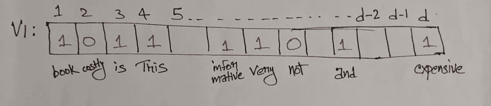
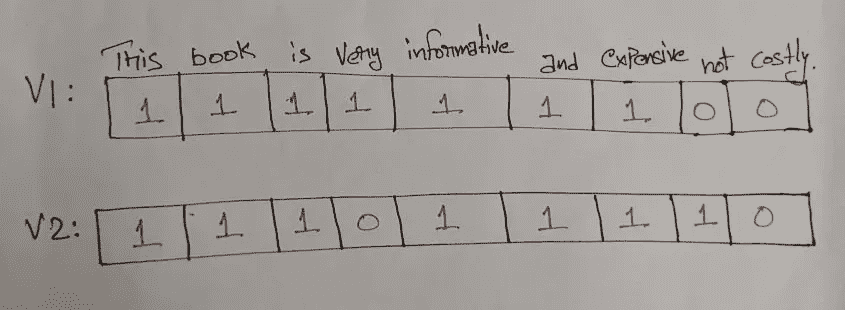

# 单词袋(蝴蝶结)

> 原文：<https://pub.towardsai.net/bag-of-words-bow-c6522cd3a6e9?source=collection_archive---------0----------------------->

## [自然语言处理](https://towardsai.net/p/category/nlp)

在之前的博客中，我们已经广泛讨论了将文本转换为矢量以执行机器学习算法的必要性，以便可以从文本数据中获得有意义的见解。文本数据是当前世界上许多行业(如医疗保健、旅游、电子商务等)可用的主要数据形式

因此，非常需要处理和分析来自文本数据的见解，这可能有助于在医疗保健行业中更快地做出决策/辅助做出决策，在来自旅行行业中的乘客评论的帮助下使旅程舒适。

单词袋是一种非常简单的策略，它将文本转换为数字向量，这有助于机器学习算法对文本数据执行操作。

***将文本转换为数字向量的主要目的是语义相似(SS)文本必须更接近(closer vector)。***

在进入博客之前，让我们先来看看 NLP 中使用的基本术语

**Corpus —** 它是一个包含所有文档的文件。

**文档—** 文档通常是用户对特定产品或服务的评论。

**鞠躬:**

让我们用一个例子来讨论这个概念，一个出版商要求读者在书完成后发表评论。因此，读者张贴他们的评论，这有助于在下一版中进行必要的修改。以下是包含读者发布的大约 n 篇文档(评论)的语料库。让我们看看语料库中的一些文档。这被认为是第一步。

R1:这本书信息量很大，而且很贵。

R2:这本书内容不丰富，而且很贵。

***R3:这本书信息量大，成本高。***

***R4:书是翔实的，书是昂贵的。***

单词袋的第二步是设计一个所有独特单词的列表(字典)或构建一个所有独特单词的集合。

从上述文件(评论)的所有独特的词的集合如下:

***这本书，是，非常，翔实，而且，昂贵，不，奢华。***

让我们假设我们有***d***——跨所有文档的唯一单词。

在构建了所有独特单词的集合之后，第三步是在语料库中存在的独特单词的帮助下构建向量。

V1、V2、V3、V4 分别是评论 R1、R2、R3 和 R4 的向量。

为评论 R1 构建向量 V1。

R1:这本书信息量很大，而且很贵。

现在我们需要构造一个大小为 ***d*** 的向量，使得所有唯一的单词对应一个不同的维度 V1 属于 R^ ***d*** (真实坐标空间的 ***d*** *维度)*因为是*维度，每个单词对应字典中的一个索引。*

**

*图 1 用 **d** 唯一字表示的矢量 V1*

*向量 V1 是一个***【d】****-维向量即它包含了所有*-维向量中唯一来自语料库的单词。计算一个单词在 R1 出现的次数，并填入相应的 V1 单元格中。在上图中， ***这个*** 只出现了一次，所以计数(单词出现的次数)是 *1* ，单词*在 R1 不存在，所以对应的单元格用 *0 填充。*这样整个矢量 V1 就被填满了。****

**由于 V1 是**维*维*维**维即*维非常大*大部分单元格都填充了零，这种情况导致了*稀疏向量*。稀疏向量是其中向量的大部分单元/元素为零的向量。**

**这种将文本数据转换成数字向量的策略被称为单词包。**

****文字袋工作:****

**让我们以 R1 和 R2 为例，**

**R1:这本书信息量很大，而且很贵。**

**R2:这本书内容不丰富，而且很贵。**

****

**图 2 用独特的词语描绘 V1 和 V2**

**长度(V1-V2) = ||V1-V2||**

**||V1-V2||是范式**

**因此，从上面的图 2 中，**

**这里只有两个不同的词，一个是 ***Very*** 另一个是 ***not*** 在这些向量上，我们得到的这两个向量的差是| 1–0 | = 1。**

**| | v1-v2 | | = sqrt(1^2+1^2)=***sqrt(2)***。**

**从上面可以看出，sqrt(2)是两个向量之间的距离，非常小。**

**但是我们可以看到两个评论是完全相反的，除了他们都在说这本书很贵，但是一个说它很有知识性，另一个说它没有知识性。**

**所以，我们可以说，当文档中使用的单词有很小的变化时，单词包的性能不好。**

****二进制词袋****

**还有另一种略有不同的策略，叫做二进制单词袋。它的工作原理如下，与单词包的唯一区别是，如果单词出现，它标记一个而不是计数单词出现的次数，如果单词没有出现，它在向量中标记*零*。这是单词袋和二进制 BoW 之间唯一的区别。它又叫 ***布尔包*** 。所以，二进制弓只不过是向量中不同单词的数量(上面的例子是 V1 和 V2)。**

**||V1-V2|| = ***sqrt(2)。*****

****文字袋的限制:****

**BoW 模型很容易掌握，并且在阅读文档时非常成功，但是它有自己的局限性。**

**1)词典的构建需要仔细关注，因为在真实世界场景中可获得大量的语料库。**

**2)稀疏性非常普遍，因为向量的大小为***【d】***-维度(非常大)在大的稀疏向量中呈现这种小的信息是一种挑战，原因如计算期间的空间和时间复杂性。**

**3)该模型仅基于单词，忽略了单词的词序和上下文，这消除了在另一个上下文中解释相同单词的含义的灵活性。**

*****谢谢你，快乐学习的人。*****