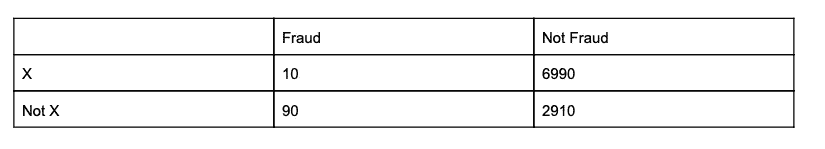
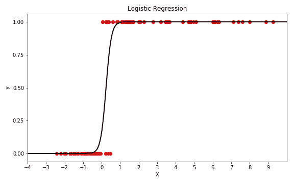
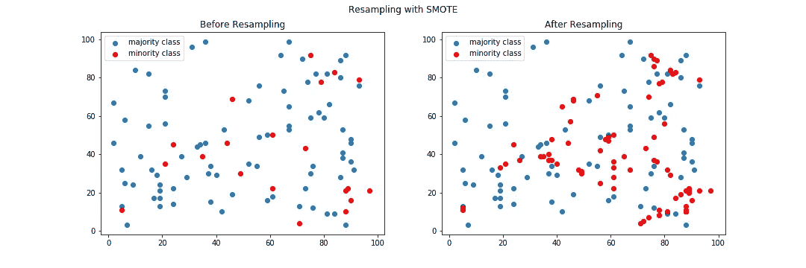
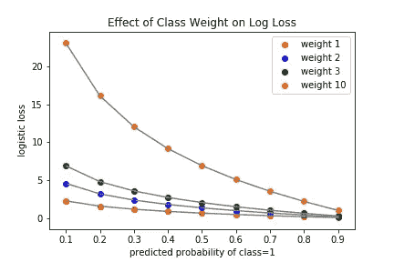

# 机器学习算法的数据集中的平衡行为

> 原文：<https://pub.towardsai.net/balancing-act-eb75dd05ffa3?source=collection_archive---------0----------------------->

## 处理 ML | [中的不平衡数据集到 AI](https://towardsai.net/)

## Python 中减轻不平衡数据集训练分类器影响的技术


# 用不平衡数据训练分类器会怎么样？

当处理不平衡的类时，我们可能需要做一些额外的工作和计划，以确保我们的算法给我们有用的结果。

在这篇博客中，我只研究了两种分类技术来说明这个问题，但是你应该知道这个问题是普遍性的。出于一个很好的理由，监督分类算法(使用标记数据)将类别分布考虑在内。然而，当我们试图检测重要的、但与备选方案相比很少的类时，很难开发一个模型来捕捉它们。

在这里，在通过一些例子深入研究了这个问题之后，我概述了一些解决这个问题的可靠的技术。

# 低优先级，高优先级

## 朴素贝叶斯

假设您正在构建一个预测模型来检测欺诈。您有一个包含 10，000 行和一些要素列的数据集，每行标记 1 表示欺诈性交易，标记 0 表示有效交易。为简单起见，我将重点介绍一个特性 x，细分如下:



[朴素贝叶斯](https://towardsdatascience.com/naive-bayes-document-classification-in-python-e33ff50f937e)分类模型使用贝叶斯定理的比率公式来预测类成员的概率。

```
Formula: Pr(C1|E)/Pr(C2|E)/ = Pr(E|C1)*Pr(C1) / Pr(E|C2)*P(C2)
```

该模型预测比率的哪一侧更高。

如果类别 1 的先验概率非常低，而类别 2 的先验概率非常高，则朴素贝叶斯模型将经常无法预测类别 1，即使类别 1(给定证据)的可能性非常高而类别 2 的可能性非常低。

将欺诈视为第 1 类，将非欺诈视为第 2 类，对于不存在特征 X 的行，计算如下:

```
Pr(E|C1) = 90/100 = .9
Pr(C1) = 100/10,000 = .01
Pr(E|C2) = 10/100 = .1
Pr(C2) = 9,900/10,000 = .99.9 * .01 / .1 * .99 = .009/.099
```

由于分母较高，因此模型将预测类别 2。尽管事实上证据倾向于欺诈。100 个欺诈案例中有 90 个没有特征 X，因此该交易符合大多数已知欺诈的特征。

由于类别 1 的先验概率如此之低，不管证据如何，算法的输出几乎总是偏向类别 2。在这种情况下，可能性必须大于 0.99 才能扭转局面。

如果你想要一个能区分 1 类和 2 类的模型，这是个坏消息。遗漏欺诈对银行和持卡人来说都有很高的成本。无论何时发生，抓住它并防止它，符合所有人的利益，即使它在银行交易的大计划中概率很低。

## 逻辑回归

逻辑回归是另一种输出概率的分类算法。一条最佳拟合线被绘制到对数优势标度的数据上，然后 y 轴被转换成概率，将该线变成 s 曲线。随着 x 减小，曲线在底部变平，概率趋近于零；随着 x 的增加，曲线在顶部变平，概率接近 1。



类别 1 的低先验将使类别 1 的预测难以实现，因为逻辑回归通过找到具有最高最大可能性的线来确定最佳拟合的线。最大似然是给定线上数据点的对数似然的总和。对数似然性通过将数据点从 x 轴投影到直线上并在 y 轴上找到相应概率的对数来确定。如果类别 1 的情况非常少，则最佳拟合线可能是很少(如果有的话)将高概率分配给类别 1 的线。在这些情况下，该模型可以通过正确地分类尽可能多的多数类而忽略少数类来获得更好的最大似然得分。

**概括一下:**如果你想用机器学习对某样东西进行分类，而它的先验概率很低，你会遇到麻烦。幸运的是，您可以使用一些策略来推动您的分类器预测低先验类别。我在这里概述了其中的三个。

# 策略 1:用自举改变先验

您可以通过对数据进行重采样来更改类先验。

如果不平衡很小，你可以对你的多数类进行随机[欠采样](https://imbalanced-learn.readthedocs.io/en/stable/generated/imblearn.under_sampling.RandomUnderSampler.html#imblearn.under_sampling.RandomUnderSampler)。如果你的类高度不平衡，我不推荐这个选项，因为你会丢失很多数据。

另一个选择是对你的少数类使用随机[过采样](https://imbalanced-learn.readthedocs.io/en/stable/generated/imblearn.over_sampling.RandomOverSampler.html#imblearn.over_sampling.RandomOverSampler)或者合成过采样。Imblearn 的 [SMOTE](https://imbalanced-learn.readthedocs.io/en/stable/generated/imblearn.over_sampling.SMOTE.html#imblearn.over_sampling.SMOTE) 通过查找每个数据点的最近邻居(默认值为 5)并在它们之间的向量上绘制点来创建合成样本。每个向量上的点数取决于平衡类别所需的样本数。

下图显示了 SMOTE 前后的数据:



您可以看到，现在在现有数据点之间聚集了少数民族类的附加数据点。

您可以在带有分类器的“imblearn”管道中使用 SMOTE，然后使管道符合您的数据，如下所示:

```
from imblearn.pipeline import Pipeline
from imblearn.over_sampling import SMOTEsmote = SMOTE()
cls = LogisticRegression()pipe = Pipeline([(‘smt’, smote), (‘cls’, cls)])
pipe.fit(X_train, y_train)
```

SMOTE 有许多您可能希望考虑的变体，例如 [SMOTENC](https://imbalanced-learn.readthedocs.io/en/stable/generated/imblearn.over_sampling.SMOTENC.html) ，它被设计用来处理分类特征。在[用户指南](https://imbalanced-learn.readthedocs.io/en/stable/over_sampling.html)中有详细的描述。

# 策略 2:调整损失函数

一些分类器有一个可选的“类权重”参数。您可以使用类权重来调整损失函数，这样您的模型就不会因仅获得多数类的正确预测而优化。您可以使用字典以所需的比率分配类权重:

class_weight={0:1，1:10}

当正确分类为 1 时，对数损失的各种重量组合(**(ylog(p)+(1y)log(1p)**)如下所示。



x 轴上. 5 或更大的值是 1 的预测值，概率从低到高。x 轴上低于 0.5 的值是 0 的预测值(不是类 1)，概率从高到低。分配给 1(正确类别)的概率越高，对数损失越低。模型分配给 0(不正确的类别)的概率越高，对数损失就越大。我们分配的类别权重越高，对错误预测的惩罚就越严厉。

# 策略 3:改变预测的阈值

如果您的模型正在预测您的少数类的概率，因此可能的情况始终在 30%或 40%的“雷达下飞行”,您可能希望降低正面预测的阈值。

要了解这种情况是否会发生，请使用分类器的 predict_proba()方法。然后，您可以创建一个带有阈值的自定义预测列表，以捕捉目标类的更多情况。代码应该如下所示:

```
probabilities = cls.predict_proba(x_test)[:,1]
y_hat = [1 if i>.35 else 0 for i in probabilities]
```

当心:如果你把门槛移得太远，你可能会在交易中得到比你预想的更多的误报。确保绘制了一个[混淆矩阵](https://scikit-learn.org/stable/modules/generated/sklearn.metrics.confusion_matrix.html)，并比较了移动阈值前后的 [F1 分数](https://scikit-learn.org/stable/modules/generated/sklearn.metrics.f1_score.html)，以便根据需要进行调整。

# 总结

您可以通过以下方式处理不平衡的类:

*   通过重采样改变先验
*   调整损失函数
*   更改预测的概率阈值

在某些情况下，您可能需要使用这三者来创建一个能够持续预测罕见类的模型。

# **资源**

这是我和海伦·利维·迈尔斯和亚当·布隆菲尔德一起做的一个项目，它使用了上述一些技术:

[](https://github.com/AdamBlomfield/mod_5_project) [## AdamBlomfield/mod_5_project

### 作者:Kelly Epley，Adam Blomfield 和 Helen Levy-Myers 在这个项目中，我们训练了一个模型，将交易标记为…

github.com](https://github.com/AdamBlomfield/mod_5_project) 

以下是一些有用的链接:

 [## 欢迎来到不平衡学习文档！—不平衡—了解 0.5.0 文档

### 安装、测试和贡献包的信息。主要文档。这包含了深入的…

不平衡-learn.readthedocs.io](https://imbalanced-learn.readthedocs.io/en/stable/)  [## 原木损失

### 对数损失(与交叉熵相关)衡量分类模型的性能，其中预测…

wiki.fast.ai](http://wiki.fast.ai/index.php/Log_Loss) [](https://developers.google.com/machine-learning/crash-course/classification/precision-and-recall) [## 分类:精确度和召回率|机器学习速成班|谷歌开发者

### 预计时间:9 分钟精度试图回答以下问题:什么比例的积极…

developers.google.com](https://developers.google.com/machine-learning/crash-course/classification/precision-and-recall)