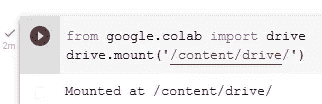
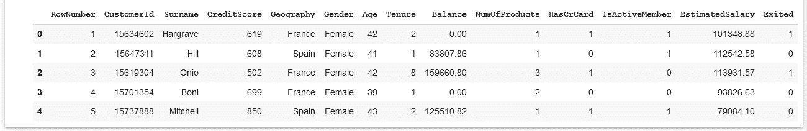

# 基于神经网络的银行流失建模

> 原文：<https://pub.towardsai.net/bank-churn-modeling-with-neural-networks-31881eee6112?source=collection_archive---------0----------------------->

## [深度学习](https://towardsai.net/p/category/machine-learning/deep-learning)

## 在 google Colab 中使用 Keras 的人工神经网络


图片[来源](https://www.kaggle.com/kmalit/bank-customer-churn-prediction)

在本文中，我们将使用 google colab 中的人工神经网络来预测客户流失或流失。目标不是用模型得到好的精度，重要的是用不同的技术和算法得到好的模型。

流失分析是一个分类问题，因为标签列只有二进制值。客户对每个公司和机构都非常重要，客户流失是分析的一部分。

这里，我们将使用神经网络根据输入特征和目标列来预测客户流失，如下所示:

**输入的特征有** *姓氏、积分、地理、……..，IsActiveMember，EstimatedSalary。*

**目标列为** *退出*

该数据集在 kaggle 上很容易获得。

让我们从 google colab 中的 python 代码开始。

首先，我们需要用 colab 挂载驱动器，这样我们就可以直接从驱动器访问数据。为此，下面给出了一个简单的命令:

```
from google.colab import drive
drive.mount('/content/drive/')
```

运行该命令后，我们将获得一个链接，用于连接带有 colab 的驱动器，如下所示:


我们需要点击链接，用 Gmail 登录，然后从那里复制链接并粘贴到上面的框中。



驱动器已安装。作者的照片

现在，导入 colab 中所有需要的库。

```
import numpy as np 
import pandas as pd 
import matplotlib.pyplot as pltimport keras
from keras.models import Sequential
from keras.layers import Dense, Activation, Embedding, Flatten,
                                  BatchNormalization, Dropoutfrom keras.activations import relu, sigmoid
from keras.layers import LeakyReLU
```

现在，我们将从驱动器中读取数据。

```
bank_df = pd.read_csv('/content/drive/MyDrive/Colab
                                     Notebooks/Churn_Modelling.csv')bank_df.head()
```



客户数据。作者的照片

[](/types-of-kernels-in-machine-learning-291cf85fcdd0) [## 机器学习中的核类型

### 使用线性函数解决非线性问题

pub.towardsai.net](/types-of-kernels-in-machine-learning-291cf85fcdd0) [](/understand-feature-selection-in-machine-learning-with-python-a0e99dbb7426) [## 理解 Python 机器学习中的特征选择

### 从数据中选择最佳特征集的技术

pub.towardsai.net](/understand-feature-selection-in-machine-learning-with-python-a0e99dbb7426) 

现在，我们将数据分为输入特征和目标特征，分别为 X 和 y。

```
X = bank_df.iloc[:, 3:13].values
y = bank_df.iloc[:, 13].values
```

输入特征从第 4 列到第 12 列，目标特征是第 13 列，即退出列。

特性中有两个类别列，我们必须将它们转换成数字形式，以便于训练。这里，我们使用了一个标签编码器来获取数字形式的类别。

```
# Encoding categorical data
from sklearn.preprocessing import LabelEncoderlabelencoder_X_1 = LabelEncoder()
X[:, 1] = labelencoder_X_1.fit_transform(X[:, 1])labelencoder_X_2 = LabelEncoder()
X[:, 2] = labelencoder_X_2.fit_transform(X[:, 2])
```

现在，我们将使用一个热编码器来获取 categories 列。

```
from sklearn.preprocessing import OneHotEncoder
from sklearn.compose import ColumnTransformerct = ColumnTransformer(
[('one_hot_encoder', OneHotEncoder(categories='auto'), [1])],
remainder='passthrough')X = ct.fit_transform(X)
X = X[:, 1:]
```

列转移是一种估计器，其中列的向量值被转换以生成特征。

是时候将特性分为训练集和测试集了。

```
# dividing features into training and testing sets.
from sklearn.model_selection import train_test_splitXtrain, Xtest, ytrain, ytest = train_test_split(X, y, test_size
                                           = 0.2, random_state = 0)
```

现在，我们将一个功能缩放，使所有的变化数据进入一些相等的范围。

```
# Feature Scalingfrom sklearn.preprocessing import StandardScaler
sc = StandardScaler()
Xtrain = sc.fit_transform(Xtrain)
Xtest = sc.transform(Xtest)
```

现在，导入 Keras 分类器和网格搜索 cv 来调整参数。

```
from keras.wrappers.scikit_learn import KerasClassifier
from sklearn.model_selection import GridSearchCV
```

是时候创建一个函数来制作一个具有不同隐层的神经网络了。

```
def create_model(layers, activation):
    model = Sequential()
    for i, nodes in enumerate(layers):
        if i==0:
            model.add(Dense(nodes, input_dim=Xtrain.shape[1]))
            model.add(Activation(activation))
        else:
            model.add(Dense(nodes))
            model.add(Activation(activation)) model.add(Dense(1))
    model.compile(optimizer='adam', loss = 'binary_crossentropy',
                                       metrics=['accuracy'])
    return modelmodel=KerasClassifier(build_fn=create_model, verbose=0)
```

在这里，我们给出了不同的层数和激活函数来选择最好的作为 GridSearchCV 的一部分。

```
layers = [[15], [35, 25], [40, 25, 15]]
activations = ['sigmoid', 'relu']param_grid = dict(layers = layers, activation = activations,
                  batch_size = [128, 256], epochs=[30])grid = GridSearchCV(estimator=model, param_grid=param_grid)
```

下一步，我们正在训练模型并获得最佳参数。

```
grid_result = grid.fit(Xtrain, ytrain)
```

编写以下命令，为我们的人工神经网络获取最佳参数。

```
[grid_result.best_score_, grid_result.best_params_]#output:
[0.8505000114440918,
 {'activation': 'relu',
  'batch_size': 256,
  'epochs': 30,
  'layers': [40, 25, 15]}]
```

现在，我们将使用这些最佳参数进行预测。

```
pred_y = grid.predict(Xtest)
```

为了评估，我们正在检查混淆矩阵。

```
from sklearn.metrics import confusion_matrix
cm = confusion_matrix(ytest, ypred)
cm#output:
array([[1517,   78],
       [ 202,  203]])
```

是时候得到我们上面创建的人工神经网络的准确度分数了。

```
from sklearn.metrics import accuracy_score
score = accuracy_score(ytest, ypred)
score#output:
0.86
```

这些参数为模型提供了 86%的准确性。

> ***结论***

这是一个非常简单的分类人工神经网络，对初学者非常有用。

我希望你喜欢这篇文章。通过我的 [LinkedIn](https://www.linkedin.com/in/data-scientist-95040a1ab/) 和 [twitter](https://twitter.com/amitprius) 联系我。

# 推荐文章

1.[8 Python 的主动学习见解收集模块](/8-active-learning-insights-of-python-collection-module-6c9e0cc16f6b?source=friends_link&sk=4a5c9f9ad552005636ae720a658281b1)
2。 [NumPy:图像上的线性代数](/numpy-linear-algebra-on-images-ed3180978cdb?source=friends_link&sk=d9afa4a1206971f9b1f64862f6291ac0)3。[Python 中的异常处理概念](/exception-handling-concepts-in-python-4d5116decac3?source=friends_link&sk=a0ed49d9fdeaa67925eac34ecb55ea30)
4。[熊猫:处理分类数据](/pandas-dealing-with-categorical-data-7547305582ff?source=friends_link&sk=11c6809f6623dd4f6dd74d43727297cf)
5。[超参数:机器学习中的 RandomSeachCV 和 GridSearchCV](/hyper-parameters-randomseachcv-and-gridsearchcv-in-machine-learning-b7d091cf56f4?source=friends_link&sk=cab337083fb09601114a6e466ec59689)
6。[用 Python](https://medium.com/towards-artificial-intelligence/fully-explained-linear-regression-with-python-fe2b313f32f3?source=friends_link&sk=53c91a2a51347ec2d93f8222c0e06402)
7 全面讲解了线性回归。[用 Python](https://medium.com/towards-artificial-intelligence/fully-explained-logistic-regression-with-python-f4a16413ddcd?source=friends_link&sk=528181f15a44e48ea38fdd9579241a78)
充分解释了 Logistic 回归 8。[数据分发使用 Numpy 与 Python](/data-distribution-using-numpy-with-python-3b64aae6f9d6?source=friends_link&sk=809e75802cbd25ddceb5f0f6496c9803)
9。[机器学习中的决策树 vs 随机森林](/decision-trees-vs-random-forests-in-machine-learning-be56c093b0f?source=friends_link&sk=91377248a43b62fe7aeb89a69e590860)
10。[用 Python 实现数据预处理的标准化](/standardization-in-data-preprocessing-with-python-96ae89d2f658?source=friends_link&sk=f348435582e8fbb47407e9b359787e41)