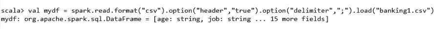
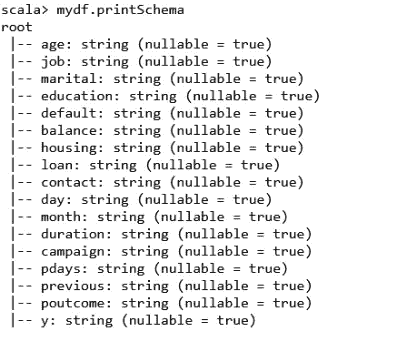
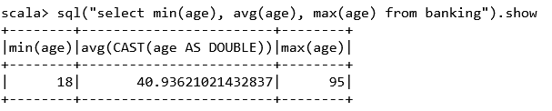
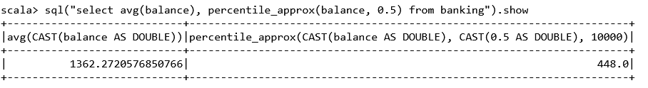
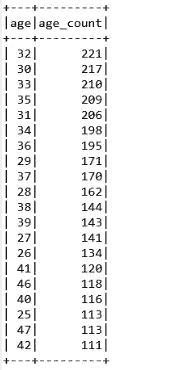
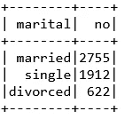
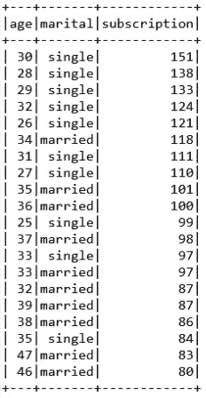
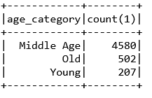

# 大数据项目中的银行市场客户分析

> 原文：<https://pub.towardsai.net/banking-market-customer-analysis-in-big-data-project-387ec95b56e5?source=collection_archive---------0----------------------->

## [数据分析](https://towardsai.net/p/category/data-analysis)

## 这个分析中使用的工具和语言是 spark 和 scala


由[弗兰基·查马基](https://unsplash.com/@franki?utm_source=medium&utm_medium=referral)在 [Unsplash](https://unsplash.com?utm_source=medium&utm_medium=referral) 上拍摄的照片

通过使用 scala 语言，银行领域的大数据分析项目非常有趣。许多银行给全国各地的许多人打电话，说服他们投资银行计划。嗯，我也接到很多电话。他们试图解释他们想推销的计划的好处。

活动结束后，该银行获得了一个愿意投资他们银行的好客户。总数据集包含订阅了存款期限和没有订阅的客户的所有记录。

数据集变量是年龄、工作、婚姻、违约、住房、贷款、联系人、月份、星期几、持续时间、活动、天数、以前、结果和 y。

根据这些数据集，目标变量是“y”，即以二进制“是”和“否”表示的定期存款认购人或认购人。其他剩余特征是独立变量。

从我的观察，我觉得有两个重要的特点。“持续时间”和“y”，持续时间很重要，因为打电话的时间越长，说明这个人对这个计划感兴趣，而“y”本身就是一个因变量。

数据集名称为 banking，我们将使用 spark 工具和 scala 语言进行分析。原始数据如下所示，用分号分隔。

## 步骤 1:加载数据并制作数据框。

为此，我们需要读取 CSV 文件并选择 delimiter 选项，以便用分号分隔各个特性。

```
scala> val mydf= spark.read.format("csv").option("header","true").
                  option("delimiter",";").load("banking.csv")
```



数据变量获得了数据集的特征。作者图片

在获得变量“mydf”中的数据后，我们可以使用“printSchema”方法查看列的名称。

```
scala> data.printSchema
```



所有列名的视图。作者图片

## 第二步:成功率

成功率由订阅该方案的人占记录总数的百分比来定义。为此，我们需要计算订阅记录和总条目的总数。

```
scala> val totalcount = mydf.count().toDouble#output: 
totalcount: Double = 45211.0scala> val subscribed = mydf.filter($"y" === "yes").count().toDouble#output:
subscribed = Double = 5289.0scala> val success_rate = subscribed/totalcount#output:
success_rate: Double = 0.1169
```

成功率在 11.5%左右。

## 第三步:失败率

失败率由未订阅该方案的人占记录总数的百分比来定义。为此，我们需要计算未订阅记录的总数和总条目数。

```
scala> val not_subscribed = mydf.filter($"n" === 
                                        "no").count().toDouble#output:
not_subscribed = Double = 39922.0scala> val failure_rate = not_subscribed/totalcount#output:
failure_rate: Double = 0.8830
```

失败率在 88.3%左右。

## 步骤 4:找出人们的最小、最大和平均年龄

有时我们使用 SQL 操作，要以表格的形式制作数据框，我们必须使用如下所示的相同方法:

```
scala> mydf.createOrReplaceTempView("banking")scala> sql("select min(age), avg(age), max(age) from banking").show
```



获得关于年龄的结果。作者的照片

## 第五步:通过客户的银行余额来观察他们

分析师总是试图从不同的特征中发现洞见，以便进行分析和可视化。通过检查客户的银行余额进行分析。

```
scala> sql("select avg(balance), percentile_approx(balance, 0.5)
                        from banking").show
```



输出。作者的照片

## 第 6 步:按客户年龄查找订阅该计划的人数

非常重要的一点是，要知道哪些年龄组的人更多地参与了这项计划。结果只显示前 20 行。

```
scala> sql("select age, count(*) as age_count from banking where
          y = 'yes' group by age order by age_count desc").show
```



按年龄计数输出。作者的照片

## 第七步:了解婚姻状况统计类别

婚姻状况是每个数据集中的一个类别特征。scala 中的这个查询给出了婚姻状况中所有类别的计数。

```
scala> sql("select marital, count(*) as count from banking where
          y = 'yes' group by marital order by count desc").show
```



婚姻类别的计数。作者的照片

## 第八步:年龄和婚姻状况的共同影响

年龄和婚姻状况的结合如何提供订阅与否的洞察力。

```
scala> sql("select age, marital, count(*) as subscription from 
            banking where y ='yes' group by age, marital order by 
            subscription desc").show
```



显示前 20 行计数。作者的照片

## 第九步:做一点功能工程，找到订阅的正确年龄

了解订阅客户的正确年龄，并找出订阅更多的年龄组。

```
scala> sql("select case when age<25 then 'Young' when age between 25
            and 60 then 'Middle age' when age >=60 then 'Old' end as
           age_category,count(1) from banking where y='yes' group by
           age_category order by 2 desc").show
```



年龄组计数。作者的照片

年龄组的总数等于预订客户的总数。从这个问题中，我们观察到中年组的人订阅最多。

> ***结论:***

这个项目是给 scala 语言的基本查询。这个大数据项目包含非常好的数据，在这些数据中，我们分析了一些细微的见解以获得预测。

我希望你喜欢这篇文章。通过我的 [LinkedIn](https://www.linkedin.com/in/data-scientist-95040a1ab/) 和 [twitter](https://twitter.com/amitprius) 联系我。

# 推荐文章

1.  [NLP —用 Python 从零到英雄](https://medium.com/towards-artificial-intelligence/nlp-zero-to-hero-with-python-2df6fcebff6e?sk=2231d868766e96b13d1e9d7db6064df1)

2. [Python 数据结构数据类型和对象](https://medium.com/towards-artificial-intelligence/python-data-structures-data-types-and-objects-244d0a86c3cf?sk=42f4b462499f3fc3a160b21e2c94dba6)

3. [MySQL:零到英雄](https://medium.com/towards-artificial-intelligence/mysql-zero-to-hero-with-syntax-of-all-topics-92e700762c7b?source=friends_link&sk=35a3f8dc1cf1ebd1c4d5008a5d12d6a3)