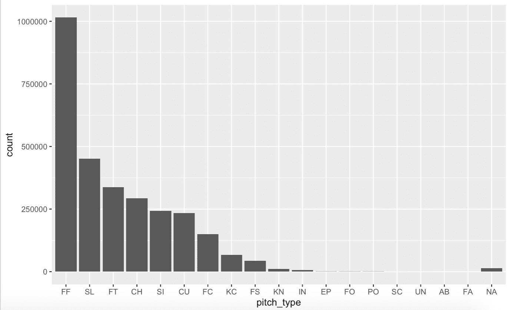
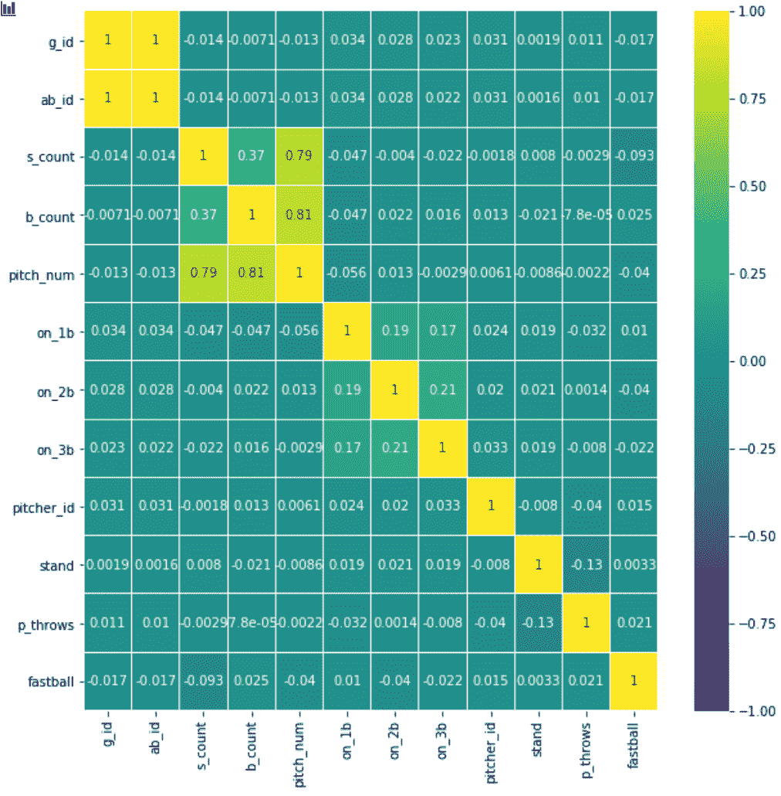
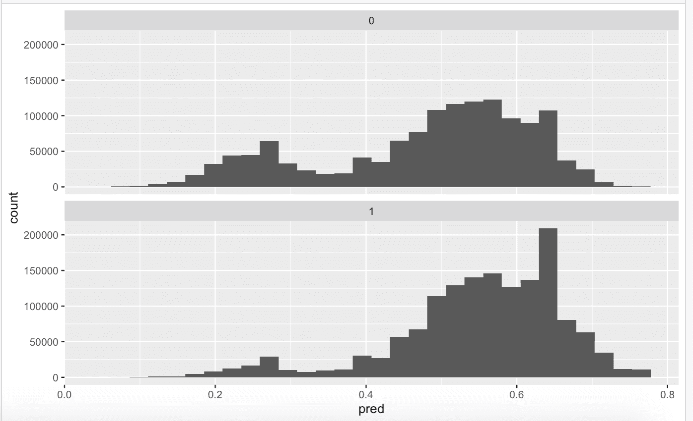

# 棒球投球预测

> 原文：<https://pub.towardsai.net/baseball-pitch-prediction-e1da2a0a8b30?source=collection_archive---------1----------------------->

[学分](https://www.pinterest.com/pin/795237246679335160/)

## [机器学习](https://towardsai.net/p/category/machine-learning)

## 用机器学习预测棒球的下一次投球

# 介绍

道奇队的游击手科里·西格在第九局两人出局后准备击球。快速球在里面，他接触到…滚地球到二垒，他出局了。太空人队在 7 场比赛中赢得了 2017 年世界大赛。

最终发现太空人用摄像机来计算下一次投球。击球手知道即将到来的投球给球队带来了巨大的优势，一些太空人的教练和球员受到了严厉的处罚。然而，这件事让我想知道是否有一种方法可以预测下一次投球，而不会“作弊”我决定使用机器学习和数据科学来根据当前的游戏场景预测下一场比赛。这里，我的意思是所有的因素都是有编号的，所有人都可以看到的，比如击球次数，球数，跑垒员等等。

# 数据清理

我用的数据可以在 [Kaggle](https://www.kaggle.com/pschale/mlb-pitch-data-20152018) 上找到。整个数据集包含八个逗号分隔值(CSV)文件，包含 2015-2018 年 MLB 季节的数据。然而，我专注于两个文件，投球和打击。pitches CSV 文件包含 40 个数据栏，而 at-bats 有 11 个。它们都有我需要的数据值，所以我决定合并这些文件。合并后的文件包含 51 个变量，但其中大部分是不需要的。许多不同的列描述了实际的投球，就像用坐标描述球的运动一样。这些都无济于事，因为 pitch 类型将与所有这些列的组合一样好。

一开始。我只是浏览了所有的变量，并根据我的知识思考了哪些变量会影响投手下一次投球的决定。

我决定制作一个简单的数据框，只包含一些可用于基本模型的变量。我决定保留击球数、球数、投球数，并在数据中添加两个新变量。第一个变量类似于 pitch_type 变量。然而，它是二进制的。任何 4-seam、2-seam 或 cutters 都将为此变量返回 1(将其归类为快速球)，任何其他投球类型都将生成 0。第二个新变量显示了之前的音高。然而，它不是二进制的。为了使方法更简单，我把 4 缝线、2 缝线和切球组合成快速球，把曲球和滑球组合成一种投球类型。

下一个数据框包含这些变量，此外还有跑垒员是否在垒上、投手的 id、投手的姿势和击球手的姿势。最后，我创建了用于多分类的数据帧，其中快速球变量将包含所有的音高，而不是之前数据帧中的二进制。当第一次创建这个数据帧时，我不确定是否有可能预测精确的音高类型。在将一些球种归类后，我选定了四种不同的球种，FF(4 缝线、2 缝线或切球)、CU/SL(曲球或滑球)、ch(变速球)或其他。数据清理，除了合并，都是在 R 中用 tidyverse 完成的。

# 数据可视化和统计

**螺距类型图**

第一次收集数据时，我脑海中有一个图表。我想看看每次投球的数量。这个条形图显示了三个赛季中每种球场的数量。这显示出快速球是最常见的球种，占所有球种的一半还不到。

**可变相关热图**

这个关联热图显示了变量之间的关联。相关性范围从-1 到+1。颜色越浅，相关性越高。这将让我们看到哪些变量是必要的，以及我们是否可以删除任何变量。因为我们想要预测快速球变量，所以我们需要查看“快速球”和其他变量的值。在此热图中，我们必须关注最底部的行或最右边的列，因为它们是相同的。热图并没有给出太多关于哪些变量有助于预测音高的信息，这只是告诉我们很难高速预测。你也可以看到一些值非常高，原因是它们直接相关。例如，击球手的投球数与击球和球数直接相关。

# 模型结构

我创建的前两个模型是广义线性模型(GLM)和支持向量机(SVM)。我在 r 中创建了这两个模型。这些模型用二进制分类来预测投球(1 表示快速球，0 表示其他球)。我使用了击球数、球数、(击球手的)投球数、任何垒上是否有跑垒员的最后一次投球、击球手姿势、投手 id(每个投手都有一个 id)和投手姿势。

GLM 不同于正常的线性回归模型，因为它通过链接函数将线性模型与响应变量相关联，并允许每个测量值的方差大小是其预测值的函数，从而“概括”了线性回归(因此得名)。结果输出 0 到 1 之间的值。在我们的例子中，如果它是 0.5 或更低，它不是一个快速球，如果它是 0.5 或更高，它是一个快速球。从 GLM 开始，我使用了我的数据框，其中只包含 2018 年的数据。我没有将数据分为测试和训练。然而，我将模型与所有数据进行了拟合，并创建了一个可视化的模型。我不知道预期的精确度是多少，而且模型运行得非常快。运行模型后，它给了我 60.5%的准确率。

上面的图表是非快速球的投球，下面的图表是快速球。

我很惊讶。这是一个非常基本的模型，比随机猜测要好得多，这将给你大约 47%的准确率，因为快速球比其他球都多。然而，在 GLM 模型中没有可以调整的超参数，所以在 SVM 上。

支持向量机(SVM)获取所有数据，并在输出之间创建最佳边界。该模型将进行复杂的数据转换，并将您的数据分成不同的组(对于这个项目，它分为两组，快速球，或没有)。输出将介于-1 和 1 之间。0–1 范围会传回快速球，而-1–0 范围不会传回快速球。

SVM 花了相当长的时间来适应 1 年的数据，所以我把 2018 赛季的前 100 场比赛作为基线。仅用 100 场比赛，SVM 模型就能准确预测出 61%的比赛。如果有更多的数据，我不知道会准确多少，但我不认为会准确多少，因为 GLM 100 场比赛的准确率是 60.3%，1 个赛季的准确率是 60.5%。然而，这是用模型的默认值。我调整了 SVM 的超参数，最终能够达到 66.1%的精确度。考虑到它只训练了 100 场比赛，这是相当令人印象深刻的，但我怀疑其准确性。我相信，如果我将数据分为测试和训练，模型的测试准确性会低得多，我认为随着数据的增加，准确性会下降，因为它过度适合 100 场比赛。

然而，我认为我可以用随机森林模型创建一个更好的模型。我决定也用 R 语言创建这个模型。随机森林分类器在数据样本上创建决策树，然后从每个样本中获得预测，最后通过投票选择最佳解决方案。这个模型面临的另一个问题，类似于 SVM，是运行这个模型需要很长时间，所以我只能在 100 场比赛中测试准确性。基本模型的精确度约为 52%。对于最终的模型，我决定做一个训练/测试分割，在调整超参数后，测试精度大约为 54%。

我决定把 SVM 和随机森林都带到 Python，看看它是否能更快地适应 1 个赛季。

这一次，对于 SVM 模型，我以 70/30 的比例将数据分为训练和测试。最初，当试图拟合模型时，我遇到了一个问题，因为一些变量有字符串值，而 Python 模型不允许字符串。为了解决这个问题，我必须对投手/击球手的姿态和最后一个投球变量使用一键编码。默认的 SVM 模型在 2018 赛季训练了 100 场比赛，准确率为 52%。这很糟糕，但是我有信心调整这些值。

在使用网格搜索调整了 Python SVM 的超参数并测试了许多不同的成本、伽马和内核之后，我能够获得 67.35%的最终准确度。我对从初始模型到最终模型的准确性的巨大飞跃感到非常惊讶。我认为这对模型来说是一个很好的开始，如果我在所有三季中运行它，它甚至可能达到 68%。然而，我对这个结果并不完全满意。我想达到至少 70%的准确率，甚至 75%，如果可能的话，所以我决定再尝试两个模型。

完成《SVM》后，我搬回了兰登森林，但这次是用 Python。测试基本随机森林模型给了我 60.91%的测试数据准确率。这比 SVM 的基本模型好得多，后者的精确度约为 52%。这让我对调音后的准确度抱有很大希望。然而，我的希望没有实现。调整后的模型有 62%的准确率。

从这里，我转向我的最终模型，一个神经网络。我创建了一个具有 3 层的基本模型，其中有 8 个、8 个和 1 个具有 ReLU 激活功能的神经元。这只是一个测试模型，当用 100 个游戏的 4 个时期的数据进行测试时，它的表现相当糟糕。在此之后，我决定调整它与 3 层从 12，8，1 神经元，但尝试与网格搜索功能多个优化器。尽管进行了大量的测试和调整，神经网络永远不会表现良好，只能达到 52%左右。因此，我决定使用 SVM 的最终模型。

因为最终的应用程序是在 R 中创建的，以使应用程序后端更简单，所以我决定回去用与 python 模型相同的超参数在 R 中创建 SVM。本质上，我用 python 训练和测试了这个模型，然后用 r 语言创建了一个最终模型，在所有 3 个赛季中训练它。

# 仪表板/应用程序

创建仪表板时，我决定保持简单。有某种方式让用户输入变量，当他们点击按钮，它会显示关于是否是一个快速球投掷文本。创建前端非常容易，因为它只是几个数字输入或文本输入。我原以为后端会很容易，其实挺难的。我将模型保存为 RDS 文件，它实际上可以是 R 中的任何对象，并将它加载到应用程序中。然后，我将用户的输入直接放入模型中。当我尝试这样做时，它给出了一个错误，说“对比度只能应用于具有 2 个或更多级别的因子”。我很困惑，直到我意识到发生这种情况的原因是该模型无法与其他数据进行比较。它得到的唯一数据是用户的输入。为了解决这个问题，我采用了 100 个游戏数据集，只保留了所有不同的唯一数据点。我假设这将有相同数量的唯一数据点，因为一个赛季或更多，所以这里应该没有问题。然后，我在用户输入和唯一的数据集上运行模型，以便进行比较。这修正了这个问题，并且显示了这个球是不是快速球。你可以试试 R [Shiny](https://shafinh.shinyapps.io/Pitch-Prediction/?_ga=2.31195388.218988019.1607845390-1320958266.1607845390) 上的应用

# 最后的想法

当我第一次投入到这个项目中时，我认为我可以创建一个应用程序，它可以以相当高的准确率预测棒球的下一次投球。当第一次创建模型并看到 100 场比赛数据的准确率约为 50–60%时，我仍然认为通过调整模型值和使用更多数据，我可能会获得 70+的准确率。然而，我现在意识到这根本不可能。正如汉克·亚伦曾经说过的，“猜测投手会投出什么是成功击球手的 80%。另外 20%只是执行。”预测即将到来的投球可以让你成为一个更好的击球手，正因为如此，手头的任务比最初想象的要困难得多。虽然我可能无法创建一个我想要的项目，但总的来说，我仍然认为最终产品很棒，对我来说是一次很好的学习经历。

# 项目的未来

我目前正在创建一个类似的模型和应用程序，然而，它不是预测投球，而是建议最有可能三振出局的投球。就这个项目而言，我认为它已经完成了。没有那么多我可以做的来使这个项目更好，一旦我完成了另一个应用程序，我可以尝试将它们合并成一个单一的酷应用程序。

**Github 回购:**https://github.com/ShafinH/Pitch-Prediction T2

**演示 App:**

 [## 棒球投球预测

shafinh.shinyapps.io](https://shafinh.shinyapps.io/Pitch-Prediction/?_ga=2.254469963.218988019.1607845390-1320958266.1607845390)