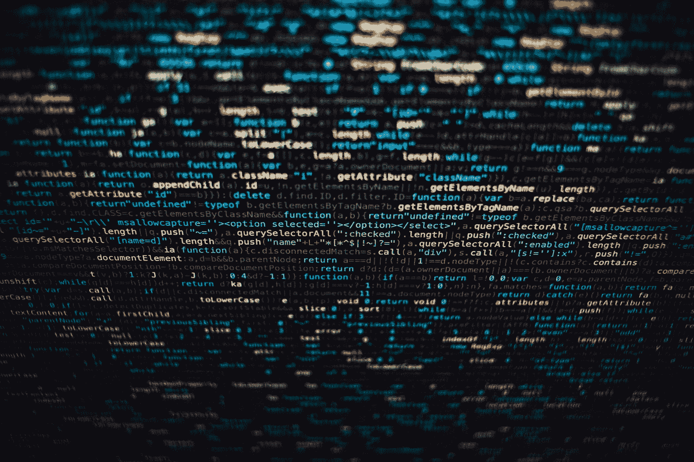
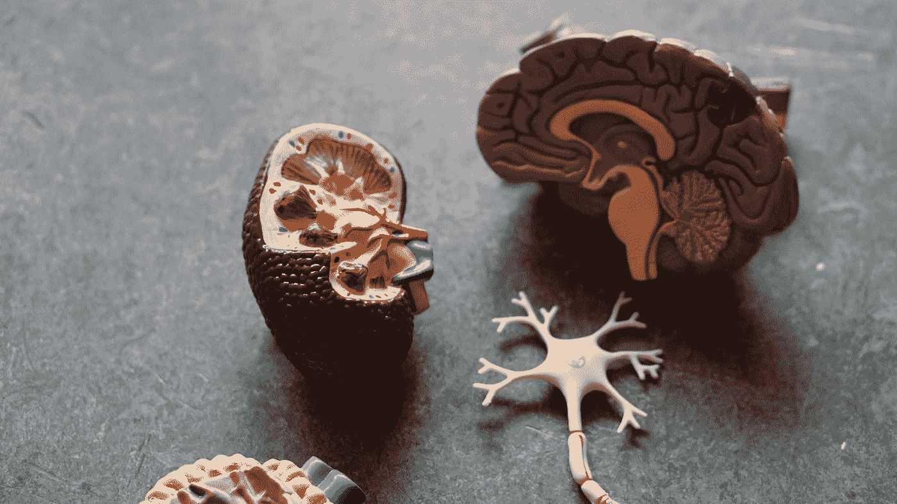
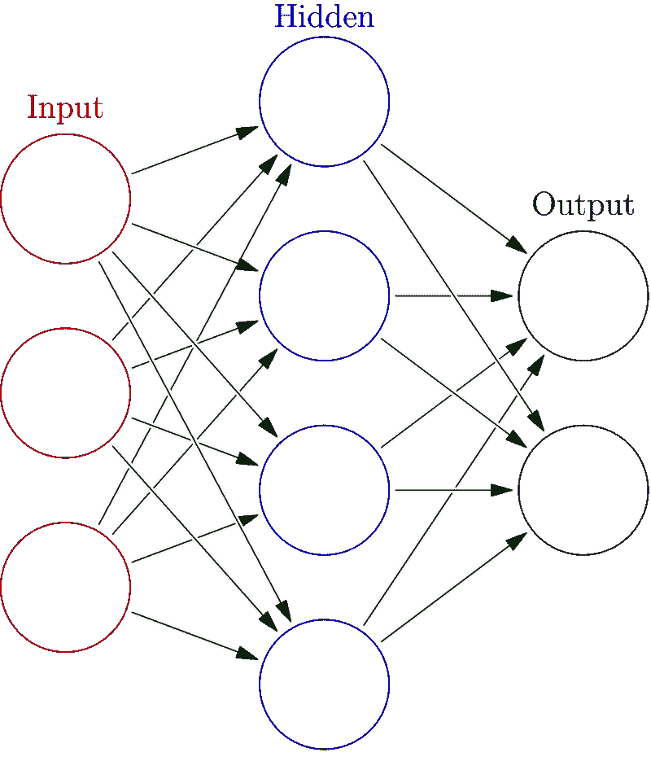
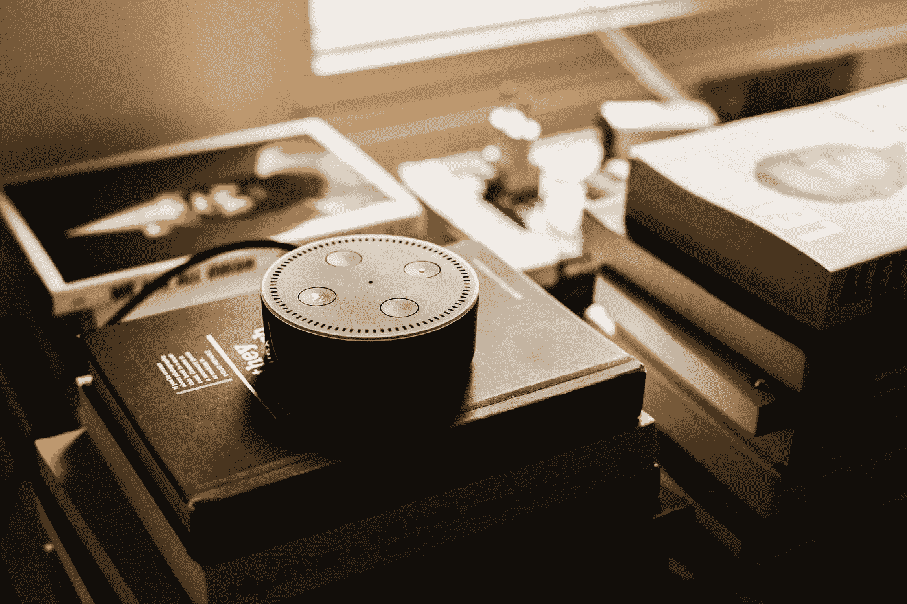
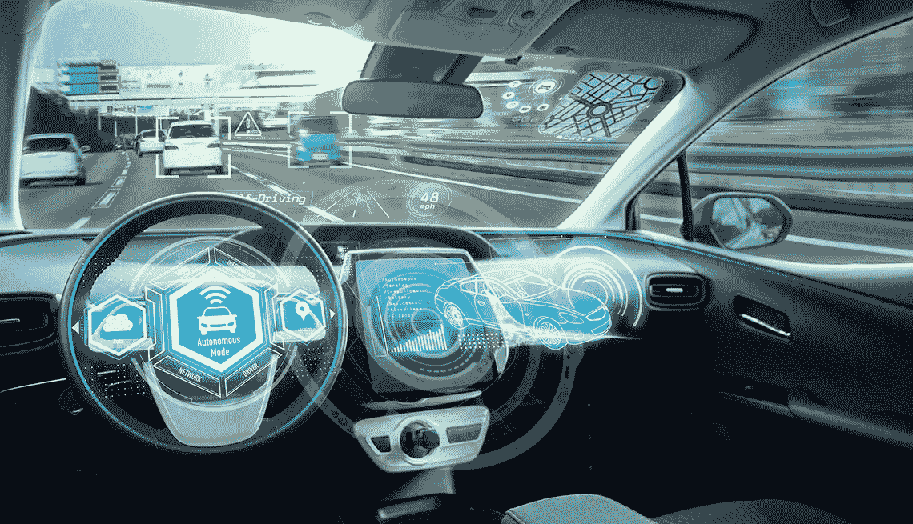

# 人工智能的基本概念及其应用

> 原文：<https://pub.towardsai.net/basic-concepts-of-artificial-intelligence-and-its-applications-294fb84bfc5e?source=collection_archive---------0----------------------->

## 探索大数据和人工智能

## 机器学习、深度学习、强弱人工智能、神经网络简介:BP 和 CNN

在 [Unsplash](https://unsplash.com?utm_source=medium&utm_medium=referral) 上由 [Hitesh Choudhary](https://unsplash.com/@hiteshchoudhary?utm_source=medium&utm_medium=referral) 拍摄的照片

本节为您介绍人工智能的基本概念。我们会讲解人工智能的定义，人工智能能做什么，人工智能的基本概念，以及机器学习和深度学习，强人工智能，弱人工智能的定义，然后最后给大家介绍两种算法，BP 神经网络和卷积神经网络。

# 人工智能的定义

那么我们来看看人工智能的定义，什么是人工智能，也就是我们所说的 ai。人工智能是一门研究和发展模拟人类智能延伸和扩展的理论、方法、技术和应用系统的新技术学科。我们利用人工智能研究，是希望机器能够完成一些需要智能人类才能完成的复杂任务。也就是我们希望机器能代替我们解决一些复杂的任务。在这个过程中，他不是一个重复性的机械活动，而是一些需要人类智慧参与其中的活动。

# 机器学习和深度学习

说到人工智能，就不得不提两个方面:机器学习和深度学习。

## 机器学习

首先，机器学习是人工智能中的一个核心概念。我们所有人都要学习，我们人类的知识传递也是通过这样的学习方法进行的。我们学习祖先的知识，然后通过推理创造新的知识。我们也希望机器有这样的能力:通过学习之前的信息，让机器更像有智能，能够对未来新的输入做出相应的反应。这叫做机器学习。

照片由[法兰克诉](https://unsplash.com/@franckinjapan?utm_source=medium&utm_medium=referral)在 [Unsplash](https://unsplash.com?utm_source=medium&utm_medium=referral) 拍摄

## 深度学习

当我们谈论人工智能时，我们经常会听到机器学习和深度学习等概念。其实它们是一种包容关系，人工智能包括机器学习和深度学习，而机器学习中的一种特定的学习形式叫做深度学习。它主要基于神经网络算法。目前，深度学习已经在图像识别、语音识别、自然语言处理、音频识别、社交网络过滤、机器翻译、医学图像分析、棋盘游戏程序等领域取得了很大进展。

马里乌斯·马萨拉尔在 [Unsplash](https://unsplash.com?utm_source=medium&utm_medium=referral) 上的照片

# 弱强人工智能

人工智能有两种不同的形式，一种叫弱人工智能，一种叫强人工智能。那么他们两个在聊什么呢？

## 弱人工智能

弱人工智能在说的是，机器并不是真正的智能。关键是它不能有自主意识。它只能在特定领域有相应的智能，类似于一种很高级的，一种仿生学。只在一个方面，比如看、听、说，显得有智能，但不像人类有完整的意识。

照片由[马库斯·斯皮斯克](https://unsplash.com/@markusspiske?utm_source=medium&utm_medium=referral)在 [Unsplash](https://unsplash.com?utm_source=medium&utm_medium=referral) 拍摄

## 强人工智能

强人工智能意味着机器可以有意识地出现，达到甚至超过人类的智能。这不仅仅是计算机科学的一个领域，它涉及到心理学、哲学等许多方面。它属于人创造的一种智能，甚至可以称之为生命。

照片由 [Arseny Togulev](https://unsplash.com/@tetrakiss?utm_source=medium&utm_medium=referral) 在 [Unsplash](https://unsplash.com?utm_source=medium&utm_medium=referral) 上拍摄

所以弱人工智能和强人工智能最大的区别就是这个机器能达到什么样的智能水平，机器有没有自己的意识。这是这两类人工智能最本质的区别。先不要害怕我们的世界会被天网之类的机器或者别的什么征服。目前我们研究的人工智能的范围还是在弱人工智能的范围。

# 什么是神经网络？

说到人工智能，就不得不提人工智能中一个众所周知的算法，叫做神经网络。那么神经网络就和人脑的神经传递一样，从一个输入单元到下一个输入单元得到一个结果。这是一个简单的神经网络的原理，就是模拟人脑中神经传递信息。它将信息从一个神经元传递到另一个神经元，然后向下传递。

Robina Weermeijer 在 [Unsplash](https://unsplash.com?utm_source=medium&utm_medium=referral) 上的照片

## BP 神经网络

神经网络算法发明后，很多问题在一定程度上得到了解决。同时，人们也在不断优化这个算法。首先，一个应用非常广泛并且非常经典的是 BP 神经网络。BP 神经网络比原神经网络多了一个隐含层。输入层和输出层中还有其他隐藏层。通过梯度下降的方式可以大大降低计算量和计算难度。

一个基本的神经网络

## 卷积神经网络

但是有了 BP 神经网络之后，我们发现 BP 神经网络的计算量还是很大。它有时无法在我们可接受的时间范围内给出最优解，或者给出最优解的时间太长，不符合我们某些应用的需求。然后出现了卷积神经网络(CNN)，它本质上也是一种神经网络算法，但它优化了 BP 神经网络中的内容，它使计算更快，并且它可以在许多问题上获得最大化。出色的解决方案。它通过高度并行地处理相关信息来提高其计算效率。同时，大大降低了 BP 神经网络之间的计算复杂度。因此，卷积神经网络目前可以在很多问题上快速达到最优解。

> 让我们看看人工智能能做什么。

## 图像识别

图像识别现在广泛应用于我们的生活中。例如，一个人的身份可以基于照片或当用相机捕捉到一个人的面部时进行识别。在中国许多城市的火车站，你可以刷身份证，机器用摄像头采集你的面部图像，然后识别和验证你的身份。一些楼宇门禁使用图像识别进行识别，你不再需要门禁卡或钥匙。其他应用包括高级人机交互、视频监控、图像自动索引和视频数据库等。

## 语音识别

语音识别为我们与计算机交互提供了一种更快、更方便的方式。当我们对电脑说话时，它可以知道我们在说什么，并与我们互动。这种方法和我们以前在键盘上打字完全不同。这种与计算机交互的方式可以给我们带来许多扩展的应用。像 Siri，Google Assistant，Alexa 这样的虚拟助手可以根据命令或问题为个人执行任务或服务。

安德烈斯·乌雷纳在 [Unsplash](https://unsplash.com?utm_source=medium&utm_medium=referral) 上拍摄的照片

## 自动驾驶汽车

自动驾驶或自动驾驶汽车在人工智能领域也非常受欢迎。谷歌的 Waymo 已经开始了一项名为“Waymo One”的商业自动驾驶汽车服务。中国互联网公司也在北京四环成功测试了自动驾驶。现在也有一些高级汽车带有自动驾驶的模块。随着 5G 技术的出现，我会相信这项技术会彻底改变我们未来的出行方式。C-V2X，即蜂窝 V2X(车辆对一切)，是一种使用相同 5G 网络的通信技术。它允许车辆之间进行无线通信，还可以与其他交通基础设施(如交通灯、路边等)进行通信。

## 消费金融

想象一下，如果我们在一个网站上输入一笔我们想投资的钱，就像我们身边有一个财务规划师一样，人工智能会立即告诉我们哪种投资回报最高。人工智能在金融领域取得了一些重大进展。

# 摘要

人工智能是一门综合性很强的学科。它可以做图像识别(它能看)、语音识别(它能听)、自动驾驶(它能走)、消费金融等等。用这些感知去听，去看，去说，越来越像人类。

要实现这一切，我们得了解机器学习和深度学习，这是人工智能的核心内容。那就是通过学习的方法让机器获得一定的智能。

机器学习和深度学习的结果能在多大程度上产生人工智能？他们能超越人类的智力吗？我们认为现在所有的 AI 都是弱人工智能，而不是强人工智能。强大的人工智能机器有自己的意识，但可以肯定的是，我们现在的机器都没有。

安迪·凯利在 [Unsplash](https://unsplash.com?utm_source=medium&utm_medium=referral) 上的照片

我们还介绍了神经网络和优化神经网络的 BP 神经网络，以及更优化的卷积神经网络。BP 和卷积神经网络的主要区别在于能否在更快的时间内得到最优解，或者能否得到最优解。

补充一下，人工智能的发展也必须依靠大数据技术。它需要大量的数据来支持。技术创新才刚刚开始，还有更多的新技术需要我们不断学习。

如果你想了解更多人工智能和大数据的应用，也可以阅读以下文章:

 [## 什么是大数据，人工智能能做什么？

### 大数据和人工智能发展迅速，正在深刻影响我们的生活，并大大提高我们的生活质量

towardsdatascience.com。](https://towardsdatascience.com/what-is-big-data-and-what-artificial-intelligence-can-do-d3f1d14b84ce)  [## 大数据及其应用的发展与趋势

### 关于大数据的发展和趋势及其在电信行业和其他领域的应用

towardsdatascience.com](https://towardsdatascience.com/the-development-and-trend-of-big-data-and-its-applications-5dd8c52e1df6)  [## 人工智能的三大领域及其工业应用

### 人工智能是一门研究和发展理论、方法、技术和方法的新技术学科

towardsdatascience.com](https://towardsdatascience.com/three-major-fields-of-artificial-intelligence-and-their-industrial-applications-8f67bf0c2b46)