# 神经类型转移的基本直觉和指南

> 原文：<https://pub.towardsai.net/basic-intuition-on-neural-style-transfer-idea-c5ac179d1530?source=collection_archive---------0----------------------->

## [计算机视觉](https://towardsai.net/p/category/computer-vision)

用 PyTorch 简单解释神经类型转换的思想和实现。

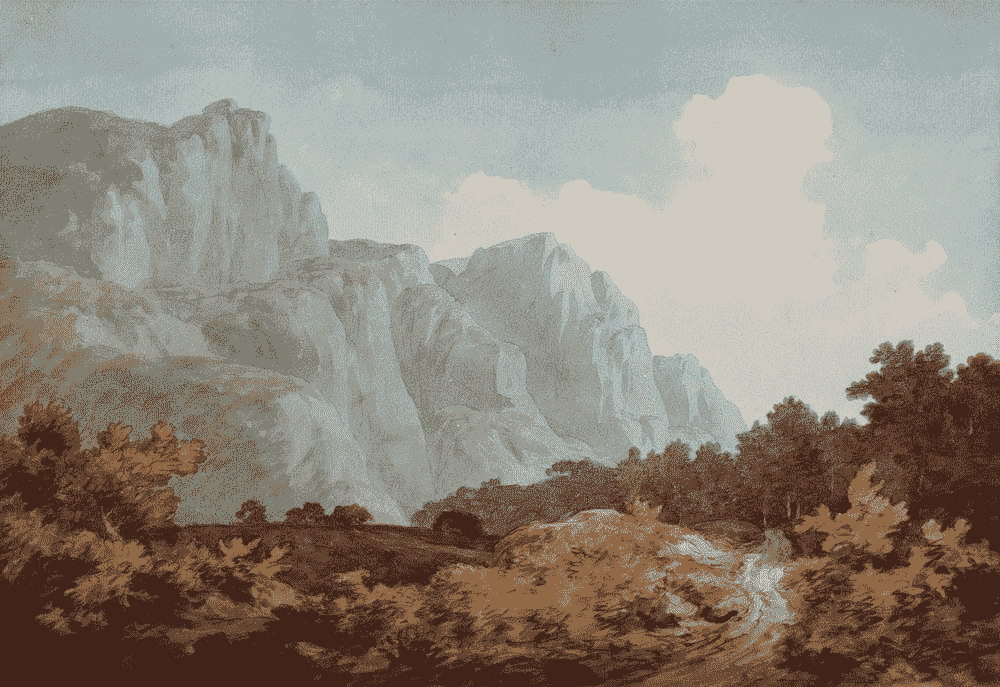

图片来自 [Unsplash](https://unsplash.com/photos/wKlHsooRVbg)

# 介绍

神经风格转移，简称 NST，是一个有趣的想法，其中神经网络学习转移风格，即它学习如何绘画并生成具有独特绘画的新图像。

风格转移的概念是将一种风格或纹理转移到输入图像上，用深度神经网络实现风格转移图像的方法称为神经风格转移。这意味着 NST 是一种技术，它采用两个图像—一个内容图像和一个样式参考图像(可以是著名画家的作品或新纹理)—并将它们混合在一起，以便输出看起来像内容图像，但以参考图像的样式“绘制”。下图描述了 NST 的输出。

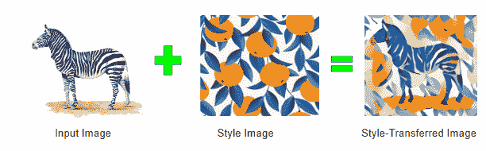

神经类型转移结果

## 让我们深入研究一下！

实际上，它与神经网络的工作方式略有不同。我们都知道，在神经网络中，当图像作为输入时，权重被更新并反向传播，例如，在 CNN 进行图像识别的情况下，网络试图学习如何识别它。

然而，在 NST 中，我们更新图像的像素(结果图像的待更新权重)和预训练网络的冻结权重。我们根据损失不断更新最终图像像素，直到它是期望的输出，即最小损失。

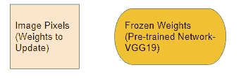

更新图像像素并冻结预先训练的网络权重

预训练网络(VGG，雷斯网)用于从内容图像和风格图像中提取特征，并且某种机制用于更新风格转移图像的像素，即最终输出。

这就是为什么只有单一风格的图像被转移到相应的单一风格的图像，而不是数据集使用。其实风格和内容形象是一一对应的。

# 组件:

*   预先训练美国有线电视新闻网像 VGG，雷斯内特。

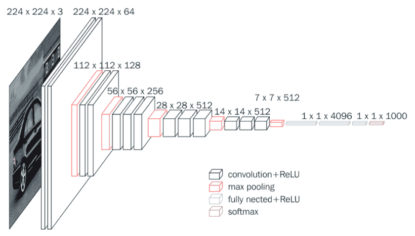

VGG 建筑

*   **内容图片**:我们要传递风格的图片。

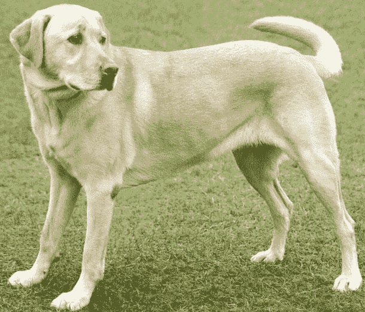

内容图像

*   **样式图像**:要转移样式的图像。

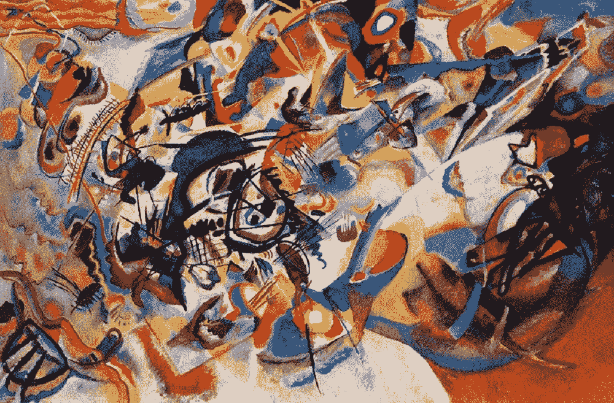

风格图像

*   **生成的图像**:包含最终结果(像素即权重)的图像

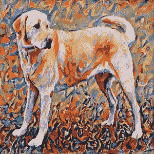

生成的图像

# **如何运作？**

我们有三个预先训练好的比如说 VGG(固定权重)网络，分别用于每个内容图像、风格图像和生成的图像。主要目标是在生成的图像中保持内容和样式图像的细节。

1.  将内容图像详细信息复制到新图像中，以最小化内容图像的内容距离
2.  将样式图像详细信息复制到新图像中，以便最大限度地缩短样式与样式图像之间的距离。
3.  最小化距离意味着最小化图像到生成图像之间的损失。

# 涉及的重要步骤:

1.  针对每种内容、样式和生成的图像，使用预先训练好的模型(如 VGG、ResNet)来计算特征。
2.  计算内容损失和风格损失。
3.  计算总综合损失。
4.  反向传播梯度以更新生成的图像权重像素，而预先训练的模型权重被冻结。

**第一步:**

**第二步:计算内容和风格损失**

**内容丢失:**

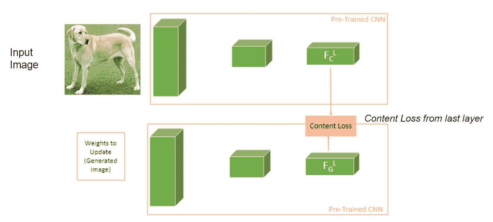

内容损失

我们可以通过称为内容图像和生成图像的最后特征图之间的均方误差(MSE)的损失函数将内容图像的细节复制到生成图像，该损失函数最小化了内容图像和生成图像之间的距离，即，它指示内容图像的细节正在被转移到生成图像。

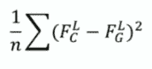

MSE:内容丢失

为什么我们只比较内容图像的最后一层特征图？

在深度卷积层中，不同的层学习不同的特征。第一卷积层学习诸如边缘和简单纹理的特征。后来的卷积层学习更复杂的纹理和图案等特征。最后一个卷积层学习诸如部分对象的对象的特征。因此，我们需要重要对象的内容特征来生成图像。

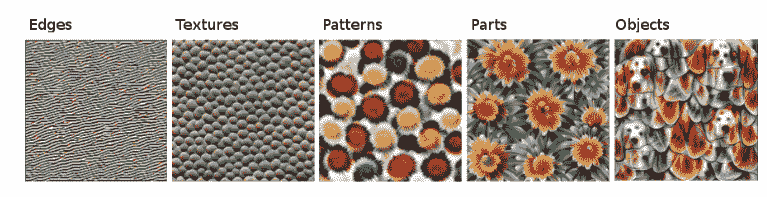

每层的五层卷积输出[:来源](https://christophm.github.io/interpretable-ml-book/cnn-features.html)

**风格缺失:**

它的主要目标是在生成的图像中加强样式图像的细节。为此，在风格图像和生成的图像之间应该有类似的激活相关性，即通过称为 Gram 矩阵的相关性矩阵来测量。

**克拉姆矩阵(风格矩阵)概念**

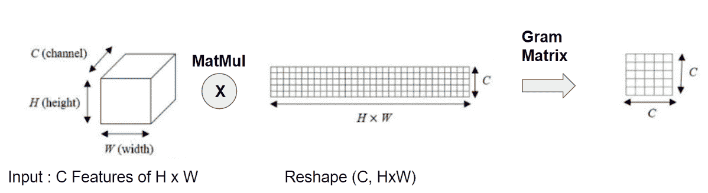

过程:Gram 矩阵计算

计算 Gram 矩阵

gram 矩阵用于捕获称为风格矩阵的一组特征图的“特征分布”。上图描绘了那个概念。

gram 矩阵是一种相关运算，即总结同时发生的激活的层上的特征图的点积。由于纹理(风格)具有很强的局部性，当我们捕获大量同时发生的激活时，我们捕获局部性。所测量的是，在特定的像素位置，特征#F1 是否倾向于与特征#F2 同时出现。

通过找到这个矩阵，我们得到更接近目标的编码的相关激活(我们想要捕获的样式),检索样式。此外，Gram matrix 是位置不变的，它基于特征图中单个点的统计数据。

**样式丢失中使用的步骤**:

1.  首先，计算风格图像的层 I 的特征图的克矩阵和生成图像的层 I 的特征图的克矩阵。
2.  求风格图像的 gram 矩阵和内容图像的 gram 矩阵之间的均方误差，称为风格损失。
3.  计算所有图层的风格影像特征图和生成的影像特征图的风格损失，如下图所示。

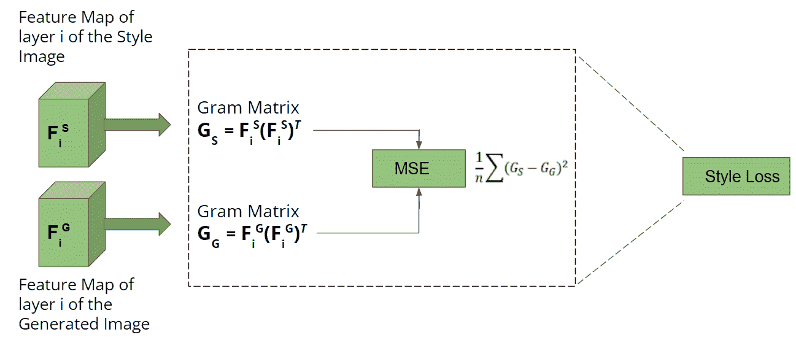

生成的和样式图像 gram 矩阵之间的 MSE。

类似地，计算所有层中的样式损失，以在生成的图像中保留如上所述的每个细节(样式)。

**为什么？**

我们需要将样式图像的每个细节转移到生成的图像，并需要从编码器的每个层(预训练的 CNN 模型)计算样式损失，其中发现不同的细节。

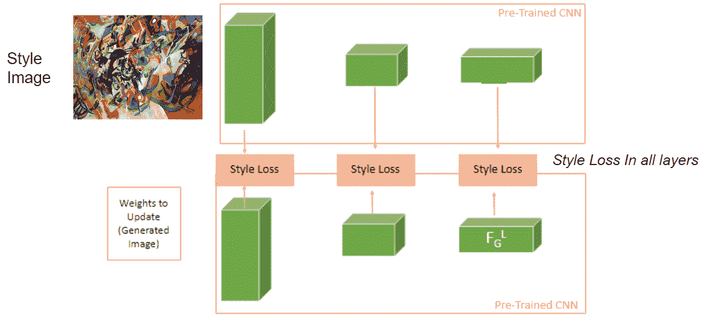

所有图层中的样式丢失

**代号:**

**第三步:计算总的综合损失。**

最后，总损失计算为加权损失= 𝜶 x 内容损失+ 𝝱 x 风格损失。 ***α*** 和 ***β*** 用于控制生成的图像中呈现的内容和样式的数量。您还可以在[论文](https://arxiv.org/abs/1508.06576)中看到不同 ***α*** 和 ***β*** 值的不同效果的可视化效果。我们的主要工作是使用 Adam 这样的优化器来生成包含内容图像和样式图像细节的图像，从而最大限度地减少这种总损失。

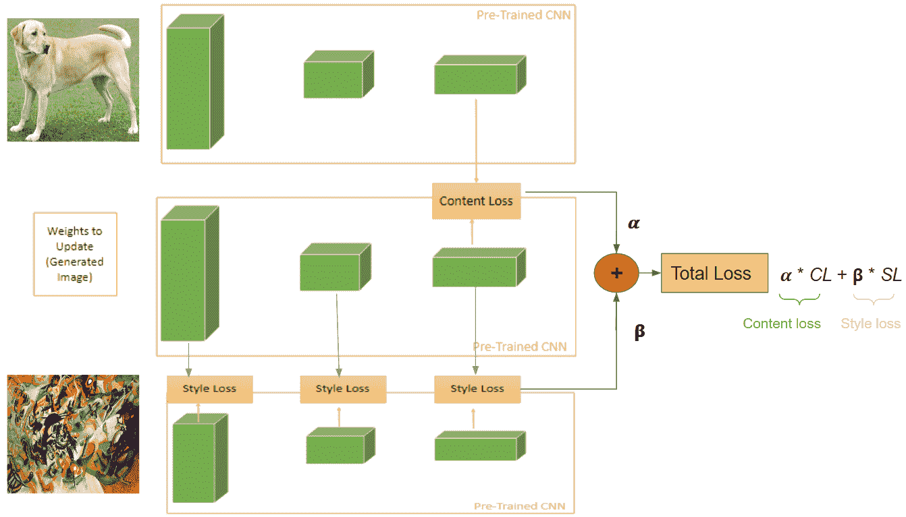

综合全损

**步骤 5:反向传播梯度以更新生成的图像权重像素，而预先训练的模型权重被冻结。**

主要的事情是有一个梯度的反向传播来更新生成的图像的权重，即像素值。下图描述了该机制。

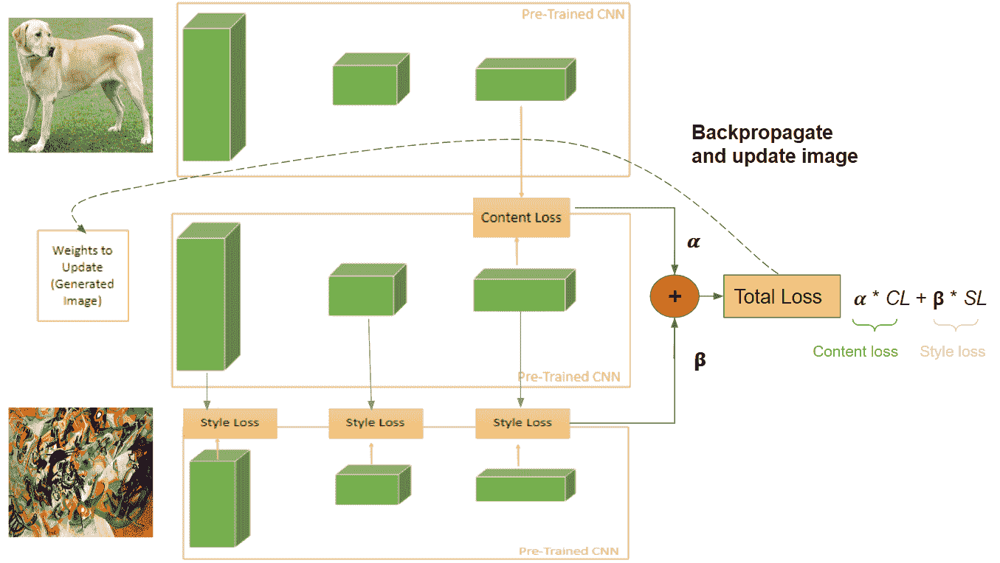

反向传播的总损失

**代码:**

在对比如说 10000 个时代的训练中，网络学会了很好地将风格转移到生成的图像中。当您对单个图像运行上述代码时，结果如下所示:

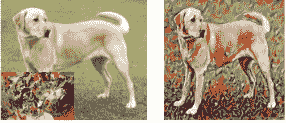

NST 训练后的输出

神经风格转移就是这么来的。

# 结论

在本教程中，您将学习神经风格转换是如何工作的，以及如何用 PyTorch 实现它。神经风格转移将参考图像的内容和风格特征整合到新的艺术中。它不同于神经网络机制，在神经网络机制中，生成的图像的像素被更新，而预训练网络的权重被冻结。从每个内容、样式和生成的图像中提取第一特征。最初，生成的图像是内容图像的克隆，并且在训练时，网络试图更新生成的图像像素，包括样式图像细节。你也知道两个损失内容损失和风格损失和组合损失帮助我们实现我们想要的。组合损失被计算为内容和风格损失的权重，并且在利用梯度反向传播的训练期间，生成的图像的像素被更新。

本教程的代码可从[这里](https://github.com/sushant097/Neural-Style-Transfer-Implementation)获得。

# 进一步阅读

[1] [原创论文:艺术风格的新算法](https://arxiv.org/abs/1508.06576)

[2] [Tensorflow 神经风格转移教程](https://www.tensorflow.org/tutorials/generative/style_transfer)

[3] [快速神经风格转移](https://arxiv.org/pdf/1603.08155.pdf)