# 深度学习和机器学习 Python 教程的基础线性代数

> 原文：<https://pub.towardsai.net/basic-linear-algebra-for-deep-learning-and-machine-learning-ml-python-tutorial-444e23db3e9e?source=collection_archive---------0----------------------->

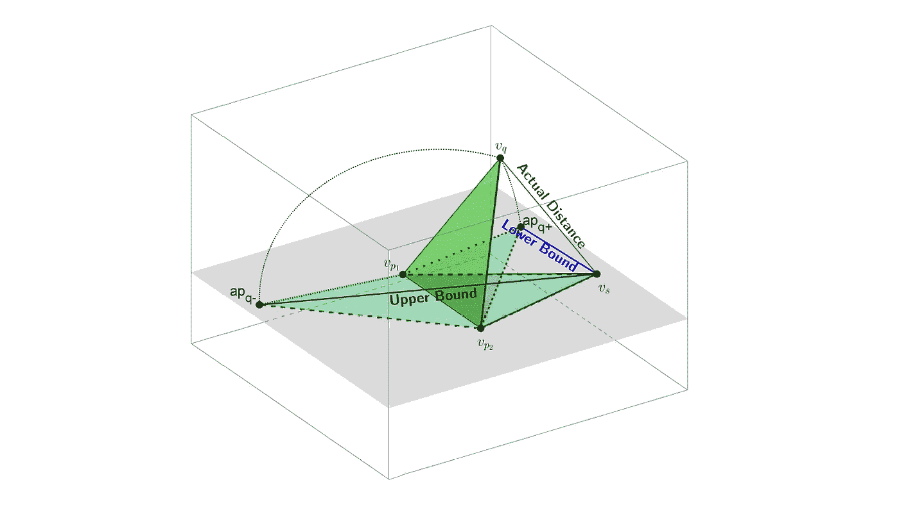

图 1:一个三维欧几里得空间，用来表示线性方程组[ [1](https://en.wikipedia.org/wiki/Linear_algebra) ] [ [2](https://en.wikipedia.org/wiki/Euclidean_space) ]的解。图像是由 Richard Connor、Lucia Vadicamo 和 Fausto Rabitti [ [3](https://www.researchgate.net/publication/318720793_High-Dimensional_Simplexes_for_Supermetric_Search) ]创作的“ [**用于超度量搜索的高维简单图”的矢量衍生图。**](https://www.researchgate.net/publication/318720793_High-Dimensional_Simplexes_for_Supermetric_Search)

## [深度学习](https://towardsai.net/p/category/machine-learning/deep-learning)，[编辑](https://towardsai.net/p/category/editorial)，[机器学习](https://towardsai.net/p/category/machine-intelligence)，[数学](https://towardsai.net/p/category/mathematics)，[编程](https://towardsai.net/p/category/programming)，[教程](https://towardsai.net/p/category/tutorial)

## 线性代数入门教程，用于[机器学习](https://mld.ai/mldcmu) (ML)和深度学习，包含 Python 中的示例代码实现

最后更新，2021 年 1 月 6 日

**作者:**萨妮娅·帕维斯，[罗伯托·伊里翁多](https://mktg.best/vguzs)

[](https://members.towardsai.net/) [## 加入我们吧↓ |面向人工智能成员|数据驱动的社区

### 加入人工智能，成为会员，你将不仅支持人工智能，但你将有机会…

members.towardsai.net](https://members.towardsai.net/) 

**本教程的代码可在**[**Github**](https://github.com/towardsai/tutorials/tree/master/linear-algebra-for-ml-and-deep-learning)**上获得，其完整实现也可在**[**Google Colab**](https://colab.research.google.com/drive/1WhzsrEQ-JatDbaaJ81Wh8aYY9jqGWdsw?usp=sharing)**上获得。**

## 目录

1.  [简介](#46d0)
2.  [机器学习和深度学习中的线性代数](#60ee)
3.  [矩阵](#56b6)
4.  [矢量](#a2b1)
5.  [矩阵乘法](#f25a)
6.  [转置矩阵](#1986)
7.  [逆矩阵](#2173)
8.  [正交矩阵](#c383)
9.  [对角矩阵](#fa6e)
10.  [正规方程中的转置矩阵和逆矩阵](#7788)
11.  [线性方程](#555f)
12.  [向量规范](#94b3)
13.  [L1 常模或曼哈顿常模](#dda9)
14.  [L2 范数或欧几里德范数](#11bc)
15.  [机器学习中的正则化](#41da)
16.  [套索](#564d)
17.  [山脊](#d6fd)
18.  [特征提取和特征选择](#c54b)
19.  [协方差矩阵](#953f)
20.  [特征值和特征向量](#bcd2)
21.  [正交性](#9c2e)
22.  [标准正交集](#4312)
23.  [跨度](#b757)
24.  [基础](#f187)
25.  [主成分分析](#7594)
26.  [矩阵分解或矩阵分解](#740e)
27.  [结论](#3904)
28.  [资源](#3902)
29.  [参考文献](#8f6f)

> 📚查看我们关于[用于机器学习、数据科学和深度学习的最佳笔记本电脑](https://towardsai.net/p/news/best-laptops-for-machine-learning-deep-learning-data-science-ml-f55602197593)的编辑推荐。📚

# 介绍

[**机器学习**](https://mld.ai/mldcmu) 和深度学习系统的基础完全基于数学原理和概念。理解数学原理的基本基础是必要的。在基线和模型构建过程中，许多数学概念，如维数灾难、正则化、二进制、多类、有序回归等，都必须在头脑中保持艺术性。

深度学习的基本单元，通常称为神经元，完全基于其数学概念，这涉及到涉及输入和权重的相乘值的总和。它的激活函数，如 Sigmoid、ReLU 和其他函数，是使用数学定理构建的。

这些是正确理解机器学习和深度学习的基本概念的基本数学领域:

*   线性代数。
*   向量微积分。
*   矩阵分解。
*   概率和分布。
*   解析几何。

# 机器学习和深度学习中的线性代数

由于向量的可用性和处理向量的若干规则，线性代数在机器学习中起着必不可少的作用。我们主要处理机器学习中的分类器或回归器问题，然后通过从实际值到预测值的计算来应用误差最小化技术。因此，我们使用线性代数来处理前面提到的计算。线性代数处理大量数据，或者换句话说，“线性代数是数据的基础数学。”

这些是我们在机器学习(ML)和深度学习[ [11](https://d2l.ai/chapter_preliminaries/linear-algebra.html) ]中使用的线性代数的一些领域:

*   向量和矩阵。
*   线性方程组。
*   向量空间。
*   基础。

此外，这些是机器学习(ML)和深度学习的领域，我们在这些领域应用线性代数的方法:

*   回归线的推导。
*   预测目标值的线性方程。
*   支持向量机分类(SVM)。
*   降维。
*   均方误差或损失函数。
*   正规化。
*   协方差矩阵。
*   卷积。

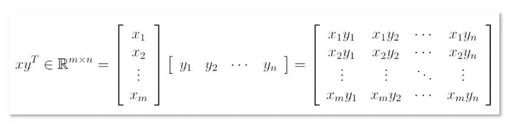

图 2:一个矢量积。

# [数]矩阵

矩阵是线性代数的重要组成部分。它存储 *m*n* 个数据元素，我们用它来计算线性方程组或线性映射。它是实值元素[ [11](https://d2l.ai/chapter_preliminaries/linear-algebra.html) ]的一个 *m*n* 元组。

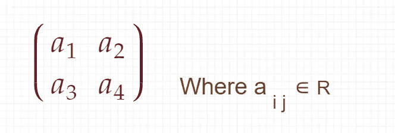

图 3:矩阵表示。

行数和列数称为矩阵的维数。

# 矢量

在线性代数中，向量是一个 *n*1* 矩阵。它只有一列。

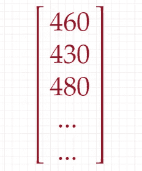

图 4:向量表示。

# 矩阵乘法

矩阵乘法是行和列的点积，其中矩阵的行与另一个矩阵列相乘并求和。


图 5:矩阵乘法。

## 在线性回归中

预测房价有多个特征。下表列出了不同房屋的特点和目标价值(价格)。

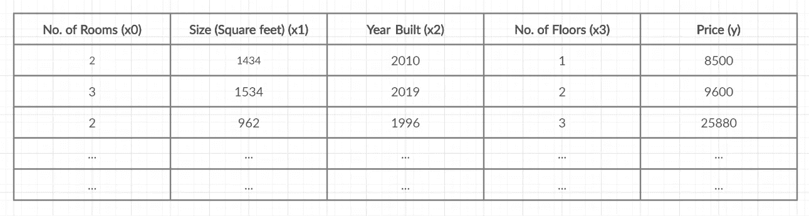

图 6:表 1 展示了预测房价的房屋特征。

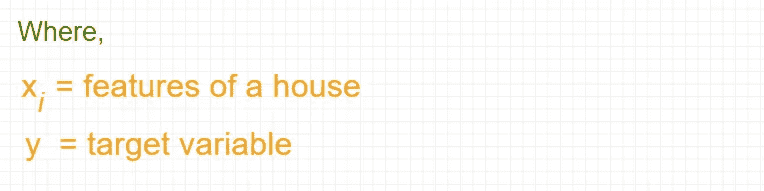

图 7:特性和目标变量。

因此，要计算假设:

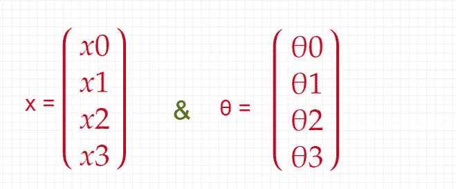

图 8:特性和系数。

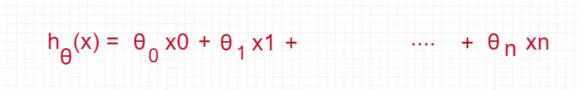

图 9:房价预测的假设计算。

# 转置矩阵

对于 **A** ∈ R^ *m*n* 矩阵 **B** ∈ R^ *n*m* 与**b***ij =****a***ij 称为 **A** 的转置。表示为**b**=**a**^*t .*

示例:

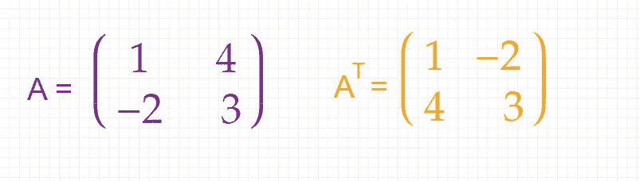

图 10:矩阵 a 的转置

# 逆矩阵

考虑一个方阵 **A** ∈ R^ *n*n.* 设矩阵 **B** ∈R^ *n*n* 具有 **AB** = In = **BA，B** 称为 **A** 的逆，记为 **A** ^ *-1。*

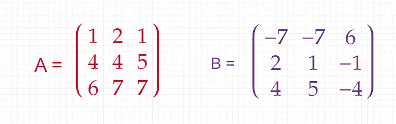

图 11:矩阵 A 和 b。

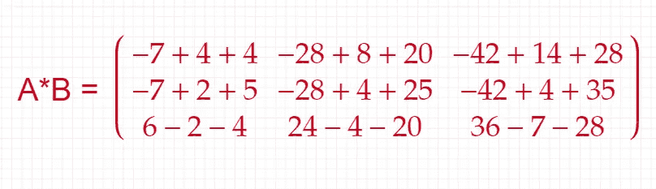

图 12:矩阵 A 和 b 之间的乘法。

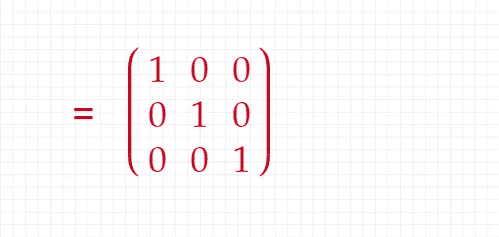

图 13:转置矩阵。

# 正交矩阵

方阵 A∈R^ *n*n* 是正交矩阵当且仅当它的列是正交的(单位长度)，因此:


图 14:正交矩阵的方程。

示例:

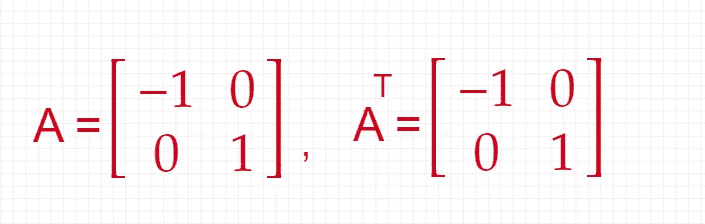

图 15:矩阵 A 及其转置矩阵。

因此，

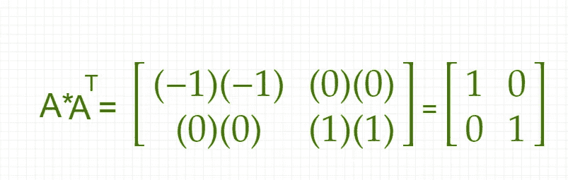

图 16:乘以 A 的转置。

# 对角矩阵

方阵 A∈R^ *n*n* 是一个对角矩阵，其中除了主对角线上的元素之外，所有元素都为零，如下所示:

> *Aij =0 代表所有 I！= j*
> 
> *Aij = 0 为部分或全部 i = j*

示例:

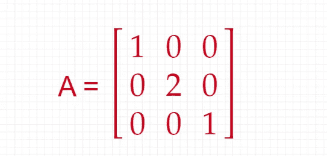

图 17:对角矩阵 a。

# 正规方程中的转置矩阵和逆矩阵

正规方程方法通过明确地获取关于θJ 的导数并将它们设置为零来最小化 *J* 。我们可以不用梯度下降[ [4](https://www.geeksforgeeks.org/ml-normal-equation-in-linear-regression/) ]直接求出 **θ** 的值。

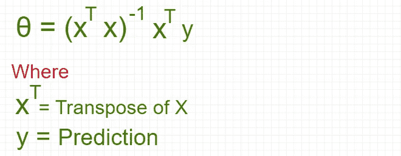

图 18:误差最小化。

实现通过从上表中取出数据，“表 1”如图 5 所示。

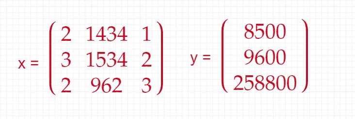

图 19:矩阵 x 下的特性和矩阵 y 下的价格。

创建特征 x 和目标 y 的矩阵:

```
import numpy as np Features
x = np.array([[2, 1834, 1],[3, 1534, 2],[2, 962, 3]])# Target or Price
y = [8500, 9600, 258800]
```

矩阵 x 的转置:

```
# Transpose of x
transpose_x = x.transpose()transpose_x
```

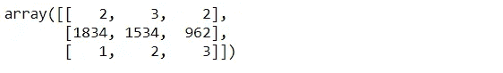

图 20:特性 x 的转置。

转置矩阵与原始矩阵 x 的乘法:

```
multi_transpose_x_to_x = np.dot(transpose_x, x)multi_transpose_x_to_x
```

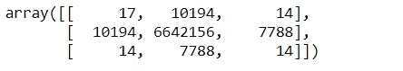

图 21:转置矩阵与原始矩阵相乘。

转置矩阵与原始矩阵相乘的逆

```
inverse_of_multi_transpose_x_to_x = np.linalg.inv(multi_transpose_x_to_x)inverse_of_multi_transpose_x_to_x
```

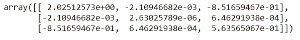

图 22:逆矩阵。

转置的 x 与 y 相乘:

```
multiplication_transposed_x_y = np.dot(transpose_x, y)multiplication_transposed_x_y
```

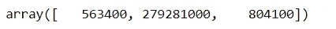

图 23:转置的 x 与 y 相乘。

θ值的计算:

```
theta = np.dot(inverse_of_multi_transpose_x_to_x, multiplication_transposed_x_y)theta
```

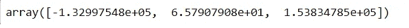

图 24:θ。

# 线性方程

线性方程是线性代数的核心部分，许多问题都是通过它来表述和解决的。这是一个直线方程。

我们将线性方程表示在图 24 中:


图 25:线性方程。

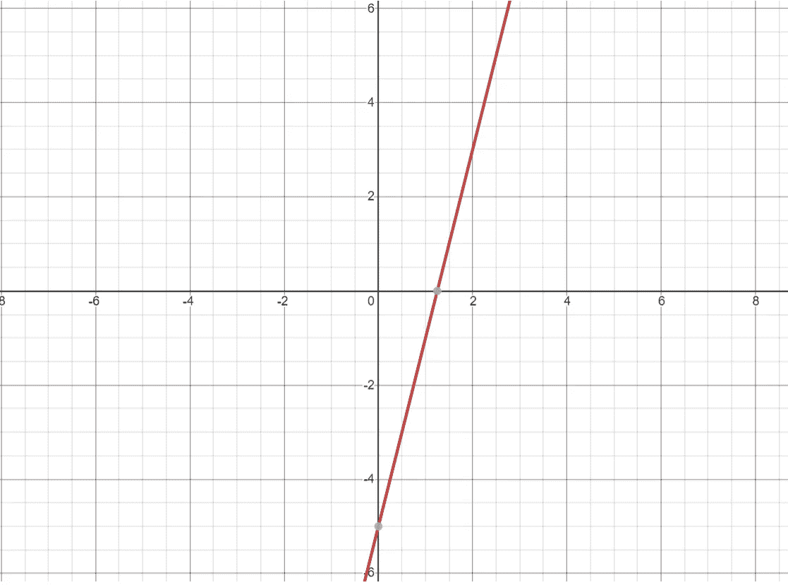

图 26:展示 y = 4x + 5 的线性方程的图表

例子: *x = 2*

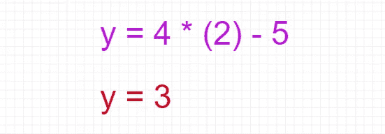

图 27:y 对上述线性方程的导数。

## 线性回归中的线性方程

回归是给出直线方程的过程。它试图用一组特定的数据找到一条最佳拟合线。直线方程基于线性方程:

> *Y = bX + a*

在哪里，

**a** =它是一个 *Y 轴截距*，决定了直线与 Y 轴的交叉点。

**b** =是一个*斜率*，决定了线条倾斜的方向和程度。

**实施**

预测房子的价格，变量是平方英尺和价格。

读取房价数据:

```
import pandas as pddf = pd.read_csv('house_price.csv')df.head()
```

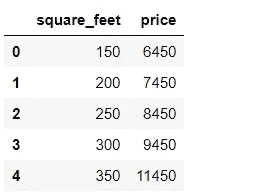

图 28:房价表。

计算平均值:

```
def get_mean(value):
    total = sum(value)
    length = len(value)
    mean = total/length
    return mean
```

计算差异:

```
def get_variance(value):
    mean = get_mean(value)
    mean_difference_square = [pow((item - mean), 2) for item in value]
    variance = sum(mean_difference_square)/float(len(value)-1)
    return variance
```

计算协方差:

```
def get_covariance(value1, value2):
    value1_mean = get_mean(value1)
    value2_mean = get_mean(value2)
    values_size = len(value1)
    covariance = 0.0
    for i in range(0, values_size):
        covariance += (value1[i] - value1_mean) * (value2[i] - value2_mean)
    return covariance / float(values_size - 1)
```

线性回归实现:

```
def linear_regression(df):
    X = df['square_feet']
    Y = df['price']
    m = len(X)    square_feet_mean = get_mean(X)
    price_mean = get_mean(Y)

    #variance of X
    square_feet_variance = get_variance(X)
    price_variance = get_variance(Y)

    covariance_of_price_and_square_feet = get_covariance(X, Y)
    w1 = covariance_of_price_and_square_feet        float(square_feet_variance)    w0 = price_mean - w1 * square_feet_mean

    # prediction --> Linear Equation
    prediction = w0 + w1 * X

    df['price (prediction)'] = prediction
    return df['price (prediction)']
```

调用'*线性 _ 回归*'方法:

```
linear_regression(df)
```

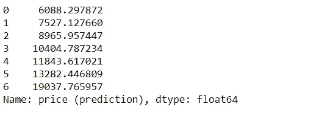

图 29:预测价格。

“线性回归”方法中使用的线性方程:


图 30:线性回归的线性方程。

# 向量范数

向量范数测量向量的大小[ [5](https://www.slideserve.com/jaimie/vector-norms) ]。从根本上讲，给定变量 *x* 的大小可以用它的范数||x||来表示，范数表示两个变量 x 和 y 之间的距离，用||x-y||来表示。

向量范数的一般方程:

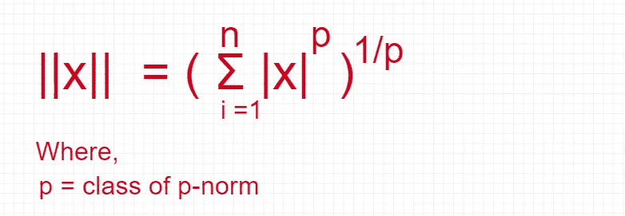

图 31:向量范数方程||x||。

这些是 p-范数的一般类别:

*   L1 标准或曼哈顿标准。
*   L2 范数或欧几里德范数。

L1 和 L2 规范用于正则化。

# L1 标准还是曼哈顿标准

对于 x ∈ **R^** n，定义了 **R** ^ *n* 上的 L1 范数，如图 31 所示:


图 32: L1 范数或曼哈顿范数方程。

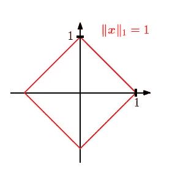

图 33: L1 标准表示法。

如图 32 所示，红线代表 L1 范数方程的向量集。

# L2 范数或欧几里德范数

x∈**r**t28】^n 的 L2 范数定义为:

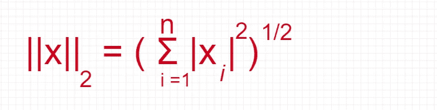

图 34: L2 范数或欧几里德范数方程。

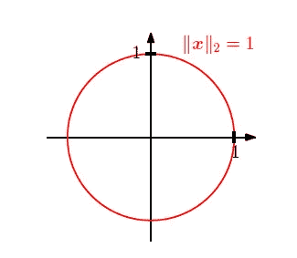

图 35: L2 标准表示法。

如图 34 所示，红线代表 L2 范数方程的向量集。

# 机器学习中的正则化

正则化是修改损失函数以惩罚学习权重的特定值的过程。正规化有助于我们避免过度拟合。

对于以下操作，它是机器学习中的一个优秀补充:

*   来处理共线性。
*   从数据中滤除噪声。
*   以防止过度拟合。
*   以获得良好的性能。

这些是标准的正则化技术:

*   L1 正则化
*   L2 正则化(岭)

正则化是规范的应用。

## L1 正则化

套索是一种普遍的正规化技术。其公式如图 35 所示:

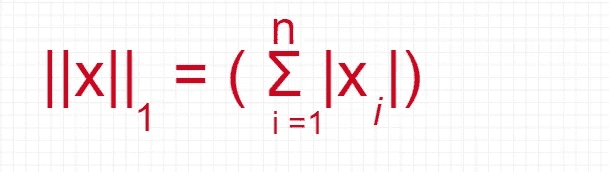

图 36: L1 正则化方程。

## L2 正则化(岭)

L2 正则化方程(岭):

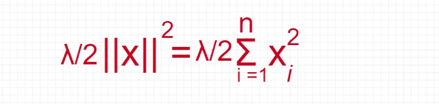

图 37: L2 正则化(山脊)。

其中，λ =通过调整惩罚项的权重来控制复杂度的权衡。

# 特征提取和特征选择

特征提取和特征选择的主要目的是选择一组最优的低维特征来提高分类效率。这些术语本质上是在处理维数灾难问题。在矩阵中执行特征选择和特征提取。

## 特征抽出

在特征提取中，我们通过某种函数映射从现有特征中找到一组特征。

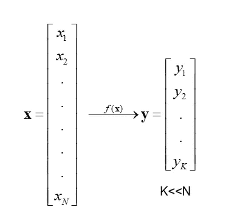

图 38:特征提取。

## 特征选择

在特征选择中，选择原始特征的子集。

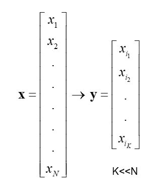

图 39:特性选择。

主要的特征提取方法有:

*   主成分分析
*   线性判别分析(LDA)

PCA 是一种关键的特征提取方法，了解协方差矩阵、特征值或特征向量的概念对于理解 PCA 的概念是至关重要的。

# 协方差矩阵

协方差矩阵是 PCA 推导的组成部分。以下概念对于计算协方差矩阵非常重要:

*   方差。
*   协方差。

## 差异

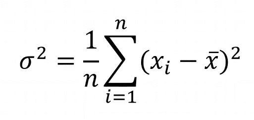

图 40:方差方程。

或者

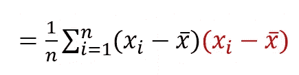

图 41:扩展形式的方差方程。

方差的局限性在于它不探究变量之间的关系。

## 协方差

协方差用于度量两个随机变量的联合可变性。

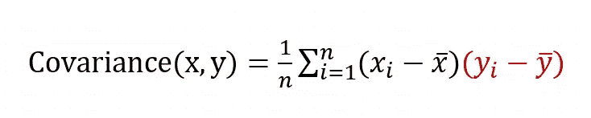

图 42:协方差方程。

# 协方差矩阵

协方差矩阵是给出每对给定随机向量元素之间的协方差的平方矩阵。

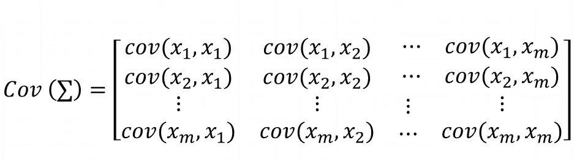

图 43:协方差矩阵。

协方差矩阵的等式:

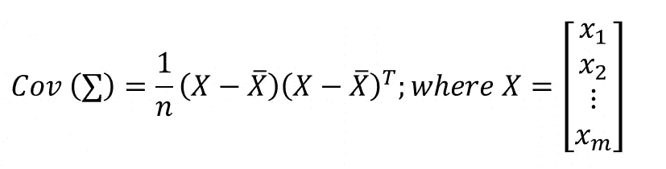

图 44:协方差矩阵方程。

# 特征值和特征向量

特征值的定义:

> *设 m 是一个 n*n 矩阵。如果在* ***R*** *^n 中存在非零向量 x，使得 mx = λx.* ，则标量λ称为 m 的特征值

对于特征向量:

> *向量 x 称为λ对应的特征向量。*

## 特征值和特征向量的计算

设 m 为 **n*n** 矩阵，有特征值 ***λ*** *和*对应的特征向量 x .所以， **mx = *λx*** *。*这个等式可以写成如下:

**mx — λx *=* 0**

所以，等式:

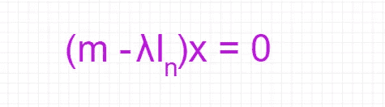

图 45:求解λ的这个方程，我们得到了 m 的所有特征值。

**例子**:

计算给定矩阵 ***m*** 的特征值和特征向量:


图 46:矩阵 m。

解决方案:

这里，矩阵的大小是 2。所以:

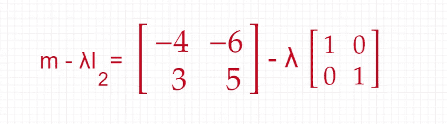

图 47:派生的第一步。

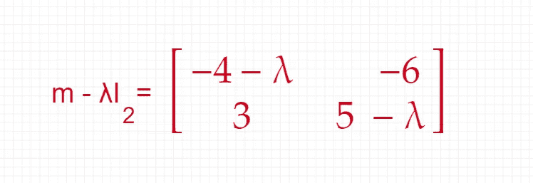

图 48:派生的第二步。

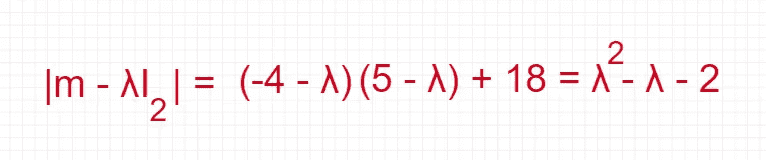

图 49:派生的第三步。

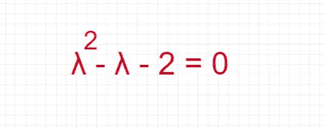

图 50:派生的第四步。

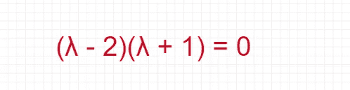

图 51:衍生的第五步。

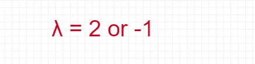

图 52:推导的第六步。

这里 **m** 的特征值为 **2** 和 **-1** 。

每个特征值有多个可用的特征向量。

# 正交性

如果两个向量 v 和 w 的点积为零，则称它们正交[ [7](http://people.math.harvard.edu/~knill/teaching/math19b_2011/handouts/math19b_2011.pdf) ]。

> ***v.w = 0***

示例:

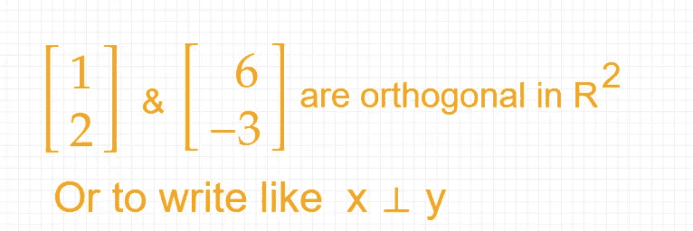

图 53:正交性。

# 标准正交集

如果集合中的所有向量都是相互正交的，并且所有向量的长度都是单位长度，那么这个集合称为正交集合[ [8](https://en.wikipedia.org/wiki/Orthonormality) ]。构成一个基的标准正交集叫做标准正交基。

# 跨度

设 **V** 为向量空间，其元素为 v *1* ，v *2* ，…..，v *n* ∈ V。

这些元素的总和乘以代表图 53 所示等式的标量，所有线性组合的集合称为跨度。

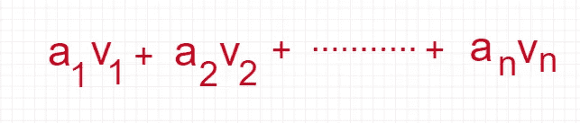

图 54:跨度方程。

示例:

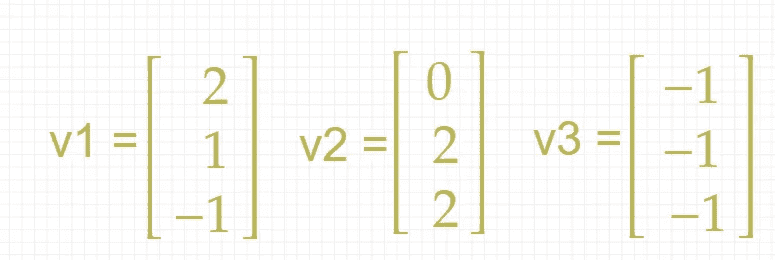

图 55:三个不同的向量。

因此:

> *Span (v1，v2，v3) = av1 + bv2 + cv3*

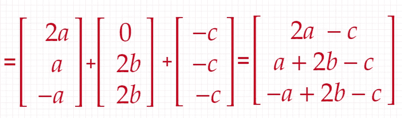

图 56:跨度方程的计算。

# 基础

向量空间的基础是一系列向量，这些向量构成一个线性独立的集合，并且跨越空间[ [9](https://en.wikibooks.org/wiki/Linear_Algebra/Basis) 。

示例:

下面的向量序列是一个基础:


图 57:基本表示。

它是线性独立的，如下所示:


图 58:线性独立性。


图 59:基本方程。

# 主成分分析

主成分分析致力于合理地处理尽可能多的数据知识。这是一种降维技术。它找到方差最大的方向，并用它们来投影数据以降低维数。

主成分分析的计算步骤:

假设有一个值为 x *1* ，x *2* 的 **N*1** 向量，…..，x *m.*

*   计算样本平均值:


图 60:样本均值方程。

*   用向量值减去样本平均值:


图 61:减去样本均值。

*   计算样本协方差矩阵:


图 62:协方差矩阵的方程。

*   计算协方差矩阵的特征值和特征向量


图 63:特征值和特征向量。

*   **降维**:仅用前 k 个特征向量近似 x(k<N)。

## 主成分分析的 Python 实现

Python 实现 PCA 的主要目标是:

*   实现协方差矩阵。
*   求特征值和特征向量。
*   从主成分分析中理解降维的概念。

**加载虹膜数据**

```
import numpy as npimport pylab as plimport pandas as pdfrom sklearn import datasetsimport matplotlib.pyplot as pltfrom sklearn.preprocessing import StandardScalerload_iris = datasets.load_iris()iris_df = pd.DataFrame(load_iris.data, columns=[load_iris.feature_names])iris_df.head()
```


图 64: Iris 数据集表格。

**标准化**

对数据进行标准化总是有好处的，这样可以使数据的所有要素保持相同的比例。

```
standardized_x = StandardScaler().fit_transform(load_iris.data)standardized_x[:2]
```


图 65:标准化数据集。

**计算协方差矩阵**

```
covariance_matrix_x = np.cov(standardized_x.T)covariance_matrix_x
```


图 iris 数据集的协方差矩阵。

**从协方差矩阵计算特征值和特征向量**

```
eigenvalues, eigenvectors = np.linalg.eig(covariance_matrix_x)eigenvalues
```


图 67:特征值阵列。

```
eigenvectors
```


图 68:特征向量数组。

**检查特征值的方差**

```
total_of_eigenvalues = sum(eigenvalues)varariance = [(i / total_of_eigenvalues)*100 for i in sorted(eigenvalues, reverse=True)]varariance
```


图 69:虹膜数据集特征值的方差。

图 68 所示的值表示方差，分析如下:

*   第一成分= 72.96%
*   第二成分= 22.85%
*   第三部分= 3.5%
*   第四成分= 0.5%

因此，**第三**和**第四**组件分别具有非常低的方差。这些都可以放下。因为这些组件不能增加任何价值。

**仅取第一和第二组件并整形**

```
eigenpairs = [(np.abs(eigenvalues[i]), eigenvectors[:,i]) for i in range(len(eigenvalues))]# Sorting from Higher values to lower valueeigenpairs.sort(key=lambda x: x[0], reverse=True)eigenpairs
```


图 70:特征对的结果。

**执行 Eigenparis 的矩阵称重**

```
matrix_weighing = np.hstack((eigenpairs[0][1].reshape(4,1),eigenpairs[1][1].reshape(4,1)))matrix_weighing
```


图 71:矩阵加权的结果。

将标准化矩阵乘以矩阵权重:

```
Y = standardized_x.dot(matrix_weighing)Y
```


图 72:产品结果。

**绘图**

```
plt.figure()target_names = load_iris.target_names
y = load_iris.targetfor c, i, target_name in zip("rgb", [0, 1, 2], target_names):
    plt.scatter(Y[y==i,0], Y[y==i,1], c=c, label=target_name)plt.xlabel('PCA 1')
plt.ylabel('PCA 2')
plt.legend()
plt.title('PCA')
plt.show()
```


图 73:第一个数据集的 PCA 1 和 PCA 2 的绘制结果。

# 矩阵分解或矩阵分解

矩阵分解或因式分解也是机器学习中使用的线性代数的重要组成部分。基本上，它是将矩阵分解成矩阵的乘积。

有几种矩阵分解技术，如 LU 分解、奇异值分解(SVD)等。

**奇异值分解**

这是一种降维技术。根据奇异值分解矩阵:

设 M 是一个矩形矩阵，可以分解成三个矩阵的乘积——(1)正交矩阵(U)，(2)对角矩阵(S)，和(3)正交矩阵(V)的转置。


图 74:矩阵的三个乘积。

# 结论

机器学习和深度学习已经建立在数学概念的基础上。一个广阔的数学领域被用来建立算法和计算数据。

线性代数是研究向量[ [10](https://math.libretexts.org/Bookshelves/Linear_Algebra) ]以及操纵向量的若干规则。它是一个关键的基础设施，它涵盖了机器学习的许多领域，如线性回归、分类变量中的一键编码、用于降维的 PCA(主成分分析)、用于推荐系统的矩阵分解。

深度学习完全基于线性代数和微积分。它也用于多种优化技术，如梯度下降、随机梯度下降等。

矩阵是线性代数的重要组成部分，我们用它来简洁地表示线性方程组、线性映射等。此外，向量是唯一的对象，可以加在一起并与标量相乘，从而产生另一个类似的对象。任何建议或反馈对于继续改进都至关重要。如果你有任何问题，请在评论中告诉我们。

**免责声明:**本文中表达的观点仅代表作者个人，不代表卡耐基梅隆大学或其他(直接或间接)与作者相关的公司的观点。这些文章并不打算成为最终产品，而是当前思想的反映，同时也是讨论和改进的催化剂。

通过[向艾](https://towardsai.net/)发布

# 资源:

[Google colab 实现](https://colab.research.google.com/drive/1WhzsrEQ-JatDbaaJ81Wh8aYY9jqGWdsw?usp=sharing)。

[Github 库](https://github.com/towardsai/tutorials/tree/master/linear-algebra-for-ml-and-deep-learning)。

线性代数，潜入深度学习，[https://d2l.ai/chapter_preliminaries/linear-algebra.html](https://mktg.best/llmqk)

# 参考

[1]线性代数，维基百科，[https://en.wikipedia.org/wiki/Linear_algebra](https://en.wikipedia.org/wiki/Linear_algebra)

[2]欧几里得空间，维基百科，[https://en.wikipedia.org/wiki/Euclidean_space](https://en.wikipedia.org/wiki/Euclidean_space)

[3]用于超度量搜索的高维 Simplexes，Richard Connor，Lucia Vadicamo，Fausto Rabitti，ResearchGate，[https://www . research gate . net/publication/318720793 _ High-Dimensional _ simple xes _ for _ super metric _ Search](https://www.researchgate.net/publication/318720793_High-Dimensional_Simplexes_for_Supermetric_Search)

[4] ML |线性回归中的正规方程，GeeksforGeeks，[https://www . geeks forgeeks . org/ML-Normal-Equation-in-Linear-Regression/](https://www.geeksforgeeks.org/ml-normal-equation-in-linear-regression/)

[5]https://www.slideserve.com/jaimie/vector-norms[石溪大学计算机科学系 CSE541 的 Roger Crawfis 的矢量规范](https://www.slideserve.com/jaimie/vector-norms)

[6]方差估计模拟，莱斯大学在线统计书，[http://Online Stat Book . com/2/summaring _ distributions/Variance _ est . html](http://onlinestatbook.com/2/summarizing_distributions/variance_est.html)

[7]哈佛大学奥利弗·克尼尔第十七讲:正交性[http://people . math . Harvard . edu/~ knill/teaching/math 19b _ 2011/讲义/math19b_2011.pdf](http://people.math.harvard.edu/~knill/teaching/math19b_2011/handouts/math19b_2011.pdf)

[8]标准正交，维基百科，[https://en.wikipedia.org/wiki/Orthonormality](https://en.wikipedia.org/wiki/Orthonormality)

[9]线性代数/基础，Wikibooks，[https://en.wikibooks.org/wiki/Linear_Algebra/Basis](https://en.wikibooks.org/wiki/Linear_Algebra/Basis)

[10]线性代数，LibreTexts，[https://math.libretexts.org/Bookshelves/Linear_Algebra](https://math.libretexts.org/Bookshelves/Linear_Algebra)

[11]线性代数，潜入深度学习，阿斯顿·张，扎克·c·利普顿，，亚历克斯·j·斯莫拉，