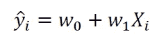
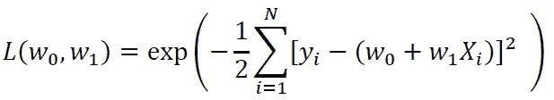
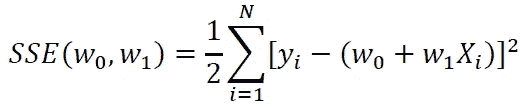
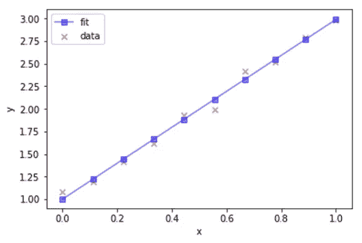

# 数据科学的基本数学技能

> 原文：<https://pub.towardsai.net/basic-math-skills-for-data-science-82368f6e2e63?source=collection_archive---------1----------------------->

## [数据科学](https://towardsai.net/p/category/data-science)，[数学](https://towardsai.net/p/category/mathematics)

## 数学技能将帮助你避免使用机器学习算法作为黑盒工具的陷阱


照片由[罗马法师](https://unsplash.com/@roman_lazygeek?utm_source=medium&utm_medium=referral)在 [Unsplash](https://unsplash.com?utm_source=medium&utm_medium=referral) 上拍摄

*很少或没有数学背景的我能成为一名数据科学家吗？*

*数据科学实践需要哪些基本的数学技能？*

有这么多伟大的包或库可供数据科学家们执行他们的工作。一些最常见的描述性和预测性分析包包括:

*   *Ggplot2*
*   *Matplotlib*
*   *Seaborn*
*   *Scikit-learn*
*   *插入符号*
*   *张量流*
*   *PyTorch*
*   *Keras*

然而，数学技能在数据科学和机器学习中仍然是必不可少的，因为这些包只是黑盒，如果没有坚实的数学基础，你将无法提出核心的分析问题。因此，良好的数学背景对于构建可靠的机器学习模型至关重要。它还将帮助你避免使用机器学习算法作为黑盒工具的陷阱。

本文将回顾一些对数据科学实践至关重要的基本数学技能。这个列表并不是包罗万象的，但至少它提供了你需要开始的基础知识。

## (一)统计和概率

统计和概率用于特征的可视化、数据预处理、特征转换、数据插补、降维、特征工程、模型评估等。以下是您需要熟悉的主题:

a)平均值

b)中间值

c)模式

d)标准偏差/方差

e)相关系数和协方差矩阵

f)概率分布(二项式、泊松、正态)

g) p 值

h) MSE(均方差)

i) R2 分数

j) Baye 定理(精确度、召回率、阳性预测值、阴性预测值、混淆矩阵、ROC 曲线)

k) A/B 测试

l)蒙特卡罗模拟

## ㈡多变量微积分

大多数机器学习模型是用具有几个特征或预测器的数据集构建的。因此，熟悉多变量微积分对于建立机器学习模型极其重要。以下是您需要熟悉的主题:

a)几个变量的函数

b)导数和梯度

c)阶跃函数、Sigmoid 函数、Logit 函数、ReLU(校正线性单位)函数

d)成本函数

e)绘制功能图

f)函数的最小值和最大值

## ㈢线性代数

线性代数是机器学习中最重要的数学技能。数据集被表示为矩阵。线性代数用于数据预处理、数据转换和模型评估。以下是您需要熟悉的主题:

a)矢量

b)矩阵

c)矩阵的转置

d)矩阵的逆矩阵

e)矩阵的行列式

f)点积

g)特征值

h)特征向量

## ㈣优化方法

大多数机器学习算法通过最小化目标函数来执行预测建模，从而学习为了获得预测标签而必须应用于测试数据的权重。以下是您需要熟悉的主题:

a)成本函数/目标函数

b)可能性函数

c)误差函数

d)梯度下降算法及其变体(例如随机梯度下降算法)

在这里了解更多关于梯度下降算法的信息: [**机器学习:梯度下降算法如何工作**](https://medium.com/towards-artificial-intelligence/machine-learning-how-the-gradient-descent-algorithm-works-61682d8570b6) 。

## 案例研究:使用梯度下降算法构建简单的线性回归器

在这个案例研究中，我们展示了在构建一个简单的机器学习算法时如何使用不同的数学概念。


基本线性回归引擎的工作流程。Benjamin O. Tayo 的图片

我们描述了如何使用梯度下降法构建一个简单的 python 估算器来执行线性回归。假设我们有一个包含单个要素(X)和结果(y)的一维数据集，并假设数据集中有 N 个观测值:


拟合数据的线性模型如下所示:



其中 w0 和 w1 是算法在训练期间学习的权重。

## 梯度下降算法

如果我们假设模型中的误差是独立的且呈正态分布，则似然函数如下所示:



为了最大化似然函数，我们最小化 w0 和 w1 的误差平方和(SSE ):



目标函数或我们的 SSE 函数通常使用梯度下降(GD)算法来最小化。在 GD 方法中，权重根据以下程序更新:


即在与梯度相反的方向上。这里，eta 是一个小的正常数，称为学习率。该等式可以用分量形式写成:


如果你想了解更多关于 GD 算法及其工作原理的信息，请参阅以下文章:[https://medium . com/@ Benjamin bi/machine-learning-how-the-gradient-descent-algorithm-works-61682d 8570 b 6](https://medium.com/@benjaminobi/machine-learning-how-the-gradient-descent-algorithm-works-61682d8570b6)

## 使用 Python Estimator 实现

```
import pandas as pdimport numpy as npimport matplotlib.pyplot as pltclass GradientDescent(object):
    """Gradient descent optimizer.
    Parameters
    ------------
    eta : float
        Learning rate (between 0.0 and 1.0)
    n_iter : int
        Passes over the training dataset.

    Attributes
    -----------
    w_ : 1d-array
        Weights after fitting.
    errors_ : list
        Error in every epoch.
    """    def __init__(self, eta=0.01, n_iter=10):
        self.eta = eta
        self.n_iter = n_iter

    def fit(self, X, y):
        """Fit the data.

        Parameters
        ----------
        X : {array-like}, shape = [n_points]
        Independent variable or predictor.
        y : array-like, shape = [n_points]
        Outcome of prediction.
        Returns
        -------
        self : object
        """
        self.w_ = np.zeros(2)
        self.errors_ = []

        for i in range(self.n_iter):
            errors = 0
            for j in range(X.shape[0]):
                self.w_[1:] += self.eta*X[j]*(y[j] - self.w_[0] -                     self.w_[1]*X[j])
                self.w_[0] += self.eta*(y[j] - self.w_[0] - self.w_[1]*X[j])
                errors += 0.5*(y[j] - self.w_[0] - self.w_[1]*X[j])**2
            self.errors_.append(errors)
        return self    def predict(self, X):
        """Return predicted y values"""
        return self.w_[0] + self.w_[1]*X
```

## Python 估计器的应用

**a)创建数据集**

```
np.random.seed(1)X=np.linspace(0,1,10)y = 2*X + 1y = y + np.random.normal(0,0.05,X.shape[0])
```

**b)拟合和预测**

```
gda = GradientDescent(eta=0.1, n_iter=100)gda.fit(X,y)y_hat=gda.predict(X)
```

**c)绘图输出**

```
plt.figure()plt.scatter(X,y, marker='x',c='r',alpha=0.5,label='data')plt.plot(X,y_hat, marker='s',c='b',alpha=0.5,label='fit')plt.xlabel('x')plt.ylabel('y')plt.legend()
```



基本线性回归的输出。Benjamin O. Tayo 的图片

**d)计算 R 平方值**

```
R_sq = 1-((y_hat - y)**2).sum()/((y-np.mean(y))**2).sum()R_sq0.991281901588877
```

总之，我们已经展示了如何应用基本的数学技巧，使用 GD 算法构建一个简单的线性回归估计器。数学是数据科学和机器学习的支柱。扎实的数学背景能让你建立高效可靠的模型。它还将帮助你避免使用机器学习算法作为黑盒工具的陷阱。