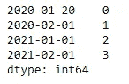
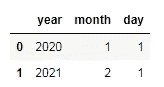
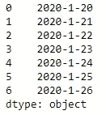
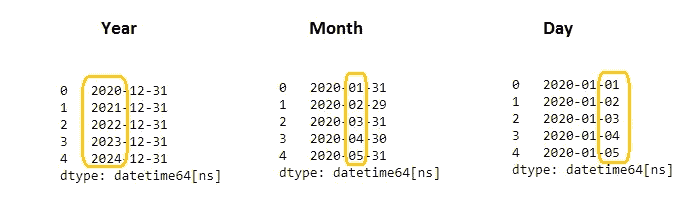

# Python 时间序列基础

> 原文：<https://pub.towardsai.net/basic-of-time-series-with-python-a2f7cb451a76?source=collection_archive---------0----------------------->

## [数据可视化](https://towardsai.net/p/category/data-visualization)

## 熊猫时间序列的工作函数和基本原理


照片由[艾萨克·史密斯](https://unsplash.com/@isaacmsmith?utm_source=medium&utm_medium=referral)在 [Unsplash](https://unsplash.com?utm_source=medium&utm_medium=referral) 拍摄

时间序列分析是我们周围发生的关于时间的日常活动的一部分。随着日、月、年的流逝，我们周围的观察留下了一些信息。为了获得这些信息，我们从统计分析中获得帮助，以某些格式制作数据/信息并进行分析。现在，随着越来越多的数据在任何地方生成，很难使用简单的低级工具进行分析。因此，新的工具和算法被开发出来，使得大量的数据以合适的格式存在，并解决我们获取信息的目的。

时间序列数据的收集和存储方式有助于我们预测未来，并通过每年增加的收入稳定业务增长。

我们在时间序列数据中处理什么？简单地说，我们处理时间和日期。哦！等一下，但这不仅仅是时间和日期。它由时间中的秒、分和小时以及日期中的日、周、月和年组成。

时间序列在许多领域都有应用，如天气预报、股票市场、信号系统、数据传输管理等。

[](https://medium.com/towards-artificial-intelligence/time-series-analysis-with-python-6002ec6d5aa4) [## 用 Python 进行时间序列分析

### 熊猫数据框的日期和时间分析

medium.com](https://medium.com/towards-artificial-intelligence/time-series-analysis-with-python-6002ec6d5aa4) 

我们将逐步用 python 对时间序列进行分析和实践。python 中处理数据和时间的基本功能是`datetime`。

```
#first we have to import the datetime object in python
from datetime import datetime 
datetime(year=2020, month=12, day=30)#Output: 
datetime.datetime(2020, 12, 30, 0, 0)
```

我们在输出中注意到的一件事是两个零，这些零指的是三个参数年、月和日之后的小时和分钟，这是必需的。

```
#lets give other arguments alsodatetime(year=2020, month=12, day=30, hour=2, minute=3, second=15,
         microsecond=45)#output:datetime.datetime(2020, 12, 30, 2, 3, 15, 45)
```

嗯，我们看到用`datetime`对象创建数据和时间。在我们深入探讨之前，让我们先了解一下 python 中对时间序列的一些定义。

*   ***Datetime:*** 用于 python 中时间和序列的基本功能。
*   ***Dateutils:*** 也是一个基本的函数对象但是作为第三方模块。如果您的 python 环境中没有安装`dateutils`，您可以通过 pip 命令安装它。

```
pip install python-dateutil
```

*   ***时间戳:*** 用来知道物体在特定时刻的确切参照物。
*   ***时间增量:*** 它是一个`datetime`类中两个时间戳之间以天、小时、分钟或秒为单位的持续时间。
*   ***日历:*** 类 Calendar 对象包含了很多与日历相关的功能。通过使用 calendar 类，我们可以访问许多方法，如*日历*、*弱日*、*月范围*、*月*、 *HTML 日历*等等。
*   ***时间间隔:*** 是一个间隔时间点，即起点和终点。
*   ***Time:*** 它是`datetime`类中的一个方法，我们可以在其中访问和使用很多时间功能。

日期和时间功能也在 **NumPy** 库中。它们的名字分别是`datetime64`和`timedelta64`。

我们还可以在**熊猫**库中看到数据和时间的初级创建方法。它们如下所示:

在日期时间→ `to_datetime`，`to_range`

时间增量→ `to_timedelta`、`timedelta_range`

在时间跨度上→ `period`，`period_range`

时间序列分析中日期和时间的良好用途是当我们在序列或数据帧中使用日期或时间组件作为索引时。系列是单个列，而数据框是矩阵形式的多个列的组合。

[](https://medium.com/towards-artificial-intelligence/fully-explained-linear-regression-with-python-fe2b313f32f3) [## 用 Python 全面解释线性回归

### 如何用一个真实的例子解决回归问题。

medium.com](https://medium.com/towards-artificial-intelligence/fully-explained-linear-regression-with-python-fe2b313f32f3) 

`dateutils`使用处理部分字符串的解析。下面给出的例子说明了如何解析用来从日期和时间格式的字符串中获取日期时间格式。

```
#import the parser function from the dateutil library
from dateutil import parserdate = parser.parse("10th of July, 2015")
date#output:
datetime.datetime(2015, 7, 10, 0, 0)
-------------------------------------------------------------------#import the parse for string 
from dateutil.parser import parseparse("Yesterday was January 4, 2021", fuzzy_with_tokens=True)#output:
(datetime.datetime(2021, 1, 4, 0, 0), ('Yesterday was ', ' ', ' '))
```

现在，我们将讨论 pandas 的日期和时间，因为使用 pandas，我们可以处理具有大量数据的序列或数据帧，并且使用 python 可以轻松地将日期/时间作为索引。

熊猫的时间序列示例:

```
#import pandas library
import pandas as pdpd.Timedelta("2 days")#output: Timedelta('2 days 00:00:00')
```

为了在 pandas 中制作一系列日期并将其用作索引，我们使用`DatetimeIndex`。

```
index = pd.DatetimeIndex(['2020-1-20', '2020-02-01','2021-01-01', 
                          '2021-02-01'])
index#output:
DatetimeIndex(['2020-01-20', '2020-02-01', '2021-01-01', 
               '2021-02-01'], dtype='datetime64[ns]', freq=None)
```

假设我们要制作另一个系列，并将该索引系列作为另一个系列的索引。因此，将形成两列，我们也可以称之为数据帧。要用一个列制作一个系列，我们使用`pd.series`。

```
data = pd.Series([0, 1, 2, 3], index=index)
print(data)
```



一个数据帧中的两个系列。作者图片

为了制作一个数据框架，我们可以用熊猫的数据框架

```
df = pd.DataFrame({'year': [2020, 2021], 'month': [1, 2], 'day': [1,
                   1]})
print(df)
```



日期的数据框。作者图片

我们可以通过使用`to_datetime`将该数据帧转换为`datetime`格式

```
pd.to_datetime(df)#output:
0   2020-01-01
1   2021-02-01
dtype: datetime64[ns]
```

我们可以使用 pd.series 创建日期列的序列

```
series_date = pd.Series(['2020-1-20', '2020-1-21', '2020-1-22',
              '2020-1-23', '2020-1-24', '2020-1-25', '2020-1-26'])
print(series_date)
```



一系列日期。作者图片

了解熊猫的时差。

```
pd.Timedelta("2 days 00:00:00")#output:
Timedelta('2 days 00:00:00')
----------------------------------------------
pd.Timedelta("2 days 2 hours")#output:
Timedelta('2 days 02:00:00')
----------------------------------------------
pd.Timedelta(days=2, seconds=2)#output:
Timedelta('2 days 00:00:02')
----------------------------------------------
# integers with a unit, 1 is specify for day
pd.Timedelta(2, unit="d")#output:
Timedelta('2 days 00:00:00')
----------------------------------------------
# a NaT
pd.Timedelta("nan")#output:
NaT
----------------------------------------------
pd.Timedelta("nat")#output:
NaT
----------------------------------------------
# ISO 8601 Duration strings
pd.Timedelta("P0DT0H1M0S")#output:
Timedelta('0 days 00:01:00')
```

现在我们将添加两个新参数，即周期和频率。周期取决于频率。周期是数据根据每年、每月或每天的频率变化的次数。

```
#period change as per Year
s_year = pd.Series(pd.date_range("2020-1-1", periods=5, freq="Y"))
s_year#period change as per Month
s_month = pd.Series(pd.date_range("2020-1-1", periods=5, freq="M"))
s_month#period change as per day
s_day = pd.Series(pd.date_range("2020-1-1", periods=5, freq="D"))
s_day
```



周期根据频率而变化。作者图片

结论:

时间序列的基础主要是用日期和时间数据框架进行分析。制作一个日期和时间的索引对分析数据和时间记录有很大的帮助。

我希望你喜欢这篇文章。通过我的 [LinkedIn](https://www.linkedin.com/in/data-scientist-95040a1ab/) 和 [twitter](https://twitter.com/amitprius) 联系我。

# 推荐文章

1.  [NLP —用 Python 从零到英雄](https://medium.com/towards-artificial-intelligence/nlp-zero-to-hero-with-python-2df6fcebff6e?sk=2231d868766e96b13d1e9d7db6064df1)

2. [Python 数据结构数据类型和对象](https://medium.com/towards-artificial-intelligence/python-data-structures-data-types-and-objects-244d0a86c3cf?sk=42f4b462499f3fc3a160b21e2c94dba6)

3. [MySQL:零到英雄](https://medium.com/towards-artificial-intelligence/mysql-zero-to-hero-with-syntax-of-all-topics-92e700762c7b?source=friends_link&sk=35a3f8dc1cf1ebd1c4d5008a5d12d6a3)