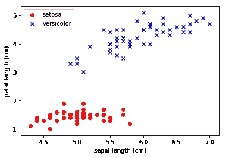

# 基于最小二乘法的基本感知器模型

> 原文：<https://pub.towardsai.net/basic-perceptron-model-using-least-squares-method-17900e0d1eff?source=collection_archive---------0----------------------->

## 用 Python | [建立一个面向 AI](https://towardsai.net) 的基本感知器模型


就像组成人类神经系统的数十亿个神经元一样，感知器是人工智能的基本单元。我们做出的每一个想法、行动、情感或决定都反映了神经系统的活动，神经系统是一个控制和沟通你身体每一部分的主系统。生物智能依赖于这种由数十亿神经元组成的复杂机制，这些神经元组织在不同的层中，通过电信号和化学信号相互交流。

为了理解生物智能是如何产生的，重要的是要理解被称为神经元的基本构件是如何工作的。

生物神经元有 3 个主要功能:

1.  **感觉输入**。神经元利用其树突(感受区域)来监控身体内外发生的变化。收集的信息被称为感官输入。
2.  **整合**:细胞体系统处理和解释感觉输入，并决定每个时刻应该做什么，这个过程叫做整合。如果感觉输入低于某个阈值，感觉信号就不会被激活。
3.  **电机输出**。如果感觉输入信号高于某个阈值，神经元就会产生输出，由神经递质通过突触间隙传递。神经递质会刺激或抑制附近的神经元。

与生物智能类似，人工智能是由称为感知机的基本构建模块的复杂网络产生的。感知器的工作原理与神经元相同:

1.  投入
2.  综合
3.  输出

这里我们将重点讨论如何使用 python 构建一个基本的感知器模型。这一知识是理解更高级模型(如神经网络)的基础，神经网络是由成千上万亿个感知器组成的复杂系统，具有产生人工智能系统(如自动驾驶汽车)的能力。

# 基本感知机模型

Python 的 *sklearn* 包包含了几个分类器，比如*感知器*、*SupportVectorClassifier*、*logisticregressionclassifier*、 *DecisionTreeClassifier* 、 *RandomForestClassifier* 和 *KNN 分类器*。虽然使用这些现成的机器学习算法很重要，但该领域的每个初学者都必须掌握这些算法如何工作的基础知识。开始进入神经网络和深度学习模型的旅程的一个好地方是考虑感知器。

在这个例子中，我们构建了一个简单的感知器模型，其中学习权重是使用最小二乘法计算的。

感知器模型有以下四个主要步骤:

1.  **训练**
2.  **激活**
3.  **量子化**
4.  **预测**


**X** 表示属性或预测矩阵， **y** 表示类。我们将使用[虹膜数据集](https://archive.ics.uci.edu/ml/machine-learning-databases/iris/iris.data)来说明我们的模型。数据集包含以下属性信息:

1.  萼片长度，单位为厘米
2.  萼片宽度，单位为厘米
3.  花瓣长度(厘米)
4.  花瓣宽度(厘米)

这三个类别是

1.  刚毛鸢尾
2.  杂色鸢尾
3.  海滨鸢尾

为简单起见，我们执行二元分类。出于实际原因，我们使用两个花类 Setosa 和 Versicolor。然而，感知器算法可以扩展到多类分类，例如，通过一对一技术。

# 使用 Python 实现模型

这段代码将感知器分类算法应用于虹膜数据集。使用最小二乘法计算用于计算激活函数的权重。这种方法不同于 Rosenblatt 的原始感知器规则，在该规则中，权重是递归计算的。关于 Rosenblatt 感知器算法实现的更多信息，请参见以下书籍:《Python 机器学习*》作者 Sebastian Raschka。*

**导入必要的库**

```
import pandas as pdimport numpy as npimport matplotlib.pyplot as pltfrom sklearn.model_selection import train_test_split
```

**定义感知器分类器对象**

```
class Perceptron(object):
    """Perceptron classifier using least-square method to calculate weights.

    Attributes
    -----------
    w : 1d-array
        Weights after fitting.
    """   
    def fit(self, X, y):
        """Fit training data.

        Parameters
        ----------
        X : {array-like}, shape = [n_samples, n_features]
        Training vectors, where n_samples is the number of samples and n_features is the number of features.
        y : array-like, shape = [n_samples]
        Target values.
        Returns
        -------
        self : object
        """
        self.w = np.dot(np.linalg.inv(np.dot(X.T,X)),np.dot(X.T,y))
        return self

    def predict(self, X):
        """Return class label after unit step"""
        return np.where(np.dot(X,self.w) >= 0.0, 1, -1)
```

**导入虹膜数据集**

```
df = pd.read_csv('iris.data.csv', header=None)print(df.tail())
y = df.iloc[0:100, 4].values
y = np.where(y == 'Iris-setosa', -1, 1)
X = df.iloc[0:100, 0:4].valuesplt.scatter(X[:50, 0], X[:50, 2],color='red', marker='o', label='setosa')plt.scatter(X[50:100, 0], X[50:100, 2],color='blue', marker='x', label='versicolor')plt.xlabel('sepal length (cm)')
plt.ylabel('petal length (cm)')
plt.legend(loc='upper left')
plt.show()
```



**培训、测试和评估**

```
X_train, X_test, y_train, y_test = train_test_split(X, y, test_size=0.2, random_state=21, stratify=y)
ppn = Perceptron()
ppn.fit(X_train,y_train)
y_pred=ppn.predict(X_test)
accuracy = 100*np.sum(y_pred==y_test)/len(y_test)
print("accuracy of the model:= " + str(accuracy))
```

总之，我们已经演示了如何使用最小二乘法在 python 中构建一个基本的感知器模型，用于计算权重，然后用于计算激活函数。感知器模型是更高级的神经网络系统的基本构件。每个深度学习和人工智能领域的初学者都应该掌握感知机模型的基础知识。

本文的代码和数据集可以从这个 Github 资源库下载:[https://github.com/bot13956/perceptron_classifier](https://github.com/bot13956/perceptron_classifier)。